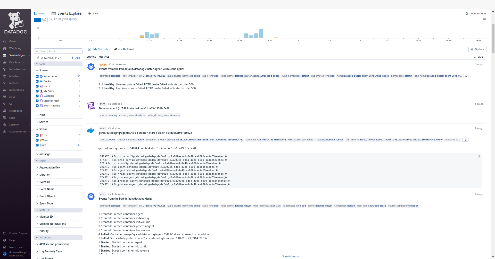
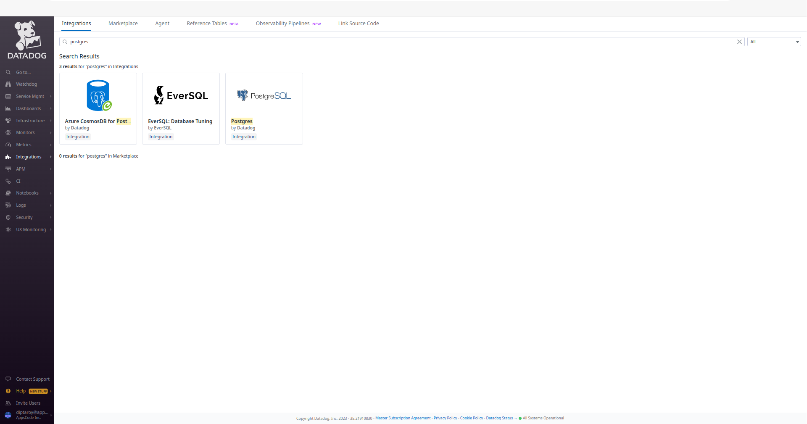
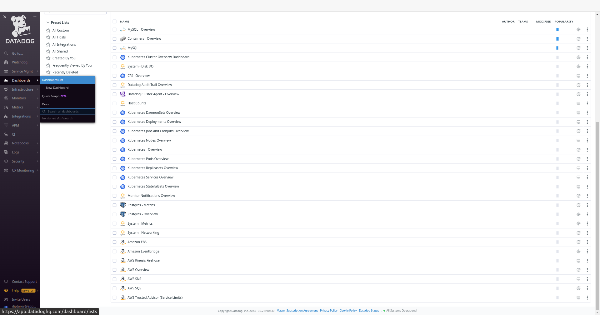
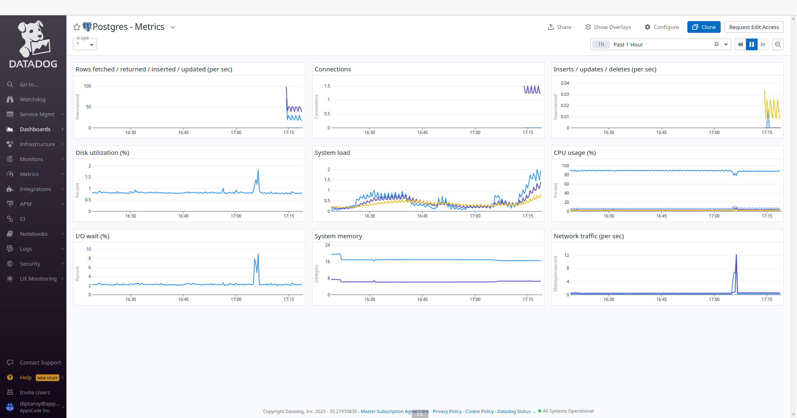
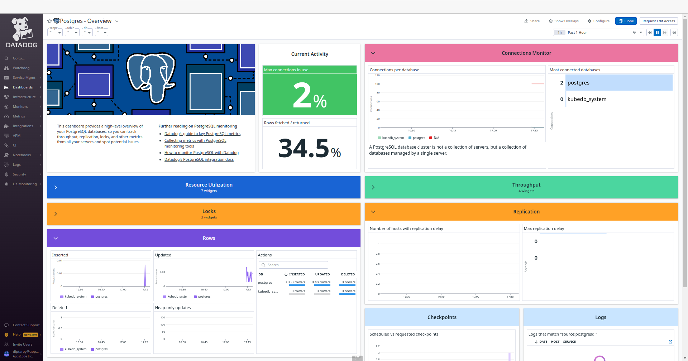
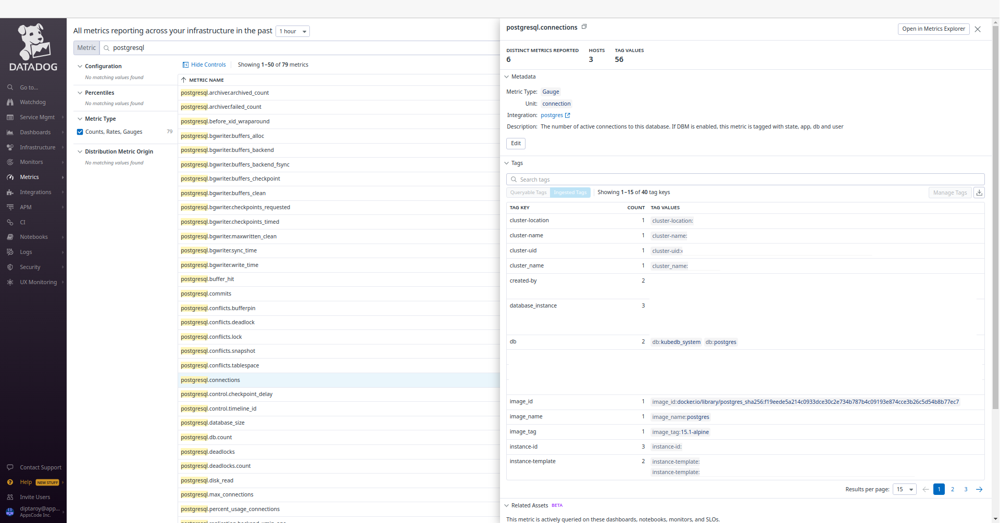
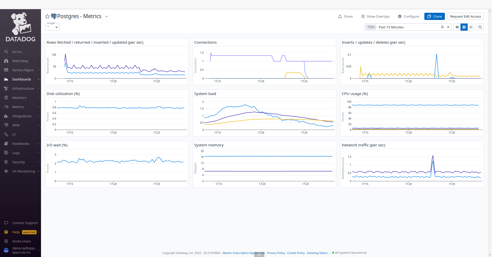
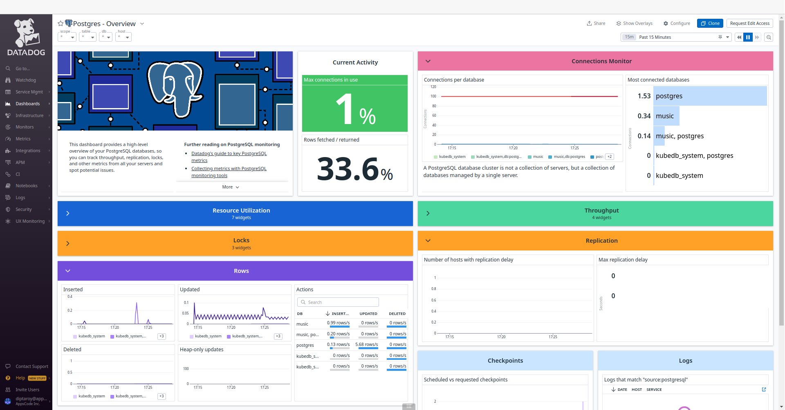

## Introduction

KubeDB is the Kubernetes Native Database Management Solution which simplifies and automates routine database tasks such as Provisioning, Monitoring, Upgrading, Patching, Scaling, Volume Expansion, Backup, Recovery, Failure detection, and Repair for various popular databases on private and public clouds. The databases that KubeDB supports are Redis, PostgreSQL, Kafka, MySQL, MongoDB, MariaDB, Elasticsearch, ProxySQL, Percona XtraDB, Memcached and PgBouncer. You can find the guides to all the supported databases in [KubeDB](https://kubedb.com/).
In this tutorial we will Monitor PostgreSQL With Datadog in Amazon Elastic Kubernetes Service (Amazon EKS) Using KubeDB. We will cover the following steps:

1) Install KubeDB
2) Install Datadog
3) Deploy PostgreSQL Cluster
4) Read/Write Sample Data
5) Monitor PostgreSQL with Datadog


### Get Cluster ID

We need the cluster ID to get the KubeDB License. To get cluster ID we can run the following command:

```bash
$ kubectl get ns kube-system -o jsonpath='{.metadata.uid}'
6c08dcb8-8440-4388-849f-1f2b590b731e
```

### Get License

Go to [Appscode License Server](https://license-issuer.appscode.com/) to get the license.txt file. For this tutorial, we will use KubeDB Enterprise Edition.


## Install KubeDB

We will use helm to install KubeDB. Please install [Helm](https://helm.sh/docs/intro/install/) if it is not already installed.
Now, let's install `KubeDB`.

```bash
$ helm repo add appscode https://charts.appscode.com/stable/
$ helm repo update

$ helm search repo appscode/kubedb
NAME                              	CHART VERSION	APP VERSION	DESCRIPTION
appscode/kubedb                   	v2023.11.2   	v2023.11.2 	KubeDB by AppsCode - Production ready databases...
appscode/kubedb-autoscaler        	v0.22.0      	v0.22.0    	KubeDB Autoscaler by AppsCode - Autoscale KubeD...
appscode/kubedb-catalog           	v2023.11.2   	v2023.11.2 	KubeDB Catalog by AppsCode - Catalog for databa...
appscode/kubedb-community         	v0.24.2      	v0.24.2    	KubeDB Community by AppsCode - Community featur...
appscode/kubedb-crds              	v2023.11.2   	v2023.11.2 	KubeDB Custom Resource Definitions
appscode/kubedb-dashboard         	v0.13.0      	v0.13.0    	KubeDB Dashboard by AppsCode
appscode/kubedb-enterprise        	v0.11.2      	v0.11.2    	KubeDB Enterprise by AppsCode - Enterprise feat...
appscode/kubedb-grafana-dashboards	v2023.11.2   	v2023.11.2 	A Helm chart for kubedb-grafana-dashboards by A...
appscode/kubedb-metrics           	v2023.11.2   	v2023.11.2 	KubeDB State Metrics
appscode/kubedb-one               	v2023.11.2   	v2023.11.2 	KubeDB and Stash by AppsCode - Production ready...
appscode/kubedb-ops-manager       	v0.24.0      	v0.24.0    	KubeDB Ops Manager by AppsCode - Enterprise fea...
appscode/kubedb-opscenter         	v2023.11.2   	v2023.11.2 	KubeDB Opscenter by AppsCode
appscode/kubedb-provisioner       	v0.37.0      	v0.37.0    	KubeDB Provisioner by AppsCode - Community feat...
appscode/kubedb-schema-manager    	v0.13.0      	v0.13.0    	KubeDB Schema Manager by AppsCode
appscode/kubedb-ui                	v2023.10.18  	0.4.6      	A Helm chart for Kubernetes
appscode/kubedb-ui-server         	v2021.12.21  	v2021.12.21	A Helm chart for kubedb-ui-server by AppsCode
appscode/kubedb-webhook-server    	v0.13.0      	v0.13.0    	KubeDB Webhook Server by AppsCode 

# Install KubeDB Enterprise operator chart
$ helm install kubedb appscode/kubedb \
  --version v2023.11.2 \
  --namespace kubedb --create-namespace \
  --set kubedb-provisioner.enabled=true \
  --set kubedb-ops-manager.enabled=true \
  --set kubedb-autoscaler.enabled=true \
  --set kubedb-dashboard.enabled=true \
  --set kubedb-schema-manager.enabled=true \
  --set-file global.license=/path/to/the/license.txt
```

Let's verify the installation:

```bash
$ watch kubectl get pods --all-namespaces -l "app.kubernetes.io/instance=kubedb"

NAMESPACE   NAME                                            READY   STATUS    RESTARTS   AGE
kubedb      kubedb-kubedb-autoscaler-857b984554-q8npd       1/1     Running   0          2m40s
kubedb      kubedb-kubedb-dashboard-64469696f6-9ngdm        1/1     Running   0          2m40s
kubedb      kubedb-kubedb-ops-manager-5d5974fd5-tmtzk       1/1     Running   0          2m40s
kubedb      kubedb-kubedb-provisioner-65b79449d4-8mklc      1/1     Running   0          2m40s
kubedb      kubedb-kubedb-schema-manager-5674b5bb8f-cv478   1/1     Running   0          2m40s
kubedb      kubedb-kubedb-webhook-server-67bd9d8fbd-lnx6z   1/1     Running   0          2m40s
```

We can list the CRD Groups that have been registered by the operator by running the following command:

```bash
$ kubectl get crd -l app.kubernetes.io/name=kubedb
NAME                                              CREATED AT
elasticsearchautoscalers.autoscaling.kubedb.com   2023-11-27T09:11:03Z
elasticsearchdashboards.dashboard.kubedb.com      2023-11-27T09:11:50Z
elasticsearches.kubedb.com                        2023-11-27T09:11:19Z
elasticsearchopsrequests.ops.kubedb.com           2023-11-27T09:11:37Z
elasticsearchversions.catalog.kubedb.com          2023-11-27T09:10:11Z
etcds.kubedb.com                                  2023-11-27T09:11:19Z
etcdversions.catalog.kubedb.com                   2023-11-27T09:10:12Z
kafkaopsrequests.ops.kubedb.com                   2023-11-27T09:12:09Z
kafkas.kubedb.com                                 2023-11-27T09:11:21Z
kafkaversions.catalog.kubedb.com                  2023-11-27T09:10:12Z
mariadbautoscalers.autoscaling.kubedb.com         2023-11-27T09:11:03Z
mariadbdatabases.schema.kubedb.com                2023-11-27T09:10:53Z
mariadbopsrequests.ops.kubedb.com                 2023-11-27T09:11:50Z
mariadbs.kubedb.com                               2023-11-27T09:10:53Z
mariadbversions.catalog.kubedb.com                2023-11-27T09:10:12Z
memcacheds.kubedb.com                             2023-11-27T09:11:19Z
memcachedversions.catalog.kubedb.com              2023-11-27T09:10:12Z
mongodbautoscalers.autoscaling.kubedb.com         2023-11-27T09:11:03Z
mongodbdatabases.schema.kubedb.com                2023-11-27T09:10:53Z
mongodbopsrequests.ops.kubedb.com                 2023-11-27T09:11:40Z
mongodbs.kubedb.com                               2023-11-27T09:10:53Z
mongodbversions.catalog.kubedb.com                2023-11-27T09:10:12Z
mysqlautoscalers.autoscaling.kubedb.com           2023-11-27T09:11:03Z
mysqldatabases.schema.kubedb.com                  2023-11-27T09:10:52Z
mysqlopsrequests.ops.kubedb.com                   2023-11-27T09:11:47Z
mysqls.kubedb.com                                 2023-11-27T09:10:52Z
mysqlversions.catalog.kubedb.com                  2023-11-27T09:10:12Z
perconaxtradbautoscalers.autoscaling.kubedb.com   2023-11-27T09:11:03Z
perconaxtradbopsrequests.ops.kubedb.com           2023-11-27T09:12:03Z
perconaxtradbs.kubedb.com                         2023-11-27T09:11:20Z
perconaxtradbversions.catalog.kubedb.com          2023-11-27T09:10:12Z
pgbouncers.kubedb.com                             2023-11-27T09:11:20Z
pgbouncerversions.catalog.kubedb.com              2023-11-27T09:10:12Z
postgresautoscalers.autoscaling.kubedb.com        2023-11-27T09:11:03Z
postgresdatabases.schema.kubedb.com               2023-11-27T09:10:53Z
postgreses.kubedb.com                             2023-11-27T09:10:53Z
postgresopsrequests.ops.kubedb.com                2023-11-27T09:11:56Z
postgresversions.catalog.kubedb.com               2023-11-27T09:10:12Z
proxysqlautoscalers.autoscaling.kubedb.com        2023-11-27T09:11:03Z
proxysqlopsrequests.ops.kubedb.com                2023-11-27T09:12:00Z
proxysqls.kubedb.com                              2023-11-27T09:11:20Z
proxysqlversions.catalog.kubedb.com               2023-11-27T09:10:12Z
publishers.postgres.kubedb.com                    2023-11-27T09:12:12Z
redisautoscalers.autoscaling.kubedb.com           2023-11-27T09:11:03Z
redises.kubedb.com                                2023-11-27T09:11:20Z
redisopsrequests.ops.kubedb.com                   2023-11-27T09:11:53Z
redissentinelautoscalers.autoscaling.kubedb.com   2023-11-27T09:11:03Z
redissentinelopsrequests.ops.kubedb.com           2023-11-27T09:12:06Z
redissentinels.kubedb.com                         2023-11-27T09:11:21Z
redisversions.catalog.kubedb.com                  2023-11-27T09:10:12Z
subscribers.postgres.kubedb.com                   2023-11-27T09:12:15Z
```

## Install Datadog

To install Datadog, we recommend using `Helm`. Below are the steps for the installation. For more installation options and details, visit [Datadog's official documentation](https://docs.datadoghq.com/containers/kubernetes/installation/?tab=operator).

```bash
$ helm repo add datadog https://helm.datadoghq.com
$ helm repo update
$ helm install datadog --set datadog.site='datadoghq.com' --set datadog.apiKey=<YOUR DATADOG API KEY> --set datadog.apm.enabled=true datadog/datadog
```

Let's verify the installation:

```bash
$ kubectl get pods --all-namespaces -l "app.kubernetes.io/instance=datadog"

NAMESPACE   NAME                                    READY   STATUS    RESTARTS   AGE
default     datadog-cdtf2                           3/3     Running   0          3m20s
default     datadog-cluster-agent-bc5797f6d-xzgmv   1/1     Running   0          3m19s
default     datadog-fbqsx                           3/3     Running   0          3m19s
default     datadog-fqrkj                           3/3     Running   0          3m19s
default     datadog-h4zmg                           3/3     Running   0          3m20s
default     datadog-m7ppn                           3/3     Running   0          3m19s
default     datadog-tbffj                           3/3     Running   0          3m20s
```

### Datadog Events

To view events from your Kubernetes cluster, go to [Datadog's Event Explorer](https://app.datadoghq.com/event/explorer). You'll find valuable insights and information about your Kubernetes environment.



### Install PostgreSQL Dashboard

To access the PostgreSQL dashboard, go to `Integrations` and then install the PostgreSQL integration from there. This will allow you to monitor your PostgreSQL databases through Datadog's dashboard.



### Deploy PostgreSQL Cluster

Now we are going to deploy PostgreSQL cluster using KubeDB. You'll need to deploy your PostgreSQL cluster with the same namespace `default` where Datadog is installed.

Here is the yaml of the PostgreSQL we are going to use:

```yaml
apiVersion: kubedb.com/v1alpha2
kind: Postgres
metadata:
  name: postgres-cluster-dd
  namespace: default
spec:
  version: "15.1"
  replicas: 3
  standbyMode: Hot
  storageType: Durable
  storage:
    storageClassName: "gp2"
    accessModes:
      - ReadWriteOnce
    resources:
      requests:
        storage: 1Gi
  terminationPolicy: WipeOut
  podTemplate:
    metadata:
      annotations:
        ad.datadoghq.com/postgres.checks: |
          {
            "postgres": {
              "init_config": {},
              "instances": [
                {
                  "host": "%%host%%",
                  "port":"5432",
                  "username":"datadog",
                  "password":"admin123"
                }
              ]
            }
          }
        ad.datadoghq.com/postgres.logs: '[{"source":"postgresql","service":"postgresql"}]'
```


Let's save this yaml configuration into `postgres-cluster-dd.yaml` 
Then create the above PostgreSQL CRD

```bash
$ kubectl apply -f postgres-cluster-dd.yaml
postgres.kubedb.com/postgres-cluster-dd created
```

In this yaml,
* `spec.version` field specifies the version of PostgreSQL. Here, we are using PostgreSQL `version 15.1`. You can list the KubeDB supported versions of PostgreSQL by running `$ kubectl get postgresversions` command.
* Another field to notice is the `spec.storageType` field. This can be `Durable` or `Ephemeral` depending on the requirements of the database to be persistent or not.
* `spec.terminationPolicy` field is *Wipeout* means that the database will be deleted without restrictions. It can also be "Halt", "Delete" and "DoNotTerminate". Learn more about [Termination Policy](https://kubedb.com/docs/latest/guides/postgres/concepts/postgres/#specterminationpolicy).
* `spec.podTemplate.metadata.annotations` field specifes [Autodiscovery Integrations Templates](https://docs.datadoghq.com/containers/kubernetes/integrations/?tab=kubernetesadv2) as pod annotations on your application container. Learn more about [Autodiscovery Template Variables](https://docs.datadoghq.com/containers/guide/template_variables/).

> Note: To align with the configurations specified in our annotations, it is essential to create a PostgreSQL user with the username `datadog` and the password `admin123`. You can change these fields to your preference.

Once everything handled correctly and the PostgreSQL object is deployed, you will see that the following are created:

```bash
$ kubectl get all -n default -l=app.kubernetes.io/instance=postgres-cluster-dd

NAME                        READY   STATUS    RESTARTS   AGE
pod/postgres-cluster-dd-0   2/2     Running   0          3m40s
pod/postgres-cluster-dd-1   2/2     Running   0          3m14s
pod/postgres-cluster-dd-2   2/2     Running   0          2m48s

NAME                                  TYPE        CLUSTER-IP      EXTERNAL-IP   PORT(S)                      AGE
service/postgres-cluster-dd           ClusterIP   10.124.10.229   <none>        5432/TCP,2379/TCP            3m42s
service/postgres-cluster-dd-pods      ClusterIP   None            <none>        5432/TCP,2380/TCP,2379/TCP   3m42s
service/postgres-cluster-dd-standby   ClusterIP   10.124.10.196   <none>        5432/TCP                     3m42s

NAME                                   READY   AGE
statefulset.apps/postgres-cluster-dd   3/3     3m42s

NAME                                                     TYPE                  VERSION   AGE
appbinding.appcatalog.appscode.com/postgres-cluster-dd   kubedb.com/postgres   15.1      3m43s
```
Let’s check if the database is ready to use,

```bash
$ kubectl get postgres -n default postgres-cluster-dd
NAME                  VERSION   STATUS   AGE
postgres-cluster-dd   15.1      Ready    4m36s
```
> We have successfully deployed PostgreSQL in AWS with Datadog. Now we can exec into the container to use the database.

### Accessing Database Through CLI

To access the database through CLI, we have to get the credentials to access. KubeDB will create Secret and Service for the database `postgres-cluster-dd` that we have deployed. Let’s check them using the following commands,

```bash
$ kubectl get secret -n default -l=app.kubernetes.io/instance=postgres-cluster-dd
NAME                       TYPE                       DATA   AGE
postgres-cluster-dd-auth   kubernetes.io/basic-auth   2      5m2s

$ kubectl get service -n default -l=app.kubernetes.io/instance=postgres-cluster-dd
NAME                          TYPE        CLUSTER-IP      EXTERNAL-IP   PORT(S)                      AGE
postgres-cluster-dd           ClusterIP   10.124.10.229   <none>        5432/TCP,2379/TCP            5m25s
postgres-cluster-dd-pods      ClusterIP   None            <none>        5432/TCP,2380/TCP,2379/TCP   5m25s
postgres-cluster-dd-standby   ClusterIP   10.124.10.196   <none>        5432/TCP                     5m25s
```
Now, we are going to use `postgres-cluster-dd-auth` to get the credentials.

```bash
$ kubectl get secrets -n default postgres-cluster-dd-auth -o jsonpath='{.data.username}' | base64 -d
postgres

$ kubectl get secrets -n default postgres-cluster-dd-auth -o jsonpath='{.data.password}' | base64 -d
iJwx;cpMDMGO29vo
```

### Grant Permission to Datadog Agent

In this section, we'll create a PostgreSQL user with the username `datadog` and the password `admin123` as defined in `postgres-cluster-dd.yaml`. Additionally, we'll provide the user to have the necessary permissions to scrape metrics.

```bash
$ kubectl exec -it postgres-cluster-dd-0 -n default -c postgres -- bash
postgres-cluster-dd-0:/$ psql -d "user=postgres password=iJwx;cpMDMGO29vo"
psql (15.1)
Type "help" for help.

postgres=# create user datadog with password 'admin123';
CREATE ROLE

postgres=# grant pg_monitor to datadog;
GRANT ROLE

postgres=# grant SELECT ON pg_stat_database to datadog;
GRANT

postgres=# exit
exit
```

### Accessing PostgreSQL Dashboards

To access the monitoring dashboards in the Datadog UI, navigate to the `Dashboards` section in your Datadog account's main menu. From the dropdown menu, select `Dashboards List`, and you'll find `Postgres - Overview` and `Postgres - Metrics`. These dashboards provide insights into various aspects of your PostgreSQL database, offering both a high-level summary and more detailed performance metrics for effective monitoring and management. Also, to access PostgreSQL metrics, navigate to the `Metrics` section and select `Summary` in the Datadog UI.










#### Insert Sample Data

Let's insert some sample data into our PostgreSQL database.

```bash
$  kubectl exec -it postgres-cluster-dd-0 -n default -c postgres -- bash
postgres-cluster-dd-0:/$ psql -d "user=postgres password=iJwx;cpMDMGO29vo"
psql (15.1)
Type "help" for help.

postgres=# \l
                                                  List of databases
     Name      |  Owner   | Encoding |  Collate   |   Ctype    | ICU Locale | Locale Provider |   Access privileges   
---------------+----------+----------+------------+------------+------------+-----------------+-----------------------
 kubedb_system | postgres | UTF8     | en_US.utf8 | en_US.utf8 |            | libc            | 
 postgres      | postgres | UTF8     | en_US.utf8 | en_US.utf8 |            | libc            | 
 template0     | postgres | UTF8     | en_US.utf8 | en_US.utf8 |            | libc            | =c/postgres          +
               |          |          |            |            |            |                 | postgres=CTc/postgres
 template1     | postgres | UTF8     | en_US.utf8 | en_US.utf8 |            | libc            | =c/postgres          +
               |          |          |            |            |            |                 | postgres=CTc/postgres
(4 rows)

postgres=# CREATE DATABASE music;
CREATE DATABASE

postgres=# \l
                                                  List of databases
     Name      |  Owner   | Encoding |  Collate   |   Ctype    | ICU Locale | Locale Provider |   Access privileges   
---------------+----------+----------+------------+------------+------------+-----------------+-----------------------
 kubedb_system | postgres | UTF8     | en_US.utf8 | en_US.utf8 |            | libc            | 
 music         | postgres | UTF8     | en_US.utf8 | en_US.utf8 |            | libc            | 
 postgres      | postgres | UTF8     | en_US.utf8 | en_US.utf8 |            | libc            | 
 template0     | postgres | UTF8     | en_US.utf8 | en_US.utf8 |            | libc            | =c/postgres          +
               |          |          |            |            |            |                 | postgres=CTc/postgres
 template1     | postgres | UTF8     | en_US.utf8 | en_US.utf8 |            | libc            | =c/postgres          +
               |          |          |            |            |            |                 | postgres=CTc/postgres
(5 rows)

postgres=# \c music
You are now connected to database "music" as user "postgres".

music=# CREATE TABLE artist (name VARCHAR(50) NOT NULL, song VARCHAR(50) NOT NULL);
CREATE TABLE

music=# INSERT INTO artist (name, song) VALUES('Avicii', 'The Nights');
INSERT 0 1

music=# SELECT * FROM artist;
  name  |    song    
--------+------------
 Avicii | The Nights
(1 row)

music=# \q

postgres-cluster-dd-0:/$ exit
exit
```

> We’ve successfully inserted some sample data to our database. More information about Run & Manage PostgreSQL on Kubernetes can be found in [PostgreSQL Kubernetes](https://kubedb.com/kubernetes/databases/run-and-manage-postgres-on-kubernetes/)


Following the insertion of sample data into our PostgreSQL database, we can monitor any resultant changes in the Datadog UI. Go to the `Postgres - Metrics` and `Postgres - Overview` dashboards to observe any updates in performance metrics and insights for our PostgreSQL database.





## Conclusion

In this article, we've explored the process of monitoring PostgreSQL with Datadog in the Amazon Elastic Kubernetes Service (Amazon EKS) using KubeDB. Our aim was to provide insights into efficiently managing and analyzing PostgreSQL performance within a Kubernetes environment. We've explored into the PostgreSQL configuration, data insertion, and monitoring aspects. This is just the beginning of our journey in exploring the dynamic relationship between PostgreSQL, Datadog, and Kubernetes. We have more articles and resources in the pipeline, all geared toward enhancing your understanding of these technologies and their effective integration. To stay updated and informed, be sure to follow our website for upcoming articles and insights.

If you want to learn more about Production-Grade PostgreSQL you can have a look into that playlist below:

<iframe width="560" height="315" src="https://www.youtube.com/embed/videoseries?si=qWrgJVmoEJRbVx29&amp;list=PLoiT1Gv2KR1imqnrYFhUNTLHdBNFXPKr_" title="YouTube video player" frameborder="0" allow="accelerometer; autoplay; clipboard-write; encrypted-media; gyroscope; picture-in-picture; web-share" allowfullscreen></iframe>


## Support

To speak with us, please leave a message on [our website](https://appscode.com/contact/).

To receive product announcements, follow us on [Twitter](https://twitter.com/KubeDB).

To watch tutorials of various Production-Grade Kubernetes Tools Subscribe our [YouTube](https://www.youtube.com/c/AppsCodeInc/) channel.

More about [PostgreSQL on Kubernetes](https://kubedb.com/kubernetes/databases/run-and-manage-postgres-on-kubernetes/)

If you have found a bug with KubeDB or want to request for new features, please [file an issue](https://github.com/kubedb/project/issues/new).
