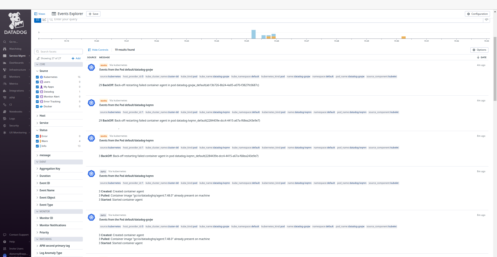
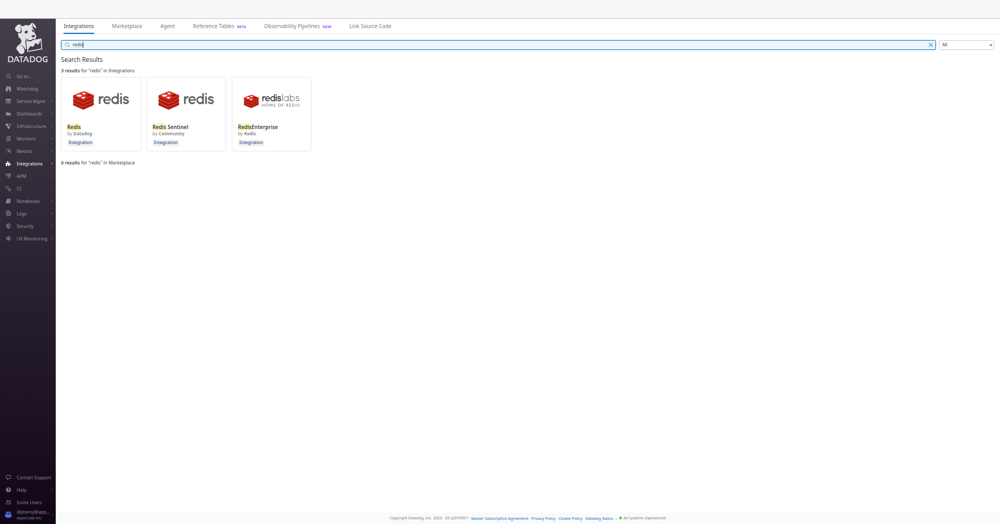
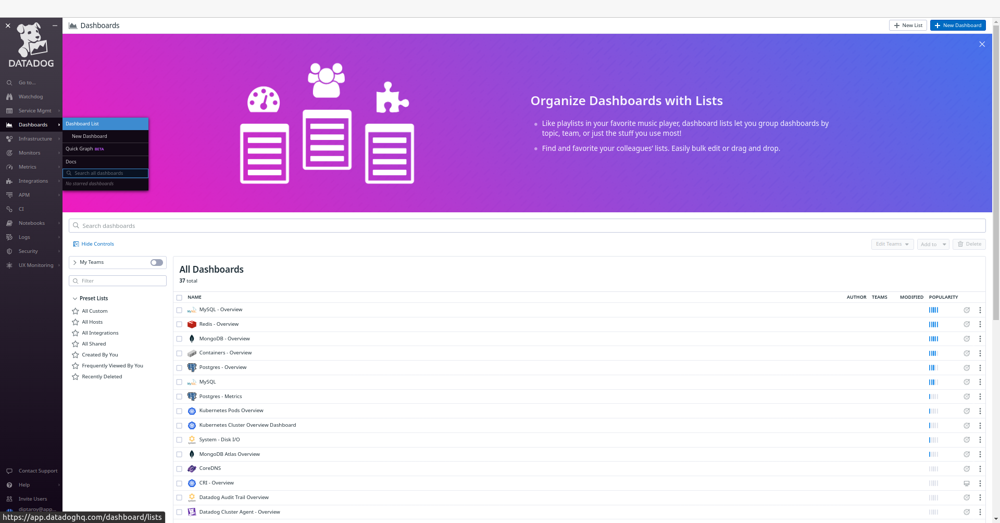
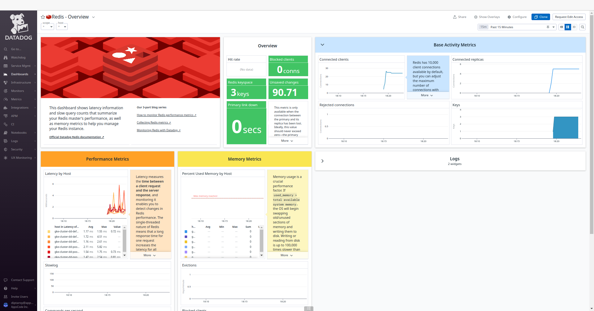
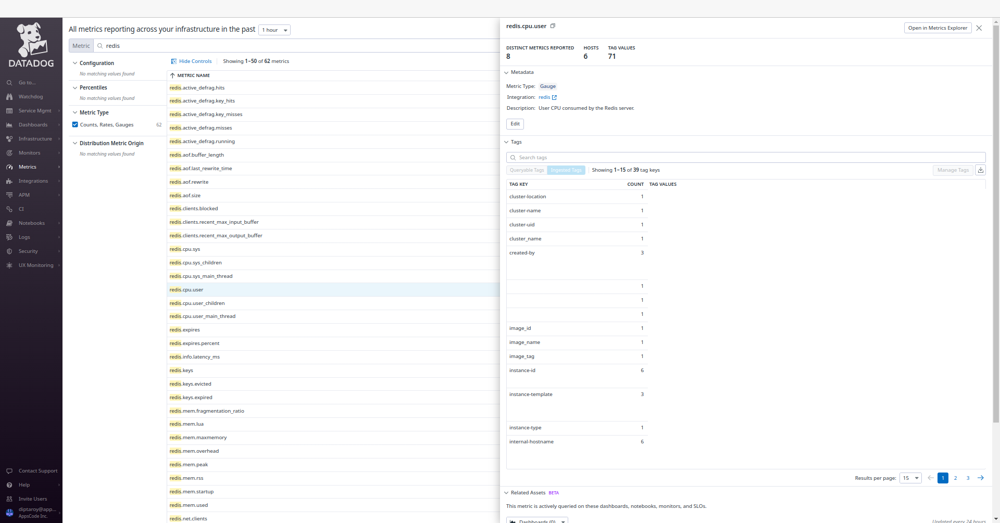
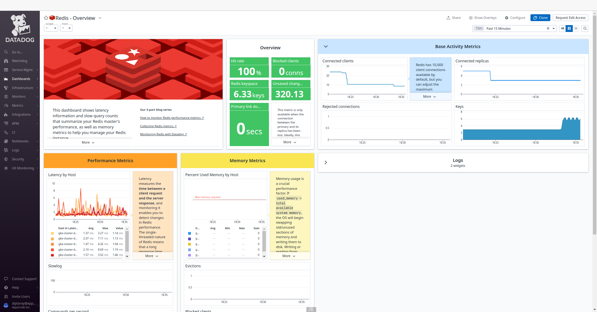

## Introduction

KubeDB is the Kubernetes Native Database Management Solution which simplifies and automates routine database tasks such as Provisioning, Monitoring, Upgrading, Patching, Scaling, Volume Expansion, Backup, Recovery, Failure detection, and Repair for various popular databases on private and public clouds. The databases supported by KubeDB include MongoDB, Elasticsearch, MySQL, MariaDB, Redis, PostgreSQL, FerretDB, Percona XtraDB, and Memcached. Additionally, KubeDB also supports ProxySQL, PgBouncer and the streaming platform Kafka. You can find the guides to all the supported databases in [KubeDB](https://kubedb.com/).
In this tutorial we will Monitor Redis With Datadog in Azure Kubernetes Service (AKS) Using KubeDB. We will cover the following steps:

1) Install KubeDB
2) Install Datadog
3) Deploy Redis Cluster
4) Read/Write Sample Data
5) Monitor Redis with Datadog


### Get Cluster ID

We need the cluster ID to get the KubeDB License. To get cluster ID we can run the following command:

```bash
$ kubectl get ns kube-system -o jsonpath='{.metadata.uid}'
8e336615-0dbb-4ae8-b72f-2e7ec34c399d
```

### Get License

Go to [Appscode License Server](https://license-issuer.appscode.com/) to get the license.txt file. For this tutorial, we will use KubeDB.


## Install KubeDB

We will use helm to install KubeDB. Please install [Helm](https://helm.sh/docs/intro/install/) if it is not already installed.
Now, let's install `KubeDB`.

```bash
$ helm search repo appscode/kubedb
NAME                              	CHART VERSION	APP VERSION	DESCRIPTION                                       
appscode/kubedb                   	v2024.2.14   	v2024.2.14 	KubeDB by AppsCode - Production ready databases...
appscode/kubedb-autoscaler        	v0.27.0      	v0.27.0    	KubeDB Autoscaler by AppsCode - Autoscale KubeD...
appscode/kubedb-catalog           	v2024.2.14   	v2024.2.14 	KubeDB Catalog by AppsCode - Catalog for databa...
appscode/kubedb-community         	v0.24.2      	v0.24.2    	KubeDB Community by AppsCode - Community featur...
appscode/kubedb-crd-manager       	v0.0.7       	v0.0.7     	KubeDB CRD Manager by AppsCode                    
appscode/kubedb-crds              	v2024.2.14   	v2024.2.14 	KubeDB Custom Resource Definitions                
appscode/kubedb-dashboard         	v0.18.0      	v0.18.0    	KubeDB Dashboard by AppsCode                      
appscode/kubedb-enterprise        	v0.11.2      	v0.11.2    	KubeDB Enterprise by AppsCode - Enterprise feat...
appscode/kubedb-grafana-dashboards	v2024.2.14   	v2024.2.14 	A Helm chart for kubedb-grafana-dashboards by A...
appscode/kubedb-kubestash-catalog 	v2024.2.14   	v2024.2.14 	KubeStash Catalog by AppsCode - Catalog of Kube...
appscode/kubedb-metrics           	v2024.2.14   	v2024.2.14 	KubeDB State Metrics                              
appscode/kubedb-one               	v2023.12.28  	v2023.12.28	KubeDB and Stash by AppsCode - Production ready...
appscode/kubedb-ops-manager       	v0.29.0      	v0.29.0    	KubeDB Ops Manager by AppsCode - Enterprise fea...
appscode/kubedb-opscenter         	v2024.2.14   	v2024.2.14 	KubeDB Opscenter by AppsCode                      
appscode/kubedb-provider-aws      	v2024.2.14   	v0.4.0     	A Helm chart for KubeDB AWS Provider for Crossp...
appscode/kubedb-provider-azure    	v2024.2.14   	v0.4.0     	A Helm chart for KubeDB Azure Provider for Cros...
appscode/kubedb-provider-gcp      	v2024.2.14   	v0.4.0     	A Helm chart for KubeDB GCP Provider for Crossp...
appscode/kubedb-provisioner       	v0.42.0      	v0.42.0    	KubeDB Provisioner by AppsCode - Community feat...
appscode/kubedb-schema-manager    	v0.18.0      	v0.18.0    	KubeDB Schema Manager by AppsCode                 
appscode/kubedb-ui                	v2024.2.13   	0.6.4      	A Helm chart for Kubernetes                       
appscode/kubedb-ui-server         	v2021.12.21  	v2021.12.21	A Helm chart for kubedb-ui-server by AppsCode     
appscode/kubedb-webhook-server    	v0.18.0      	v0.18.0    	KubeDB Webhook Server by AppsCode 


$ helm install kubedb oci://ghcr.io/appscode-charts/kubedb \
  --version v2024.2.14 \
  --namespace kubedb --create-namespace \
  --set-file global.license=/path/to/the/license.txt \
  --set global.featureGates.FerretDB=true \
  --wait --burst-limit=10000 --debug
```

Let's verify the installation:

```bash
$ watch kubectl get pods --all-namespaces -l "app.kubernetes.io/instance=kubedb"

NAMESPACE   NAME                                            READY   STATUS    RESTARTS   AGE
kubedb      kubedb-kubedb-autoscaler-5b9fbf7468-m7jhd       1/1     Running   0          3m22s
kubedb      kubedb-kubedb-ops-manager-74d65767c6-wxtlr      1/1     Running   0          3m22s
kubedb      kubedb-kubedb-provisioner-7b97fb9fdd-t4fxt      1/1     Running   0          3m22s
kubedb      kubedb-kubedb-webhook-server-86dd6bf6cb-spn5k   1/1     Running   0          3m22s
kubedb      kubedb-sidekick-5dc87959b7-ftrwd                1/1     Running   0          3m22s
```

We can list the CRD Groups that have been registered by the operator by running the following command:

```bash
$ kubectl get crd -l app.kubernetes.io/name=kubedb
NAME                                               CREATED AT
connectclusters.kafka.kubedb.com                   2024-03-15T11:51:49Z
connectors.kafka.kubedb.com                        2024-03-15T11:51:49Z
druidversions.catalog.kubedb.com                   2024-03-15T11:51:06Z
elasticsearchautoscalers.autoscaling.kubedb.com    2024-03-15T11:51:45Z
elasticsearchdashboards.elasticsearch.kubedb.com   2024-03-15T11:51:45Z
elasticsearches.kubedb.com                         2024-03-15T11:51:45Z
elasticsearchopsrequests.ops.kubedb.com            2024-03-15T11:51:45Z
elasticsearchversions.catalog.kubedb.com           2024-03-15T11:51:06Z
etcdversions.catalog.kubedb.com                    2024-03-15T11:51:06Z
ferretdbversions.catalog.kubedb.com                2024-03-15T11:51:06Z
kafkaconnectorversions.catalog.kubedb.com          2024-03-15T11:51:06Z
kafkaopsrequests.ops.kubedb.com                    2024-03-15T11:51:49Z
kafkas.kubedb.com                                  2024-03-15T11:51:49Z
kafkaversions.catalog.kubedb.com                   2024-03-15T11:51:06Z
mariadbautoscalers.autoscaling.kubedb.com          2024-03-15T11:51:52Z
mariadbdatabases.schema.kubedb.com                 2024-03-15T11:51:52Z
mariadbopsrequests.ops.kubedb.com                  2024-03-15T11:51:52Z
mariadbs.kubedb.com                                2024-03-15T11:51:52Z
mariadbversions.catalog.kubedb.com                 2024-03-15T11:51:06Z
memcachedversions.catalog.kubedb.com               2024-03-15T11:51:06Z
mongodbarchivers.archiver.kubedb.com               2024-03-15T11:51:55Z
mongodbautoscalers.autoscaling.kubedb.com          2024-03-15T11:51:55Z
mongodbdatabases.schema.kubedb.com                 2024-03-15T11:51:56Z
mongodbopsrequests.ops.kubedb.com                  2024-03-15T11:51:55Z
mongodbs.kubedb.com                                2024-03-15T11:51:55Z
mongodbversions.catalog.kubedb.com                 2024-03-15T11:51:06Z
mysqlarchivers.archiver.kubedb.com                 2024-03-15T11:51:59Z
mysqlautoscalers.autoscaling.kubedb.com            2024-03-15T11:51:59Z
mysqldatabases.schema.kubedb.com                   2024-03-15T11:51:59Z
mysqlopsrequests.ops.kubedb.com                    2024-03-15T11:51:59Z
mysqls.kubedb.com                                  2024-03-15T11:51:59Z
mysqlversions.catalog.kubedb.com                   2024-03-15T11:51:06Z
perconaxtradbversions.catalog.kubedb.com           2024-03-15T11:51:06Z
pgbouncerversions.catalog.kubedb.com               2024-03-15T11:51:06Z
pgpoolversions.catalog.kubedb.com                  2024-03-15T11:51:06Z
postgresarchivers.archiver.kubedb.com              2024-03-15T11:52:02Z
postgresautoscalers.autoscaling.kubedb.com         2024-03-15T11:52:02Z
postgresdatabases.schema.kubedb.com                2024-03-15T11:52:03Z
postgreses.kubedb.com                              2024-03-15T11:52:02Z
postgresopsrequests.ops.kubedb.com                 2024-03-15T11:52:02Z
postgresversions.catalog.kubedb.com                2024-03-15T11:51:06Z
proxysqlversions.catalog.kubedb.com                2024-03-15T11:51:06Z
publishers.postgres.kubedb.com                     2024-03-15T11:52:03Z
rabbitmqversions.catalog.kubedb.com                2024-03-15T11:51:06Z
redisautoscalers.autoscaling.kubedb.com            2024-03-15T11:52:06Z
redises.kubedb.com                                 2024-03-15T11:52:06Z
redisopsrequests.ops.kubedb.com                    2024-03-15T11:52:06Z
redissentinelautoscalers.autoscaling.kubedb.com    2024-03-15T11:52:06Z
redissentinelopsrequests.ops.kubedb.com            2024-03-15T11:52:06Z
redissentinels.kubedb.com                          2024-03-15T11:52:06Z
redisversions.catalog.kubedb.com                   2024-03-15T11:51:06Z
singlestoreversions.catalog.kubedb.com             2024-03-15T11:51:06Z
solrversions.catalog.kubedb.com                    2024-03-15T11:51:06Z
subscribers.postgres.kubedb.com                    2024-03-15T11:52:03Z
zookeeperversions.catalog.kubedb.com               2024-03-15T11:51:06Z
```

## Install Datadog

To install Datadog, we recommend using `Helm`. Below are the steps for the installation. For more installation options and details, visit [Datadog's official documentation](https://docs.datadoghq.com/containers/kubernetes/installation/?tab=operator).

```bash
$ helm repo add datadog https://helm.datadoghq.com
$ helm repo update

$ helm install datadog -f values.yaml --set datadog.site='datadoghq.com' --set datadog.apiKey=<YOUR DATADOG API KEY> --set datadog.apm.enabled=true datadog/datadog
```

in `values.yaml` file we have added that configuration below,

```bash
  containers:
    agent:
      # agents.containers.agent.env -- Additional environment variables for the agent container
      env:
        - name: REDIS_PASSWORD
          value: "test"
```
Let's verify the installation:

```bash
$ kubectl get pods --all-namespaces -l "app.kubernetes.io/instance=datadog"

NAMESPACE   NAME                                    READY   STATUS    RESTARTS   AGE
default     datadog-cdtf2                           3/3     Running   0          3m47s
default     datadog-cluster-agent-bc5797f6d-xzgmv   1/1     Running   0          3m46s
default     datadog-fbqsx                           3/3     Running   0          3m46s
default     datadog-fqrkj                           3/3     Running   0          3m46s
default     datadog-h4zmg                           3/3     Running   0          3m47s
default     datadog-m7ppn                           3/3     Running   0          3m46s
default     datadog-tbffj                           3/3     Running   0          3m47s
```

### Datadog Events

To view events from your Kubernetes cluster, go to [Datadog's Event Explorer](https://app.datadoghq.com/event/explorer). You'll find valuable insights and information about your Kubernetes environment.



### Install Redis Dashboard

To access the Redis dashboard, go to `Integrations` and then install the Redis integration from there. This will allow you to monitor your Redis databases through Datadog's dashboard.



#### Create Custom Secret

Now, we are going to create a custom secret for our Redis cluster with the same password `test` as provided in the `values.yaml` file.

Here is the yaml of custom secret we are going to use:

```yaml
apiVersion: v1
kind: Secret
metadata:
  name: mysecret
  namespace: default
stringData:
  username: default
  password: test 
type: "kubernetes.io/basic-auth"
```
Let's save this yaml configuration into `mysecret.yaml` 
Then create the above secret,

```bash
$ kubectl apply -f mysecret.yaml 
secret/mysecret created
```

### Deploy Redis Cluster

Now, we are going to deploy Redis cluster using KubeDB. You’ll need to deploy your Redis cluster with the same namespace `default` where Datadog is installed.

Here is the yaml of the Redis we are going to use:

```yaml
apiVersion: kubedb.com/v1alpha2
kind: Redis
metadata:
  name: redis-cluster-dd
  namespace: default
spec:
  version: 7.2.3
  mode: Cluster
  authSecret:
    name: mysecret
    externallyManaged: true
  cluster:
    master: 3
    replicas: 1
  storageType: Durable
  storage:
    resources:
      requests:
        storage: "1Gi"
    storageClassName: "default"
    accessModes:
      - ReadWriteOnce
  terminationPolicy: WipeOut
  podTemplate:
    metadata:
      annotations:
        ad.datadoghq.com/redis.checks: |
          {
            "redisdb": {
              "instances": [
                {
                  "host": "%%host%%",
                  "port":"6379",
                  "password":"%%env_REDIS_PASSWORD%%"
                }
              ]
            }
          }
```


Let's save this yaml configuration into `redis-cluster-dd.yaml` 
Then create the above Redis CRD

```bash
$ kubectl apply -f redis-cluster-dd.yaml
redis.kubedb.com/redis-cluster-dd created
```

In this yaml,
* `spec.version` field specifies the version of Redis. Here, we are using Redis `7.2.3`. You can list the KubeDB supported versions of Redis by running `$ kubectl get redisversions` command.
* Another field to notice is the `spec.storageType` field. This can be `Durable` or `Ephemeral` depending on the requirements of the database to be persistent or not.
* `spec.authSecret` is an optional field that points to a Secret used to hold credentials for Redis superuser. If not set, KubeDB operator creates a new Secret `{redis-object-name}-auth` for storing the password for Redis superuser. Here, we are using custom secret `mysecret`. 
* `spec.terminationPolicy` field is *Wipeout* means that the database will be deleted without restrictions. It can also be "Halt", "Delete" and "DoNotTerminate". Learn more about [Termination Policy](https://kubedb.com/docs/latest/guides/redis/concepts/redis/#specterminationpolicy).
* `spec.podTemplate.metadata.annotations` field specifes [Autodiscovery Integrations Templates](https://docs.datadoghq.com/containers/kubernetes/integrations/?tab=kubernetesadv2) as pod annotations on your application container. Learn more about [Autodiscovery Template Variables](https://docs.datadoghq.com/containers/guide/template_variables/).


Once everything handled correctly and the Redis object is deployed, you will see that the following are created:

```bash
$ kubectl get all -n default -l=app.kubernetes.io/instance=redis-cluster-dd

NAME                            READY   STATUS    RESTARTS   AGE
pod/redis-cluster-dd-shard0-0   1/1     Running   0          5m29s
pod/redis-cluster-dd-shard0-1   1/1     Running   0          5m12s
pod/redis-cluster-dd-shard1-0   1/1     Running   0          5m17s
pod/redis-cluster-dd-shard1-1   1/1     Running   0          5m9s
pod/redis-cluster-dd-shard2-0   1/1     Running   0          5m27s
pod/redis-cluster-dd-shard2-1   1/1     Running   0          5m10s

NAME                            TYPE        CLUSTER-IP     EXTERNAL-IP   PORT(S)    AGE
service/redis-cluster-dd        ClusterIP   10.96.10.245   <none>        6379/TCP   5m11s
service/redis-cluster-dd-pods   ClusterIP   None           <none>        6379/TCP   5m11s

NAME                                       READY   AGE
statefulset.apps/redis-cluster-dd-shard0   2/2     5m31s
statefulset.apps/redis-cluster-dd-shard1   2/2     5m30s
statefulset.apps/redis-cluster-dd-shard2   2/2     5m29s

NAME                                                  TYPE               VERSION   AGE
appbinding.appcatalog.appscode.com/redis-cluster-dd   kubedb.com/redis   7.2.3     5m31s
```
Let’s check if the database is ready to use,

```bash
$ kubectl get redis -n default redis-cluster-dd
NAME               VERSION   STATUS   AGE
redis-cluster-dd   7.2.3     Ready    6m13s
```
> We have successfully deployed Redis in Azure with Datadog. Now we can exec into the container to use the database.

### Accessing Database Through CLI

To access the database through CLI, we have to get the credentials to access. KubeDB will create Secret and Service for the database `redis-cluster-dd` that we have deployed. Let’s check them using the following commands,

```bash
$ kubectl get secret -n default -l=app.kubernetes.io/instance=redis-cluster-dd
NAME                      TYPE                       DATA   AGE
redis-cluster-dd-auth     kubernetes.io/basic-auth   2      5m39s
redis-cluster-dd-config   Opaque                     1      5m39s

$ kubectl get service -n default -l=app.kubernetes.io/instance=redis-cluster-dd
NAME                    TYPE        CLUSTER-IP   EXTERNAL-IP   PORT(S)    AGE
redis-cluster-dd        ClusterIP   10.92.37.3   <none>        6379/TCP   5m50s
redis-cluster-dd-pods   ClusterIP   None         <none>        6379/TCP   5m51s
```
Now, we are going to use `redis-cluster-dd-auth` to get the credentials.

```bash
$ kubectl get secrets -n default mysecret -o jsonpath='{.data.username}' | base64 -d
default

$ kubectl get secrets -n default mysecret -o jsonpath='{.data.\password}' | base64 -d
test
```
Now, we are going to use `PASSWORD` to authenticate and insert some sample data. First, let’s export the `PASSWORD` as environment variables to make further commands re-usable.

```bash
$ export PASSWORD=$(kubectl get secrets -n default mysecret -o jsonpath='{.data.\password}' | base64 -d)
```

### Accessing Redis Dashboards

To access the monitoring dashboards in the Datadog UI, navigate to the `Dashboards` section in your Datadog account's main menu. From the dropdown menu, select `Dashboards List`, and you'll find `Redis - Overview`. This dashboard provide insights into various aspects of your Redis database, offering both a high-level summary and more detailed performance metrics for effective monitoring and management. Also, to access Redis metrics, navigate to the `Metrics` section and select `Summary` in the Datadog UI.








#### Insert Sample Data

Let's insert some sample data into our Redis database.

```bash
$ kubectl exec -it -n default redis-cluster-dd-shard0-0 -- redis-cli -c -a $PASSWORD

127.0.0.1:6379> set Product1 KubeDB
-> Redirected to slot [15299] located at 10.92.7.11:6379
OK
10.92.7.11:6379> set Product2 Stash
-> Redirected to slot [2976] located at 10.92.0.10:6379
OK
10.92.0.10:6379> get Product1
-> Redirected to slot [15299] located at 10.92.7.11:6379
"KubeDB"
10.92.7.11:6379> get Product2
-> Redirected to slot [2976] located at 10.92.0.10:6379
"Stash"
10.92.0.10:6379> exit
```

> We’ve successfully inserted some sample data to our database. More information about Deploy & Manage Redis on Kubernetes can be found in [Redis Kubernetes](https://kubedb.com/kubernetes/databases/run-and-manage-redis-on-kubernetes/)


Following the insertion of sample data into our Redis database, we can monitor any resultant changes in the Datadog UI. Go to the `Redis - Overview` dashboard to observe any updates in performance metrics and insights for our Redis database.



## Conclusion

In this article, we've explored the process of monitoring Redis with Datadog in Azure Kubernetes Service (AKS) using KubeDB. Our aim was to provide insights into efficiently managing and analyzing Redis performance within a Kubernetes environment. We've explored into the Redis configuration, data insertion, and monitoring aspects. This is just the beginning of our journey in exploring the dynamic relationship between Redis, Datadog, and Kubernetes. We have more articles and resources in the pipeline, all geared toward enhancing your understanding of these technologies and their effective integration. To stay updated and informed, be sure to follow our website for upcoming articles and insights.

If you want to learn more about Production-Grade Redis you can have a look into that playlist below:

<iframe width="560" height="315" src="https://www.youtube.com/embed/videoseries?si=3L2LlnMVjfofy_NR&amp;list=PLoiT1Gv2KR1iSuQq_iyypzqvHW9u_un04" title="YouTube video player" frameborder="0" allow="accelerometer; autoplay; clipboard-write; encrypted-media; gyroscope; picture-in-picture; web-share" allowfullscreen></iframe>


## Support

To speak with us, please leave a message on [our website](https://appscode.com/contact/).

To receive product announcements, follow us on [X](https://twitter.com/KubeDB).

To watch tutorials of various Production-Grade Kubernetes Tools Subscribe our [YouTube](https://www.youtube.com/c/AppsCodeInc/) channel.

More about [Redis on Kubernetes](https://kubedb.com/kubernetes/databases/run-and-manage-redis-on-kubernetes/)

If you have found a bug with KubeDB or want to request for new features, please [file an issue](https://github.com/kubedb/project/issues/new).
