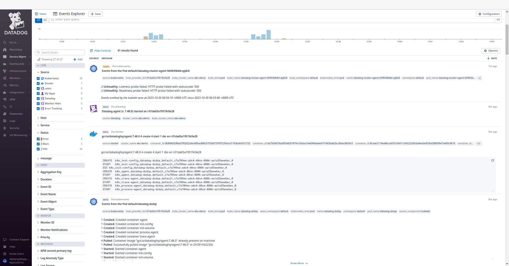
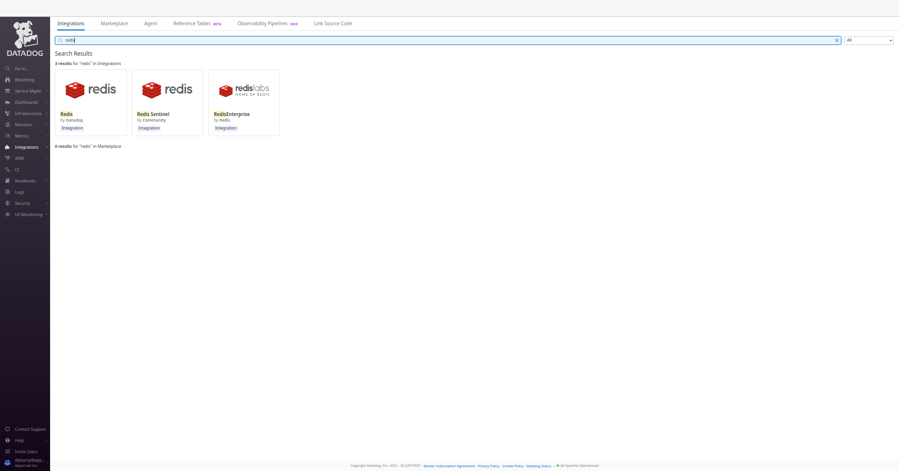
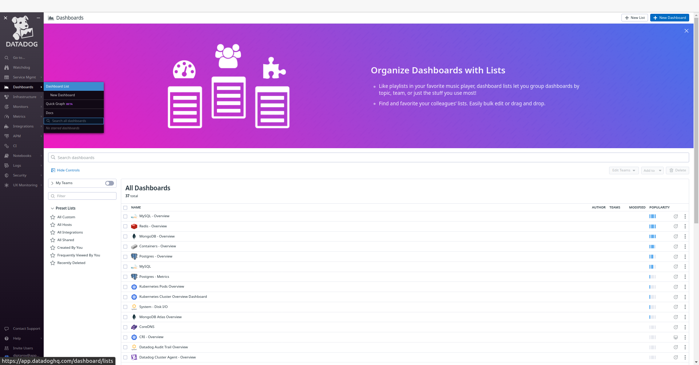
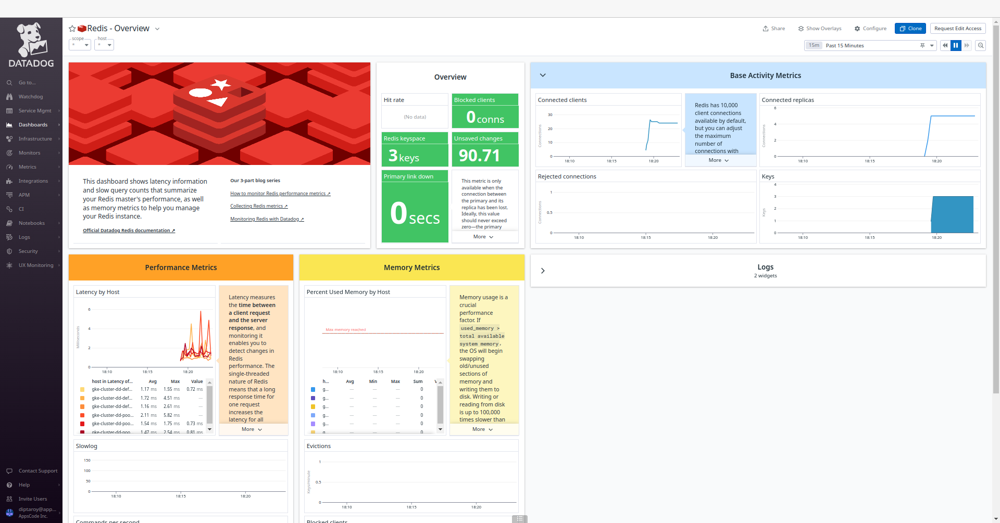
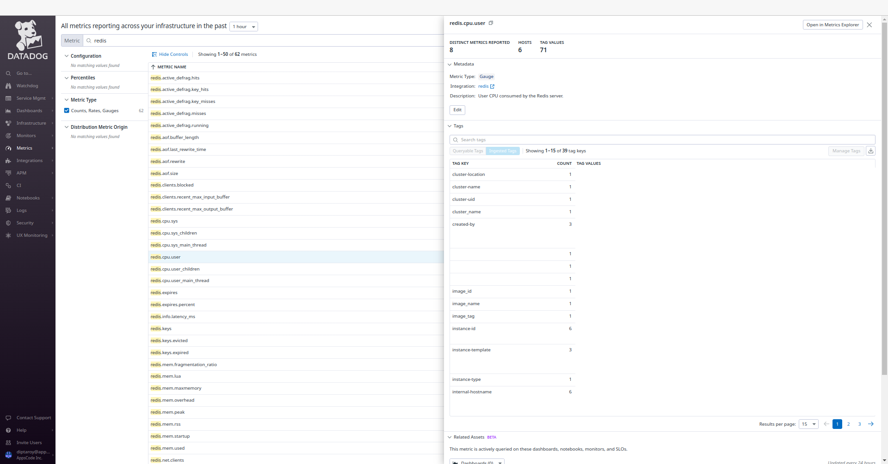
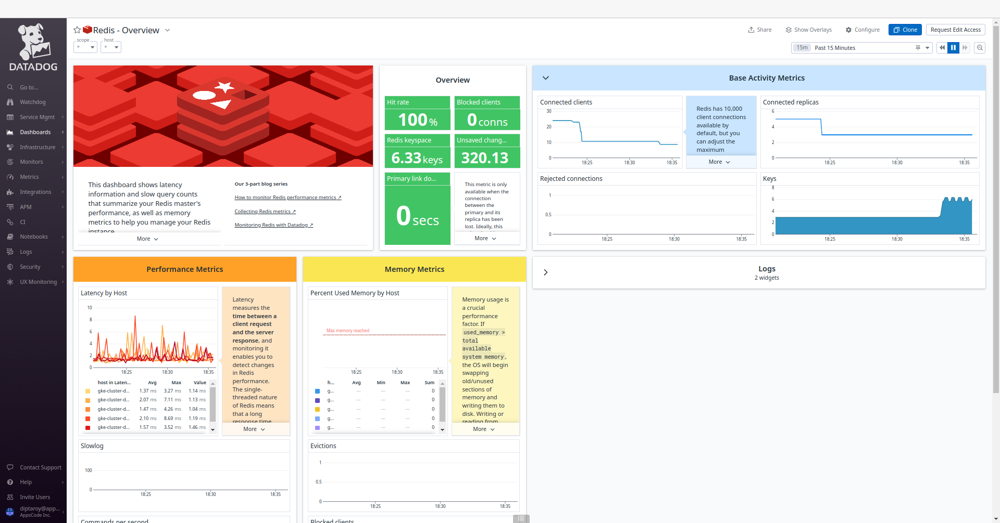

## Introduction

KubeDB is the Kubernetes Native Database Management Solution which simplifies and automates routine database tasks such as Provisioning, Monitoring, Upgrading, Patching, Scaling, Volume Expansion, Backup, Recovery, Failure detection, and Repair for various popular databases on private and public clouds. The databases that KubeDB supports are Redis, PostgreSQL, Kafka, MySQL, MongoDB, MariaDB, Elasticsearch, ProxySQL, Percona XtraDB, Memcached and PgBouncer. You can find the guides to all the supported databases in [KubeDB](https://kubedb.com/).
In this tutorial we will Monitor Redis With Datadog in Amazon Elastic Kubernetes Service (Amazon EKS) Using KubeDB. We will cover the following steps:

1) Install KubeDB
2) Install Datadog
3) Deploy Redis Cluster
4) Read/Write Sample Data
5) Monitor Redis with Datadog


### Get Cluster ID

We need the cluster ID to get the KubeDB License. To get cluster ID we can run the following command:

```bash
$ kubectl get ns kube-system -o jsonpath='{.metadata.uid}'
8e336615-0dbb-4ae8-b72f-2e7ec34c399d
```

### Get License

Go to [Appscode License Server](https://license-issuer.appscode.com/) to get the license.txt file. For this tutorial, we will use KubeDB Enterprise Edition.


## Install KubeDB

We will use helm to install KubeDB. Please install [Helm](https://helm.sh/docs/intro/install/) if it is not already installed.
Now, let's install `KubeDB`.

```bash
$ helm repo add appscode https://charts.appscode.com/stable/
$ helm repo update

$ helm search repo appscode/kubedb
NAME                              	CHART VERSION	APP VERSION	DESCRIPTION                                       
appscode/kubedb                   	v2023.11.2   	v2023.11.2 	KubeDB by AppsCode - Production ready databases...
appscode/kubedb-autoscaler        	v0.22.0      	v0.22.0    	KubeDB Autoscaler by AppsCode - Autoscale KubeD...
appscode/kubedb-catalog           	v2023.11.2   	v2023.11.2 	KubeDB Catalog by AppsCode - Catalog for databa...
appscode/kubedb-community         	v0.24.2      	v0.24.2    	KubeDB Community by AppsCode - Community featur...
appscode/kubedb-crds              	v2023.11.2   	v2023.11.2 	KubeDB Custom Resource Definitions                
appscode/kubedb-dashboard         	v0.13.0      	v0.13.0    	KubeDB Dashboard by AppsCode                      
appscode/kubedb-enterprise        	v0.11.2      	v0.11.2    	KubeDB Enterprise by AppsCode - Enterprise feat...
appscode/kubedb-grafana-dashboards	v2023.11.2   	v2023.11.2 	A Helm chart for kubedb-grafana-dashboards by A...
appscode/kubedb-metrics           	v2023.11.2   	v2023.11.2 	KubeDB State Metrics                              
appscode/kubedb-one               	v2023.11.2   	v2023.11.2 	KubeDB and Stash by AppsCode - Production ready...
appscode/kubedb-ops-manager       	v0.24.0      	v0.24.0    	KubeDB Ops Manager by AppsCode - Enterprise fea...
appscode/kubedb-opscenter         	v2023.11.2   	v2023.11.2 	KubeDB Opscenter by AppsCode                      
appscode/kubedb-provisioner       	v0.37.0      	v0.37.0    	KubeDB Provisioner by AppsCode - Community feat...
appscode/kubedb-schema-manager    	v0.13.0      	v0.13.0    	KubeDB Schema Manager by AppsCode                 
appscode/kubedb-ui                	v2023.10.18  	0.4.6      	A Helm chart for Kubernetes                       
appscode/kubedb-ui-server         	v2021.12.21  	v2021.12.21	A Helm chart for kubedb-ui-server by AppsCode     
appscode/kubedb-webhook-server    	v0.13.0      	v0.13.0    	KubeDB Webhook Server by AppsCode 

# Install KubeDB Enterprise operator chart
$ helm install kubedb appscode/kubedb \
  --version v2023.11.2 \
  --namespace kubedb --create-namespace \
  --set kubedb-provisioner.enabled=true \
  --set kubedb-ops-manager.enabled=true \
  --set kubedb-autoscaler.enabled=true \
  --set kubedb-dashboard.enabled=true \
  --set kubedb-schema-manager.enabled=true \
  --set-file global.license=/path/to/the/license.txt
```

Let's verify the installation:

```bash
$ watch kubectl get pods --all-namespaces -l "app.kubernetes.io/instance=kubedb"

NAMESPACE   NAME                                            READY   STATUS    RESTARTS   AGE
kubedb      kubedb-kubedb-autoscaler-8685b5f5f8-kwh9r       1/1     Running   0          2m38s
kubedb      kubedb-kubedb-dashboard-677448dff8-ggrz6        1/1     Running   0          2m38s
kubedb      kubedb-kubedb-ops-manager-f4d869f54-xbtd7       1/1     Running   0          2m38s
kubedb      kubedb-kubedb-provisioner-778795d79-zbn74       1/1     Running   0          2m38s
kubedb      kubedb-kubedb-schema-manager-64f9cc9445-vwfsk   1/1     Running   0          2m38s
kubedb      kubedb-kubedb-webhook-server-85cb5f5fdb-jtpgt   1/1     Running   0          2m38s
```

We can list the CRD Groups that have been registered by the operator by running the following command:

```bash
$ kubectl get crd -l app.kubernetes.io/name=kubedb
NAME                                              CREATED AT
elasticsearchautoscalers.autoscaling.kubedb.com   2023-11-08T09:17:35Z
elasticsearchdashboards.dashboard.kubedb.com      2023-11-08T09:18:05Z
elasticsearches.kubedb.com                        2023-11-08T09:17:11Z
elasticsearchopsrequests.ops.kubedb.com           2023-11-08T09:17:12Z
elasticsearchversions.catalog.kubedb.com          2023-11-08T09:16:27Z
etcds.kubedb.com                                  2023-11-08T09:17:23Z
etcdversions.catalog.kubedb.com                   2023-11-08T09:16:27Z
kafkaopsrequests.ops.kubedb.com                   2023-11-08T09:17:43Z
kafkas.kubedb.com                                 2023-11-08T09:17:25Z
kafkaversions.catalog.kubedb.com                  2023-11-08T09:16:27Z
mariadbautoscalers.autoscaling.kubedb.com         2023-11-08T09:17:35Z
mariadbdatabases.schema.kubedb.com                2023-11-08T09:17:56Z
mariadbopsrequests.ops.kubedb.com                 2023-11-08T09:17:24Z
mariadbs.kubedb.com                               2023-11-08T09:17:23Z
mariadbversions.catalog.kubedb.com                2023-11-08T09:16:27Z
memcacheds.kubedb.com                             2023-11-08T09:17:24Z
memcachedversions.catalog.kubedb.com              2023-11-08T09:16:27Z
mongodbautoscalers.autoscaling.kubedb.com         2023-11-08T09:17:35Z
mongodbdatabases.schema.kubedb.com                2023-11-08T09:17:56Z
mongodbopsrequests.ops.kubedb.com                 2023-11-08T09:17:15Z
mongodbs.kubedb.com                               2023-11-08T09:17:15Z
mongodbversions.catalog.kubedb.com                2023-11-08T09:16:27Z
mysqlautoscalers.autoscaling.kubedb.com           2023-11-08T09:17:35Z
mysqldatabases.schema.kubedb.com                  2023-11-08T09:17:55Z
mysqlopsrequests.ops.kubedb.com                   2023-11-08T09:17:21Z
mysqls.kubedb.com                                 2023-11-08T09:17:21Z
mysqlversions.catalog.kubedb.com                  2023-11-08T09:16:27Z
perconaxtradbautoscalers.autoscaling.kubedb.com   2023-11-08T09:17:35Z
perconaxtradbopsrequests.ops.kubedb.com           2023-11-08T09:17:37Z
perconaxtradbs.kubedb.com                         2023-11-08T09:17:24Z
perconaxtradbversions.catalog.kubedb.com          2023-11-08T09:16:27Z
pgbouncers.kubedb.com                             2023-11-08T09:17:18Z
pgbouncerversions.catalog.kubedb.com              2023-11-08T09:16:27Z
postgresautoscalers.autoscaling.kubedb.com        2023-11-08T09:17:35Z
postgresdatabases.schema.kubedb.com               2023-11-08T09:17:56Z
postgreses.kubedb.com                             2023-11-08T09:17:24Z
postgresopsrequests.ops.kubedb.com                2023-11-08T09:17:31Z
postgresversions.catalog.kubedb.com               2023-11-08T09:16:27Z
proxysqlautoscalers.autoscaling.kubedb.com        2023-11-08T09:17:35Z
proxysqlopsrequests.ops.kubedb.com                2023-11-08T09:17:34Z
proxysqls.kubedb.com                              2023-11-08T09:17:24Z
proxysqlversions.catalog.kubedb.com               2023-11-08T09:16:27Z
publishers.postgres.kubedb.com                    2023-11-08T09:17:46Z
redisautoscalers.autoscaling.kubedb.com           2023-11-08T09:17:35Z
redises.kubedb.com                                2023-11-08T09:17:25Z
redisopsrequests.ops.kubedb.com                   2023-11-08T09:17:27Z
redissentinelautoscalers.autoscaling.kubedb.com   2023-11-08T09:17:35Z
redissentinelopsrequests.ops.kubedb.com           2023-11-08T09:17:40Z
redissentinels.kubedb.com                         2023-11-08T09:17:25Z
redisversions.catalog.kubedb.com                  2023-11-08T09:16:27Z
subscribers.postgres.kubedb.com                   2023-11-08T09:17:50Z
```

## Install Datadog

To install Datadog, we recommend using `Helm`. Below are the steps for the installation. For more installation options and details, visit [Datadog's official documentation](https://docs.datadoghq.com/containers/kubernetes/installation/?tab=operator).

```bash
$ helm repo add datadog https://helm.datadoghq.com
$ helm repo update

$ helm install datadog -f values.yaml --set datadog.site='datadoghq.com' --set datadog.apiKey=<YOUR DATADOG API KEY> --set datadog.apm.enabled=true datadog/datadog
```

in `values.yaml` file we have added that configuration below,

```bash
  containers:
    agent:
      # agents.containers.agent.env -- Additional environment variables for the agent container
      env:
        - name: REDIS_PASSWORD
          value: "test"
```
Let's verify the installation:

```bash
$ kubectl get pods --all-namespaces -l "app.kubernetes.io/instance=datadog"

NAMESPACE   NAME                                    READY   STATUS    RESTARTS   AGE
default     datadog-cdtf2                           3/3     Running   0          3m20s
default     datadog-cluster-agent-bc5797f6d-xzgmv   1/1     Running   0          3m19s
default     datadog-fbqsx                           3/3     Running   0          3m19s
default     datadog-fqrkj                           3/3     Running   0          3m19s
default     datadog-h4zmg                           3/3     Running   0          3m20s
default     datadog-m7ppn                           3/3     Running   0          3m19s
default     datadog-tbffj                           3/3     Running   0          3m20s
```

### Datadog Events

To view events from your Kubernetes cluster, go to [Datadog's Event Explorer](https://app.datadoghq.com/event/explorer). You'll find valuable insights and information about your Kubernetes environment.



### Install Redis Dashboard

To access the Redis dashboard, go to `Integrations` and then install the Redis integration from there. This will allow you to monitor your Redis databases through Datadog's dashboard.



#### Create Custom Secret

Now, we are going to create a custom secret for our Redis cluster with the same password `test` as provided in the `values.yaml` file.

Here is the yaml of custom secret we are going to use:

```yaml
apiVersion: v1
kind: Secret
metadata:
  name: mysecret
  namespace: default
stringData:
  username: default
  password: test 
type: "kubernetes.io/basic-auth"
```
Let's save this yaml configuration into `mysecret.yaml` 
Then create the above secret,

```bash
$ kubectl apply -f mysecret.yaml 
secret/mysecret created
```

### Deploy Redis Cluster

Now, we are going to deploy Redis cluster using KubeDB. You’ll need to deploy your Redis cluster with the same namespace `default` where Datadog is installed.

Here is the yaml of the Redis we are going to use:

```yaml
apiVersion: kubedb.com/v1alpha2
kind: Redis
metadata:
  name: redis-cluster-dd
  namespace: default
spec:
  version: 7.0.5
  mode: Cluster
  authSecret:
    name: mysecret
    externallyManaged: true
  cluster:
    master: 3
    replicas: 1
  storageType: Durable
  storage:
    resources:
      requests:
        storage: "1Gi"
    storageClassName: "standard"
    accessModes:
      - ReadWriteOnce
  terminationPolicy: WipeOut
  podTemplate:
    metadata:
      annotations:
        ad.datadoghq.com/redis.checks: |
          {
            "redisdb": {
              "instances": [
                {
                  "host": "%%host%%",
                  "port":"6379",
                  "password":"%%env_REDIS_PASSWORD%%"
                }
              ]
            }
          }
```


Let's save this yaml configuration into `redis-cluster-dd.yaml` 
Then create the above Redis CRD

```bash
$ kubectl apply -f redis-cluster-dd.yaml
redis.kubedb.com/redis-cluster-dd created
```

In this yaml,
* `spec.version` field specifies the version of Redis. Here, we are using Redis `7.0.5`. You can list the KubeDB supported versions of Redis by running `$ kubectl get redisversions` command.
* Another field to notice is the `spec.storageType` field. This can be `Durable` or `Ephemeral` depending on the requirements of the database to be persistent or not.
* `spec.authSecret` is an optional field that points to a Secret used to hold credentials for Redis superuser. If not set, KubeDB operator creates a new Secret `{redis-object-name}-auth` for storing the password for Redis superuser. Here, we are using custom secret `mysecret`. 
* `spec.terminationPolicy` field is *Wipeout* means that the database will be deleted without restrictions. It can also be "Halt", "Delete" and "DoNotTerminate". Learn more about [Termination Policy](https://kubedb.com/docs/latest/guides/redis/concepts/redis/#specterminationpolicy).
* `spec.podTemplate.metadata.annotations` field specifes [Autodiscovery Integrations Templates](https://docs.datadoghq.com/containers/kubernetes/integrations/?tab=kubernetesadv2) as pod annotations on your application container. Learn more about [Autodiscovery Template Variables](https://docs.datadoghq.com/containers/guide/template_variables/).


Once everything handled correctly and the Redis object is deployed, you will see that the following are created:

```bash
$ kubectl get all -n default -l=app.kubernetes.io/instance=redis-cluster-dd

NAME                            READY   STATUS    RESTARTS   AGE
pod/redis-cluster-dd-shard0-0   1/1     Running   0          6m29s
pod/redis-cluster-dd-shard0-1   1/1     Running   0          6m12s
pod/redis-cluster-dd-shard1-0   1/1     Running   0          6m28s
pod/redis-cluster-dd-shard1-1   1/1     Running   0          6m9s
pod/redis-cluster-dd-shard2-0   1/1     Running   0          6m27s
pod/redis-cluster-dd-shard2-1   1/1     Running   0          6m10s

NAME                            TYPE        CLUSTER-IP     EXTERNAL-IP   PORT(S)    AGE
service/redis-cluster-dd        ClusterIP   10.96.10.245   <none>        6379/TCP   6m31s
service/redis-cluster-dd-pods   ClusterIP   None           <none>        6379/TCP   6m31s

NAME                                       READY   AGE
statefulset.apps/redis-cluster-dd-shard0   2/2     6m31s
statefulset.apps/redis-cluster-dd-shard1   2/2     6m30s
statefulset.apps/redis-cluster-dd-shard2   2/2     6m29s

NAME                                                  TYPE               VERSION   AGE
appbinding.appcatalog.appscode.com/redis-cluster-dd   kubedb.com/redis   7.0.5     6m31s
```
Let’s check if the database is ready to use,

```bash
$ kubectl get redis -n default redis-cluster-dd
NAME               VERSION   STATUS   AGE
redis-cluster-dd   7.0.5     Ready    7m1s
```
> We have successfully deployed Redis in AWS with Datadog. Now we can exec into the container to use the database.

### Accessing Database Through CLI

To access the database through CLI, we have to get the credentials to access. KubeDB will create Secret and Service for the database `redis-cluster-dd` that we have deployed. Let’s check them using the following commands,

```bash
$ kubectl get secret -n default -l=app.kubernetes.io/instance=redis-cluster-dd
NAME                      TYPE                       DATA   AGE
redis-cluster-dd-auth     kubernetes.io/basic-auth   2      5m
redis-cluster-dd-config   Opaque                     1      5m

$ kubectl get service -n default -l=app.kubernetes.io/instance=redis-cluster-dd
NAME                    TYPE        CLUSTER-IP   EXTERNAL-IP   PORT(S)    AGE
redis-cluster-dd        ClusterIP   10.92.37.3   <none>        6379/TCP   5m20s
redis-cluster-dd-pods   ClusterIP   None         <none>        6379/TCP   5m21s
```
Now, we are going to use `redis-cluster-dd-auth` to get the credentials.

```bash
$ kubectl get secrets -n default mysecret -o jsonpath='{.data.username}' | base64 -d
default

$ kubectl get secrets -n default mysecret -o jsonpath='{.data.\password}' | base64 -d
test
```
Now, we are going to use `PASSWORD` to authenticate and insert some sample data. First, let’s export the `PASSWORD` as environment variables to make further commands re-usable.

```bash
$ export PASSWORD=$(kubectl get secrets -n default mysecret -o jsonpath='{.data.\password}' | base64 -d)
```

### Accessing Redis Dashboards

To access the monitoring dashboards in the Datadog UI, navigate to the `Dashboards` section in your Datadog account's main menu. From the dropdown menu, select `Dashboards List`, and you'll find `Redis - Overview`. This dashboard provide insights into various aspects of your Redis database, offering both a high-level summary and more detailed performance metrics for effective monitoring and management. Also, to access Redis metrics, navigate to the `Metrics` section and select `Summary` in the Datadog UI.








#### Insert Sample Data

Let's insert some sample data into our Redis database.

```bash
$ $ kubectl exec -it -n default redis-cluster-dd-shard0-0 -- redis-cli -c -a $PASSWORD

127.0.0.1:6379> set Product1 KubeDB
-> Redirected to slot [15299] located at 10.92.7.11:6379
OK
10.92.7.11:6379> set Product2 Stash
-> Redirected to slot [2976] located at 10.92.0.10:6379
OK
10.92.0.10:6379> get Product1
-> Redirected to slot [15299] located at 10.92.7.11:6379
"KubeDB"
10.92.7.11:6379> get Product2
-> Redirected to slot [2976] located at 10.92.0.10:6379
"Stash"
10.92.0.10:6379> exit
```

> We’ve successfully inserted some sample data to our database. More information about Run & Manage Redis on Kubernetes can be found in [Redis Kubernetes](https://kubedb.com/kubernetes/databases/run-and-manage-redis-on-kubernetes/)


Following the insertion of sample data into our Redis database, we can monitor any resultant changes in the Datadog UI. Go to the `Redis - Overview` dashboard to observe any updates in performance metrics and insights for our Redis database.



## Conclusion

In this article, we've explored the process of monitoring Redis with Datadog in Amazon Elastic Kubernetes Service (Amazon EKS) using KubeDB. Our aim was to provide insights into efficiently managing and analyzing Redis performance within a Kubernetes environment. We've explored into the Redis configuration, data insertion, and monitoring aspects. This is just the beginning of our journey in exploring the dynamic relationship between Redis, Datadog, and Kubernetes. We have more articles and resources in the pipeline, all geared toward enhancing your understanding of these technologies and their effective integration. To stay updated and informed, be sure to follow our website for upcoming articles and insights.

If you want to learn more about Production-Grade Redis you can have a look into that playlist below:

<iframe width="560" height="315" src="https://www.youtube.com/embed/videoseries?si=3L2LlnMVjfofy_NR&amp;list=PLoiT1Gv2KR1iSuQq_iyypzqvHW9u_un04" title="YouTube video player" frameborder="0" allow="accelerometer; autoplay; clipboard-write; encrypted-media; gyroscope; picture-in-picture; web-share" allowfullscreen></iframe>


## Support

To speak with us, please leave a message on [our website](https://appscode.com/contact/).

To receive product announcements, follow us on [Twitter](https://twitter.com/KubeDB).

To watch tutorials of various Production-Grade Kubernetes Tools Subscribe our [YouTube](https://www.youtube.com/c/AppsCodeInc/) channel.

More about [Redis on Kubernetes](https://kubedb.com/kubernetes/databases/run-and-manage-redis-on-kubernetes/)

If you have found a bug with KubeDB or want to request for new features, please [file an issue](https://github.com/kubedb/project/issues/new).
