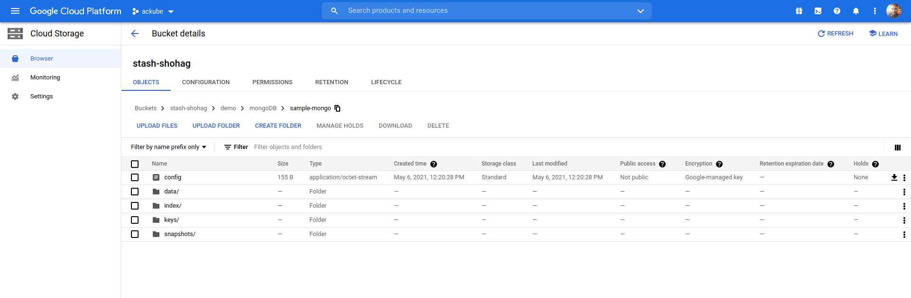

## Overview

The databases that KubeDB support are MongoDB, Elasticsearch, MySQL, MariaDB, PostgreSQL and Redis. You can find the guides to all the supported databases [here](https://kubedb.com/).
In this tutorial we will deploy MongoDB database. We will cover the following steps:

1) Install KubeDB
2) Deploy Database
3) Install Stash
4) Backup Using Stash
5) Recover Using Stash

## Step 1: Installing KubeDB

We will follow the following sub-steps to install KubeDB.

### Step 1.1: Get Cluster ID

We need the cluster ID to get the KubeDB License.
To get cluster ID we can run the following command:

```bash
$ oc get ns kube-system -o=jsonpath='{.metadata.uid}'
08b1259c-5d51-4948-a2de-e2af8e6835a4 
```

### Step 1.2: Get License

Go to [Appscode License Server](https://license-issuer.appscode.com/) to get the license.txt file. For this tutorial we will use KubeDB Enterprise Edition.


### Step 1.3 Install KubeDB

We will use helm to install KubeDB.Please install helm [here](https://helm.sh/docs/intro/install/) if it is not already installed.
Now, let's install `KubeDB`.

```bash
$ helm repo add appscode https://charts.appscode.com/stable/
$ helm repo update

$ helm search repo appscode/kubedb
NAME                        CHART VERSION APP VERSION DESCRIPTION
appscode/kubedb             v2021.04.16   v2021.04.16 KubeDB by AppsCode - Production ready databases...
appscode/kubedb-autoscaler  v0.3.0        v0.3.0      KubeDB Autoscaler by AppsCode - Autoscale KubeD...
appscode/kubedb-catalog     v0.18.0       v0.18.0     KubeDB Catalog by AppsCode - Catalog for databa...
appscode/kubedb-community   v0.18.0       v0.18.0     KubeDB Community by AppsCode - Community featur...
appscode/kubedb-crds        v0.18.0       v0.18.0     KubeDB Custom Resource Definitions
appscode/kubedb-enterprise  v0.5.0        v0.5.0      KubeDB Enterprise by AppsCode - Enterprise feat...

# Install KubeDB Enterprise operator chart
$ helm install kubedb appscode/kubedb \
    --version v2021.04.16 \
    --namespace kube-system \
    --set-file global.license=/path/to/the/license.txt \
    --set kubedb-enterprise.enabled=true \
    --set kubedb-autoscaler.enabled=true
```

Let's verify the installation:

```bash
$ watch kubectl get pods --all-namespaces -l "app.kubernetes.io/instance=kubedb"

NAMESPACE     NAME                                        READY   STATUS    RESTARTS   AGE
kube-system   kubedb-kubedb-autoscaler-569f66dbbc-qqmmb   1/1     Running   0          3m28s
kube-system   kubedb-kubedb-community-b6469fb9c-4hwbh     1/1     Running   0          3m28s
kube-system   kubedb-kubedb-enterprise-b658c95fc-kwqt6    1/1     Running   0          3m28s

```

We can see the CRD Groups that have been registered by the operator by running the following command:

```bash
$ oc get crd -l app.kubernetes.io/name=kubedb
NAME                                              CREATED AT
elasticsearchautoscalers.autoscaling.kubedb.com   2021-04-21T04:05:40Z
elasticsearches.kubedb.com                        2021-04-21T04:05:37Z
elasticsearchopsrequests.ops.kubedb.com           2021-04-21T04:05:37Z
elasticsearchversions.catalog.kubedb.com          2021-04-21T04:02:43Z
etcds.kubedb.com                                  2021-04-21T04:05:38Z
etcdversions.catalog.kubedb.com                   2021-04-21T04:02:44Z
mariadbs.kubedb.com                               2021-04-21T04:05:38Z
mariadbversions.catalog.kubedb.com                2021-04-21T04:02:44Z
memcacheds.kubedb.com                             2021-04-21T04:05:38Z
memcachedversions.catalog.kubedb.com              2021-04-21T04:02:45Z
mongodbautoscalers.autoscaling.kubedb.com         2021-04-21T04:05:37Z
mongodbopsrequests.ops.kubedb.com                 2021-04-21T04:05:40Z
mongodbs.kubedb.com                               2021-04-21T04:05:38Z
mongodbversions.catalog.kubedb.com                2021-04-21T04:02:46Z
mysqlopsrequests.ops.kubedb.com                   2021-04-21T04:05:48Z
mysqls.kubedb.com                                 2021-04-21T04:05:38Z
mysqlversions.catalog.kubedb.com                  2021-04-21T04:02:46Z
perconaxtradbs.kubedb.com                         2021-04-21T04:05:38Z
perconaxtradbversions.catalog.kubedb.com          2021-04-21T04:02:47Z
pgbouncers.kubedb.com                             2021-04-21T04:05:39Z
pgbouncerversions.catalog.kubedb.com              2021-04-21T04:02:47Z
postgreses.kubedb.com                             2021-04-21T04:05:39Z
postgresversions.catalog.kubedb.com               2021-04-21T04:02:48Z
proxysqls.kubedb.com                              2021-04-21T04:05:39Z
proxysqlversions.catalog.kubedb.com               2021-04-21T04:02:49Z
redises.kubedb.com                                2021-04-21T04:05:39Z
redisopsrequests.ops.kubedb.com                   2021-04-21T04:05:54Z
redisversions.catalog.kubedb.com                  2021-04-21T04:02:49Z
```

## Step 2: Deploying Database

Now we are going to Install MongoDB with the help of KubeDB.
At first, let's create a Namespace in which we will deploy the database.

```bash
$ oc create ns demo
```

Now, before deploying the MongoDB CRD let's perform some checks to ensure that it is deployed correctly.

### Check 1: StorageClass check

Let's check the availabe storage classes:

```bash
$ oc get storageclass
NAME         PROVISIONER             RECLAIMPOLICY   VOLUMEBINDINGMODE      ALLOWVOLUMEEXPANSION
local-path   rancher.io/local-path   Delete          WaitForFirstConsumer   false    
```

Here, you can see that I hace a storageclass named `local-path`. If you dont have a storage class you can run the following command:

```bash
$ oc apply -f https://raw.githubusercontent.com/rancher/local-path-provisioner/master/deploy/local-path-storage.yaml
```

This will create the storage-class named local-path.

### Check 2: Correct Permissions

We need to ensure that the service account has correct permissions. To ensure correct permissions we should run:

```bash
$ oc adm policy add-scc-to-user privileged system:serviceaccount:local-path-storage:local-path-provisioner-service-account
```

This command will give the required permissions. </br>
Here is the yaml of the MongoDB CRD we are going to use:

```yaml
apiVersion: kubedb.com/v1alpha2
kind: MongoDB
metadata:
  name: mgo-quickstart
  namespace: demo
spec:
  version: "4.2.3"
  storageType: Durable
  storage:
    accessModes:
    - ReadWriteOnce
    resources:
      requests:
        storage: 1Gi
  terminationPolicy: WipeOut
```

Let's save this yaml configuration into mongoDB.yaml. Then apply using the command
`oc apply -f mongoDB.yaml`

This yaml uses MonngoDB CRD.

* In this yaml we can see in the `spec.version` field the version of MongoDB. You can change and get updated version by running `oc get mongodbversions` command.
* Another field to notice is the `spec.storagetype` field. This can be Durable or Ephemeral depending on the requirements of the database to be persistent or not.
* `spec.storage.storageClassName` contains the name of the storage class we obtained before named "local-path".
* Lastly, the `spec.terminationPolicy` field is *Wipeout* means that the database will be deleted without restrictions. It can also be "Halt", "Delete" and "DoNotTerminate". Learn More about these [HERE](https://kubedb.com/docs/v2021.04.16/guides/mongodb/concepts/mongodb/#specterminationpolicy).

### Deploy MongoDB CRD

Once these are handled correctly and the MongoDB CRD is deployed you will see that the following are created:

```bash
$ oc get all -n demo
NAME                   READY   STATUS    RESTARTS   AGE
pod/mgo-quickstart-0   1/1     Running   0          5m49s

NAME                          TYPE        CLUSTER-IP     EXTERNAL-IP   PORT(S)     AGE
service/mgo-quickstart        ClusterIP   10.217.4.198   <none>        27017/TCP   5m50s
service/mgo-quickstart-pods   ClusterIP   None           <none>        27017/TCP   5m50s

NAME                              READY   AGE
statefulset.apps/mgo-quickstart   1/1     5m52s

NAME                                                TYPE                 VERSION   AGE
appbinding.appcatalog.appscode.com/mgo-quickstart   kubedb.com/mongodb   4.2.3     5m23s

NAME                                VERSION   STATUS   AGE
mongodb.kubedb.com/mgo-quickstart   4.2.3     Ready    6m
```

> We have successfully deployed MongoDB in OpenShift. Now we can exec into the container to use the database.

## Accessing Database Through CLI

To access the database through CLI we have to exec into the container:

 ```bash
$ oc  get secrets -n demo mgo-quickstart-auth -o jsonpath='{.data.\username}' | base64 -d
root                                                                   
$ oc  get secrets -n demo mgo-quickstart-auth -o jsonpath='{.data.\password}' | base64 -d
ay=bql8jD5Y;SKrF
$ oc exec -it mgo-quickstart-0 -n demo sh
kubectl exec [POD] [COMMAND] is DEPRECATED and will be removed in a future version. Use kubectl exec [POD] -- [COMMAND] instead.
 ```

 Then to login into MongoDB:

```bash
$ mongo admin
MongoDB shell version v4.2.3
connecting to: mongodb://127.0.0.1:27017/admin?compressors=disabled&gssapiServiceName=mongodb
Implicit session: session { "id" : UUID("60091063-f4c0-45af-aec9-ef9463cc1a5f") }
MongoDB server version: 4.2.3
Welcome to the MongoDB shell.
For interactive help, type "help".
For more comprehensive documentation, see
	http://docs.mongodb.org/
Questions? Try the support group
	http://groups.google.com/group/mongodb-user
2021-05-06T05:37:34.907+0000 I  STORAGE  [main] In File::open(), ::open for '//.mongorc.js' failed with Permission denied
> db.auth("root","ay=bql8jD5Y;SKrF")
1
 ```

Now we have entered into the MongoDB CLI and we can create and delete as we want.
Let's create a database and create a test table called movie:

```bash
> show dbs
admin   0.000GB
config  0.000GB
local   0.000GB
> use testdb
switched to db testdb
> db.movie.insert({"name":"batman"});
WriteResult({ "nInserted" : 1 })
> db.movie.find().pretty()
{ "_id" : ObjectId("6093810e104a7bd2911ec415"), "name" : "batman" }
> exit
bye
```

> This was just one example of database deployment. The other databases that KubeDB suport are MySQL, Postgres, Elasticsearch, MariaDB and Redis. The tutorials on how to deploy these into the cluster can be found [HERE](https://kubedb.com/)

## Backup and Recover Database Using Stash

Here we are going to backup the database we deployed before using Stash.

### Step 1: Install Stash

Here we will use the KubeDB license we obtained earlier.

```bash
$ helm install stash appscode/stash             \
  --version v2021.04.12                  \
  --namespace kube-system                       \
  --set features.enterprise=true                \
  --set-file global.license=/path/to/the/license.txt
```

Let's verify the installation:

```bash
$ oc get pods --all-namespaces -l app.kubernetes.io/name=stash-enterprise --watch
NAMESPACE     NAME                                      READY   STATUS    RESTARTS   AGE
kube-system   stash-stash-enterprise-77bd9869c6-9wjvv   2/2     Running   0          7d19h
```

### Step 2: Prepare Backend

Stash supports various backends for storing data snapshots. It can be a cloud storage like GCS bucket, AWS S3, Azure Blob Storage etc. or a Kubernetes persistent volume like HostPath, PersistentVolumeClaim, NFS etc.

For this tutorial we are going to use gcs-bucket. You can find other setups [here](https://stash.run/docs/v2021.04.12/guides/latest/backends/overview/).

 

 **Create Secret:**

```bash
$ echo -n 'YOURPASSWORD' > RESTIC_PASSWORD
$ echo -n 'YOURPROJECTNAME' > GOOGLE_PROJECT_ID
$ cat /PATH/TO/JSONKEY.json > GOOGLE_SERVICE_ACCOUNT_JSON_KEY
$ oc create secret generic -n demo gcs-secret \
        --from-file=./RESTIC_PASSWORD \
        --from-file=./GOOGLE_PROJECT_ID \
        --from-file=./GOOGLE_SERVICE_ACCOUNT_JSON_KEY
 ```

### Step 3: Create Repository

```yaml
apiVersion: stash.appscode.com/v1alpha1
kind: Repository
metadata:
  name: gcs-repo
  namespace: demo
spec:
  backend:
    gcs:
      bucket: YOURBUCKETNAME
      prefix: /demo/mongoDB/sample-mongo
    storageSecretName: gcs-secret
```

This repository specifies the gcs-secret we created before and connects to the gcs-bucket. It also specifies the location in the bucket where we want to backup our database.
> Don't forget to change `spec.backend.gcs.bucket` to your bucket name.

### Step 4: Create BackupConfiguration

```yaml
apiVersion: stash.appscode.com/v1beta1
kind: BackupConfiguration
metadata:
  name: sample-mongodb-backup
  namespace: demo
spec:
  schedule: "*/5 * * * *"
  repository:
    name: gcs-repo
  target:
    ref:
      apiVersion: appcatalog.appscode.com/v1alpha1
      kind: AppBinding
      name: mgo-quickstart
  runtimeSettings:
    container:
      securityContext:
        runAsUser: 1000610000
        runAsGroup: 1000610000
  retentionPolicy:
    name: keep-last-5
    keepLast: 5
    prune: true
```

Notice that the BackupConfiguration contains `spec.runtimeSettings.container.securitycontext` field. The user and group security context need to be changed in OpenShift to the values within 1000610000 - 1000619999. Now, this BackupConfiguration creates a cronjob that backs up the specified database (`spec.target`) every 5 minutes.</br>
So, after 5 minutes we can see the following status:

```bash
$ oc get backupsession -n demo                                 
NAME                               INVOKER-TYPE          INVOKER-NAME            PHASE       AGE
sample-mongodb-backup-1620282013   BackupConfiguration   sample-mongodb-backup   Succeeded   2m40s
```

Now if we check our GCS bucket we can see that the backup has been successful.



> **If you reached here CONGRATULATIONS!! :confetti_ball:  :partying_face: :confetti_ball: The backup has been successful**. If you didn't its okay. You can reach out to us through [EMAIL](mailto:support@appscode.com?subject=Stash%20Backup%20Failed%20in%20OpenShift).

## Recover

Let's think of a scenario in which the database has been accidentally deleted or there was an error in the database causing it to crash.
In such a case, we have to pause the BackupConfiguration so that the failed/damaged database does not get backed up into the cloud:

```bash
oc patch backupconfiguration -n demo sample-mongodb-backup --type="merge" --patch='{"spec": {"paused": true}}'
```

At first let's simulate accidental database deletion.

```bash
$ oc exec -it mgo-quickstart-0 -n demo sh
kubectl exec [POD] [COMMAND] is DEPRECATED and will be removed in a future version. Use kubectl exec [POD] -- [COMMAND] instead.
$ mongo admin
MongoDB shell version v4.2.3
connecting to: mongodb://127.0.0.1:27017/admin?compressors=disabled&gssapiServiceName=mongodb
Implicit session: session { "id" : UUID("6185c112-ccfd-44f6-828d-cdca7435372e") }
MongoDB server version: 4.2.3
Welcome to the MongoDB shell.
For interactive help, type "help".
For more comprehensive documentation, see
	http://docs.mongodb.org/
Questions? Try the support group
	http://groups.google.com/group/mongodb-user
2021-05-06T06:28:38.418+0000 I  STORAGE  [main] In File::open(), ::open for '//.mongorc.js' failed with Permission denied
> db.auth("root","ay=bql8jD5Y;SKrF")
1
> show dbs
admin   0.000GB
config  0.000GB
local   0.000GB
testdb  0.000GB
> use testdb
switched to db testdb
> db.dropDatabase()
{ "dropped" : "testdb", "ok" : 1 }
> show dbs
admin   0.000GB
config  0.000GB
local   0.000GB
```

### Step 1: Create a RestoreSession

Now, let's create a RestoreSession that will initiate restoring from the cloud.

```yaml
apiVersion: stash.appscode.com/v1beta1
kind: RestoreSession
metadata:
  name: sample-mongodb-restore
  namespace: demo
spec:
  repository:
    name: gcs-repo
  target:
    ref:
      apiVersion: appcatalog.appscode.com/v1alpha1
      kind: AppBinding
      name: mgo-quickstart
  runtimeSettings:
    container:
      securityContext:
        runAsUser: 1000610000
        runAsGroup: 1000610000
  rules:
    - snapshots: [latest]
```

Notice that the `securityContext` field is the same as we mentioned earlier in the BackupConfiguration. This RestoreSession specifies where the data will be restored.
Once this is applied, a RestoreSession will be created. Once it has succeeded, the database has been successfully recovered as you can see in the images below:

```bash
$ oc get restoresession -n demo
NAME                     REPOSITORY   PHASE       AGE
sample-mongodb-restore   gcs-repo     Succeeded   95s

```

Now let's check whether the database has been correctly restored:

```bash
> show dbs
admin   0.000GB
config  0.000GB
local   0.000GB
testdb  0.000GB
> db.movie.find().pretty()
{ "_id" : ObjectId("60938f7a2bfe705fb488fb17"), "name" : "batman" }
```

> The recovery has been successful. If you faced any difficulties in the recovery process you can reach out to us through [EMAIL](mailto:support@appscode.com?subject=Stash%20Recovery%20Failed%20in%20OpenShift).

## Support

To speak with us, please leave a message on [our website](https://appscode.com/contact/).

To join public discussions with the KubeDB community, join us in the [Kubernetes Slack team](https://kubernetes.slack.com/messages/C8149MREV/) channel `#kubedb`. To sign up, use our [Slack inviter](http://slack.kubernetes.io/).

To receive product announcements, follow us on [Twitter](https://twitter.com/KubeDB).

If you have found a bug with KubeDB or want to request for new features, please [file an issue](https://github.com/kubedb/project/issues/new).