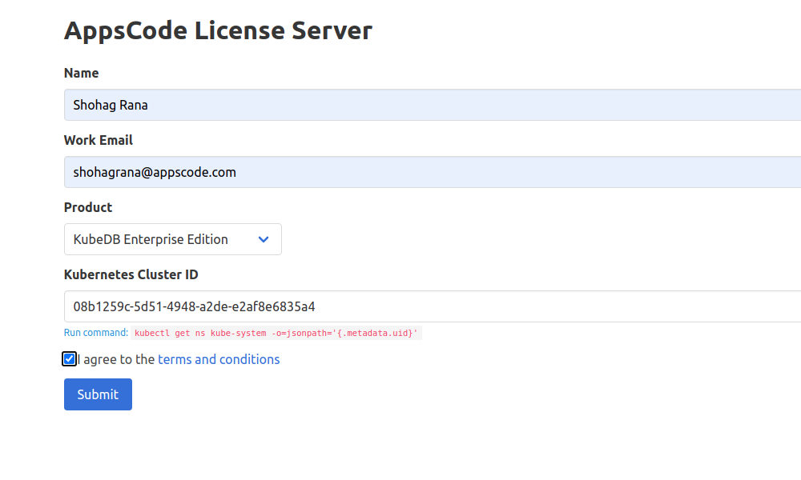
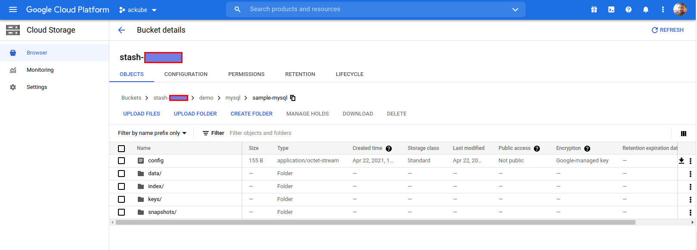

# How to manage database in Openshift using KubeDB

```bash
~ $ oc get nodes
NAME                 STATUS   ROLES           AGE   VERSION
crc-xl2km-master-0   Ready    master,worker   12d   v1.20.0+bafe7
```
## Step 1: Installing KubeDB 
</br>

### Step 1.1: Get Cluster ID
```bash
~ $ oc get ns kube-system -o=jsonpath='{.metadata.uid}'
08b1259c-5d51-4948-a2de-e2af8e6835a4 
```
###  Step 1.2: Get License

Go to [Appscode License Server](https://license-issuer.appscode.com/) to get the license.txt file. For this tutorial we will use KubeDB Enterprise Edition.


### Step 1.3 Install KubeDB
We need [helm](https://helm.sh/docs/intro/install/) to install KubeDB. It can be installed by the following commands:
```bash
$ curl -fsSL -o get_helm.sh https://raw.githubusercontent.com/helm/helm/master/scripts/get-helm-3
$ chmod 700 get_helm.sh
$ ./get_helm.sh
```

Finally we install `KubeDB`

```bash
$ helm repo add appscode https://charts.appscode.com/stable/
$ helm repo update

$ helm search repo appscode/kubedb
NAME                        CHART VERSION APP VERSION DESCRIPTION
appscode/kubedb             v2021.04.16   v2021.04.16 KubeDB by AppsCode - Production ready databases...
appscode/kubedb-autoscaler  v0.3.0        v0.3.0      KubeDB Autoscaler by AppsCode - Autoscale KubeD...
appscode/kubedb-catalog     v0.18.0       v0.18.0     KubeDB Catalog by AppsCode - Catalog for databa...
appscode/kubedb-community   v0.18.0       v0.18.0     KubeDB Community by AppsCode - Community featur...
appscode/kubedb-crds        v0.18.0       v0.18.0     KubeDB Custom Resource Definitions
appscode/kubedb-enterprise  v0.5.0        v0.5.0      KubeDB Enterprise by AppsCode - Enterprise feat...

# Install KubeDB Enterprise operator chart
$ helm install kubedb appscode/kubedb \
    --version v2021.04.16 \
    --namespace kube-system \
    --set-file global.license=/path/to/the/license.txt \
    --set kubedb-enterprise.enabled=true \
    --set kubedb-autoscaler.enabled=true
```
Let's verify the installation:
```bash
watch oc get pods --all-namespaces -l "app.kubernetes
Every 2.0s: oc get pods --all-namespaces -l app.kubernetes.io/instance=kubedb                                                                                                      Shohag: Wed Apr 21 10:08:54 2021

NAMESPACE     NAME                                        READY   STATUS    RESTARTS   AGE
kube-system   kubedb-kubedb-autoscaler-569f66dbbc-qqmmb   1/1     Running   0          3m28s
kube-system   kubedb-kubedb-community-b6469fb9c-4hwbh     1/1     Running   0          3m28s
kube-system   kubedb-kubedb-enterprise-b658c95fc-kwqt6    1/1     Running   0          3m28s

```
We can see the CRD Groups that have been registered by the operator by running the following command:
```bash
oc get crd -l app.kubernetes.io/name=kubedb
```

# Step 2: Deploying Database

> Now we can Install a number of common databases with the help of KubeDB.

The databases that KubeDB support are MongoDB, Elasticsearch, MySQL, MariaDB, PostgreSQL and Redis.
## Deploying MySQL Database
Let's first create a Namespace in which we will deploy the database.
```bash
oc create ns demo
```
Now lets apply the following yaml file:
```yaml
apiVersion: kubedb.com/v1alpha2
kind: MySQL
metadata:
  name: mysql-quickstart
  namespace: demo
spec:
  version: "8.0.23-v1"
  storageType: Durable
  storage:
    storageClassName: "local-path"
    accessModes:
    - ReadWriteOnce
    resources:
      requests:
        storage: 1Gi
  terminationPolicy: WipeOut
```
This yaml uses MySQL CRD.
> NOTE: This might fail if correct permissions and storage class is not set. Let's make some checks so that the above yaml does not fail.
### Check 1: StorageClass check
Let's First check if storageclass is available:
```bash
oc get storageclass
NAME         PROVISIONER             RECLAIMPOLICY   VOLUMEBINDINGMODE      ALLOWVOLUMEEXPANSION
local-path   rancher.io/local-path   Delete          WaitForFirstConsumer   false    
```
If you dont see the above output then you should run:
```bash
oc apply -f https://raw.githubusercontent.com/rancher/local-path-provisioner/master/deploy/local-path-storage.yaml
```
This will create the storage-class named local-path.

### Check 2: Correct Permissions

If you apply the above yaml and it is stuck in provisioning state then the pvc does not have required permissions. In such a case you should run:
```bash
oc adm policy add-scc-to-user privileged system:serviceaccount:local-path-storage:local-path-provisioner-service-account
```
This command will give the required permissions. </br>
### Deploy MySQL CRD
Once these are handled correctly and the MySQL CRD is deployed you will see that the following are created:
```bash
NAME                     READY   STATUS    RESTARTS   AGE
pod/mysql-quickstart-0   1/1     Running   0          31m

NAME                            TYPE        CLUSTER-IP     EXTERNAL-IP   PORT(S)    AGE
service/mysql-quickstart        ClusterIP   10.217.5.195   <none>        3306/TCP   31m
service/mysql-quickstart-pods   ClusterIP   None           <none>        3306/TCP   31m

NAME                                READY   AGE
statefulset.apps/mysql-quickstart   1/1     31m

NAME                                                  TYPE               VERSION   AGE
appbinding.appcatalog.appscode.com/mysql-quickstart   kubedb.com/mysql   8.0.23    31m

NAME                                VERSION     STATUS   AGE
mysql.kubedb.com/mysql-quickstart   8.0.23-v1   Ready    31m
```

> We have successfully deployed MySQL database in OpenShift. Now we can exec into the container to use the database.

## Accessing Database Through CLI

To access the database through CLI we have to exec into the container:
 ```bash
oc exec -it -n demo mysql-quickstart-0 -- bash
 ```
 Then to login into mysql:
 ```bash
mysql -uroot -p${MYSQL_ROOT_PASSWORD}
 ```
Now we have entered into the MySQL CLI and we can create and delete as we want.

> This was just one example of database deployment. The other databases that KubeDB suport are MongoDB, Elasticsearch, MariaDB, PostgreSQL and Redis. The tutorials on how to deploy these into the cluster can be found [HERE](https://kubedb.com/)

# Backup and Recover In OpenShift

## Backup

### Step 1: Install Stash
Here we will use the kubedb license we obtained earlier.
```bash
helm install stash appscode/stash             \
  --version v2021.04.12                  \
  --namespace kube-system                       \
  --set features.enterprise=true                \
  --set-file global.license=/path/to/the/license.txt
```
verify installation:
```bash
oc get pods --all-namespaces -l app.kubernetes.io/name=stash-enterprise --watch
```
### Step 2: Prepare Backend
Stash supports various backends for storing data snapshots. It can be a cloud storage like GCS bucket, AWS S3, Azure Blob Storage etc. or a Kubernetes persistent volume like HostPath, PersistentVolumeClaim, NFS etc.

For this tutorial we are going to use gcs-bucket. You can find other setups [here](https://stash.run/docs/v2021.04.12/guides/latest/backends/overview/).

 
 **Create Secret:**
 ```bash
~ $ echo -n 'YOURPASSWORD' > RESTIC_PASSWORD
~ $ echo -n 'ackube' > GOOGLE_PROJECT_ID
~ $ cat /home/ac/Downloads/ackube-87e4aa631714.json > GOOGLE_SERVICE_ACCOUNT_JSON_KEY
~ $ oc create secret generic -n demo gcs-secret \
        --from-file=./RESTIC_PASSWORD \
        --from-file=./GOOGLE_PROJECT_ID \
        --from-file=./GOOGLE_SERVICE_ACCOUNT_JSON_KEY
 ```
 ### Step 3: Create Repository

```yaml
apiVersion: stash.appscode.com/v1alpha1
kind: Repository
metadata:
  name: gcs-repo
  namespace: demo
spec:
  backend:
    gcs:
      bucket: stash-shohag
      prefix: /demo/mysql/sample-mysql
    storageSecretName: gcs-secret
```
This repository specifies the gcs-secret we created before and connects to the gcs-bucket.
### Step 4: Create BackupConfiguration
```yaml
apiVersion: stash.appscode.com/v1beta1
kind: BackupConfiguration
metadata:
  name: sample-mysql-backup
  namespace: demo
spec:
  schedule: "*/5 * * * *"
  repository:
    name: gcs-repo
  target:
    ref:
      apiVersion: appcatalog.appscode.com/v1alpha1
      kind: AppBinding
      name: mysql-quickstart
  runtimeSettings:
    container:
      securityContext:
        runAsUser: 1000610000
        runAsGroup: 1000610000
  retentionPolicy:
    name: keep-last-5
    keepLast: 5
    prune: true
```
This BackupConfiguration creates a cronjob that backs up the specified database every 5 minutes.</br></br>
So, after 5 minutes we can see the following status:


Now if we check our GCS bucket we can see that the backup has been successful.



> **If you reached here CONGRATULATIONS!! :confetti_ball:  :partying_face: 		:confetti_ball: The backup has been successful**. If you didn't its okay. You can reach out to us through [EMAIL](mailto:support@appscode.com?subject=Stash%20Backup%20Failed%20in%20OpenShift).

## Recover
We have to pause backup cronjob:
```bash
oc patch backupconfiguration -n demo sample-mysql-backup --type="merge" --patch='{"spec": {"paused": true}}'
```
In order to show that the recovery has been successful let's simulate accidental database deletion.


**Now let's start recovering the database.**
### Step 1: Create a RestoreSession
```yaml
apiVersion: stash.appscode.com/v1beta1
kind: RestoreSession
metadata:
  name: sample-mysql-restore
  namespace: demo
spec:
  repository:
    name: gcs-repo
  target:
    ref:
      apiVersion: appcatalog.appscode.com/v1alpha1
      kind: AppBinding
      name: mysql-quickstart
  runtimeSettings:
    container:
      securityContext:
        runAsUser: 1000610000
        runAsGroup: 1000610000
  rules:
    - snapshots: [latest]
```
Once this is applied, a RestoreSession will be created. Once it has succeeded, the database has been successfully recovered as you can see in the images below:


> Thus we have successfully recovered the MySQL database.


## Support

To speak with us, please leave a message on [our website](https://appscode.com/contact/).

To join public discussions with the KubeDB community, join us in the [Kubernetes Slack team](https://kubernetes.slack.com/messages/C8149MREV/) channel `#kubedb`. To sign up, use our [Slack inviter](http://slack.kubernetes.io/).

To receive product announcements, follow us on [Twitter](https://twitter.com/KubeDB).

If you have found a bug with KubeDB or want to request for new features, please [file an issue](https://github.com/kubedb/project/issues/new).