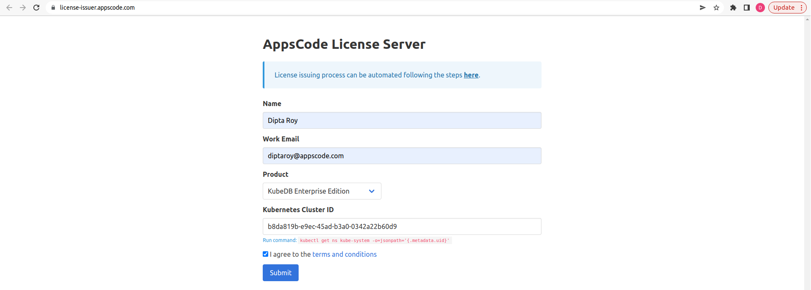

## Summary

In this article, We are going to cover up these below topics :
- Introduction to Gatekeeper
- Mutation, Validation, Templates & External Data providers
- Demonstration on Constraint validation
- Concept of ResourceGraph & PolicyReport
- Monitoring policies using Prometheus & Grafana.

## Introduction
Kubernetes provides a powerful platform for managing containerized applications, but it also introduces new complexities and challenges in managing security, compliance, and governance.
Policy management is an essential aspect of Kubernetes that helps organizations manage and enforce compliance and security policies across their Kubernetes clusters. 
But,managing the policies manually is a very troublesome & error-prune approach for the organizations. So we need a dedicated tool for that. And such a tool is [Gatekeeper](https://github.com/open-policy-agent/gatekeeper).

## Gatekeeper CRDs
There are total of 6 apiGroups available in gatekeeper. Here is the complete list of all the Custom resources of those apiGroups : 
1) `mutations` -> `Assign`, `AssignMetadata`, `ModifySet` <br>
They mutate the resources. `AssignMetadata` mutates the metadata part. `Assign` mutates the spec part. & `ModifySet` mutates the lists (for examples, args of a container).   
2) `templates` -> `ConstraintTemplate` <br>
ConstraintTemplate is a template for policy validations. It can be thought as a CRD of CRD, means we can register new custom-resources (aka constraints) to our cluster. We will look a detailed example of it later.
3) `status` -> `ConstraintPodStatus`, `ConstraintTemplatePodStatus`, `MutatorPodStatus` <br>
These resources don't give any specific functionality to the users, rather they give information about which operator pods are determining the policy violations.
4) `config` -> `Config` <br>
Some constraints are impossible to write without access to more state than just the object under test. For example, it is impossible to know if an ingress's hostname is unique among all ingresses unless a rule has access to all other ingresses. To make such rules possible, we enable syncing of data into OPA.
5) `externaldata` -> `Provider` <br>
Gatekeeper provides various means to mutate and validate Kubernetes resources. However, in many of these scenarios this data is either built-in, static or user defined. With external data feature, Gatekeeper enables to interface with various external data sources, such as image registries, using a provider-based model.
6) `expansion` -> `ExpansionTemplate` <br>
one could configure Gatekeeper to immediately reject deployments that would create a Pod that violates a constraint instead of merely rejecting the Pods. To achieve this, Gatekeeper creates a "mock resource" for the Pod, runs validation on it, and aggregates the mock resource's violations onto the parent resource (Deployment for example).


## Workflow
In this tutorial we will deploy all the resources in local kind cluster. But you can also learn and try out running them in Linode Kubernetes Engine (LKE), Google Kubernetes Engine (GKE) , Azure Kubernetes Service (AKS) or Amazon Elastic Kubernetes Service(EKS) . We will cover the following steps:

- Install Gatekeeper
- Deploy ConstraintTemplates & Constraints
- Install KubeDB
- Create ResourceGraph
- Use PolicyReport
- Monitoring Policies


## Install Gatekeeper
We will install this helm [chart](https://github.com/open-policy-agent/gatekeeper/tree/master/charts/gatekeeper).

We will use helm to install Gatekeper. Please install helm [here](https://helm.sh/docs/intro/install/) if it is not already installed.

```bash
$ helm repo add gatekeeper https://open-policy-agent.github.io/gatekeeper/charts
$ helm repo update
$ helm install gatekeeper/gatekeeper --name-template=gatekeeper --namespace gatekeeper-system --create-namespace --set replicas=1 --set constraintViolationsLimit=100
```


## Constraints Template
Let's say, we have a specific use case scenario, where we don't want to allow any deployments those have less than 3 replicas or more than 50 replicas. 

If we don't use any policy management tool, we need to either manually check the deployment's spec if they maintain the restrictions. Or we can write the restrictions into code, make webhook server with it, & deploy it in our cluster with operator style. 
Each time our cluster administrator wnats to change the target-resource or range, The webhook server code needs to be updated accordingly & make a new release of it.  A big big hassle !!

But if we choose to use Gatekeeper as policy management tool, We would instead apply a kubernetes resource like below : 
```yaml
apiVersion: templates.gatekeeper.sh/v1
kind: ConstraintTemplate
metadata:
  name: k8sreplicalimits
  annotations:
    metadata.gatekeeper.sh/title: "Replica Limits"
    metadata.gatekeeper.sh/version: 1.0.0
    description: >-
      Requires that objects with the field `spec.replicas` (Deployments,
      ReplicaSets, etc.) specify a number of replicas within defined ranges.
spec:
  crd:
    spec:
      names:
        kind: K8sReplicaLimits
      validation:
        # Schema for the `parameters` field
        openAPIV3Schema:
          type: object
          properties:
            ranges:
              type: array
              description: Allowed ranges for numbers of replicas.  Values are inclusive.
              items:
                type: object
                description: A range of allowed replicas.  Values are inclusive.
                properties:
                  min_replicas:
                    description: The minimum number of replicas allowed, inclusive.
                    type: integer
                  max_replicas:
                    description: The maximum number of replicas allowed, inclusive.
                    type: integer
  targets:
    - target: admission.k8s.gatekeeper.sh
      rego: |
        package k8sreplicalimits

        deployment_name = input.review.object.metadata.name

        violation[{"msg": msg}] {
            spec := input.review.object.spec
            not input_replica_limit(spec)
            msg := sprintf("The provided number of replicas is not allowed for deployment: %v. Allowed ranges: %v", [deployment_name, input.parameters])
        }

        input_replica_limit(spec) {
            provided := input.review.object.spec.replicas
            count(input.parameters.ranges) > 0
            range := input.parameters.ranges[_]
            value_within_range(range, provided)
        }

        value_within_range(range, value) {
            range.min_replicas <= value
            range.max_replicas >= value
        }
```
Lets deep dive into this yaml. 
- `.spec.crd.spec.names.kind` specifies the new kind we are going to register to our cluster
- we are giving it a name (`.metadata.name`) & description (`.metadata.annotaions.description`)
- Specifying a standard open APi schema for the CRD in `.spec.crd.spec.validation.openAPIV3Schema`, where `min_replicas` & `max_replicas` property belongs.
- Lastly, the validation logic in `.spec.targets.rego`. `violation[{"msg": msg}]` is the entry and exit of the rego code. `input_replica_limit` & `value_within_range` are some utility functions for validations.
  For more details about [rego language](https://www.openpolicyagent.org/docs/latest/policy-language/)

So, the templates has been created, & a new kind named `K8sReplicaLimits` has been registered to the cluster. 

## Constraint
Now we are going to apply the constraint.

```yaml
apiVersion: constraints.gatekeeper.sh/v1beta1
kind: K8sReplicaLimits
metadata:
  name: replica-limits
spec:
  enforcementAction: deny
  match:
    kinds:
      - apiGroups: ["apps"]
        kinds: ["Deployment"]
  parameters:
    ranges:
      - min_replicas: 3
        max_replicas: 50
```
- `.spec.enforcementAction` is set to `deny`, as we don't want to create deployment those violate the restriction
- `.spec.match` specifies the target resources.
- `.spec.parameters` are the part which has been defined in `.spec.crd.spec.validation.openAPIV3Schema` of the ConstraintTemplate.

That's it !!
Now, If cluster administrator wants to change the ranges, all he needs to do is to change the `min_replicas` & `max_replicas` field here. If he wants to enforce this policy to the statefulset resources also, he just needs to add that in `.spec.match.kinds`, etc. The policy will be enforced to the k8s cluster directly.


## Install KubeDB

You can test Gatekeeper without even installing KubeDB. But you want to follow this blog with me, you need to do that. As I have given example with KubeDB. We will follow the steps to install KubeDB.

### Get Cluster ID

We need the cluster ID to get the KubeDB License.
To get cluster ID we can run the following command:

```bash
$ kubectl get ns kube-system -o jsonpath='{.metadata.uid}'
b8da819b-e9ec-45ad-b3a0-0342a22b60d9
```

### Get License

Go to [Appscode License Server](https://license-issuer.appscode.com/) to get the license.txt file. For this tutorial we will use KubeDB Enterprise Edition.



### Install KubeDB

```bash
$ helm repo add appscode https://charts.appscode.com/stable/
$ helm repo update

$ helm search repo appscode/kubedb
NAME                              	CHART VERSION	APP VERSION	DESCRIPTION                                       
appscode/kubedb                   	v2023.04.10  	v2023.04.10	KubeDB by AppsCode - Production ready databases...
appscode/kubedb-autoscaler        	v0.18.0      	v0.18.0    	KubeDB Autoscaler by AppsCode - Autoscale KubeD...
appscode/kubedb-catalog           	v2023.04.10  	v2023.04.10	KubeDB Catalog by AppsCode - Catalog for databa...
appscode/kubedb-community         	v0.24.2      	v0.24.2    	KubeDB Community by AppsCode - Community featur...
appscode/kubedb-crds              	v2023.04.10  	v2023.04.10	KubeDB Custom Resource Definitions                
appscode/kubedb-dashboard         	v0.9.0       	v0.9.0     	KubeDB Dashboard by AppsCode                      
appscode/kubedb-enterprise        	v0.11.2      	v0.11.2    	KubeDB Enterprise by AppsCode - Enterprise feat...
appscode/kubedb-grafana-dashboards	v2023.04.10  	v2023.04.10	A Helm chart for kubedb-grafana-dashboards by A...
appscode/kubedb-metrics           	v2023.04.10  	v2023.04.10	KubeDB State Metrics                              
appscode/kubedb-one               	v2023.04.10  	v2023.04.10	KubeDB and Stash by AppsCode - Production ready...
appscode/kubedb-ops-manager       	v0.20.0      	v0.20.0    	KubeDB Ops Manager by AppsCode - Enterprise fea...
appscode/kubedb-opscenter         	v2023.04.10  	v2023.04.10	KubeDB Opscenter by AppsCode                      
appscode/kubedb-provisioner       	v0.33.0      	v0.33.0    	KubeDB Provisioner by AppsCode - Community feat...
appscode/kubedb-schema-manager    	v0.9.0       	v0.9.0     	KubeDB Schema Manager by AppsCode                 
appscode/kubedb-ui                	v2023.03.23  	0.3.28     	A Helm chart for Kubernetes                       
appscode/kubedb-ui-server         	v2021.12.21  	v2021.12.21	A Helm chart for kubedb-ui-server by AppsCode     
appscode/kubedb-webhook-server    	v0.9.0       	v0.9.0     	KubeDB Webhook Server by AppsCode 

# Install KubeDB Enterprise operator chart
$ helm install kubedb appscode/kubedb \
  --version v2023.04.10 \
  --namespace kubedb --create-namespace \
  --set kubedb-provisioner.enabled=true \
  --set kubedb-ops-manager.enabled=true \
  --set kubedb-autoscaler.enabled=true \
  --set kubedb-dashboard.enabled=true \
  --set kubedb-schema-manager.enabled=true \
  --set-file global.license=/path/to/the/license.txt
```

Let's verify the installation:

```bash
$ watch kubectl get pods --all-namespaces -l "app.kubernetes.io/instance=kubedb"
NAMESPACE   NAME                                            READY   STATUS    RESTARTS      AGE
kubedb      kubedb-kubedb-autoscaler-8567f844fd-rdmz9       1/1     Running   0             20h
kubedb      kubedb-kubedb-dashboard-576d6bc7dc-4496s        1/1     Running   0             20h
kubedb      kubedb-kubedb-ops-manager-854bf567c8-fzp2r      1/1     Running   0             20h
kubedb      kubedb-kubedb-provisioner-596d87bc46-fz4fg      1/1     Running   0             20h
kubedb      kubedb-kubedb-schema-manager-6b67b8687-vp75b    1/1     Running   0             20h
kubedb      kubedb-kubedb-webhook-server-8496d984d7-lqrcz   1/1     Running   0             20h
```

## Integrating gatekeeper with Appscode eco-system
There can be a lot of use cases for policy enforcement. Most of them are very common, they should be enforced on all clusters, for security reason. 
Like pulling images from a specific registry, ensuring unique ingress host, ensuring some org specific label-annotations, never running a container with root access, etc.
But writing production-grade rego files for all these use cases is not that easy. 

What if we make a templates library for all the common use cases, And we enforce those constraints on your cluster on behalf of you ? That's exactly what Appscode is aiming at.

## Concept of ResourceGraph & PolicyReport
Let's say, now you want to get a complete list of which resources has been violated by the constraints of your cluster. In that case, there will be no easy solution in gatekeeper. You need to get the constraints one by one, check the `.status.violations` field if that resource you are looking for is present or not. And listing those violations.

This is troublesome, error-prune, but somewhat doable.  But, what if you don't want the violations for just that resource, but for the connected resources of that resource ? (For example serviceAccount, clusterroles, service, persistentvolume etc resources those are connected with a deployment). There is nothing you can do actually in this case !! 

We have introduced an extended-api-server type `Resourcegraph` to address this use case.

```yaml
apiVersion: meta.k8s.appscode.com/v1alpha1
kind: ResourceGraph
request:
  source:
    ref:
      name: scanner
      namespace: kubeops
    resource:
      group: apps
      kind: StatefulSet
      name: statefulsets
      version: v1
```
Internally, we utilize [graphql](https://graphql.org/learn/) to make a complete graph of all the existing resources, & mark the connections between those resources with different labels. when you kubectl create the above yaml, you will get all the connections it have with other resources in the `response` field.

If you are interested in getting the policy violations list not the connections, you just need to apply our `PolicyReport` EAS in the above manner. Like below :
```yaml

apiVersion: policy.k8s.appscode.com/v1alpha1
kind: PolicyReport
request:
  ref:
    name: kubedb-kubedb-provisioner
    namespace: kubedb
  resource:
    group: apps
    kind: Deployment
    name: deployments
    version: v1
```
In its `response`, the violations will be found.  So, you are done with getting a rich policy library and kubernetes types for the policy management, lets now talk about monitoring.

## Monitoring policies
We export policy-related live metrics of the k8s cluster to a `/metrics` endpoint using our [ui-server](https://github.com/kubeops/ui-server/tree/master/pkg/metricshandler) repository.
Monitoring tools like Prometheus can scrap these metrics & make use of it. Currently, we export 4 [gauge metrics](https://prometheus.io/docs/concepts/metric_types/#gauge) for monitoring cluster-wide & namespace-specific policy violations.

`/metrics` endpoint exposes this type of metrics : 
```text
# HELP policy_appscode_com_cluster_violation_occurrence_total Cluster-wide Violation Occurrence statistics
# TYPE policy_appscode_com_cluster_violation_occurrence_total gauge
policy_appscode_com_cluster_violation_occurrence_total 73
# HELP policy_appscode_com_cluster_violation_occurrence_by_constraint_type Cluster-wide Violation Occurrence statistics by constraint type
# TYPE policy_appscode_com_cluster_violation_occurrence_by_constraint_type gauge
policy_appscode_com_cluster_violation_occurrence_by_constraint_type{constraint="K8sContainerLimits"} 30
policy_appscode_com_cluster_violation_occurrence_by_constraint_type{constraint="K8sContainerRequests"} 23
policy_appscode_com_cluster_violation_occurrence_by_constraint_type{constraint="K8sReplicaLimits"} 20
# HELP policy_appscode_com_namespace_violation_occurrence_total Namespace-wise total Violation Occurrence statistics
# TYPE policy_appscode_com_namespace_violation_occurrence_total gauge
policy_appscode_com_namespace_violation_occurrence_total{namespace="monitoring"} 6
policy_appscode_com_namespace_violation_occurrence_total{namespace="local-path-storage"} 2
policy_appscode_com_namespace_violation_occurrence_total{namespace="gatekeeper-system"} 4
policy_appscode_com_namespace_violation_occurrence_total{namespace="default"} 4
policy_appscode_com_namespace_violation_occurrence_total{namespace="kube-bind"} 1
policy_appscode_com_namespace_violation_occurrence_total{namespace="kubeops"} 2
policy_appscode_com_namespace_violation_occurrence_total{namespace="kube-system"} 1
policy_appscode_com_namespace_violation_occurrence_total{namespace="kubeops"} 3
policy_appscode_com_namespace_violation_occurrence_total{namespace="local-path-storage"} 1
policy_appscode_com_namespace_violation_occurrence_total{namespace="kube-bind"} 2
policy_appscode_com_namespace_violation_occurrence_total{namespace="gatekeeper-system"} 2
policy_appscode_com_namespace_violation_occurrence_total{namespace="monitoring"} 8
policy_appscode_com_namespace_violation_occurrence_total{namespace="kube-system"} 7
policy_appscode_com_namespace_violation_occurrence_total{namespace="default"} 7
policy_appscode_com_namespace_violation_occurrence_total{namespace="monitoring"} 8
policy_appscode_com_namespace_violation_occurrence_total{namespace="default"} 4
policy_appscode_com_namespace_violation_occurrence_total{namespace="kubeops"} 3
policy_appscode_com_namespace_violation_occurrence_total{namespace="kube-system"} 5
policy_appscode_com_namespace_violation_occurrence_total{namespace="local-path-storage"} 1
policy_appscode_com_namespace_violation_occurrence_total{namespace="kube-bind"} 2
# HELP policy_appscode_com_namespace_violation_occurrence_by_constraint_type Namespace-wise Violation Occurrence statistics by constraint type
# TYPE policy_appscode_com_namespace_violation_occurrence_by_constraint_type gauge
policy_appscode_com_namespace_violation_occurrence_by_constraint_type{constraint="K8sReplicaLimits",namespace="monitoring"} 6
policy_appscode_com_namespace_violation_occurrence_by_constraint_type{constraint="K8sReplicaLimits",namespace="local-path-storage"} 2
policy_appscode_com_namespace_violation_occurrence_by_constraint_type{constraint="K8sReplicaLimits",namespace="gatekeeper-system"} 4
policy_appscode_com_namespace_violation_occurrence_by_constraint_type{constraint="K8sReplicaLimits",namespace="default"} 4
policy_appscode_com_namespace_violation_occurrence_by_constraint_type{constraint="K8sReplicaLimits",namespace="kube-bind"} 1
policy_appscode_com_namespace_violation_occurrence_by_constraint_type{constraint="K8sReplicaLimits",namespace="kubeops"} 2
policy_appscode_com_namespace_violation_occurrence_by_constraint_type{constraint="K8sReplicaLimits",namespace="kube-system"} 1
policy_appscode_com_namespace_violation_occurrence_by_constraint_type{constraint="K8sContainerLimits",namespace="kubeops"} 3
policy_appscode_com_namespace_violation_occurrence_by_constraint_type{constraint="K8sContainerLimits",namespace="local-path-storage"} 1
policy_appscode_com_namespace_violation_occurrence_by_constraint_type{constraint="K8sContainerLimits",namespace="kube-bind"} 2
policy_appscode_com_namespace_violation_occurrence_by_constraint_type{constraint="K8sContainerLimits",namespace="gatekeeper-system"} 2
policy_appscode_com_namespace_violation_occurrence_by_constraint_type{constraint="K8sContainerLimits",namespace="monitoring"} 8
policy_appscode_com_namespace_violation_occurrence_by_constraint_type{constraint="K8sContainerLimits",namespace="kube-system"} 7
policy_appscode_com_namespace_violation_occurrence_by_constraint_type{constraint="K8sContainerLimits",namespace="default"} 7
policy_appscode_com_namespace_violation_occurrence_by_constraint_type{constraint="K8sContainerRequests",namespace="local-path-storage"} 1
policy_appscode_com_namespace_violation_occurrence_by_constraint_type{constraint="K8sContainerRequests",namespace="kube-bind"} 2
policy_appscode_com_namespace_violation_occurrence_by_constraint_type{constraint="K8sContainerRequests",namespace="monitoring"} 8
policy_appscode_com_namespace_violation_occurrence_by_constraint_type{constraint="K8sContainerRequests",namespace="default"} 4
policy_appscode_com_namespace_violation_occurrence_by_constraint_type{constraint="K8sContainerRequests",namespace="kubeops"} 3
policy_appscode_com_namespace_violation_occurrence_by_constraint_type{constraint="K8sContainerRequests",namespace="kube-system"} 5
```

We have made two simple grafana-dashboard to visualize those data in a time-metric manner. You can find those dashboard's json-files & samples [here](https://github.com/appscode/grafana-dashboards/tree/master/policy).

## Conclusion
Congrats! You have read the whole blog. We arranged a webinar on 5th april 2023 on this topic. If you are interested in some more details, here is the video link:

<iframe width="560" height="315" src="https://www.youtube.com/embed/KF2x4E2sCQE" title="YouTube video player" frameborder="0" allow="accelerometer; autoplay; clipboard-write; encrypted-media; gyroscope; picture-in-picture; web-share" allowfullscreen></iframe>
.

## What Next?

Please try the latest release and give us your valuable feedback.

* If you want to install **KubeDB**, please follow the installation instruction from [here](https://kubedb.com/docs/v2023.04.10/setup/).

* If you want to install **KubeVault**, please follow the installation instruction from [here](https://kubevault.com/docs/v2023.03.03/setup/).

* If you want to install **Stash**, please follow the installation instruction from [here](https://stash.run/docs/v2023.03.20/setup/).


## Support

To speak with us, please leave a message on [our website](https://appscode.com/contact/).

To receive product announcements, follow us on [Twitter](https://twitter.com/appscode).

If you have found a bug with KubeVault or want to request new features, please [file an issue](https://github.com/kubedb/project/issues/new).
