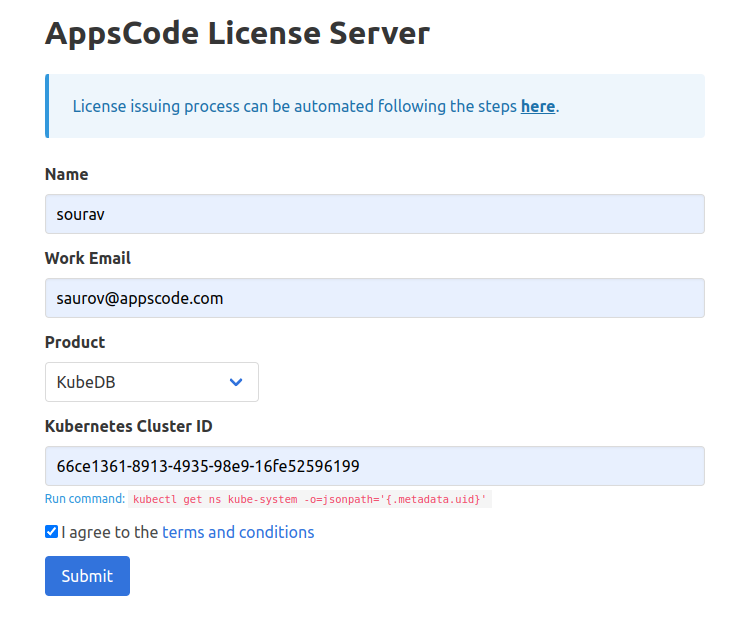
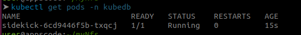
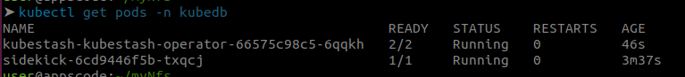
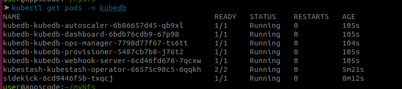
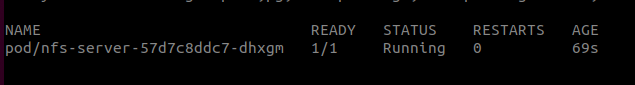
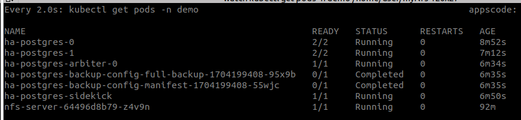
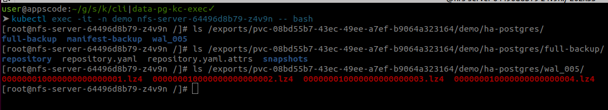
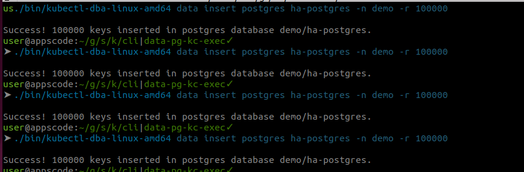
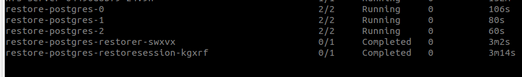
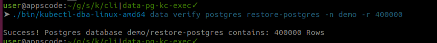

## PITR using NFS server as a backend

### Overview

KubeDB is the Kubernetes Native Database Management Solution which simplifies and automates routine database tasks such as Provisioning, Monitoring, Upgrading, Patching, Scaling, Volume Expansion, Backup, Recovery, Failure detection, and Repair for various popular databases on private and public clouds. The databases that KubeDB supports are MongoDB, Elasticsearch, MySQL, Kafka, MariaDB, Redis, PostgreSQL, ProxySQL, Percona XtraDB, Memcached and PgBouncer. You can find the guides to all the supported databases in [KubeDB](https://kubedb.com/).
In this tutorial we will use NFS server as a backend to perform Point In Time Recovery for Postgresql database.

Before begin, we need to get a license for Kubedb products.
### Get Cluster ID

We need the cluster ID to get the KubeDB License.
To get cluster ID we can run the following command:

```bash
$ kubectl get ns kube-system -o jsonpath='{.metadata.uid}'
60b010fb-9ad6-4ac6-89f4-7321e697f469
```

### Get License

Go to [Appscode License Server](https://license-issuer.appscode.com/) to get the license.txt file. For this tutorial we will use KubeDB Enterprise Edition.



As we have license, now we will follow [this](https://github.com/kubedb/archiver-demo) to install the necessary  tools for performing PITR.

### Install Sidekick

```bash
helm pull oci://ghcr.io/appscode-charts/sidekick --version v2023.12.11
```
```bash
helm upgrade -i sidekick sidekick-v2023.12.11.tgz \
  -n kubedb --create-namespace \
  --wait --burst-limit=10000 --debug
```


### Install KubeStash
```bash
helm pull oci://ghcr.io/appscode-charts/kubestash --version v2023.12.28
```
> Please provide the license that you have downloaded earlier here `--set-file global.license=`


```bash
helm upgrade -i kubestash kubestash-v2023.12.28.tgz \
  --namespace kubedb \
  --set kubedb-kubestash-catalog.enabled=true \

  --set-file global.license=$HOME/Downloads/kubedb-license-6352bd41-0d2d-4824-a70c-cd038fe8292d.txt \
  --wait --burst-limit=10000 --debug
```



### Install Kubedb

Uninstall kubedb if already kubedb relase exists.
```bash
helm uninstall kubedb -n kubedb
```

```bash
helm pull oci://ghcr.io/appscode-charts/kubedb --version v2023.12.28
```

Apply the crds.
```bash
kubectl apply -f https://github.com/kubedb/installer/raw/v2023.12.28/crds/kubedb-catalog-crds.yaml

```

> Please provide the license that you have downloaded earlier here `--set-file global.license=`


```bash
helm upgrade -i kubedb kubedb-v2023.12.28.tgz \
  --namespace kubedb \
  --set kubedb-kubestash-catalog.enabled=true \
  --set-file global.license=$HOME/Downloads/kubedb-license-6352bd41-0d2d-4824-a70c-cd038fe8292d.txt \
  --wait --burst-limit=10000 --debug
```



### Install VolumeSnapshotter
If your cluster already have a volume-snapshotter available, You don't need to follow this step.
Otherwise, You need to install an external-snapshotter to take volume snapshot.

clone https://github.com/kubernetes-csi/external-snapshotter/tree/release-5.0

or 

wget https://github.com/kubernetes-csi/external-snapshotter/archive/refs/tags/v5.0.1.zip

```bash
unzip v5.0.1.zip
cd external-snapshotter-5.0.1

kubectl kustomize client/config/crd | kubectl create -f -
kubectl -n kube-system kustomize deploy/kubernetes/snapshot-controller | kubectl create -f -
kubectl kustomize deploy/kubernetes/csi-snapshotter | kubectl create -f -
```


### Install Longhorn
You will need to install longhorn for provisioning volume snapshot. If you already have a volume snapshot provisioner available in your cluster, ignore this step.

Add Longhorn chart repository.

`helm repo add longhorn https://charts.longhorn.io`

Update local Longhorn chart information from chart repository.

`helm repo update`

Install Longhorn chart.

With Helm 2, the following command will create the longhorn-system namespace and install the Longhorn chart together.

`helm install longhorn/longhorn --name longhorn --namespace longhorn-system`

With Helm 3, the following commands will create the longhorn-system namespace first, then install the Longhorn chart.
```bash 
kubectl create namespace longhorn-system
helm install longhorn longhorn/longhorn --namespace longhorn-system
```

### Create volumeSnapshotClass

Apply this yaml to create a volumeSnapShotClass. This will be used to create volume snapshot.
```yaml
apiVersion: snapshot.storage.k8s.io/v1
kind: VolumeSnapshotClass
metadata:
  name: longhorn-vsc
driver: driver.longhorn.io
deletionPolicy: Delete
parameters:
  type: snap
```
### Install CSI driver for NFS
Install CSI driver for creating nfs volume from [here](https://github.com/kubernetes-csi/csi-driver-nfs/tree/master/charts).

```bash
helm repo add csi-driver-nfs https://raw.githubusercontent.com/kubernetes-csi/csi-driver-nfs/master/charts
helm install csi-driver-nfs csi-driver-nfs/csi-driver-nfs --namespace kube-system --version v4.5.0 --set feature.enableFSGroupPolicy=true

```
Be aware to set `--set feature.enableFSGroupPolicy=true` this.


We will use namespace `demo` throughout this tutorial.
```bash
➤ kubectl create ns demo
namespace/demo created
```

### Setup NFS Server


We will deploy a nfs server and a service using the below yamls. Note we have shared `/exports` path.
```yaml

apiVersion: apps/v1
kind: Deployment
metadata:
  name: nfs-server
  namespace: demo
spec:
  selector:
    matchLabels:
      app: nfs-server
  template:
    metadata:
      labels:
        app: nfs-server
    spec:
      containers:
        - name: nfs-server
          image: k8s.gcr.io/volume-nfs:0.8
          ports:
            - name: nfs
              containerPort: 2049
            - name: mountd
              containerPort: 20048
            - name: rpcbind
              containerPort: 111
          securityContext:
            privileged: true
          volumeMounts:
            - name: storage
              mountPath: /exports
      volumes:
        - name: storage
          hostPath:
            path: /data/nfs # store all data in "/data/nfs" directory of the node where it is running
            type: DirectoryOrCreate
---

apiVersion: v1
kind: Service
metadata:
  name: nfs-server
  namespace: demo
spec:
  ports:
    - name: nfs
      port: 2049
    - name: mountd
      port: 20048
    - name: rpcbind
      port: 111
  selector:
    app: nfs-server # must match with the label of NFS pod
```

```bash
➤ kubectl apply -f nfs-server.yaml
deployment.apps/nfs-server created
service/nfs-server created
```
nfs server should be running inside this pod



### Create StorageClass for NFS

```yaml
allowVolumeExpansion: true
apiVersion: storage.k8s.io/v1
kind: StorageClass
metadata:
  name: nfs 
parameters:
  server: nfs-server.demo.svc.cluster.local
  share: /
provisioner: nfs.csi.k8s.io
reclaimPolicy: Delete
volumeBindingMode: Immediate

```
Here, `parameters.server` should be the dns name of your service that is created along with nfs server, `parameters.share` should be the path inside the shared directory.


### Create BackupStorage

First create a PVC which we will use as our backend storage. This pvc should be created using `nfs` storageClass that we have created earlier.

```yaml
apiVersion: v1
kind: PersistentVolumeClaim
metadata:
  name: nfs-pvc
  namespace: demo
spec:
  storageClassName: "nfs"
  resources:
    requests:
      storage: 1Gi
  accessModes: 
    - ReadWriteOnce

```

create a encryption secret.

`EncryptionSecret refers to the Secret containing the encryption key which will be used to encode/decode the backed up data. You can refer to a Secret of a different namespace.` 

```yaml
apiVersion: v1
kind: Secret
type: Opaque
metadata:
  name: encrypt-secret
  namespace: demo
stringData:
  RESTIC_PASSWORD: "changeit"

```

create a retention policy.

```yaml
apiVersion: storage.kubestash.com/v1alpha1
kind: RetentionPolicy
metadata:
  name: postgres-retention-policy
  namespace: demo
spec:
  maxRetentionPeriod: "30d"
  successfulSnapshots:
    last: 100
  failedSnapshots:
    last: 2
```

Now we create the backupStorage following way.

```yaml
apiVersion: storage.kubestash.com/v1alpha1
kind: BackupStorage
metadata:
  name: local-storage
  namespace: demo
spec:
  storage:
    provider: local
    local:
      mountPath: /pg/walg
      persistentVolumeClaim:
        claimName: nfs-pvc
  usagePolicy:
    allowedNamespaces:
      from: All
  default: false
  deletionPolicy: WipeOut
  runtimeSettings:
    pod:
      securityContext:
        fsGroup: 70
        runAsUser: 70
```


### Create Postgres-Archiver

Apply the following yaml to create a Postgres-Archiver.

```yaml
apiVersion: archiver.kubedb.com/v1alpha1
kind: PostgresArchiver
metadata:
  name: pg-archiver
  namespace: demo
spec:
  pause: false
  databases:
    namespaces:
      from: Selector
      selector:
        matchLabels:
         kubernetes.io/metadata.name: demo
    selector:
      matchLabels:
        archiver: "true"
  retentionPolicy:
    name: postgres-retention-policy
    namespace: demo
  encryptionSecret:
    name: "encrypt-secret"
    namespace: "demo"
  fullBackup:
    jobTemplate:
      spec:
        securityContext:
          fsGroup: 70
          runAsUser: 70
    driver: "VolumeSnapshotter"
    task:
      params:
        volumeSnapshotClassName: "longhorn-vsc"
    scheduler:
      successfulJobsHistoryLimit: 1
      failedJobsHistoryLimit: 1
      schedule: "30 3 * * *"
    sessionHistoryLimit: 2
  manifestBackup:
    jobTemplate:
      spec:
        securityContext:
          fsGroup: 70
          runAsUser: 70
    scheduler:
      successfulJobsHistoryLimit: 1
      failedJobsHistoryLimit: 1
      schedule: "30 3 * * *"
    sessionHistoryLimit: 2
  backupStorage:
    ref:
      name: "local-storage"
      namespace: "demo"

```


### Create Postgres

```yaml
apiVersion: kubedb.com/v1alpha2
kind: Postgres
metadata:
  name: ha-postgres
  namespace: demo
  labels:
    archiver: "true"
spec:
  version: "16.1"
  replicas: 2
  standbyMode: Hot
  storageType: Durable
  storage:
    storageClassName: "longhorn"
    accessModes:
    - ReadWriteOnce
    resources:
      requests:
        storage: 1Gi
  archiver:
    ref:
      name: pg-archiver
      namespace: demo
  terminationPolicy: WipeOut

```
Database Pods and backup pods. A initial backup is taken when database is ready.



Now lets exec into the nfs server pod to see if the data is there.



### Restore
First insert some data in your postgres. We used [this](https://github.com/kubedb/cli) cli to insert data into postgres.



We have inserted `400000` rows.

Now we  need to get current time as recoveryTimeStamp and perform a pg_switch_wal if we are immediately trying to restore after insert. Note this is not necessary for other cases.

```bash
➤ kubectl exec -it -n demo ha-postgres-0 -- bash
ha-postgres-0:/$ psql -c "select now();"
              now              
-------------------------------
 2024-01-02 13:19:36.852475+00
(1 row)

ha-postgres-0:/$ psql -c "select pg_switch_wal()";
pg_switch_wal 
---------------
 0/800B710
(1 row)

```


Now create a recovery postgres like below. Make sure you change the `recoveryTimeStamp`.

See `spec.init.archiver.recoveryTimeStamp` for the format. Once you have changed the `spec.init.archiver.recoveryTimeStamp` field, apply the yaml.
```yaml
apiVersion: kubedb.com/v1alpha2
kind: Postgres
metadata:
  name: restore-postgres
  namespace: demo
spec:
  init:
    archiver:
      encryptionSecret:
        name: encrypt-secret
        namespace: demo
      fullDBRepository:
        name: ha-postgres-repository
        namespace: demo
      recoveryTimestamp: "2024-01-02T13:19:36.852475Z"
  version: "16.1"
  replicas: 3
  standbyMode: Hot
  storageType: Durable
  storage:
    storageClassName: "longhorn"
    accessModes:
    - ReadWriteOnce
    resources:
      requests:
        storage: 1Gi
  terminationPolicy: WipeOut

```
It will run few restore job and then create desired replicas of database pod. 



Now we verify if the database has `400000` rows.

