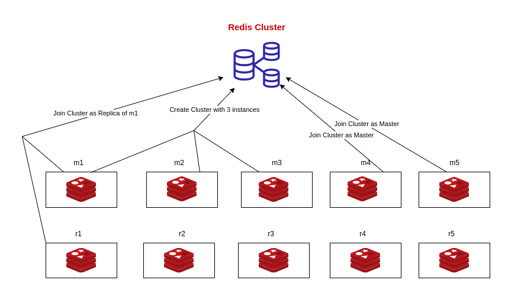
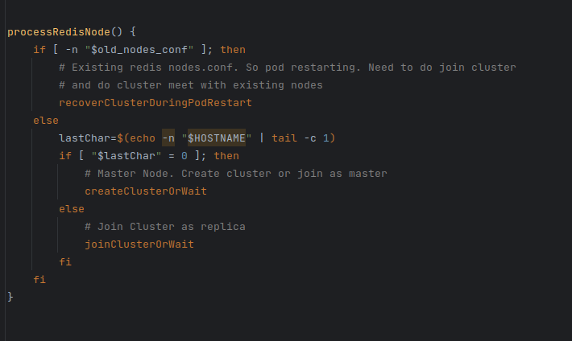

## Introduction

KubeDB is a Kubernetes Native Database Management Solution that makes it easier and more automated to manage various popular databases on both 
private and public clouds, including provisioning, monitoring, upgrading, patching, scaling, volume expansion, backup, recovery, failure detection,
and repair. MySQL, MongoDB, MariaDB, Elasticsearch, Redis, PostgreSQL, ProxySQL, Percona XtraDB, Memcached, Kafka and PgBouncer 
are among the databases that KubeDB supports.

All three Redis database modes—Cluster, Sentinel, and Standalone are supported by KubeDB. Redis implements the idea of data sharding in Cluster Mode.
In Redis Cluster mode, the data is divided and kept in different shards. Each shard has one master and one or more replicas.
In this post, we will discuss the difficulties we encountered when setting up Redis Cluster with Kubernetes.

## Declarative Set Up

Redis has been declaratively set up using a Kubernetes CRD. `Redis` is the CRD kind and `kubedb.com` is the api group that contains it.
To activate Redis Cluster mode, the `.spec.mode` section in yaml must be set to `Cluster`. Following that, a description of the 
master and replica numbers is required. There will be as many shards as there are masters because there is one master per shard.
There are many things that can be declaratively configured. You can click [here](https://kubedb.com/docs/v2023.02.28/guides/redis/concepts/redis/)
to learn more about yet.

## Kubernetes Resources

To make the operational responsibilities simpler, we have each shard configured in a statefulset. A statefulset owns the master and every replica in the shard, which run as pods.
So, if the user wants 3 master and 2 replica. There will be 3 statefulset and each statefulset will have two pods. One pod will server as master and another one will be replica.
In each pod, we run two containers. One is init container which joins all the pod in the cluster and creates cluster if the cluster does not exist and then the main container
runs a redis image.

## Creating the Cluster

When a pod comes up and executes the init script, it launches the redis server in the background before determining whether a cluster is there.
The pod must create a cluster if one does not already exist. But to establish a redis cluster, at least three instances are required. The IP addresses
of the instances is needed to create the cluster. So each instance should know the domain name or IP address of the other redis instances. The IP address or 
the domain name is also needed to check if the instance is up and running.

To locate the domain names of the database instances, we utilize a tool called [redis-node-finder](https://github.com/kubedb/redis-node-finder).
Following that, it pings and determines how many instances are active.The cluster can be created by an instance if there are three up and running redis instances.
Because all redis instances are attempting to crate clusters using their init scripts, the instance should confirm that the cluster does not 
already exist before creating one. Only one of the instances is able to successfully create the cluster; the others join it after they discover that 
the cluster is created.

Each replica can join the cluster as a master or a replica after the cluster has been created. The cluster's initial instances are by default the master instances.
If the current pod is the 0th pod in the statefulset, it joins the cluster as master since each statefulset should have one master according to our architecture.
The other instances of the statefulset join the cluster as replica of the master.

## Failover scenario

When a pod restarts for some reason, the init script makes sure that the pod joins the cluster properly. If a replica pod restarts, it should join the cluster as a replica.
In case of master nodes, there can be two scenarios. Depending on the duration of unavailability, redis cluster may do `cluster failover`. Then it should join the cluster as a replica.
Otherwise, it should join the cluster as a master node.

To handle the failover scenario for each instance, we first run a `cluster meet` command with all the current pods. The node's role is then identified.
It joins the cluster if it is a master node. In case of replica nose, we determine whether the replica needs to be in sync with the master.
When synchronization is required, the command `cluster replicate` is run to replicate all the data from the master.

## Conclusion

To enable Redis clustering we have used bash scripting from init script of the pods. We have identified different scenarios and handled them accordingly. 
After provisioning the lifecycle of the redis cluster is maintained by KubeDB Operator.
Additionally,  day-2 operations like Horizontal or Vertical Scaling, TLS operations can be done using KubeDB. To learn more, 
you can have a look at [KubeDB Docs](https://kubedb.com/kubernetes/databases/run-and-manage-redis-on-kubernetes/). 
You can also watch the demo to learn how to provision and manage Redis Cluster on Kubernetes using KubeDB.

<iframe width="800" height="500" src="https://www.youtube.com/embed/J7QI4EzuOVY" title="YouTube video player" frameborder="0" allow="accelerometer; autoplay; clipboard-write; encrypted-media; gyroscope; picture-in-picture" allowfullscreen></iframe>

## Support

To speak with us, please leave a message on [our website](https://appscode.com/contact/).

To receive product announcements, follow us on [Twitter](https://twitter.com/KubeDB).

To watch tutorials of various Production-Grade Kubernetes Tools Subscribe our [YouTube](https://youtube.com/@appscode) channel.

More about [Redis in Kubernetes](https://kubedb.com/kubernetes/databases/run-and-manage-redis-on-kubernetes/)

If you have found a bug with KubeDB or want to request for new features, please [file an issue](https://github.com/kubedb/project/issues/new).
