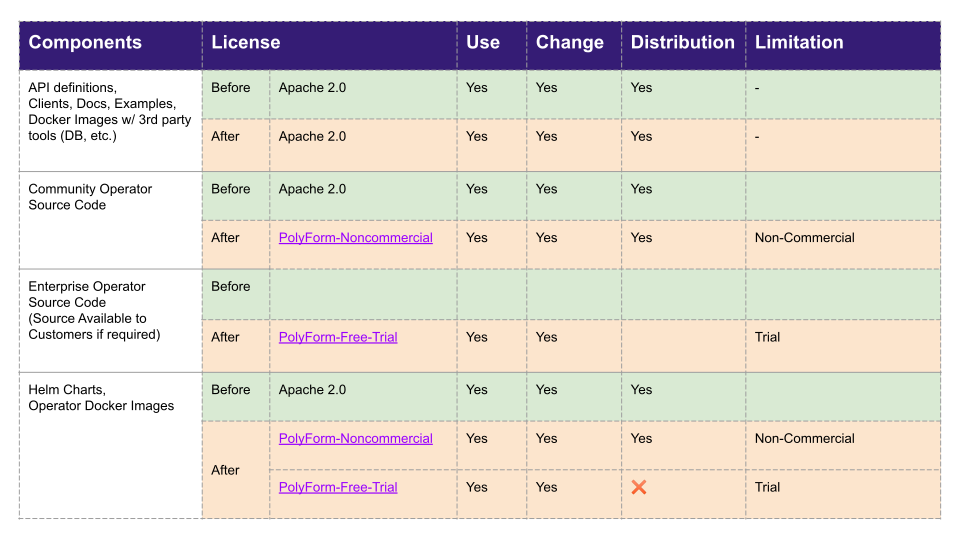
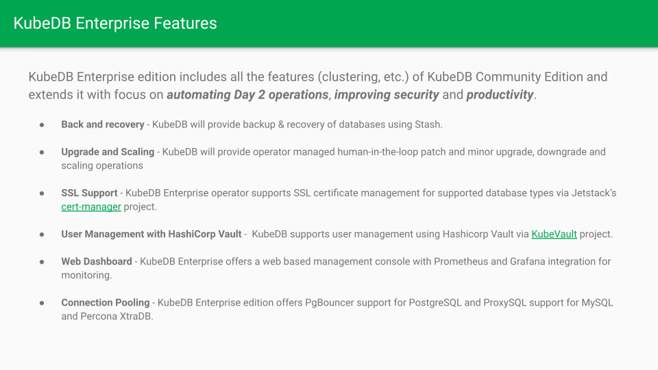
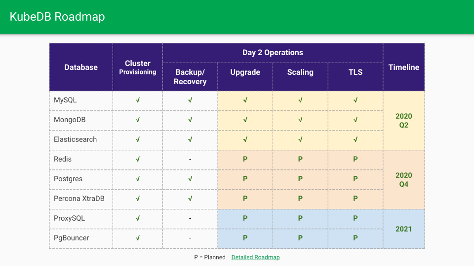
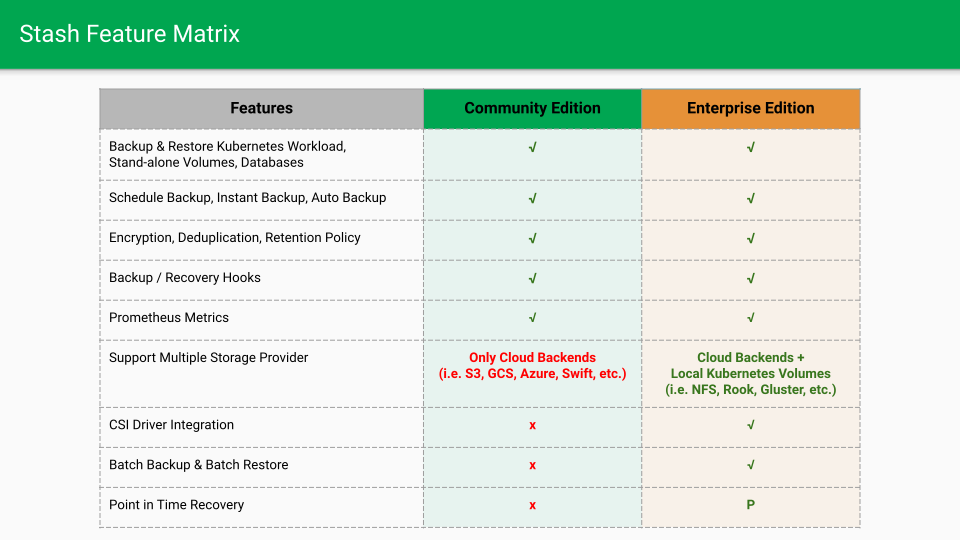

AppsCode is relicening various components of the [Stash](https://stash.run) and [KubeDB](https://kubedb.com). We have decided to use simple, standardized, plain-language software source code licenses from the [PolyForm Project](https://polyformproject.org/). Please see the table below for the upcoming changes:

## Why now?
AppsCode started as a commercial entity to accelerate the adoption of Kubernetes and containers in the Enterprise. We launched a number of open source products like Voyager, Stash, KubeDB, KubeVault etc. Consequently, we began receiving many feature requests, bug reports and general support questions via our GitHub repositories and public slack account. We are very much thankful to the existing users of our open source projects. As a commercial entity, now we are focusing on building a sustainable business for the future. These development activities incur cost which I initially bootstrapped myself. Supporting open source projects is not sustainable without any kind of revenue stream. Last year we offered support packages for our various products; but that did not help. Often, we get queries in the meetings with prospective customers regarding the difference between the free open source version and paid version. In the process we have learnt that support is not enough to convert those users into customers. For businesses it is not rational to pay for something that they can get for free. As a result, since the end of last year we started developing closed source features for the “Enterprise” version of our products.

- Mention Corona?
- Mention it is expensive to test against cloud providers ?

## What’s included in KubeDB Enterprise Edition:

KubeDB Enterprise edition includes all the features (clustering, etc.) of KubeDB Community Edition and extends it with focus on automating Day 2 operations, improving security and productivity. You can see some quick demos of upcoming MySQL Enterprise features [here](https://www.youtube.com/playlist?list=PLoiT1Gv2KR1imxr13HareDzWfUvsWWtVY).

## Future of AppsCode Products

Going forward, we will be offering two versions of our Stash and KubeDB operators. The open-sourced community version of the operators with limited features will serve the non-commercial users covered by the [PolyForm Noncommercial License](https://polyformproject.org/licenses/noncommercial/1.0.0/). The close-sourced, enterprise version of the operators with full features  will serve the licensed users. If the licensed users request the source code of the enterprise operators in some circumstances, then it will be available to them under NDA. For our products, we will make announcements on a case by case basis. (How do I tell that for some products there will be no enterprise version?)

## What does it mean for existing users?

If you are a Noncommercial organization as defined by the [PolyForm Noncommercial License] ](https://polyformproject.org/licenses/noncommercial/1.0.0/) or using AppsCode products for personal use, you should be able to continue to use our products as you are doing today. For commercial organizations, we are offering a 32 day trial license. This should allow AppsCode products for free in CI environments. If you are interested in licensing either Stash or KubeDB, please contact us via sales@appscode.com for further discussion.

We are also working on a hosted version of KubeDB products where customers will be able to BYOK. Please follow us on twitter [@AppsCodeHQ](https://twitter.com/intent/follow?screen_name=AppsCodeHQ) to stay up-to-date.
