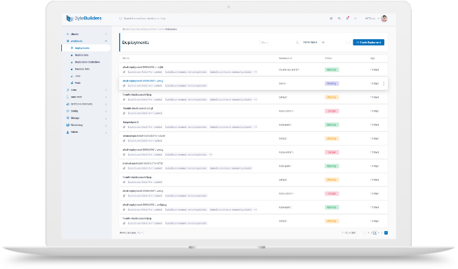
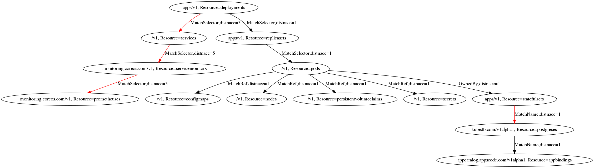

Kubernetes has own the container orchestrator war. One of the key contributors to its success is the ability to extend Kubernetes by the end users. The primary way users extend Kubernetes is by defining new resource types. This is called Custom Resource Definitions (CRD) in the Kubernetes parlance. Users can write a controller that can reconcile users' desired specification to a cluster. Controllers that capture operational knowledge of a software application are commonly know as Kubernetes operators.

The popularity of Kubernetes has drawn more developers to write CRD for their own software. Tools like Kubebuilder, Kudo, etc. make writing controllers relatively easy for any developer who knows how to write code in Go. While this is one of the most exciting developments in the cloud native world, it presents a challenge for building higher level tooling like a web dashboard for Kubernetes. It is challenging to develop a meaningful dashboard for a CRD type that did not exist when the Dashboard was developed.

## Common Patterns in CRDs

CRDs usually follow a few common patterns:

1. CRD as a parent resource for other Kubernetes resources; For example, in [KubeDB](https://kubedb.com) project we define a CRD for each supported database type . So, we have a CRD for PostgreSQL. When user creates a Postgres object, the KubeDB operator provisions a StatefulSet, one or more services, secrets, service accounts, roles for that database.

2. CRD as a Kubernretes native configuration object. One of the popular examples of this pattern is Prometheus operator. Prometheus operator introduced ServiceMonitor, PodMonitor CRDs which are used to generate Prometheus configuration. Similar patterns are also found in Istio, OPA Gatekeeper projects.

## What does Dashboard do?

Kubernetes CRDs can be easily manipulated using `kubectl`. But Dashboards are pretty important too. Especially for team members who are not Kubernetes developers but wants to use Kubernetes to get their job done. The Kubernetes official Dashboard is oblivious to CRDs. So is true for GKE dashboard. Yes, everyone who creates their own CRD could write their own dashboard but that’s not too easy to do.

Usually Dashboards show a section about a resource and a number of tabled for various connected resources.

<figure align="center">
 
 <figcaption align="center">Fig: A Kubernetes Dashboard</figcaption>
</figure>

## ResourceDescriptor

Kubernetes resources use a declarative api format. But the connection between various resources are still hidden inside the application. ResourceDescriptor is a new type of resource which can be used to declaratively define the connection between any two resource types.

In this work, we make the following key contributions:

1. Define a new resource named ResourceDescriptor.
2. We define 4 types of connections present in various Kubernetes resources. This is based on our knowledge of the space.
3. We present a collection of ResourceDescriptors for various common types of resources. This can be a starting point for a community effort to maintain this list.
4. We present a graph library that uses the definitions to find paths between any 2 resource type, List resources of a target type given a source object.
5. This project also hosts a public apiserver that returns these resources via a Kubernetes EAS server. This can be used to access this data in a language neutral way.
6. ResourceDescriptor also holds DisplayColumns and Key Targets (important connections for a resource) for any resource type in a generic way. This can be used to drive a web Dashboard.

Before we get into the details, I want to answer why OwnerRef is not enough to define the connections among resource types. OwnerReferences do present a specific type of connection between 2 resources. But other types of useful connections exist which are not captured by this. For example, if you are using Prometheus operator, you may want to know which ServiceMonitor is used to monitor your Deployment. But there is no owner reference connection between a Deployment and a ServiceMonitor.

## The Resource Graph

We take the view that each type of resource (identified by GroupVersionResource aka GVR) is a vertex in the graph. The edges are defined as connections in the ResourceDescriptors. There are 4 types of connections currently supported by ResourceDescriptors. Each connection types are bi-directional meaning once connection from X to Y is defined, we can automatically find a list of X type objects for a given Y. The cost associated with such operations depends on the type of connection.

It is hard to know whether additional types of connections might be needed or exists. I would like your feedback so we can introduce new  connection types.

<figure align="center">
 
 <figcaption align="center">Fig: Resource Graph for Deployments</figcaption>
</figure>

### Connection: MatchSelector 

This is the most common type of connection where resource A connects with resource B via a label selector. For example: A service selects pods via label selectors. ServiceMonitors select services via selectors. There can be a few different variations of this

**Variation 1:** 

```yaml
spec:
  resource:
    group: ""
    kind: Service
    name: services
    scope: Namespaced
    version: v1
  connections:
    - target:
        apiVersion: v1
        kind: Pod
      type: MatchSelector
      namespacePath: "metadata.namespace"
      selectorPath: "spec.selector"
```

In the above example, Service resource selects a list of pods via spec.selector field of a service object. Since the labels are not specified, metadata.labels for pods are used by default. This also means, we can use a standard List() call with labels selectors to find pods for a given service. `namespacePath` field represents the namespace value for such call. In this case, it is the namespace of the service. The cost of this List call is assigned 1, since it can be converted into an api call to kube-apiserver.

We are also able to use this connection to find services that points to a given pod. Since, we know both pod and service are namespaced objects, we can use the namespace of the pod in that case. But in this case, we need to List all services in the pods namespace and filter them inside the application to identify the services. So, the cost for the edge in the backward direction is assigned higher than the forward direction. In the current implementation the cost of the backward connection is assigned 5 (somewhat arbitrarily). The idea is that 4 forward edges will be better than traversing one backward edge.

**Variation 2:**

```yaml
spec:
  resource:
    group: ""
    kind: Service
    name: services
    scope: Namespaced
    version: v1
  connections:
    - target:
        apiVersion: apps/v1
        kind: Deployment
      type: MatchSelector
      namespacePath: "metadata.namespace"
      selectorPath: "spec.selector"
      targetLabelPath: "spec.template.metadata.labels"
```

In some cases, the selector of source resource selects a subfield of a target resource. For example, a Service selects the spec.template.metadata.labels field of a deployment, because these labels become the labels of the pods that are created as a result. This can be specified in the `targetLabelPath` field. Here the cost of both forward (Deployments for a given service) and backward (Services for a given Deployment) are assumed 5, since in both cases we need to list all resources of the target type and filter at the application level.

**Variation 3:**

```yaml
spec:
  resource:
    group: kubedb.com
    kind: Postgres
    name: postgreses
    scope: Namespaced
    version: v1alpha1
  connections:
    - target:
        apiVersion: v1
        kind: Service
      type: MatchSelector
      namespacePath: "metadata.namespace"
      selector:
        matchLabels:
          kubedb.com/kind: Postgres
          kubedb.com/name: "{.metadata.name}"
```

In this case, the source resource can use a fixed set of labels to select target resource. This is a pattern commonly found in CRDs that provision multiple Kubernetes core resources. So,  the selector is defined in-line in the ResourceDescriptor instead of settings `selectorPath` field. The in-line selectors use the `metav1.LabelSelector` structure. One interesting twist is that the in-line selectors can use any jsonpath expression as the value of these label selectors. As shown above,this allows us to use the source object to render the values for actual label selector. `targetLabelPath` is not defined here. So, metadata.labels field of the target objects are used to match the selector. So, in this case, we are able to use the List() api call to find services for a KubeDB Postgres object.

### Connection: MatchName
When a CRD creates various child Kubernetes resources, the child resources might use the same name as the originating CRD name or add some prefix or suffix to the name of the Custom Resource object to generate the name for the child resources.

```yaml
spec:
  resource:
    group: kubedb.com
    kind: Postgres
    name: postgreses
    scope: Namespaced
    version: v1alpha1
  connections:
    - target:
        apiVersion: apps/v1
        kind: Statefulset
      type: MatchName
      namespacePath: "metadata.namespace"
      nameTemplate: "{.metadata.name}"
      level: Owner
    - target:
        apiVersion: appcatalog.appscode.com/v1alpha1
        kind: AppBinding
      type: MatchName
      namespacePath: "metadata.namespace"
      nameTemplate: "{.metadata.name}"
      level: Owner
```

This type of connections can be defined as shown in the example above. Here we see that Postgres crd creates a StatefulSet and an [AppBinding](https://blog.byte.builders/post/appbinding/) with the same name. So, `nameTemplate` is set to `{.metadata.name}` . It is important to set the `namespacePath` field so that the target resources in the same namespace are only Listed as connections. If the child resources use some suffix or prefix, you can define `nameTemplate` like `kubedb-{.metadata.name}` or `{.metadata.name}-pods`. You can also optionally specify the connection level. We are able to find the target resource via a GET api call. So, the cost for both forward and backward edges are assigned 1.

### Connection: OwnedBy

We find that there are 3 levels of ownership relationship among resource types:

- `Reference`: This is the default connection level and represented by an empty string. This means one resource is connected with another resource.
- `Owner`: This means the source resource is Owner of the target resources. So, the target resources must have the source resource in their `metadata.ownerReferenfces` field.
- `Controller`:  This means the source resource is Controller of the target resources. This is a stronger mode of ownership. So, the target resources must have the source resource in their `metadata.ownerReferenfces` field with `controller` boolean field set to `true`.


```yaml
spec:
  resource:
    group: apps
    kind: ReplicaSet
    name: replicasets
    scope: Namespaced
    version: v1
  connections:
    - target:
        apiVersion: apps/v1
        kind: Deployment
      type: OwnedBy
      level: Controller
```

If a resource is owned and/or controlled by another resource, then the child resource can define a OwnedBy type connection in its ResourceDescriptor. The connection level must be `Owner` or `Controller` in this case. The cost of forward edge is 1 but the cost of backward edge is assigned 5. Because to list all the child resources of an owner resource, we need to list all child resourced and then filter them in the application layer.

### Connection: MatchRef
Lot of times one resource refers to another resource via a field in its own spec. This is most flexible form of connections among resource types. The connection can be defined using one or more of the following fields:

- `Name`
- `Namespace`
- `Kind`
- `APIGroup`

For example a RoleBinding referring to a Role

```yaml
apiVersion: rbac.authorization.k8s.io/v1
# This role binding allows "jane" to read pods in the "default" namespace.
kind: RoleBinding
metadata:
  name: read-pods
  namespace: default
subjects:
- kind: User
  name: jane # Name is case sensitive
  apiGroup: rbac.authorization.k8s.io
roleRef:
  kind: Role #this must be Role or ClusterRole
  name: pod-reader # this must match the name of the Role or ClusterRole you wish to bind to
  apiGroup: rbac.authorization.k8s.io

```

Also, a resource can point to another resource via various fields in its spec. For example, a Pod can refer to a Configmap / Secret in its `volumes` , `envFrom` and `env` fields. So, ResourceDescriptors support multiple references for a target resource. The reference expressions follow the [JSONPath](https://kubernetes.io/docs/reference/kubectl/jsonpath/) support available in Kubernetes.

```yaml
spec:
  resource:
    group: ""
    kind: Pod
    name: pods
    scope: Namespaced
    version: v1
  connections:
    - target:
        apiVersion: v1
        kind: Node
      type: MatchRef
      references:
      - '{.spec.nodeName}'
    - target:
        apiVersion: v1
        kind: PersistentVolumeClaim
      type: MatchRef
      namespacePath: "metadata.namespace"
      references:
      - '{range .spec.volumes[*]}{.persistentVolumeClaim.claimName}{"\n"}{end}'
    - target:
        apiVersion: v1
        kind: Configmap
      type: MatchRef
      namespacePath: "metadata.namespace"
      references:
      - '{range .spec.containers[*].envFrom[*]}{.configMapRef.name}{"\n"}{end}'
      - '{range .spec.containers[*].env[*]}{.valueFrom.configMapKeyRef.name}{"\n"}{end}'
      - '{range .spec.volumes[*]}{.configMap.name}{"\n"}{end}'
```

Using these connections users may list all the pods that uses (mounts or injects as environment variable) a given configmap, or list all the pods running on a given node. 

Each reference JSONPath expression must return its results in a CSV format. There can be at most 4 columns in each row. These is what is expected per column:

- If only 1 column is present per row, it must be the name of the target resource. The target resource may be non-namespaced or the namespace of derived from the namespacePath field is used which defaults to source object namespace.
- If 2 columns are present per row, the first column must be the name of the resource and the second column must be the name of the namespace.
- If 3 columns are present per row, the columns must be in this order: name,namespace,kind.
- If 4 columns are present per row, the columns must present the following fields: name,namespace,kind,apiGroup .

Each row must be `\n` delimited. Empty rows are ignored. There must not be any special heading row.

The `namespacePath` field is recommended for namespaced target resources because it reduces the cost of Listing resources when used as a Backward connection. If the reference rows return namespace, this field is ignored when resolving forward connection.

### Namespace Path Selector

`namespacePath` field can point to complex namespace selectors. This is supported since [Prometheus ServiceMonitor](https://github.com/coreos/prometheus-operator/blob/v0.31.1/pkg/apis/monitoring/v1/types.go#L848) field uses the following format:

```yaml
// NamespaceSelector is a selector for selecting either all namespaces or a
// list of namespaces.
// +k8s:openapi-gen=true
type NamespaceSelector struct {
	// Boolean describing whether all namespaces are selected in contrast to a
	// list restricting them.
	Any bool `json:"any,omitempty"`
	// List of namespace names.
	MatchNames []string `json:"matchNames,omitempty"`
}
```

## Open Source

Today we are open sourcing this [kmodules/resource-metadata](https://github.com/kmodules/resource-metadata) so that this problem can be solved as a community and we can benefit from each others work. This project provides:

- API types for ResourceDescriptors
- API types for finding the shortest path between 2 resource types.
- A [package of ResourceDescriptors for various common resources](https://github.com/kmodules/resource-metadata/tree/e176a5a32431a770180cea177c8e6523da8f6676/hub/resourcedescriptors). We hope to expand it to include more and more resource types. We would like to see community contribution to expand these ResourceDescriptors.
- A [graph package](https://godoc.org/kmodules.xyz/resource-metadata/pkg/graph#Graph) that can return the shortest path between 2 resources and a List api to list target resources for any resources assuming there is a path between those two resource types.

We also provide provide a publicly accessible server https://api.crd.builders/ using the pre-defined resource descriptors. You should be able to interact with this server using curl commands.

```bash
# Test GraphFinder api

curl -X POST \
  https://api.crd.builders/apis/meta.appscode.com/v1alpha1/graphfinders \
  -H 'content-type: application/json' \
  -d '{
   "apiVersion": "meta.appscode.com/v1alpha1",
   "kind": "GraphFinder",
   "request": {
      "source": {
         "group": "apps",
         "version": "v1",
         "resource": "deployments"
      }
   }
}'
```

```bash
# find path from deployments -> services

curl -X POST \
  https://api.crd.builders/apis/meta.appscode.com/v1alpha1/pathfinders \
  -H 'content-type: application/json' \
  -d '{
   "apiVersion": "meta.appscode.com/v1alpha1",
   "kind": "PathFinder",
   "request": {
      "source": {
         "group": "apps",
         "version": "v1",
         "resource": "deployments"
      },
      "target": {
         "group": "",
         "version": "v1",
         "resource": "services"
      }
   }
}'

# find all paths from deployments

curl -X POST \
  https://api.crd.builders/apis/meta.appscode.com/v1alpha1/pathfinders \
  -H 'content-type: application/json' \
  -d '{
   "apiVersion": "meta.appscode.com/v1alpha1",
   "kind": "PathFinder",
   "request": {
      "source": {
         "group": "apps",
         "version": "v1",
         "resource": "deployments"
      }
   }
}'
```

If you have read all the way to the end, I want to thank you. If you have any questions and want to know more, you can reach me via [Twitter](https://twitter.com/tsaha) or [Email](mailto:tamal@appscode.com).
