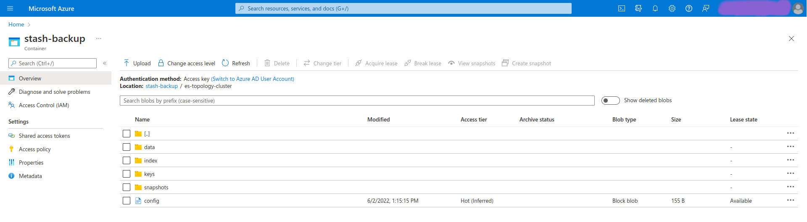

## Overview

KubeDB is the Kubernetes Native Database Management Solution which simplifies and automates routine database tasks such as Provisioning, Monitoring, Upgrading, Patching, Scaling, Volume Expansion, Backup, Recovery, Failure detection, and Repair for various popular databases on private and public clouds. The databases that KubeDB supports are Elasticsearch, MySQL, MongoDB, MariaDB, Redis, PostgreSQL, ProxySQL, Percona XtraDB, Memcached and PgBouncer. You can find the guides to all the supported databases [here](https://kubedb.com/). Elasticsearch has many distributions like `ElasticStack`, `OpenSearch`, `SearchGuard`, `OpenDistro` etc. **KubeDB provides all of these distribution's support under the Elasticsearch CR of KubeDB**.
In this tutorial we will deploy Elasticsearch database in Azure Kubernetes Service (AKS). We will cover the following steps:

1) Install KubeDB
2) Deploy Elasticsearch Topology Cluster
3) Install Stash
4) Backup Elasticsearch Using Stash
5) Recover Elasticsearch Using Stash

## Install KubeDB

We will follow the steps to install KubeDB.

### Get Cluster ID

We need the cluster ID to get the KubeDB License.
To get cluster ID we can run the following command:

```bash
$ kubectl get ns kube-system -o jsonpath='{.metadata.uid}'
b8da819b-e9ec-45ad-b3a0-0342a22b60d9
```

### Get License

Go to [Appscode License Server](https://license-issuer.appscode.com/) to get the license.txt file. For this tutorial we will use KubeDB Enterprise Edition.


### Install KubeDB

We will use helm to install KubeDB. Please install helm [here](https://helm.sh/docs/intro/install/) if it is not already installed.
Now, let's install `KubeDB`.

```bash
$ helm repo add appscode https://charts.appscode.com/stable/
$ helm repo update

$ helm search repo appscode/kubedb
NAME                              	CHART VERSION	APP VERSION	DESCRIPTION                                       
appscode/kubedb                   	v2022.05.24  	v2022.05.24	KubeDB by AppsCode - Production ready databases...
appscode/kubedb-autoscaler        	v0.12.0      	v0.12.0    	KubeDB Autoscaler by AppsCode - Autoscale KubeD...
appscode/kubedb-catalog           	v2022.05.24  	v2022.05.24	KubeDB Catalog by AppsCode - Catalog for databa...
appscode/kubedb-community         	v0.24.2      	v0.24.2    	KubeDB Community by AppsCode - Community featur...
appscode/kubedb-crds              	v2022.05.24  	v2022.05.24	KubeDB Custom Resource Definitions                
appscode/kubedb-dashboard         	v0.3.0       	v0.3.0     	KubeDB Dashboard by AppsCode                      
appscode/kubedb-enterprise        	v0.11.2      	v0.11.2    	KubeDB Enterprise by AppsCode - Enterprise feat...
appscode/kubedb-grafana-dashboards	v2022.05.24  	v2022.05.24	A Helm chart for kubedb-grafana-dashboards by A...
appscode/kubedb-metrics           	v2022.05.24  	v2022.05.24	KubeDB State Metrics                              
appscode/kubedb-ops-manager       	v0.14.0      	v0.14.0    	KubeDB Ops Manager by AppsCode - Enterprise fea...
appscode/kubedb-opscenter         	v2022.05.24  	v2022.05.24	KubeDB Opscenter by AppsCode                      
appscode/kubedb-provisioner       	v0.27.0      	v0.27.0    	KubeDB Provisioner by AppsCode - Community feat...
appscode/kubedb-schema-manager    	v0.3.0       	v0.3.0     	KubeDB Schema Manager by AppsCode                 
appscode/kubedb-ui-server         	v2021.12.21  	v2021.12.21	A Helm chart for kubedb-ui-server by AppsCode     
appscode/kubedb-webhook-server    	v0.3.0       	v0.3.0     	KubeDB Webhook Server by AppsCode  

# Install KubeDB Enterprise operator chart
$ helm install kubedb appscode/kubedb \
  --version v2022.05.24 \
  --namespace kubedb --create-namespace \
  --set kubedb-provisioner.enabled=true \
  --set kubedb-ops-manager.enabled=true \
  --set kubedb-autoscaler.enabled=true \
  --set kubedb-dashboard.enabled=true \
  --set kubedb-schema-manager.enabled=true \
  --set-file global.license=/path/to/the/license.txt

```

Let's verify the installation:

```bash
$ watch kubectl get pods --all-namespaces -l "app.kubernetes.io/instance=kubedb"
NAMESPACE   NAME                                            READY   STATUS    RESTARTS   AGE
kubedb      kubedb-kubedb-autoscaler-5fb84994bb-kptx6       1/1     Running   0          2m17s
kubedb      kubedb-kubedb-dashboard-79f78cb848-jnjfx        1/1     Running   0          2m17s
kubedb      kubedb-kubedb-ops-manager-d97ffd45b-k75s5       1/1     Running   0          2m17s
kubedb      kubedb-kubedb-provisioner-54bb76b9d5-rjkg2      1/1     Running   0          2m17s
kubedb      kubedb-kubedb-schema-manager-597cc4cbd4-xfcll   1/1     Running   0          2m17s
kubedb      kubedb-kubedb-webhook-server-7655674856-8q5lg   1/1     Running   0          2m17s
```

We can list the CRD Groups that have been registered by the operator by running the following command:

```bash
$ kubectl get crd -l app.kubernetes.io/name=kubedb
NAME                                              CREATED AT
elasticsearchautoscalers.autoscaling.kubedb.com   2022-06-02T04:32:14Z
elasticsearchdashboards.dashboard.kubedb.com      2022-06-02T04:32:00Z
elasticsearches.kubedb.com                        2022-06-02T04:32:00Z
elasticsearchopsrequests.ops.kubedb.com           2022-06-02T04:32:06Z
elasticsearchversions.catalog.kubedb.com          2022-06-02T04:28:00Z
etcds.kubedb.com                                  2022-06-02T04:32:04Z
etcdversions.catalog.kubedb.com                   2022-06-02T04:28:00Z
mariadbautoscalers.autoscaling.kubedb.com         2022-06-02T04:32:17Z
mariadbdatabases.schema.kubedb.com                2022-06-02T04:32:10Z
mariadbopsrequests.ops.kubedb.com                 2022-06-02T04:32:20Z
mariadbs.kubedb.com                               2022-06-02T04:32:04Z
mariadbversions.catalog.kubedb.com                2022-06-02T04:28:00Z
memcacheds.kubedb.com                             2022-06-02T04:32:04Z
memcachedversions.catalog.kubedb.com              2022-06-02T04:28:00Z
mongodbautoscalers.autoscaling.kubedb.com         2022-06-02T04:32:11Z
mongodbdatabases.schema.kubedb.com                2022-06-02T04:32:08Z
mongodbopsrequests.ops.kubedb.com                 2022-06-02T04:32:09Z
mongodbs.kubedb.com                               2022-06-02T04:32:04Z
mongodbversions.catalog.kubedb.com                2022-06-02T04:28:01Z
mysqldatabases.schema.kubedb.com                  2022-06-02T04:32:08Z
mysqlopsrequests.ops.kubedb.com                   2022-06-02T04:32:17Z
mysqls.kubedb.com                                 2022-06-02T04:32:04Z
mysqlversions.catalog.kubedb.com                  2022-06-02T04:28:01Z
perconaxtradbs.kubedb.com                         2022-06-02T04:32:04Z
perconaxtradbversions.catalog.kubedb.com          2022-06-02T04:28:01Z
pgbouncers.kubedb.com                             2022-06-02T04:32:05Z
pgbouncerversions.catalog.kubedb.com              2022-06-02T04:28:02Z
postgresdatabases.schema.kubedb.com               2022-06-02T04:32:09Z
postgreses.kubedb.com                             2022-06-02T04:32:05Z
postgresopsrequests.ops.kubedb.com                2022-06-02T04:32:27Z
postgresversions.catalog.kubedb.com               2022-06-02T04:28:02Z
proxysqlopsrequests.ops.kubedb.com                2022-06-02T04:32:31Z
proxysqls.kubedb.com                              2022-06-02T04:32:05Z
proxysqlversions.catalog.kubedb.com               2022-06-02T04:28:02Z
redises.kubedb.com                                2022-06-02T04:32:05Z
redisopsrequests.ops.kubedb.com                   2022-06-02T04:32:24Z
redissentinels.kubedb.com                         2022-06-02T04:32:05Z
redisversions.catalog.kubedb.com                  2022-06-02T04:28:03Z
```

## Deploy Elasticsearch Topology Cluster

Now, we are going to Deploy Elasticsearch with the help of KubeDB.
At first, let's create a Namespace in which we will deploy the database.

```bash
$ kubectl create ns demo
namespace/demo created
```

Here is the yaml of the Elasticsearch we are going to use:

```yaml
apiVersion: kubedb.com/v1alpha2
kind: Elasticsearch
metadata:
  name: es-topology-cluster
  namespace: demo
spec:
  enableSSL: true 
  version: searchguard-7.14.2
  storageType: Durable
  topology:
    master:
      replicas: 2
      storage:
        storageClassName: "default"
        accessModes:
        - ReadWriteOnce
        resources:
          requests:
            storage: 1Gi
    data:
      replicas: 3
      storage:
        storageClassName: "default"
        accessModes:
        - ReadWriteOnce
        resources:
          requests:
            storage: 1Gi
    ingest:
      replicas: 2
      storage:
        storageClassName: "default"
        accessModes:
        - ReadWriteOnce
        resources:
          requests:
            storage: 1Gi
```

Let's save this yaml configuration into `es-topology-cluster.yaml` 
Then create the above Elasticsearch yaml

```bash
$ kubectl create -f es-topology-cluster.yaml
elasticsearch.kubedb.com/es-topology-cluster created
```

* In this yaml we can see in the `spec.version` field specifies the version of Elasticsearch. Here, we are using Elasticsearch version `searchguard-7.14.2` of SearchGuard distribution.. You can list the KubeDB supported versions of Elasticsearch CR by running `kubectl get elasticsearchversions` command.
* `spec.storage` specifies PVC spec that will be dynamically allocated to store data for this database. This storage spec will be passed to the StatefulSet created by KubeDB operator to run database pods. You can specify any StorageClass available in your cluster with appropriate resource requests.
* `spec.enableSSL` - specifies whether the HTTP layer is secured with certificates or not.
* `spec.storageType` - specifies the type of storage that will be used for Elasticsearch database. It can be `Durable` or `Ephemeral`. The default value of this field is `Durable`. If `Ephemeral` is used then KubeDB will create the Elasticsearch database using `EmptyDir` volume. In this case, you don't have to specify `spec.storage` field. This is useful for testing purposes.
* `spec.topology` - specifies the node-specific properties for the Elasticsearch cluster.
  - `topology.master` - specifies the properties of master nodes.
    - `master.replicas` - specifies the number of master nodes.
    - `master.storage` - specifies the master node storage information that passed to the StatefulSet.
  - `topology.data` - specifies the properties of data nodes.
    - `data.replicas` - specifies the number of data nodes.
    - `data.storage` - specifies the data node storage information that passed to the StatefulSet.
  - `topology.ingest` - specifies the properties of ingest nodes.
    - `ingest.replicas` - specifies the number of ingest nodes.
    - `ingest.storage` - specifies the ingest node storage information that passed to the StatefulSet.

Once these are handled correctly and the Elasticsearch object is deployed, you will see that the following objects are created:

```bash
$ kubectl get all -n demo
NAME                               READY   STATUS    RESTARTS   AGE
pod/es-topology-cluster-data-0     1/1     Running   0          4m12s
pod/es-topology-cluster-data-1     1/1     Running   0          3m27s
pod/es-topology-cluster-data-2     1/1     Running   0          2m43s
pod/es-topology-cluster-ingest-0   1/1     Running   0          4m12s
pod/es-topology-cluster-ingest-1   1/1     Running   0          3m30s
pod/es-topology-cluster-master-0   1/1     Running   0          4m12s
pod/es-topology-cluster-master-1   1/1     Running   0          3m26s

NAME                                 TYPE        CLUSTER-IP    EXTERNAL-IP   PORT(S)    AGE
service/es-topology-cluster          ClusterIP   10.0.216.53   <none>        9200/TCP   4m17s
service/es-topology-cluster-master   ClusterIP   None          <none>        9300/TCP   4m17s
service/es-topology-cluster-pods     ClusterIP   None          <none>        9200/TCP   4m17s

NAME                                          READY   AGE
statefulset.apps/es-topology-cluster-data     3/3     4m15s
statefulset.apps/es-topology-cluster-ingest   2/2     4m15s
statefulset.apps/es-topology-cluster-master   2/2     4m15s

NAME                                                     TYPE                       VERSION   AGE
appbinding.appcatalog.appscode.com/es-topology-cluster   kubedb.com/elasticsearch   7.14.2    4m16s

NAME                                           VERSION              STATUS   AGE
elasticsearch.kubedb.com/es-topology-cluster   searchguard-7.14.2   Ready    4m25s
```
Let’s check if the database is ready to use,

```bash
$ kubectl get elasticsearch -n demo es-topology-cluster
NAME                  VERSION              STATUS   AGE
es-topology-cluster   searchguard-7.14.2   Ready    5m23s
```
> We have successfully deployed Elasticsearch in AKS. Now we can exec into the container to use the database.

### Insert Sample Data

In this section, we are going to create few indexes in Elasticsearch. At first, we are going to port-forward the respective Service so that we can connect with the database from our local machine. Then, we are going to insert some data into the Elasticsearch.

#### Port-forward the Service

KubeDB will create few Services to connect with the database. Let’s see the Services created by KubeDB for our Elasticsearch,

```bash
$ kubectl get service -n demo -l=app.kubernetes.io/instance=es-topology-cluster
NAME                         TYPE        CLUSTER-IP    EXTERNAL-IP   PORT(S)    AGE
es-topology-cluster          ClusterIP   10.0.216.53   <none>        9200/TCP   7m56s
es-topology-cluster-master   ClusterIP   None          <none>        9300/TCP   7m56s
es-topology-cluster-pods     ClusterIP   None          <none>        9200/TCP   7m56s
```
Here, we are going to use the `es-topology-cluster` Service to connect with the database. Now, let’s port-forward the `es-topology-cluster` Service.

```bash
# Port-forward the service to local machine
$ kubectl port-forward -n demo svc/es-topology-cluster 9200
Forwarding from 127.0.0.1:9200 -> 9200
Forwarding from [::1]:9200 -> 9200
```

#### Export the Credentials

KubeDB will create some Secrets for the database. Let’s check which Secrets have been created by KubeDB for our `es-topology-cluster`.

```bash
$ kubectl get secret -n demo -l=app.kubernetes.io/instance=es-topology-cluster
NAME                                       TYPE                       DATA   AGE
es-topology-cluster-admin-cert             kubernetes.io/tls          3      6m55s
es-topology-cluster-admin-cred             kubernetes.io/basic-auth   2      6m54s
es-topology-cluster-ca-cert                kubernetes.io/tls          2      6m55s
es-topology-cluster-client-cert            kubernetes.io/tls          3      6m54s
es-topology-cluster-config                 Opaque                     3      6m52s
es-topology-cluster-http-cert              kubernetes.io/tls          3      6m55s
es-topology-cluster-kibanaro-cred          kubernetes.io/basic-auth   2      6m54s
es-topology-cluster-kibanaserver-cred      kubernetes.io/basic-auth   2      6m54s
es-topology-cluster-logstash-cred          kubernetes.io/basic-auth   2      6m54s
es-topology-cluster-readall-cred           kubernetes.io/basic-auth   2      6m54s
es-topology-cluster-snapshotrestore-cred   kubernetes.io/basic-auth   2      6m54s
es-topology-cluster-transport-cert         kubernetes.io/tls          3      6m55s
```
Now, we can connect to the database with any of these secret that have the prefix `cred`. Here, we are using `es-topology-cluster-admin-cred` which contains the admin level credentials to connect with the database.


### Accessing Database Through CLI

To access the database through CLI, we have to get the credentials to access. Let’s export the credentials as environment variable to our current shell :

```bash
$ kubectl get secret -n demo es-topology-cluster-admin-cred -o jsonpath='{.data.username}' | base64 -d
admin
$ kubectl get secret -n demo es-topology-cluster-admin-cred -o jsonpath='{.data.password}' | base64 -d
j3$7lAN3VviB1JWi
```

Then login and insert some data into Elasticsearch:

```bash
$ curl -XPOST -k --user 'admin:j3$7lAN3VviB1JWi' "https://localhost:9200/bands/_doc?pretty" -H 'Content-Type: application/json' -d'
{
    "Artist": "Justin Timberlake",
    "Album": "Inside Llewyn Davis",
    "Song": "Five Hundred Miles"
}
'
```

Now, let’s verify that the index have been created successfully.

```bash
$ curl -XGET -k --user 'admin:j3$7lAN3VviB1JWi' "https://localhost:9200/_cat/indices?v&s=index&pretty"
health status index            uuid                   pri rep docs.count docs.deleted store.size pri.store.size
green  open   .geoip_databases M8oEBkUxTreDtAZYBfVP0A   1   1                                                  
green  open   bands            kgAKlq1_S2WOy1sQ-dTZfA   1   1          1            0     10.5kb          5.2kb
green  open   searchguard      fLEfweuOQkWPRxfBQJy8PQ   1   2          7            0     45.3kb         26.6kb
```
Also, let’s verify the data in the indexes:

```bash
$ curl -XGET -k --user 'admin:j3$7lAN3VviB1JWi' "https://localhost:9200/bands/_search?pretty"
{
  "took" : 4,
  "timed_out" : false,
  "_shards" : {
    "total" : 1,
    "successful" : 1,
    "skipped" : 0,
    "failed" : 0
  },
  "hits" : {
    "total" : {
      "value" : 1,
      "relation" : "eq"
    },
    "max_score" : 1.0,
    "hits" : [
      {
        "_index" : "bands",
        "_type" : "_doc",
        "_id" : "9jgwI4EBMChBH9DgJcLv",
        "_score" : 1.0,
        "_source" : {
          "Artist" : "Justin Timberlake",
          "Album" : "Inside Llewyn Davis",
          "Song" : "Five Hundred Miles"
        }
      }
    ]
  }
}

```
> We've successfully inserted some sample data to our Elasticsearch. And this was just an example of our Elasticsearch topology cluster deployment. More information about Run & Manage Production-Grade Elasticsearch Database on Kubernetes can be found [HERE](https://kubedb.com/kubernetes/databases/run-and-manage-elasticsearch-on-kubernetes/)

## Backup Elasticsearch Database Using Stash

Here, we are going to use Stash to backup the Elasticsearch database that we have just deployed.

### Install Stash

Kubedb Enterprise License works for Stash too.
So, we will use the Enterprise license that we have already obtained.

```bash
$ helm install stash appscode/stash             \
  --version v2022.05.18                         \
  --namespace kube-system                       \
  --set features.enterprise=true                \
  --set-file global.license=/path/to/the/license.txt
```

Let's verify the installation:

```bash
$ watch kubectl get pods --all-namespaces -l app.kubernetes.io/name=stash-enterprise
NAMESPACE     NAME                                      READY   STATUS    RESTARTS   AGE
kube-system   stash-stash-enterprise-7446594849-bbmxm   2/2     Running   0          26s
```

Now, to confirm CRD groups have been registered by the operator, run the following command:

```bash
$ kubectl get crd -l app.kubernetes.io/name=stash
NAME                                      CREATED AT
backupbatches.stash.appscode.com          2022-06-02T07:02:19Z
backupblueprints.stash.appscode.com       2022-06-02T07:02:20Z
backupconfigurations.stash.appscode.com   2022-06-02T07:02:18Z
backupsessions.stash.appscode.com         2022-06-02T07:02:18Z
functions.stash.appscode.com              2022-06-02T07:00:13Z
repositories.stash.appscode.com           2022-06-02T04:32:10Z
restorebatches.stash.appscode.com         2022-06-02T07:02:20Z
restoresessions.stash.appscode.com        2022-06-02T04:32:10Z
tasks.stash.appscode.com                  2022-06-02T07:00:14Z

```


### Prepare Backend

Stash supports various backends for storing data snapshots. It can be a cloud storage like GCS bucket, AWS S3, Azure Blob Storage etc. or a Kubernetes persistent volume like HostPath, PersistentVolumeClaim, NFS etc.

For this tutorial we are going to use azure storage. You can find other setups [here](https://stash.run/docs/v2022.05.18/guides/backends/overview/).

 

At first we need to create a secret so that we can access the Azure storage container. We can do that by the following code:

```bash
$ echo -n 'changeit' > RESTIC_PASSWORD
$ echo -n '<your-azure-storage-account-name>' > AZURE_ACCOUNT_NAME
$ echo -n '<your-azure-storage-account-key>' > AZURE_ACCOUNT_KEY
$ kubectl create secret generic -n demo azure-secret \
    --from-file=./RESTIC_PASSWORD \
    --from-file=./AZURE_ACCOUNT_NAME \
    --from-file=./AZURE_ACCOUNT_KEY
secret/azure-secret created
 ```

### Create Repository

```yaml
apiVersion: stash.appscode.com/v1alpha1
kind: Repository
metadata:
  name: azure-repo
  namespace: demo
spec:
  backend:
    azure:
      container: stash-backup
      prefix: /es-topology-cluster
    storageSecretName: azure-secret

```

This repository CRO specifies the `azure-secret` we created before and stores the name and path to the azure storage container. It also specifies the location to the container where we want to backup our database.
> Here, My container name is `stash-backup`. Don't forget to change `spec.backend.azure.container` to your container name.

Lets create this repository,

```bash
$ kubectl create -f azure-repo.yaml 
repository.stash.appscode.com/azure-repo created
```

### Create BackupConfiguration

Now, we need to create a `BackupConfiguration` file that specifies what to backup, where to backup and when to backup.

```yaml
apiVersion: stash.appscode.com/v1beta1
kind: BackupConfiguration
metadata:
  name: es-topology-cluster-backup
  namespace: demo
spec:
  schedule: "*/5 * * * *"
  repository:
    name: azure-repo
  target:
    ref:
      apiVersion: appcatalog.appscode.com/v1alpha1
      kind: AppBinding
      name: es-topology-cluster
  retentionPolicy:
    name: keep-last-5
    keepLast: 5
    prune: true
```
Create this `BackupConfiguration` by following command,

```bash
$ kubectl create -f es-topology-cluster-backup.yaml
backupconfiguration.stash.appscode.com/es-topology-cluster-backup created
```

* `BackupConfiguration` creates a cronjob that backs up the specified database (`spec.target`) every 5 minutes.
* `spec.repository` contains the secret we created before called `azure-secret`.
* `spec.target.ref` contains the reference to the appbinding that we want to backup.
* `spec.schedule` specifies that we want to backup the database at 5 minutes interval.
* `spec.retentionPolicy` specifies the policy to follow for cleaning old snapshots. 
* To learn more about `AppBinding`, click here [AppBinding](https://kubedb.com/docs/v2022.05.24/guides/elasticsearch/concepts/appbinding/). 
So, after 5 minutes we can see the following status:

```bash
$ kubectl get backupsession -n demo
NAME                                    INVOKER-TYPE          INVOKER-NAME                 PHASE       DURATION   AGE
es-topology-cluster-backup-1654154100   BackupConfiguration   es-topology-cluster-backup   Succeeded   22s        27s

$ kubectl get repository -n demo
NAME         INTEGRITY   SIZE        SNAPSHOT-COUNT   LAST-SUCCESSFUL-BACKUP   AGE
azure-repo   true        3.016 KiB   1                55s                      7m10s
```

Now if we check our azure storage container, we can see that the backup has been successful.



> **If you have reached here, CONGRATULATIONS!! :confetti_ball: :confetti_ball: :confetti_ball: You have successfully backed up MySQL Database using Stash.** If you had any problem during the backup process, you can reach out to us via [EMAIL](mailto:support@appscode.com?subject=Stash%20Backup%20Failed%20in%20GKE).

## Recover Elasticsearch Database Using Stash

Let's think of a scenario in which the database has been accidentally deleted or there was an error in the database causing it to crash.

#### Temporarily pause backup

At first, let’s stop taking any further backup of the database so that no backup runs after we delete the sample data. We are going to pause the `BackupConfiguration` object. Stash will stop taking any further backup when the `BackupConfiguration` is paused.

```bash
$ kubectl patch backupconfiguration -n demo es-topology-cluster-backup --type="merge" --patch='{"spec": {"paused": true}}'
backupconfiguration.stash.appscode.com/es-topology-cluster-backup patched

```
Verify that the `BackupConfiguration` has been paused,

```bash
$ kubectl get backupconfiguration -n demo es-topology-cluster-backup
NAME                         TASK   SCHEDULE      PAUSED   PHASE   AGE
es-topology-cluster-backup          */5 * * * *   true     Ready   8m27s
```
Notice the `PAUSED` column. Value `true` for this field means that the `BackupConfiguration` has been paused.
Stash will also suspend the respective CronJob.

```bash
$ kubectl get cronjob -n demo
NAME                                       SCHEDULE      SUSPEND   ACTIVE   LAST SCHEDULE   AGE
stash-trigger-es-topology-cluster-backup   */5 * * * *   True      0        6m23s           9m35s
```

At first, let's simulate an accidental database deletion. Here, we are going to delete the `bands` index that we have created earlier.

```bash
$ curl -XDELETE -k --user 'admin:j3$7lAN3VviB1JWi' "https://localhost:9200/bands?pretty"
{
  "acknowledged" : true
}
```
Now, let’s verify that the indexes have been deleted from the database,

```bash
$ curl -XGET -k --user 'admin:j3$7lAN3VviB1JWi' "https://localhost:9200/_cat/indices?v&s=index&pretty"
health status index            uuid                   pri rep docs.count docs.deleted store.size pri.store.size
green  open   .geoip_databases M8oEBkUxTreDtAZYBfVP0A   1   1                                                  
green  open   searchguard      fLEfweuOQkWPRxfBQJy8PQ   1   2          7            0     45.3kb         26.6kb
```

### Create a RestoreSession

Below, is the contents of YAML file of the `RestoreSession` object that we are going to create.

```yaml
apiVersion: stash.appscode.com/v1beta1
kind: RestoreSession
metadata:
  name: es-toplogy-cluster-restore
  namespace: demo
spec:
  repository:
    name: azure-repo
  target:
    ref:
      apiVersion: appcatalog.appscode.com/v1alpha1
      kind: AppBinding
      name: es-topology-cluster
  rules:
    - snapshots: [latest]
```

Now, let's create `RestoreSession` that will initiate restoring from the cloud.

```bash
$ kubectl create -f es-topology-cluster-restore.yaml
restoresession.stash.appscode.com/es-toplogy-cluster-restore created
```

This `RestoreSession` specifies where the data will be restored.
Once this is applied, a `RestoreSession` will be created. Once it has succeeded, the database has been successfully recovered as you can see below:

```bash
$ kubectl get restoresession -n demo
NAME                         REPOSITORY   PHASE       DURATION   AGE
es-toplogy-cluster-restore   azure-repo   Succeeded   9s         39s
```

Now, let's check whether the database has been correctly restored:

```bash
$ curl -XGET -k --user 'admin:j3$7lAN3VviB1JWi' "https://localhost:9200/_cat/indices?v&s=index&pretty"
health status index            uuid                   pri rep docs.count docs.deleted store.size pri.store.size
green  open   .geoip_databases M8oEBkUxTreDtAZYBfVP0A   1   1                                                  
green  open   bands            PkOUukn6Rl2qllCClaRGyw   1   1          1            0     10.4kb          5.2kb
green  open   searchguard      fLEfweuOQkWPRxfBQJy8PQ   1   2          7            0     45.3kb         26.6kb
```
Also, let’s verify the data in the indexes:

```bash
$ curl -XGET -k --user 'admin:j3$7lAN3VviB1JWi' "https://localhost:9200/bands/_search?pretty"
{
  "took" : 3,
  "timed_out" : false,
  "_shards" : {
    "total" : 1,
    "successful" : 1,
    "skipped" : 0,
    "failed" : 0
  },
  "hits" : {
    "total" : {
      "value" : 1,
      "relation" : "eq"
    },
    "max_score" : 1.0,
    "hits" : [
      {
        "_index" : "bands",
        "_type" : "_doc",
        "_id" : "9jgwI4EBMChBH9DgJcLv",
        "_score" : 1.0,
        "_source" : {
          "Artist" : "Justin Timberlake",
          "Album" : "Inside Llewyn Davis",
          "Song" : "Five Hundred Miles"
        }
      }
    ]
  }
}

```


> You can see the database has been restored. The recovery of Elasticsearch has been successful. If you faced any difficulties in the recovery process, you can reach out to us through [EMAIL](mailto:support@appscode.com?subject=Stash%20Recovery%20Failed%20in%20GKE).

We have made an in depth video on Managing Semi-synchronous MySQL Cluster Using KubeDB in Kubernetes. You can have a look into the video below:

<iframe width="560" height="315" src="https://www.youtube.com/embed/R-eYc2cUXQY" title="YouTube video player" frameborder="0" allow="accelerometer; autoplay; clipboard-write; encrypted-media; gyroscope; picture-in-picture" allowfullscreen></iframe>

## Support

To speak with us, please leave a message on [our website](https://appscode.com/contact/).

To join public discussions with the KubeDB community, join us in the [Kubernetes Slack team](https://kubernetes.slack.com/messages/C8149MREV/) channel `#kubedb`. To sign up, use our [Slack inviter](http://slack.kubernetes.io/).

To receive product announcements, follow us on [Twitter](https://twitter.com/KubeDB).

To watch tutorials of various Production-Grade Kubernetes Tools Subscribe our [YouTube](https://www.youtube.com/c/AppsCodeInc/) channel.

More about [Elasticsearch in Kubernetes](https://kubedb.com/kubernetes/databases/run-and-manage-elasticsearch-on-kubernetes/)

If you have found a bug with KubeDB or want to request for new features, please [file an issue](https://github.com/kubedb/project/issues/new).
