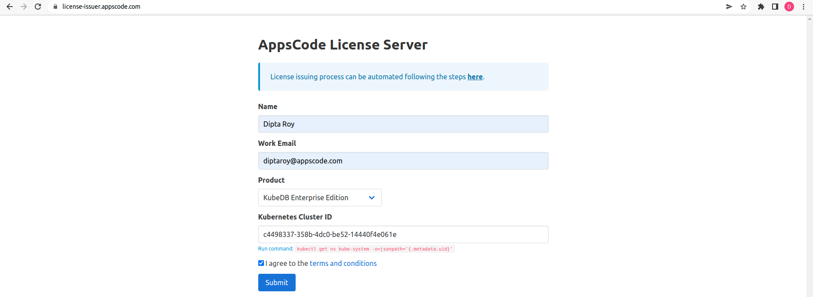
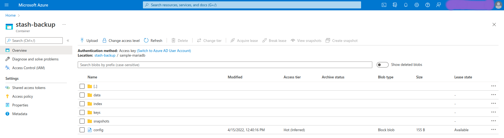

## Overview

The databases that KubeDB supports are MongoDB, MariaDB, MySQL, Elasticsearch, Redis, PostgreSQL, ProxySQL, Percona XtraDB, Memcached and PgBouncer. You can find the guides to all the supported databases [here](https://kubedb.com/).
In this tutorial we will deploy MariaDB database in Azure Kubernetes Service (AKS). We will cover the following steps:

1) Install KubeDB
2) Deploy MariaDB Clustered Database
3) Install Stash
4) Backup MariaDB Database Using Stash
5) Recover MariaDB Database Using Stash

## Install KubeDB

We will follow the steps to install KubeDB.

### Get Cluster ID

We need the cluster ID to get the KubeDB License.
To get cluster ID we can run the following command:

```bash
$ kubectl get ns kube-system -o jsonpath='{.metadata.uid}'
8c4498337-358b-4dc0-be52-14440f4e061e
```

### Get License

Go to [Appscode License Server](https://license-issuer.appscode.com/) to get the license.txt file. For this tutorial we will use KubeDB Enterprise Edition.



### Install KubeDB

We will use helm to install KubeDB. Please install helm [here](https://helm.sh/docs/intro/install/) if it is not already installed.
Now, let's install `KubeDB`.

```bash
$ helm repo add appscode https://charts.appscode.com/stable/
$ helm repo update

$ helm search repo appscode/kubedb
NAME                              	CHART VERSION	APP VERSION	DESCRIPTION                                       
appscode/kubedb                   	v2022.03.28  	v2022.03.28	KubeDB by AppsCode - Production ready databases...
appscode/kubedb-autoscaler        	v0.11.0      	v0.11.0    	KubeDB Autoscaler by AppsCode - Autoscale KubeD...
appscode/kubedb-catalog           	v2022.03.28  	v2022.03.28	KubeDB Catalog by AppsCode - Catalog for databa...
appscode/kubedb-community         	v0.24.2      	v0.24.2    	KubeDB Community by AppsCode - Community featur...
appscode/kubedb-crds              	v2022.03.28  	v2022.03.28	KubeDB Custom Resource Definitions                
appscode/kubedb-dashboard         	v0.2.0       	v0.2.0     	KubeDB Dashboard by AppsCode                      
appscode/kubedb-enterprise        	v0.11.2      	v0.11.2    	KubeDB Enterprise by AppsCode - Enterprise feat...
appscode/kubedb-grafana-dashboards	v2022.03.28  	v2022.03.28	A Helm chart for kubedb-grafana-dashboards by A...
appscode/kubedb-metrics           	v2022.03.28  	v2022.03.28	KubeDB State Metrics                              
appscode/kubedb-ops-manager       	v0.13.0      	v0.13.0    	KubeDB Ops Manager by AppsCode - Enterprise fea...
appscode/kubedb-opscenter         	v2022.03.28  	v2022.03.28	KubeDB Opscenter by AppsCode                      
appscode/kubedb-provisioner       	v0.26.0      	v0.26.0    	KubeDB Provisioner by AppsCode - Community feat...
appscode/kubedb-schema-manager    	v0.2.0       	v0.2.0     	KubeDB Schema Manager by AppsCode                 
appscode/kubedb-ui-server         	v2021.12.21  	v2021.12.21	A Helm chart for kubedb-ui-server by AppsCode     
appscode/kubedb-webhook-server    	v0.2.0       	v0.2.0     	KubeDB Webhook Server by AppsCode 

# Install KubeDB Enterprise operator chart
$ helm install kubedb appscode/kubedb \
  --version v2022.03.28 \
  --namespace kubedb --create-namespace \
  --set kubedb-provisioner.enabled=true \
  --set kubedb-ops-manager.enabled=true \
  --set kubedb-autoscaler.enabled=true \
  --set kubedb-dashboard.enabled=true \
  --set kubedb-schema-manager.enabled=true \
  --set-file global.license=/path/to/the/license.txt

```

Let's verify the installation:

```bash
$ watch kubectl get pods --all-namespaces -l "app.kubernetes.io/instance=kubedb"
NAMESPACE   NAME                                            READY   STATUS    RESTARTS   AGE
kubedb      kubedb-kubedb-autoscaler-644848687f-rvp2l       1/1     Running   0          5m6s
kubedb      kubedb-kubedb-dashboard-f4fb7575-xvqnv          1/1     Running   0          5m6s
kubedb      kubedb-kubedb-ops-manager-5955b5c9c9-57rc2      1/1     Running   0          5m6s
kubedb      kubedb-kubedb-provisioner-5b9b4ccb94-4xdj4      1/1     Running   0          5m6s
kubedb      kubedb-kubedb-schema-manager-5548d59bcf-f99ps   1/1     Running   0          5m6s
kubedb      kubedb-kubedb-webhook-server-6bd59dcd5d-smhmc   1/1     Running   0          5m6s
```

We can list the CRD Groups that have been registered by the operator by running the following command:

```bash
$ kubectl get crd -l app.kubernetes.io/name=kubedb
NAME                                              CREATED AT
elasticsearchautoscalers.autoscaling.kubedb.com   2022-04-15T05:30:00Z
elasticsearchdashboards.dashboard.kubedb.com      2022-04-15T05:30:07Z
elasticsearches.kubedb.com                        2022-04-15T05:30:05Z
elasticsearchopsrequests.ops.kubedb.com           2022-04-15T05:30:12Z
elasticsearchversions.catalog.kubedb.com          2022-04-15T05:26:41Z
etcds.kubedb.com                                  2022-04-15T05:30:05Z
etcdversions.catalog.kubedb.com                   2022-04-15T05:26:41Z
mariadbautoscalers.autoscaling.kubedb.com         2022-04-15T05:30:03Z
mariadbdatabases.schema.kubedb.com                2022-04-15T05:30:17Z
mariadbopsrequests.ops.kubedb.com                 2022-04-15T05:30:26Z
mariadbs.kubedb.com                               2022-04-15T05:30:05Z
mariadbversions.catalog.kubedb.com                2022-04-15T05:26:41Z
memcacheds.kubedb.com                             2022-04-15T05:30:05Z
memcachedversions.catalog.kubedb.com              2022-04-15T05:26:41Z
mongodbautoscalers.autoscaling.kubedb.com         2022-04-15T05:29:56Z
mongodbdatabases.schema.kubedb.com                2022-04-15T05:30:15Z
mongodbopsrequests.ops.kubedb.com                 2022-04-15T05:30:15Z
mongodbs.kubedb.com                               2022-04-15T05:30:05Z
mongodbversions.catalog.kubedb.com                2022-04-15T05:26:42Z
mysqldatabases.schema.kubedb.com                  2022-04-15T05:30:15Z
mysqlopsrequests.ops.kubedb.com                   2022-04-15T05:30:22Z
mysqls.kubedb.com                                 2022-04-15T05:30:05Z
mysqlversions.catalog.kubedb.com                  2022-04-15T05:26:42Z
perconaxtradbs.kubedb.com                         2022-04-15T05:30:06Z
perconaxtradbversions.catalog.kubedb.com          2022-04-15T05:26:42Z
pgbouncers.kubedb.com                             2022-04-15T05:30:06Z
pgbouncerversions.catalog.kubedb.com              2022-04-15T05:26:43Z
postgresdatabases.schema.kubedb.com               2022-04-15T05:30:16Z
postgreses.kubedb.com                             2022-04-15T05:30:06Z
postgresopsrequests.ops.kubedb.com                2022-04-15T05:30:33Z
postgresversions.catalog.kubedb.com               2022-04-15T05:26:43Z
proxysqls.kubedb.com                              2022-04-15T05:30:06Z
proxysqlversions.catalog.kubedb.com               2022-04-15T05:26:43Z
redises.kubedb.com                                2022-04-15T05:30:06Z
redisopsrequests.ops.kubedb.com                   2022-04-15T05:30:29Z
redissentinels.kubedb.com                         2022-04-15T05:30:06Z
redisversions.catalog.kubedb.com                  2022-04-15T05:26:44Z
```

## Deploy MariaDB Clustered Database

Now, we are going to Deploy MariaDB with the help of KubeDB.
At first, let's create a Namespace in which we will deploy the database.

```bash
$ kubectl create ns demo
namespace/demo created
```

Here is the yaml of the MariaDB CRO we are going to use:

```yaml
apiVersion: kubedb.com/v1alpha2
kind: MariaDB
metadata:
  name: sample-mariadb
  namespace: demo
spec:
  version: "10.6.4"
  replicas: 3
  storageType: Durable
  storage:
    storageClassName: "default"
    accessModes:
    - ReadWriteOnce
    resources:
      requests:
        storage: 1Gi
  terminationPolicy: WipeOut
```

Let's save this yaml configuration into `sample-mariadb.yaml` 
Then create the above MariaDB CRO

```bash
$ kubectl create -f sample-mariadb.yaml
mariadb.kubedb.com/sample-mariadb created
```

* In this yaml we can see in the `spec.version` field specifies the version of MariaDB. Here, we are using MariaDB `version 10.6.4`. You can list the KubeDB supported versions of MariaDB by running `$ kubectl get mariadbversions` command.
* `spec.storage` specifies PVC spec that will be dynamically allocated to store data for this database. This storage spec will be passed to the StatefulSet created by KubeDB operator to run database pods. You can specify any StorageClass available in your cluster with appropriate resource requests.
* And the `spec.terminationPolicy` field is *Wipeout* means that the database will be deleted without restrictions. It can also be "Halt", "Delete" and "DoNotTerminate". Learn More about these [HERE](https://kubedb.com/docs/v2022.03.28/guides/mariadb/concepts/mariadb/#specterminationpolicy).

Once these are handled correctly and the MariaDB object is deployed, you will see that the following objects are created:

```bash
$ kubectl get all -n demo
NAME                   READY   STATUS    RESTARTS   AGE
pod/sample-mariadb-0   2/2     Running   0          11m
pod/sample-mariadb-1   2/2     Running   0          11m
pod/sample-mariadb-2   2/2     Running   0          11m

NAME                          TYPE        CLUSTER-IP     EXTERNAL-IP   PORT(S)    AGE
service/sample-mariadb        ClusterIP   10.0.242.209   <none>        3306/TCP   11m
service/sample-mariadb-pods   ClusterIP   None           <none>        3306/TCP   11m

NAME                              READY   AGE
statefulset.apps/sample-mariadb   3/3     11m

NAME                                                TYPE                 VERSION   AGE
appbinding.appcatalog.appscode.com/sample-mariadb   kubedb.com/mariadb   10.6.4    11m

NAME                                VERSION   STATUS   AGE
mariadb.kubedb.com/sample-mariadb   10.6.4    Ready    11m
```
Let’s check if the database is ready to use,

```bash
$ kubectl get mariadb -n demo sample-mariadb
NAME             VERSION   STATUS   AGE
sample-mariadb   10.6.4    Ready    12m
```
> We have successfully deployed MariaDB in AKS. Now we can exec into the container to use the database.

### Accessing Database Through CLI

To access the database through CLI, we have to get the credentials to access.
KubeDB will create Secret and Service for the database `sample-mariadb` that we have deployed. Let’s check them using the following commands,

```bash
$ kubectl get secret -n demo -l=app.kubernetes.io/instance=sample-mariadb
NAME                  TYPE                       DATA   AGE
sample-mariadb-auth   kubernetes.io/basic-auth   2      13m

$ kubectl get service -n demo -l=app.kubernetes.io/instance=sample-mariadb
NAME                  TYPE        CLUSTER-IP     EXTERNAL-IP   PORT(S)    AGE
sample-mariadb        ClusterIP   10.0.242.209   <none>        3306/TCP   14m
sample-mariadb-pods   ClusterIP   None           <none>        3306/TCP   14m
```
Now, we are going to use `sample-mariadb-auth` to get the credentials.

```bash
$ kubectl get secrets -n demo sample-mariadb-auth -o jsonpath='{.data.username}' | base64 -d
root

$ kubectl get secrets -n demo sample-mariadb-auth -o jsonpath='{.data.password}' | base64 -d
S_DmOdvjbWqjyaDI

$ kubectl exec -it sample-mariadb-0 -n demo -c mariadb -- bash
```

#### Insert Sample Data

In this section, we are going to login into our MariaDB database pod and insert some sample data. 

```bash
root@sample-mariadb-0:/# mariadb --user=root --password='S_DmOdvjbWqjyaDI'
Welcome to the MariaDB monitor.  Commands end with ; or \g.

MariaDB [(none)]> CREATE DATABASE Music;
Query OK, 1 row affected (0.010 sec)

MariaDB [(none)]> SHOW DATABASES;
+--------------------+
| Database           |
+--------------------+
| Music              |
| information_schema |
| mysql              |
| performance_schema |
| sys                |
+--------------------+
5 rows in set (0.000 sec)

MariaDB [(none)]> CREATE TABLE Music.Artist (Name VARCHAR(50), Song VARCHAR(25));
Query OK, 0 rows affected (0.021 sec)

MariaDB [(none)]> INSERT INTO Music.Artist (Name, Song) VALUES ("Bon Jovi", "It's My Life");
Query OK, 1 row affected (0.003 sec)

MariaDB [(none)]> SELECT * FROM Music.Artist;
+----------+--------------+
| Name     | Song         |
+----------+--------------+
| Bon Jovi | It's My Life |
+----------+--------------+
1 row in set (0.000 sec)

MariaDB [(none)]> exit
Bye

```

> We've successfully inserted some sample data to our database. And this was just an example of our MariaDB Clustered database deployment. More information about Run & Manage Production-Grade MariaDB Database on Kubernetes can be found [HERE](https://kubedb.com/kubernetes/databases/run-and-manage-mariadb-on-kubernetes/)

## Backup MariaDB Database Using Stash

Here, we are going to use Stash to backup the MariaDB database we deployed before.

### Install Stash

Kubedb Enterprise License works for Stash too.
So, we will use the Enterprise license that we have already obtained.

```bash
$ helm install stash appscode/stash             \
  --version v2022.02.22                         \
  --namespace kube-system                       \
  --set features.enterprise=true                \
  --set-file global.license=/path/to/the/license.txt
```

Let's verify the installation:

```bash
$ watch kubectl get pods --all-namespaces -l app.kubernetes.io/name=stash-enterprise
NAMESPACE     NAME                                      READY   STATUS    RESTARTS   AGE
kube-system   stash-stash-enterprise-8466568b6b-v9ttr   2/2     Running   0          3m8s
```

Now, to confirm CRD groups have been registered by the operator, run the following command:

```bash
$ kubectl get crd -l app.kubernetes.io/name=stash
NAME                                      CREATED AT
backupbatches.stash.appscode.com          2022-04-15T06:29:00Z
backupblueprints.stash.appscode.com       2022-04-15T06:29:00Z
backupconfigurations.stash.appscode.com   2022-04-15T06:28:58Z
backupsessions.stash.appscode.com         2022-04-15T06:28:59Z
functions.stash.appscode.com              2022-04-15T06:27:18Z
repositories.stash.appscode.com           2022-04-15T05:30:18Z
restorebatches.stash.appscode.com         2022-04-15T06:29:01Z
restoresessions.stash.appscode.com        2022-04-15T05:30:18Z
tasks.stash.appscode.com                  2022-04-15T06:27:19Z

```


### Prepare Backend

Stash supports various backends for storing data snapshots. It can be a cloud storage like GCS bucket, AWS S3, Azure Blob Storage etc. or a Kubernetes persistent volume like HostPath, PersistentVolumeClaim, NFS etc.

For this tutorial we are going to use azure storage. You can find other setups [here](https://stash.run/docs/v2022.03.29/guides/backends/overview/).

 

At first we need to create a secret so that we can access the azure storage container. We can do that by the following code:

```bash
$ echo -n 'changeit' > RESTIC_PASSWORD
$ echo -n '<your-azure-storage-account-name>' > AZURE_ACCOUNT_NAME
$ echo -n '<your-azure-storage-account-key>' > AZURE_ACCOUNT_KEY
$ kubectl create secret generic -n demo azure-secret \
    --from-file=./RESTIC_PASSWORD \
    --from-file=./AZURE_ACCOUNT_NAME \
    --from-file=./AZURE_ACCOUNT_KEY
secret/azure-secret created
 ```

### Create Repository

```yaml
apiVersion: stash.appscode.com/v1alpha1
kind: Repository
metadata:
  name: azure-repo
  namespace: demo
spec:
  backend:
    azure:
      container: stash-backup
      prefix: /sample-mariadb
    storageSecretName: azure-secret

```

This repository CRO specifies the `azure-secret` we created before and stores the name and path to the azure storage container. It also specifies the location to the container where we want to backup our database.
> Here, My container name is `stash-backup`. Don't forget to change `spec.backend.azure.container` to your container name.

Lets create this repository,

```bash
$ kubectl apply -f azure-repo.yaml 
repository.stash.appscode.com/azure-repo created
```

### Create BackupConfiguration

Now, we need to create a `BackupConfiguration` file that specifies what to backup, where to backup and when to backup.

```yaml
apiVersion: stash.appscode.com/v1beta1
kind: BackupConfiguration
metadata:
  name: sample-mariadb-backup
  namespace: demo
spec:
  schedule: "*/5 * * * *"
  repository:
    name: azure-repo
  target:
    ref:
      apiVersion: appcatalog.appscode.com/v1alpha1
      kind: AppBinding
      name: sample-mariadb
  retentionPolicy:
    name: keep-last-5
    keepLast: 5
    prune: true
```
Create this `BackupConfiguration` by following command,

```bash
$ kubectl apply -f sample-mariadb-backup.yaml
backupconfiguration.stash.appscode.com/sample-mariadb-backup created
```

* `BackupConfiguration` creates a cronjob that backs up the specified database (`spec.target`) every 5 minutes.
* `spec.repository` contains the secret we created before called `azure-secret`.
* `spec.target.ref` contains the reference to the appbinding that we want to backup.
* `spec.schedule` specifies that we want to backup the database at 5 minutes interval.
* `spec.retentionPolicy` specifies the policy to follow for cleaning old snapshots. 
* To learn more about `AppBinding`, click here [AppBinding](https://kubedb.com/docs/v2022.03.28/guides/mariadb/concepts/appbinding/). 
So, after 5 minutes we can see the following status:

```bash
$ kubectl get backupsession -n demo
NAME                               INVOKER-TYPE          INVOKER-NAME            PHASE       DURATION   AGE
sample-mariadb-backup-1650004801   BackupConfiguration   sample-mariadb-backup   Succeeded   21s        63s

$ kubectl get repository -n demo
NAME         INTEGRITY   SIZE        SNAPSHOT-COUNT   LAST-SUCCESSFUL-BACKUP   AGE
azure-repo   true        4.548 MiB   1                85s                      3m42s
```

Now if we check our azure storage container, we can see that the backup has been successful.



> **If you have reached here, CONGRATULATIONS!! :confetti_ball: :confetti_ball: :confetti_ball: You have successfully backed up MariaDB Database using Stash.** If you had any problem during the backup process, you can reach out to us via [EMAIL](mailto:support@appscode.com?subject=Stash%20Backup%20Failed%20in%20GKE).

## Recover MariaDB Database Using Stash

Let's think of a scenario in which the database has been accidentally deleted or there was an error in the database causing it to crash.

#### Temporarily pause backup

At first, let’s stop taking any further backup of the database so that no backup runs after we delete the sample data. We are going to pause the `BackupConfiguration` object. Stash will stop taking any further backup when the `BackupConfiguration` is paused.

```bash
$ kubectl patch backupconfiguration -n demo sample-mariadb-backup --type="merge" --patch='{"spec": {"paused": true}}'
backupconfiguration.stash.appscode.com/sample-mariadb-backup patched
```

Now, we are going to delete database to simulate accidental database deletion.

```bash
$ kubectl exec -it sample-mariadb-0 -n demo -c mariadb -- bash
root@sample-mariadb-0:/# mariadb --user=root --password='S_DmOdvjbWqjyaDI'
Welcome to the MariaDB monitor.  Commands end with ; or \g.

MariaDB [(none)]> SHOW DATABASES;
+--------------------+
| Database           |
+--------------------+
| Music              |
| information_schema |
| mysql              |
| performance_schema |
| sys                |
+--------------------+
5 rows in set (0.001 sec)

MariaDB [(none)]> DROP DATABASE Music;
Query OK, 1 row affected (0.018 sec)

MariaDB [(none)]> SHOW DATABASES;
+--------------------+
| Database           |
+--------------------+
| information_schema |
| mysql              |
| performance_schema |
| sys                |
+--------------------+
4 rows in set (0.000 sec)

MariaDB [(none)]> exit
Bye

```

### Create a RestoreSession

Below, is the contents of YAML file of the `RestoreSession` object that we are going to create.

```yaml
apiVersion: stash.appscode.com/v1beta1
kind: RestoreSession
metadata:
  name: sample-mariadb-restore
  namespace: demo
spec:
  repository:
    name: azure-repo
  target:
    ref:
      apiVersion: appcatalog.appscode.com/v1alpha1
      kind: AppBinding
      name: sample-mariadb
  rules:
    - snapshots: [latest]
```

Now, let's create `RestoreSession` that will initiate restoring from the cloud.

```bash
$ kubectl create -f sample-mariadb-restore.yaml
restoresession.stash.appscode.com/sample-mariadb-restore created
```

This `RestoreSession` specifies where the data will be restored.
Once this is applied, a `RestoreSession` will be created. Once it has succeeded, the database has been successfully recovered as you can see below:

```bash
$ kubectl get restoresession -n demo
NAME                     REPOSITORY   PHASE       DURATION   AGE
sample-mariadb-restore   azure-repo   Succeeded   26s        38s
```

Now, let's check whether the database has been correctly restored:

```bash
$ kubectl exec -it sample-mariadb-0 -n demo -c mariadb -- bash
root@sample-mariadb-0:/# mariadb --user=root --password='S_DmOdvjbWqjyaDI'
Welcome to the MariaDB monitor.  Commands end with ; or \g.

MariaDB [(none)]> SHOW DATABASES;
+--------------------+
| Database           |
+--------------------+
| Music              |
| information_schema |
| mysql              |
| performance_schema |
| sys                |
+--------------------+
5 rows in set (0.000 sec)

MariaDB [(none)]> SELECT * FROM Music.Artist;
+----------+--------------+
| Name     | Song         |
+----------+--------------+
| Bon Jovi | It's My Life |
+----------+--------------+
1 row in set (0.000 sec)

MariaDB [(none)]> exit
Bye

```

> You can see the database has been restored. The recovery of MariaDB Database has been successful. If you faced any difficulties in the recovery process, you can reach out to us through [EMAIL](mailto:support@appscode.com?subject=Stash%20Recovery%20Failed%20in%20GKE).

We have made an in depth video on how to Auto-Scale and Reconfigure MariaDB in Kubernetes Native way using KubeDB. You can have a look into the video below:

<iframe width="560" height="315" src="https://www.youtube.com/embed/wg1kJGkFXdg" title="YouTube video player" frameborder="0" allow="accelerometer; autoplay; clipboard-write; encrypted-media; gyroscope; picture-in-picture" allowfullscreen></iframe>

## Support

To speak with us, please leave a message on [our website](https://appscode.com/contact/).

To join public discussions with the KubeDB community, join us in the [Kubernetes Slack team](https://kubernetes.slack.com/messages/C8149MREV/) channel `#kubedb`. To sign up, use our [Slack inviter](http://slack.kubernetes.io/).

To receive product announcements, follow us on [Twitter](https://twitter.com/KubeDB).

To watch tutorials of various Production-Grade Kubernetes Tools Subscribe our [YouTube](https://www.youtube.com/c/AppsCodeInc/) channel.

More about [MariaDB in Kubernetes](https://kubedb.com/kubernetes/databases/run-and-manage-mariadb-on-kubernetes/)

If you have found a bug with KubeDB or want to request for new features, please [file an issue](https://github.com/kubedb/project/issues/new).
