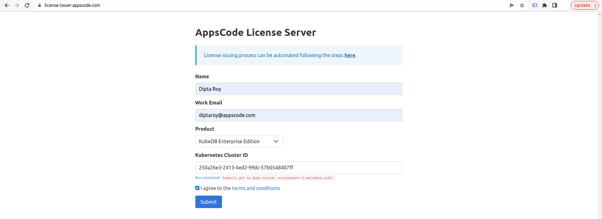
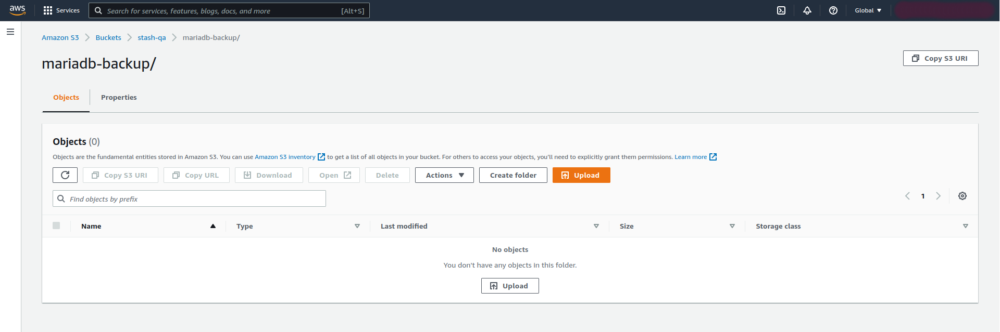
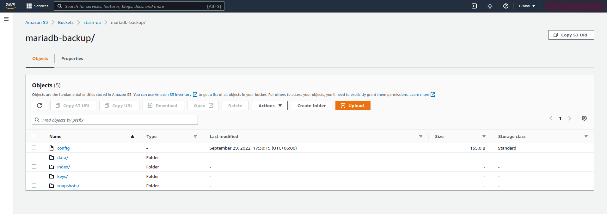

## Overview

KubeDB is the Kubernetes Native Database Management Solution which simplifies and automates routine database tasks such as Provisioning, Monitoring, Upgrading, Patching, Scaling, Volume Expansion, Backup, Recovery, Failure detection, and Repair for various popular databases on private and public clouds. The databases that KubeDB supports are MySQL, MongoDB, MariaDB, Elasticsearch, Redis, PostgreSQL, ProxySQL, Percona XtraDB, Memcached and PgBouncer. You can find the guides to all the supported databases [here](https://kubedb.com/).
In this tutorial we will deploy MariaDB database in Amazon Elastic Kubernetes Service (Amazon EKS). We will cover the following steps:

1) Install KubeDB
2) Deploy MariaDB Clustered Database
3) Install Stash
4) Backup MariaDB Database Using Stash
5) Recover MariaDB Database Using Stash

## Install KubeDB

We will follow the steps to install KubeDB.

### Get Cluster ID

We need the cluster ID to get the KubeDB License.
To get cluster ID, we can run the following command:

```bash
$ kubectl get ns kube-system -o jsonpath='{.metadata.uid}'
250a26e3-2413-4ed2-99dc-57b0548407ff
```

### Get License

Go to [Appscode License Server](https://license-issuer.appscode.com/) to get the license.txt file. For this tutorial we will use KubeDB Enterprise Edition.



### Install KubeDB

We will use helm to install KubeDB. Please install helm [here](https://helm.sh/docs/intro/install/) if it is not already installed.
Now, let's install `KubeDB`.

```bash
$ helm repo add appscode https://charts.appscode.com/stable/
$ helm repo update

$ helm search repo appscode/kubedb
NAME                              	CHART VERSION	APP VERSION	DESCRIPTION                                       
appscode/kubedb                   	v2022.08.08  	v2022.08.08	KubeDB by AppsCode - Production ready databases...
appscode/kubedb-autoscaler        	v0.13.0      	v0.13.0    	KubeDB Autoscaler by AppsCode - Autoscale KubeD...
appscode/kubedb-catalog           	v2022.08.08  	v2022.08.08	KubeDB Catalog by AppsCode - Catalog for databa...
appscode/kubedb-community         	v0.24.2      	v0.24.2    	KubeDB Community by AppsCode - Community featur...
appscode/kubedb-crds              	v2022.08.08  	v2022.08.08	KubeDB Custom Resource Definitions                
appscode/kubedb-dashboard         	v0.4.0       	v0.4.0     	KubeDB Dashboard by AppsCode                      
appscode/kubedb-enterprise        	v0.11.2      	v0.11.2    	KubeDB Enterprise by AppsCode - Enterprise feat...
appscode/kubedb-grafana-dashboards	v2022.08.08  	v2022.08.08	A Helm chart for kubedb-grafana-dashboards by A...
appscode/kubedb-metrics           	v2022.08.08  	v2022.08.08	KubeDB State Metrics                              
appscode/kubedb-ops-manager       	v0.15.0      	v0.15.1    	KubeDB Ops Manager by AppsCode - Enterprise fea...
appscode/kubedb-opscenter         	v2022.08.08  	v2022.08.08	KubeDB Opscenter by AppsCode                      
appscode/kubedb-provisioner       	v0.28.0      	v0.28.1    	KubeDB Provisioner by AppsCode - Community feat...
appscode/kubedb-schema-manager    	v0.4.0       	v0.4.0     	KubeDB Schema Manager by AppsCode                 
appscode/kubedb-ui                	v2022.06.14  	0.3.9      	A Helm chart for Kubernetes                       
appscode/kubedb-ui-server         	v2021.12.21  	v2021.12.21	A Helm chart for kubedb-ui-server by AppsCode     
appscode/kubedb-webhook-server    	v0.4.0       	v0.4.1     	KubeDB Webhook Server by AppsCode    

# Install KubeDB Enterprise operator chart
$ helm install kubedb appscode/kubedb \
  --version v2022.08.08 \
  --namespace kubedb --create-namespace \
  --set kubedb-provisioner.enabled=true \
  --set kubedb-ops-manager.enabled=true \
  --set kubedb-autoscaler.enabled=true \
  --set kubedb-dashboard.enabled=true \
  --set kubedb-schema-manager.enabled=true \
  --set-file global.license=/path/to/the/license.txt
```

Let's verify the installation:

```bash
$ kubectl get pods --all-namespaces -l "app.kubernetes.io/instance=kubedb"
NAMESPACE   NAME                                            READY   STATUS    RESTARTS   AGE
kubedb      kubedb-kubedb-autoscaler-5b4f5db49f-42kkr       1/1     Running   0          73s
kubedb      kubedb-kubedb-dashboard-6fb657cf98-g2ckh        1/1     Running   0          73s
kubedb      kubedb-kubedb-ops-manager-69d8ff4b99-dpc2c      1/1     Running   0          73s
kubedb      kubedb-kubedb-provisioner-8578bb595f-twxh5      1/1     Running   0          73s
kubedb      kubedb-kubedb-schema-manager-584bc78995-9x6q7   1/1     Running   0          73s
kubedb      kubedb-kubedb-webhook-server-67d64fd754-jdwt9   1/1     Running   0          73s
```

We can list the CRD Groups that have been registered by the operator by running the following command:

```bash
$ kubectl get crd -l app.kubernetes.io/name=kubedb
NAME                                              CREATED AT
elasticsearchautoscalers.autoscaling.kubedb.com   2022-09-29T10:54:21Z
elasticsearchdashboards.dashboard.kubedb.com      2022-09-29T10:54:20Z
elasticsearches.kubedb.com                        2022-09-29T10:54:21Z
elasticsearchopsrequests.ops.kubedb.com           2022-09-29T10:54:26Z
elasticsearchversions.catalog.kubedb.com          2022-09-29T10:47:03Z
etcds.kubedb.com                                  2022-09-29T10:54:26Z
etcdversions.catalog.kubedb.com                   2022-09-29T10:47:04Z
mariadbautoscalers.autoscaling.kubedb.com         2022-09-29T10:54:21Z
mariadbdatabases.schema.kubedb.com                2022-09-29T10:54:26Z
mariadbopsrequests.ops.kubedb.com                 2022-09-29T10:54:47Z
mariadbs.kubedb.com                               2022-09-29T10:54:27Z
mariadbversions.catalog.kubedb.com                2022-09-29T10:47:05Z
memcacheds.kubedb.com                             2022-09-29T10:54:35Z
memcachedversions.catalog.kubedb.com              2022-09-29T10:47:06Z
mongodbautoscalers.autoscaling.kubedb.com         2022-09-29T10:54:20Z
mongodbdatabases.schema.kubedb.com                2022-09-29T10:54:23Z
mongodbopsrequests.ops.kubedb.com                 2022-09-29T10:54:30Z
mongodbs.kubedb.com                               2022-09-29T10:54:24Z
mongodbversions.catalog.kubedb.com                2022-09-29T10:47:07Z
mysqldatabases.schema.kubedb.com                  2022-09-29T10:54:22Z
mysqlopsrequests.ops.kubedb.com                   2022-09-29T10:54:43Z
mysqls.kubedb.com                                 2022-09-29T10:54:22Z
mysqlversions.catalog.kubedb.com                  2022-09-29T10:47:08Z
perconaxtradbopsrequests.ops.kubedb.com           2022-09-29T10:55:02Z
perconaxtradbs.kubedb.com                         2022-09-29T10:54:39Z
perconaxtradbversions.catalog.kubedb.com          2022-09-29T10:47:09Z
pgbouncers.kubedb.com                             2022-09-29T10:54:38Z
pgbouncerversions.catalog.kubedb.com              2022-09-29T10:47:10Z
postgresdatabases.schema.kubedb.com               2022-09-29T10:54:25Z
postgreses.kubedb.com                             2022-09-29T10:54:25Z
postgresopsrequests.ops.kubedb.com                2022-09-29T10:54:54Z
postgresversions.catalog.kubedb.com               2022-09-29T10:47:10Z
proxysqlopsrequests.ops.kubedb.com                2022-09-29T10:54:58Z
proxysqls.kubedb.com                              2022-09-29T10:54:41Z
proxysqlversions.catalog.kubedb.com               2022-09-29T10:47:12Z
redises.kubedb.com                                2022-09-29T10:54:41Z
redisopsrequests.ops.kubedb.com                   2022-09-29T10:54:50Z
redissentinels.kubedb.com                         2022-09-29T10:54:41Z
redisversions.catalog.kubedb.com                  2022-09-29T10:47:13Z
```

## Deploy MariaDB Clustered Database

Now, we are going to Deploy MariaDB with the help of KubeDB.
At first, let's create a Namespace in which we will deploy the database.

```bash
$ kubectl create ns demo
namespace/demo created
```

Here is the yaml of the MariaDB CRO we are going to use:

```yaml
apiVersion: kubedb.com/v1alpha2
kind: MariaDB
metadata:
  name: mariadb-cluster
  namespace: demo
spec:
  version: "10.6.4"
  replicas: 3
  storageType: Durable
  storage:
    storageClassName: "gp2"
    accessModes:
    - ReadWriteOnce
    resources:
      requests:
        storage: 1Gi
  terminationPolicy: WipeOut
```

Let's save this yaml configuration into `mariadb-cluster.yaml` 
Then create the above MariaDB CRO

```bash
$ kubectl apply -f mariadb-cluster.yaml
mariadb.kubedb.com/mariadb-cluster created
```

* In this yaml we can see in the `spec.version` field specifies the version of MariaDB. Here, we are using MariaDB `version 10.6.4`. You can list the KubeDB supported versions of MariaDB by running `$ kubectl get mariadbversion` command.
* `spec.storage` specifies PVC spec that will be dynamically allocated to store data for this database. This storage spec will be passed to the StatefulSet created by KubeDB operator to run database pods. You can specify any StorageClass available in your cluster with appropriate resource requests.
* And the `spec.terminationPolicy` field is *Wipeout* means that the database will be deleted without restrictions. It can also be "Halt", "Delete" and "DoNotTerminate". Learn More about these [HERE](https://kubedb.com/docs/latest/guides/mariadb/concepts/mariadb/#specterminationpolicy).

Once these are handled correctly and the MariaDB object is deployed, you will see that the following objects are created:

```bash
$ kubectl get all -n demo
NAME                    READY   STATUS    RESTARTS   AGE
pod/mariadb-cluster-0   2/2     Running   0          6m29s
pod/mariadb-cluster-1   2/2     Running   0          6m29s
pod/mariadb-cluster-2   2/2     Running   0          6m29s

NAME                           TYPE        CLUSTER-IP       EXTERNAL-IP   PORT(S)    AGE
service/mariadb-cluster        ClusterIP   10.100.100.149   <none>        3306/TCP   6m33s
service/mariadb-cluster-pods   ClusterIP   None             <none>        3306/TCP   6m33s

NAME                               READY   AGE
statefulset.apps/mariadb-cluster   3/3     6m35s

NAME                                                 TYPE                 VERSION   AGE
appbinding.appcatalog.appscode.com/mariadb-cluster   kubedb.com/mariadb   10.6.4    6m39s

NAME                                 VERSION   STATUS   AGE
mariadb.kubedb.com/mariadb-cluster   10.6.4    Ready    6m55s
```
Let’s check if the database is ready to use,

```bash
$ kubectl get mariadb -n demo mariadb-cluster
NAME              VERSION   STATUS   AGE
mariadb-cluster   10.6.4    Ready    7m39s
```
> We have successfully deployed MariaDB in EKS. Now we can exec into the container to use the database.

### Accessing Database Through CLI

To access the database through CLI, we have to get the credentials to access.
KubeDB will create `Secret` and `Service` for the database `mariadb-cluster` that we have deployed. Let’s check them using the following commands,

```bash
$ kubectl get secret -n demo -l=app.kubernetes.io/instance=mariadb-cluster
NAME                   TYPE                       DATA   AGE
mariadb-cluster-auth   kubernetes.io/basic-auth   2      8m9s

$ kubectl get service -n demo -l=app.kubernetes.io/instance=mariadb-cluster
NAME                   TYPE        CLUSTER-IP       EXTERNAL-IP   PORT(S)    AGE
mariadb-cluster        ClusterIP   10.100.100.149   <none>        3306/TCP   8m38s
mariadb-cluster-pods   ClusterIP   None             <none>        3306/TCP   8m38s
```
Now, we are going to use `mariadb-cluster-auth` to get the credentials.

```bash
$ kubectl get secrets -n demo mariadb-cluster-auth -o jsonpath='{.data.username}' | base64 -d
root

$ kubectl get secrets -n demo mariadb-cluster-auth -o jsonpath='{.data.password}' | base64 -d
4f(5QlxB!S1a97y3

$ kubectl exec -it mariadb-cluster-0 -n demo -c mariadb -- bash
```

#### Insert Sample Data

In this section, we are going to login into our MariaDB database pod and insert some sample data. 

```bash
root@mariadb-cluster-0:/# mariadb --user=root --password='4f(5QlxB!S1a97y3'
Welcome to the MariaDB monitor.  Commands end with ; or \g.


MariaDB [(none)]> CREATE DATABASE Music;
Query OK, 1 row affected (0.006 sec)

MariaDB [(none)]> SHOW DATABASES;
+--------------------+
| Database           |
+--------------------+
| Music              |
| information_schema |
| kubedb_system      |
| mysql              |
| performance_schema |
| sys                |
+--------------------+
6 rows in set (0.001 sec)

MariaDB [(none)]> CREATE TABLE Music.Artist (id INT(6) UNSIGNED AUTO_INCREMENT PRIMARY KEY, Name VARCHAR(50), Song VARCHAR(25));
Query OK, 0 rows affected (0.014 sec)

MariaDB [(none)]> INSERT INTO Music.Artist (Name, Song) VALUES ("Bon Jovi", "It's My Life");
Query OK, 1 row affected (0.003 sec)

MariaDB [(none)]> SELECT * FROM Music.Artist;
+----+----------+--------------+
| id | Name     | Song         |
+----+----------+--------------+
|  1 | Bon Jovi | It's My Life |
+----+----------+--------------+
1 row in set (0.000 sec)


MariaDB [(none)]> exit
Bye

```

> We've successfully inserted some sample data to our database. And this was just an example of our MariaDB Clustered database deployment. More information about Run & Manage Production-Grade MariaDB Database on Kubernetes can be found [HERE](https://kubedb.com/kubernetes/databases/run-and-manage-mariadb-on-kubernetes/)

## Backup MariaDB Database Using Stash

Here, we are going to use Stash to backup the MariaDB database that we have just deployed.

### Install Stash

Kubedb Enterprise License works for Stash too.
So, we will use the Enterprise license that we have already obtained.

```bash
$ helm install stash appscode/stash \
  --version v2022.09.29 \
  --namespace stash --create-namespace \
  --set features.enterprise=true \
  --set-file global.license=/path/to/the/license.txt
```

Let's verify the installation:

```bash
$ kubectl get pods --all-namespaces -l app.kubernetes.io/name=stash-enterprise
NAMESPACE   NAME                                     READY   STATUS    RESTARTS   AGE
stash       stash-stash-enterprise-c6b769cb5-h2hzc   2/2     Running   0          56s
```

Now, to confirm CRD groups have been registered by the operator, run the following command:

```bash
$ kubectl get crd -l app.kubernetes.io/name=stash
NAME                                      CREATED AT
backupbatches.stash.appscode.com          2022-09-29T11:20:25Z
backupblueprints.stash.appscode.com       2022-09-29T11:20:26Z
backupconfigurations.stash.appscode.com   2022-09-29T11:20:24Z
backupsessions.stash.appscode.com         2022-09-29T11:20:24Z
functions.stash.appscode.com              2022-09-29T11:16:03Z
repositories.stash.appscode.com           2022-09-29T10:54:30Z
restorebatches.stash.appscode.com         2022-09-29T11:20:27Z
restoresessions.stash.appscode.com        2022-09-29T10:54:30Z
tasks.stash.appscode.com                  2022-09-29T11:16:05Z
```


### Prepare Backend

Stash supports various backends for storing data snapshots. It can be a cloud storage like GCS bucket, AWS S3, Azure Blob Storage etc. or a Kubernetes native resources like HostPath, PersistentVolumeClaim etc. or NFS.

For this tutorial we are going to use AWS S3 storage. You can find other setups [here](https://stash.run/docs/latest/guides/backends/overview/).

 

At first we need to create a secret so that we can access the AWS S3 storage bucket. We can do that by the following code:

```bash
$ echo -n 'changeit' > RESTIC_PASSWORD
$ echo -n '<your-aws-access-key-id-here>' > AWS_ACCESS_KEY_ID
$ echo -n '<your-aws-secret-access-key-here>' > AWS_SECRET_ACCESS_KEY
$ kubectl create secret generic -n demo s3-secret \
    --from-file=./RESTIC_PASSWORD \
    --from-file=./AWS_ACCESS_KEY_ID \
    --from-file=./AWS_SECRET_ACCESS_KEY
secret/s3-secret created
```

### Create Repository

```yaml                                                                              
apiVersion: stash.appscode.com/v1alpha1
kind: Repository
metadata:
  name: s3-repo
  namespace: demo
spec:
  backend:
    s3:
      endpoint: s3.amazonaws.com
      bucket: stash-qa
      region: us-east-1
      prefix: /mariadb-backup 
    storageSecretName: s3-secret
```

This repository CRO specifies the `s3-secret` we created before and stores the name and path to the AWS storage bucket. It also specifies the location to the container where we want to backup our database.
> Here, My bucket name is `stash-qa`. Don't forget to change `spec.backend.s3.bucket` to your bucket name and For `S3`, use `s3.amazonaws.com` as endpoint.

Lets create this repository,

```bash
$ kubectl create -f s3-repo.yaml 
repository.stash.appscode.com/s3-repo created
```

### Create BackupConfiguration

Now, we need to create a `BackupConfiguration` file that specifies what to backup, where to backup and when to backup.

```yaml
apiVersion: stash.appscode.com/v1beta1
kind: BackupConfiguration
metadata:
  name: mariadb-backup
  namespace: demo
spec:
  schedule: "*/5 * * * *"
  repository:
    name: s3-repo
  target:
    ref:
      apiVersion: appcatalog.appscode.com/v1alpha1
      kind: AppBinding
      name: mariadb-cluster
  retentionPolicy:
    name: keep-last-5
    keepLast: 5
    prune: true
```
Create this `BackupConfiguration` by following command,

```bash
$ kubectl create -f mariadb-backup.yaml 
backupconfiguration.stash.appscode.com/mariadb-backup created
```

* `BackupConfiguration` creates a cronjob that backs up the specified database (`spec.target`) every 5 minutes.
* `spec.repository` contains the repository name that we have created before called `s3-repo`.
* `spec.target.ref` contains the reference to the appbinding that we want to backup.
* `spec.schedule` specifies that we want to backup the database at 5 minutes interval.
* `spec.retentionPolicy` specifies the policy to follow for cleaning old snapshots. 
* To learn more about `AppBinding`, click here [AppBinding](https://kubedb.com/docs/latest/guides/mariadb/concepts/appbinding/). 
So, after 5 minutes we can see the following status:

```bash
$ kubectl get backupsession -n demo
NAME                        INVOKER-TYPE          INVOKER-NAME     PHASE       DURATION   AGE
mariadb-backup-1664451181   BackupConfiguration   mariadb-backup   Succeeded   10s        90s

$ kubectl get repository -n demo
NAME      INTEGRITY   SIZE         SNAPSHOT-COUNT   LAST-SUCCESSFUL-BACKUP   AGE
s3-repo   true        12.007 MiB   5                58s                      6m39s
```

Now if we check our Amazon S3 bucket, we can see that the backup has been successful.



> **If you have reached here, CONGRATULATIONS!! :confetti_ball: :confetti_ball: :confetti_ball: You have successfully backed up MariaDB Database using Stash.** If you had any problem during the backup process, you can reach out to us via [EMAIL](mailto:support@appscode.com?subject=Stash%20Backup%20Failed%20in%20AWS).

## Recover MariaDB Database Using Stash

Let's think of a scenario in which the database has been accidentally deleted or there was an error in the database causing it to crash.

#### Temporarily pause backup

At first, let’s stop taking any further backup of the database so that no backup runs after we delete the sample data. We are going to pause the `BackupConfiguration` object. Stash will stop taking any further backup when the `BackupConfiguration` is paused.

```bash
$ kubectl patch backupconfiguration -n demo mariadb-backup --type="merge" --patch='{"spec": {"paused": true}}'
backupconfiguration.stash.appscode.com/mariadb-backup patched
```

Now, we are going to delete database to simulate accidental database deletion.

```bash
$ kubectl exec -it mariadb-cluster-0 -n demo -c mariadb -- bash
root@mariadb-cluster-0:/# mariadb --user=root --password='4f(5QlxB!S1a97y3'

Welcome to the MariaDB monitor.  Commands end with ; or \g.

MariaDB [(none)]> SHOW DATABASES;
+--------------------+
| Database           |
+--------------------+
| Music              |
| information_schema |
| kubedb_system      |
| mysql              |
| performance_schema |
| sys                |
+--------------------+
6 rows in set (0.000 sec)

MariaDB [(none)]> DROP DATABASE Music;
Query OK, 1 row affected (0.015 sec)

MariaDB [(none)]> SHOW DATABASES;
+--------------------+
| Database           |
+--------------------+
| information_schema |
| kubedb_system      |
| mysql              |
| performance_schema |
| sys                |
+--------------------+
5 rows in set (0.000 sec)

MariaDB [(none)]> exit
Bye

```

### Create a RestoreSession

Below, is the contents of YAML file of the `RestoreSession` object that we are going to create.

```yaml
apiVersion: stash.appscode.com/v1beta1
kind: RestoreSession
metadata:
  name: mariadb-restore
  namespace: demo
spec:
  repository:
    name: s3-repo
  target:
    ref:
      apiVersion: appcatalog.appscode.com/v1alpha1
      kind: AppBinding
      name: mariadb-cluster
  rules:
    - snapshots: [latest]
```

Now, let's create `RestoreSession` that will initiate restoring from the cloud.

```bash
$ kubectl create -f mariadb-restore.yaml 
restoresession.stash.appscode.com/mariadb-restore created
```

This `RestoreSession` specifies where the data will be restored.
Once this is applied, a `RestoreSession` will be created. Once it has succeeded, the database has been successfully recovered as you can see below:

```bash
$ kubectl get restoresession -n demo
NAME              REPOSITORY   PHASE       DURATION   AGE
mariadb-restore   s3-repo      Succeeded   15s        20s
```

Now, let's check whether the database has been correctly restored:

```bash
$ kubectl exec -it mariadb-cluster-0 -n demo -c mariadb -- bash
root@mariadb-cluster-0:/# mariadb --user=root --password='4f(5QlxB!S1a97y3'

Welcome to the MariaDB monitor.  Commands end with ; or \g.

MariaDB [(none)]> SHOW DATABASES;
+--------------------+
| Database           |
+--------------------+
| Music              |
| information_schema |
| kubedb_system      |
| mysql              |
| performance_schema |
| sys                |
+--------------------+
6 rows in set (0.000 sec)

MariaDB [(none)]> SELECT * FROM Music.Artist;
+----+----------+--------------+
| id | Name     | Song         |
+----+----------+--------------+
|  1 | Bon Jovi | It's My Life |
+----+----------+--------------+
1 row in set (0.000 sec)

MariaDB [(none)]> exit
Bye
```

> You can see the database has been restored. The recovery of MariaDB Database has been successful. If you faced any difficulties in the recovery process, you can reach out to us through [EMAIL](mailto:support@appscode.com?subject=Stash%20Recovery%20Failed%20in%20AWS).

We have made an in depth video on MariaDB Alerting and Multi-Tenancy Support by KubeDB in Kubernetes. You can have a look into the video below:

<iframe width="560" height="315" src="https://www.youtube.com/embed/P8l2v6-yCHU" title="YouTube video player" frameborder="0" allow="accelerometer; autoplay; clipboard-write; encrypted-media; gyroscope; picture-in-picture" allowfullscreen></iframe>

## Support

To speak with us, please leave a message on [our website](https://appscode.com/contact/).

To receive product announcements, follow us on [Twitter](https://twitter.com/KubeDB).

To watch tutorials of various Production-Grade Kubernetes Tools Subscribe our [YouTube](https://www.youtube.com/c/AppsCodeInc/) channel.

More about [MariaDB in Kubernetes](https://kubedb.com/kubernetes/databases/run-and-manage-mariadb-on-kubernetes/)

If you have found a bug with KubeDB or want to request for new features, please [file an issue](https://github.com/kubedb/project/issues/new).
