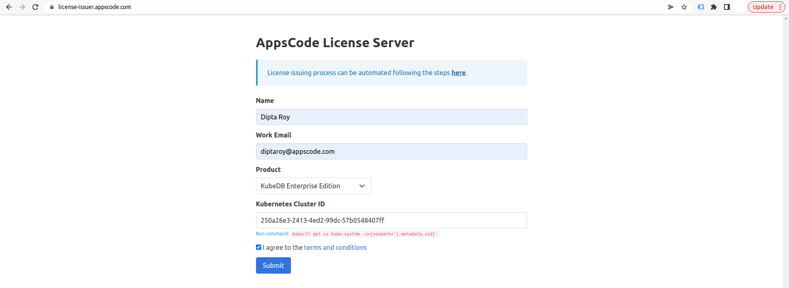
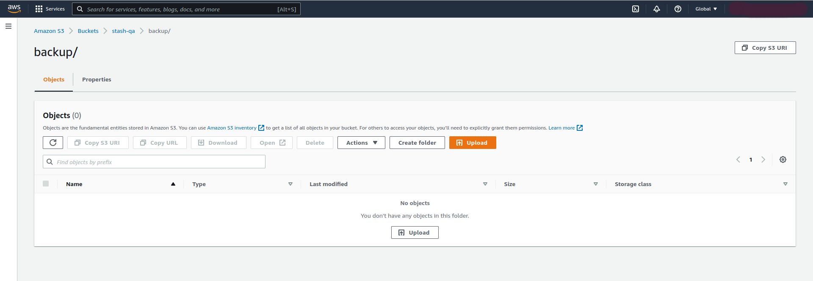
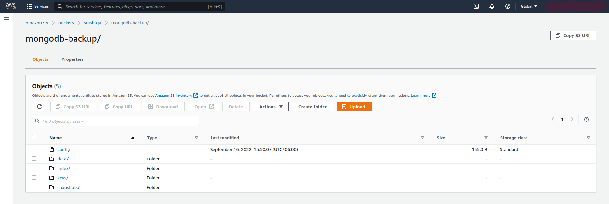

## Overview

KubeDB is the Kubernetes Native Database Management Solution which simplifies and automates routine database tasks such as Provisioning, Monitoring, Upgrading, Patching, Scaling, Volume Expansion, Backup, Recovery, Failure detection, and Repair for various popular databases on private and public clouds. The databases that KubeDB supports are  MongoDB, Elasticsearch, MySQL, MariaDB, Redis, PostgreSQL, ProxySQL, Percona XtraDB, Memcached and PgBouncer. You can find the guides to all the supported databases [here](https://kubedb.com/).
In this tutorial we will deploy MongoDB database in Amazon Elastic Kubernetes Service (Amazon EKS). We will cover the following steps:

1) Install KubeDB
2) Deploy MongoDB ReplicaSet Database
3) Install Stash
4) Backup MongoDB Database Using Stash
5) Recover MongoDB Database Using Stash

## Install KubeDB

We will follow the steps to install KubeDB.

### Get Cluster ID

We need the cluster ID to get the KubeDB License.
To get cluster ID, we can run the following command:

```bash
$ kubectl get ns kube-system -o jsonpath='{.metadata.uid}'
250a26e3-2413-4ed2-99dc-57b0548407ff
```

### Get License

Go to [Appscode License Server](https://license-issuer.appscode.com/) to get the license.txt file. For this tutorial we will use KubeDB Enterprise Edition.



### Install KubeDB

We will use helm to install KubeDB. Please install helm [here](https://helm.sh/docs/intro/install/) if it is not already installed.
Now, let's install `KubeDB`.

```bash
$ helm repo add appscode https://charts.appscode.com/stable/
$ helm repo update

$ helm search repo appscode/kubedb
NAME                              	CHART VERSION	APP VERSION	DESCRIPTION                                       
appscode/kubedb                   	v2022.08.08  	v2022.08.08	KubeDB by AppsCode - Production ready databases...
appscode/kubedb-autoscaler        	v0.13.0      	v0.13.0    	KubeDB Autoscaler by AppsCode - Autoscale KubeD...
appscode/kubedb-catalog           	v2022.08.08  	v2022.08.08	KubeDB Catalog by AppsCode - Catalog for databa...
appscode/kubedb-community         	v0.24.2      	v0.24.2    	KubeDB Community by AppsCode - Community featur...
appscode/kubedb-crds              	v2022.08.08  	v2022.08.08	KubeDB Custom Resource Definitions                
appscode/kubedb-dashboard         	v0.4.0       	v0.4.0     	KubeDB Dashboard by AppsCode                      
appscode/kubedb-enterprise        	v0.11.2      	v0.11.2    	KubeDB Enterprise by AppsCode - Enterprise feat...
appscode/kubedb-grafana-dashboards	v2022.08.08  	v2022.08.08	A Helm chart for kubedb-grafana-dashboards by A...
appscode/kubedb-metrics           	v2022.08.08  	v2022.08.08	KubeDB State Metrics                              
appscode/kubedb-ops-manager       	v0.15.0      	v0.15.4    	KubeDB Ops Manager by AppsCode - Enterprise fea...
appscode/kubedb-opscenter         	v2022.08.08  	v2022.08.08	KubeDB Opscenter by AppsCode                      
appscode/kubedb-provisioner       	v0.28.0      	v0.28.4    	KubeDB Provisioner by AppsCode - Community feat...
appscode/kubedb-schema-manager    	v0.4.0       	v0.4.0     	KubeDB Schema Manager by AppsCode                 
appscode/kubedb-ui                	v2022.06.14  	0.3.9      	A Helm chart for Kubernetes                       
appscode/kubedb-ui-server         	v2021.12.21  	v2021.12.21	A Helm chart for kubedb-ui-server by AppsCode     
appscode/kubedb-webhook-server    	v0.4.0       	v0.4.4     	KubeDB Webhook Server by AppsCode 

# Install KubeDB Enterprise operator chart
$ helm install kubedb appscode/kubedb \
  --version v2022.08.08 \
  --namespace kubedb --create-namespace \
  --set kubedb-provisioner.enabled=true \
  --set kubedb-ops-manager.enabled=true \
  --set kubedb-autoscaler.enabled=true \
  --set kubedb-dashboard.enabled=true \
  --set kubedb-schema-manager.enabled=true \
  --set-file global.license=/path/to/the/license.txt

```

Let's verify the installation:

```bash
$ kubectl get pods --all-namespaces -l "app.kubernetes.io/instance=kubedb"
NAMESPACE   NAME                                            READY   STATUS    RESTARTS   AGE
kubedb      kubedb-kubedb-autoscaler-68796cf59b-2hl2z       1/1     Running   0          2m22s
kubedb      kubedb-kubedb-dashboard-775c5d869c-w9ptn        1/1     Running   0          2m22s
kubedb      kubedb-kubedb-ops-manager-66495d6b6d-wjxjx      1/1     Running   0          2m22s
kubedb      kubedb-kubedb-provisioner-fff4d6b9b-r6gdj       1/1     Running   0          2m22s
kubedb      kubedb-kubedb-schema-manager-7b88c4f7cb-nrqmj   1/1     Running   0          2m22s
kubedb      kubedb-kubedb-webhook-server-7c458bf6cc-kdrjd   1/1     Running   0          2m22s
```

We can list the CRD Groups that have been registered by the operator by running the following command:

```bash
$ kubectl get crd -l app.kubernetes.io/name=kubedb
NAME                                              CREATED AT
elasticsearchautoscalers.autoscaling.kubedb.com   2022-09-16T06:44:49Z
elasticsearchdashboards.dashboard.kubedb.com      2022-09-16T06:44:44Z
elasticsearches.kubedb.com                        2022-09-16T06:44:44Z
elasticsearchopsrequests.ops.kubedb.com           2022-09-16T06:44:53Z
elasticsearchversions.catalog.kubedb.com          2022-09-16T06:37:52Z
etcds.kubedb.com                                  2022-09-16T06:44:53Z
etcdversions.catalog.kubedb.com                   2022-09-16T06:37:53Z
mariadbautoscalers.autoscaling.kubedb.com         2022-09-16T06:44:49Z
mariadbdatabases.schema.kubedb.com                2022-09-16T06:44:49Z
mariadbopsrequests.ops.kubedb.com                 2022-09-16T06:45:12Z
mariadbs.kubedb.com                               2022-09-16T06:44:50Z
mariadbversions.catalog.kubedb.com                2022-09-16T06:37:54Z
memcacheds.kubedb.com                             2022-09-16T06:44:55Z
memcachedversions.catalog.kubedb.com              2022-09-16T06:37:55Z
mongodbautoscalers.autoscaling.kubedb.com         2022-09-16T06:44:49Z
mongodbdatabases.schema.kubedb.com                2022-09-16T06:44:47Z
mongodbopsrequests.ops.kubedb.com                 2022-09-16T06:44:57Z
mongodbs.kubedb.com                               2022-09-16T06:44:48Z
mongodbversions.catalog.kubedb.com                2022-09-16T06:37:56Z
mysqldatabases.schema.kubedb.com                  2022-09-16T06:44:46Z
mysqlopsrequests.ops.kubedb.com                   2022-09-16T06:45:08Z
mysqls.kubedb.com                                 2022-09-16T06:44:46Z
mysqlversions.catalog.kubedb.com                  2022-09-16T06:37:57Z
perconaxtradbopsrequests.ops.kubedb.com           2022-09-16T06:45:28Z
perconaxtradbs.kubedb.com                         2022-09-16T06:44:59Z
perconaxtradbversions.catalog.kubedb.com          2022-09-16T06:37:58Z
pgbouncers.kubedb.com                             2022-09-16T06:44:59Z
pgbouncerversions.catalog.kubedb.com              2022-09-16T06:37:59Z
postgresdatabases.schema.kubedb.com               2022-09-16T06:44:49Z
postgreses.kubedb.com                             2022-09-16T06:44:49Z
postgresopsrequests.ops.kubedb.com                2022-09-16T06:45:21Z
postgresversions.catalog.kubedb.com               2022-09-16T06:38:00Z
proxysqlopsrequests.ops.kubedb.com                2022-09-16T06:45:24Z
proxysqls.kubedb.com                              2022-09-16T06:45:00Z
proxysqlversions.catalog.kubedb.com               2022-09-16T06:38:01Z
redises.kubedb.com                                2022-09-16T06:45:01Z
redisopsrequests.ops.kubedb.com                   2022-09-16T06:45:16Z
redissentinels.kubedb.com                         2022-09-16T06:45:01Z
redisversions.catalog.kubedb.com                  2022-09-16T06:38:02Z
```

## Deploy MongoDB ReplicaSet Database

Now, we are going to Deploy MongoDB with the help of KubeDB.
At first, let's create a Namespace in which we will deploy the database.

```bash
$ kubectl create ns demo
namespace/demo created
```

Here is the yaml of the MongoDB CRO we are going to use:

```yaml
apiVersion: kubedb.com/v1alpha2
kind: MongoDB
metadata:
  name: mongodb-rs
  namespace: demo
spec:
  version: "5.0.3"
  replicas: 3
  replicaSet:
    name: rs
  storage:
    storageClassName: "gp2"
    accessModes:
    - ReadWriteOnce
    resources:
      requests:
        storage: 1Gi
  terminationPolicy: WipeOut
```

Let's save this yaml configuration into `mongodb-rs.yaml` 
Then create the above MongoDB CRO

```bash
$ kubectl apply -f mongodb-rs.yaml
mongodb.kubedb.com/mongodb-rs created
```

* In this yaml we can see in the `spec.version` field specifies the version of MongoDB. Here, we are using MongoDB `version 5.0.3`. You can list the KubeDB supported versions of MongoDB by running `$ kubectl get mongodbversions` command.
* `spec.storage` specifies PVC spec that will be dynamically allocated to store data for this database. This storage spec will be passed to the StatefulSet created by KubeDB operator to run database pods. You can specify any StorageClass available in your cluster with appropriate resource requests.
* And the `spec.terminationPolicy` field is *Wipeout* means that the database will be deleted without restrictions. It can also be "Halt", "Delete" and "DoNotTerminate". Learn More about these [HERE](https://kubedb.com/docs/latest/guides/mongodb/concepts/mongodb/#specterminationpolicy).

Once these are handled correctly and the MongoDB object is deployed, you will see that the following objects are created:

```bash
$ kubectl get all -n demo
NAME               READY   STATUS    RESTARTS   AGE
pod/mongodb-rs-0   2/2     Running   0          5m14s
pod/mongodb-rs-1   2/2     Running   0          4m25s
pod/mongodb-rs-2   2/2     Running   0          3m39s

NAME                      TYPE        CLUSTER-IP      EXTERNAL-IP   PORT(S)     AGE
service/mongodb-rs        ClusterIP   10.100.96.208   <none>        27017/TCP   5m17s
service/mongodb-rs-pods   ClusterIP   None            <none>        27017/TCP   5m18s

NAME                          READY   AGE
statefulset.apps/mongodb-rs   3/3     5m21s

NAME                                            TYPE                 VERSION   AGE
appbinding.appcatalog.appscode.com/mongodb-rs   kubedb.com/mongodb   5.0.3     5m23s

NAME                            VERSION   STATUS   AGE
mongodb.kubedb.com/mongodb-rs   5.0.3     Ready    5m42s
```
Let’s check if the database is ready to use,

```bash
$ kubectl get mg -n demo mongodb-rs
NAME         VERSION   STATUS   AGE
mongodb-rs   5.0.3     Ready    6m57s
```
> We have successfully deployed MongoDB in AWS. Now we can exec into the container to use the database.

### Accessing Database Through CLI

To access the database through CLI, we have to get the credentials to access. Let’s export the credentials as environment variable to our current shell :

#### Export the Credentials

KubeDB will create Secret and Service for the database `sample-mongodb-rs` that we have deployed. Let’s check them using the following commands,

```bash
$ kubectl get secret -n demo -l=app.kubernetes.io/instance=mongodb-rs
NAME              TYPE     DATA   AGE
mongodb-rs-auth   Opaque   2      7m27s
mongodb-rs-key    Opaque   1      7m27s

$ kubectl get service -n demo -l=app.kubernetes.io/instance=mongodb-rs
NAME              TYPE        CLUSTER-IP      EXTERNAL-IP   PORT(S)     AGE
mongodb-rs        ClusterIP   10.100.96.208   <none>        27017/TCP   8m
mongodb-rs-pods   ClusterIP   None            <none>        27017/TCP   8m1s
```
Now, we are going to use `mongodb-rs-auth` to export credentials.
Let’s export the `USER` and `PASSWORD` as environment variables to make further commands re-usable.

```bash
$ export USER=$(kubectl get secrets -n demo mongodb-rs-auth -o jsonpath='{.data.\username}' | base64 -d)

$ export PASSWORD=$(kubectl get secrets -n demo mongodb-rs-auth -o jsonpath='{.data.\password}' | base64 -d)
```

#### Insert Sample Data

In this section, we are going to login into our MongoDB database pod and insert some sample data. 

```bash
$ kubectl exec -it -n demo sample-mongodb-rs-0 -- mongo admin -u $USER -p $PASSWORD
Defaulted container "mongodb" out of: mongodb, replication-mode-detector, copy-config (init)
MongoDB shell version v5.0.3
...

rs:PRIMARY> show dbs
admin          0.000GB
config         0.000GB
kubedb-system  0.000GB
local          0.000GB

rs:PRIMARY> show users
{
	"_id" : "admin.root",
	"userId" : UUID("2f66a3cd-f8c2-4a8c-bb6f-ccb25d6eb821"),
	"user" : "root",
	"db" : "admin",
	"roles" : [
		{
			"role" : "root",
			"db" : "admin"
		}
	],
	"mechanisms" : [
		"SCRAM-SHA-1",
		"SCRAM-SHA-256"
	]
}

rs:PRIMARY> use musicdb
switched to db musicdb

rs:PRIMARY> db.songs.insert({"name":"Take Me Home Country Roads"});
WriteResult({ "nInserted" : 1 })

rs:PRIMARY> db.songs.find().pretty()
{
	"_id" : ObjectId("632422b664464170468114b0"),
	"name" : "Take Me Home Country Roads"
}

rs:PRIMARY> exit
bye

```

> We've successfully inserted some sample data to our database. And this was just an example of our MongoDB ReplicaSet database deployment. The other databases that KubeDB supports are Elasticsearch, Redis, MySQL, PostgreSQL, MariaDB, Percona XtraDB, ProxySQL, Memcached and PgBouncer. More information about Run & Manage MongoDB on Kubernetes can be found [HERE](https://kubedb.com/kubernetes/databases/run-and-manage-mongodb-on-kubernetes/)

## Backup MongoDB Database Using Stash

Here, we are going to use Stash to backup the MongoDB database we deployed before.

### Install Stash

Kubedb Enterprise License works for Stash too.
So, we will use the Enterprise license that we already obtained.

```bash
$ helm install stash appscode/stash \
  --version v2022.07.09 \
  --namespace stash --create-namespace \
  --set features.enterprise=true \
  --set-file global.license=/path/to/the/license.txt
```

Let's verify the installation:

```bash
$ kubectl get pods --all-namespaces -l app.kubernetes.io/name=stash-enterprise
NAMESPACE   NAME                                      READY   STATUS    RESTARTS   AGE
stash       stash-stash-enterprise-649dff5767-ls8lw   2/2     Running   0          69s
```

Now, to confirm CRD groups have been registered by the operator, run the following command:

```bash
$ kubectl get crd -l app.kubernetes.io/name=stash
NAME                                      CREATED AT
backupbatches.stash.appscode.com          2022-09-16T07:22:59Z
backupblueprints.stash.appscode.com       2022-09-16T07:22:59Z
backupconfigurations.stash.appscode.com   2022-09-16T07:22:58Z
backupsessions.stash.appscode.com         2022-09-16T07:22:58Z
functions.stash.appscode.com              2022-09-16T07:18:59Z
repositories.stash.appscode.com           2022-09-16T06:44:52Z
restorebatches.stash.appscode.com         2022-09-16T07:23:00Z
restoresessions.stash.appscode.com        2022-09-16T06:44:52Z
tasks.stash.appscode.com                  2022-09-16T07:19:01Z
```


### Prepare Backend

Stash supports various backends for storing data snapshots. It can be a cloud storage like GCS bucket, AWS S3, Azure Blob Storage etc. or a Kubernetes persistent volume like HostPath, PersistentVolumeClaim, NFS etc.

For this tutorial we are going to use Amazon S3 Storage. You can find other setups [here](https://stash.run/docs/latest/guides/backends/overview/).

 

At first we need to create a secret so that we can access the Amazon S3 bucket. We can do that by the following code:

```bash
$ echo -n 'changeit' > RESTIC_PASSWORD
$ echo -n '<your-aws-access-key-id-here>' > AWS_ACCESS_KEY_ID
$ echo -n '<your-aws-secret-access-key-here>' > AWS_SECRET_ACCESS_KEY
$ kubectl create secret generic -n demo s3-secret \
                 --from-file=./RESTIC_PASSWORD \
                 --from-file=./AWS_ACCESS_KEY_ID \
                 --from-file=./AWS_SECRET_ACCESS_KEY
secret/s3-secret created
```

### Create Repository

```yaml
apiVersion: stash.appscode.com/v1alpha1
kind: Repository
metadata:
  name: s3-repo
  namespace: demo
spec:
  backend:
    s3:
      endpoint: s3.amazonaws.com
      bucket: stash-qa
      region: us-east-1
      prefix: /mongodb-backup
    storageSecretName: s3-secret
```

This repository CRO specifies the `s3-secret` we created before and stores the name and path to the S3 storage bucket. It also specifies the location to the container where we want to backup our database.
> Here, My bucket name is `stash-qa`. Don't forget to change `spec.backend.s3.bucket` to your bucket name and For `S3`, use `s3.amazonaws.com` as endpoint.

Lets create this repository,

```bash
$ kubectl apply -f s3-repo.yaml 
repository.stash.appscode.com/s3-repo created
```

### Create BackupConfiguration

Now, we need to create a `BackupConfiguration` file that specifies what to backup, where to backup and when to backup.

```yaml
apiVersion: stash.appscode.com/v1beta1
kind: BackupConfiguration
metadata:
  name: mongodb-rs-backup
  namespace: demo
spec:
  schedule: "*/5 * * * *"
  repository:
    name: s3-repo
  target:
    ref:
      apiVersion: appcatalog.appscode.com/v1alpha1
      kind: AppBinding
      name: mongodb-rs
  retentionPolicy:
    name: keep-last-5
    keepLast: 5
    prune: true
```
Create this `BackupConfiguration` by following command,

```bash
$ kubectl apply -f mongodb-rs-backup.yaml 
backupconfiguration.stash.appscode.com/mongodb-rs-backup created
```

* `BackupConfiguration` creates a cronjob that backs up the specified database (`spec.target`) every 5 minutes.
* `spec.repository` contains the repository name that we have created before called `s3-repo`.
* `spec.target.ref` contains the reference to the appbinding that we want to backup.
* `spec.schedule` specifies that we want to backup the database at 5 minutes interval.
* `spec.retentionPolicy` specifies the policy to follow for cleaning old snapshots. 
* To learn more about `AppBinding`, click here [AppBinding](https://kubedb.com/docs/latest/guides/mongodb/concepts/appbinding/). 
So, after 5 minutes we can see the following status:

```bash
$ kubectl get backupsession -n demo
NAME                           INVOKER-TYPE          INVOKER-NAME        PHASE       DURATION   AGE
mongodb-rs-backup-1663321801   BackupConfiguration   mongodb-rs-backup   Succeeded   43s        4m35s

$ kubectl get repository -n demo
NAME      INTEGRITY   SIZE        SNAPSHOT-COUNT   LAST-SUCCESSFUL-BACKUP   AGE
s3-repo   true        5.628 KiB   1                5m7s                     7m13s
```

Now if we check our Amazon S3 bucket, we can see that the backup has been successful.



> **If you have reached here, CONGRATULATIONS!! :confetti_ball: :confetti_ball: :confetti_ball: You have successfully backed up MongoDB Database using Stash.** If you had any problem during the backup process, you can reach out to us via [EMAIL](mailto:support@appscode.com?subject=Stash%20Backup%20Failed%20in%20AWS).

## Recover MongoDB Database Using Stash

Let's think of a scenario in which the database has been accidentally deleted or there was an error in the database causing it to crash.

#### Temporarily pause backup

At first, let’s stop taking any further backup of the database so that no backup runs after we delete the sample data. We are going to pause the `BackupConfiguration` object. Stash will stop taking any further backup when the `BackupConfiguration` is paused.

```bash
$ kubectl patch backupconfiguration -n demo mongodb-rs-backup --type="merge" --patch='{"spec": {"paused": true}}'
backupconfiguration.stash.appscode.com/mongodb-rs-backup patched
```

Now, we are going to delete database to simulate accidental database deletion.

```bash
$ kubectl exec -it -n demo mongodb-rs-0 -- mongo admin -u $USER -p $PASSWORD
Defaulted container "mongodb" out of: mongodb, replication-mode-detector, copy-config (init)
MongoDB shell version v5.0.3
...


rs:PRIMARY> show dbs
admin          0.000GB
config         0.000GB
kubedb-system  0.000GB
local          0.000GB
musicdb        0.000GB

rs:PRIMARY> use musicdb
switched to db musicdb

rs:PRIMARY> db.dropDatabase()
{
	"ok" : 1,
	"$clusterTime" : {
		"clusterTime" : Timestamp(1663322330, 2),
		"signature" : {
			"hash" : BinData(0,"cFotyj1ztl9VNbE2LXK7MdMCRBg="),
			"keyId" : NumberLong("7143869457633378308")
		}
	},
	"operationTime" : Timestamp(1663322330, 2)
}

rs:PRIMARY> show dbs
admin          0.000GB
config         0.000GB
kubedb-system  0.000GB
local          0.000GB

rs:PRIMARY> exit
bye

```

### Create a RestoreSession

Below, is the contents of YAML file of the `RestoreSession` object that we are going to create.

```yaml
apiVersion: stash.appscode.com/v1beta1
kind: RestoreSession
metadata:
  name: mongodb-rs-restore
  namespace: demo
spec:
  repository:
    name: s3-repo
  target:
    ref:
      apiVersion: appcatalog.appscode.com/v1alpha1
      kind: AppBinding
      name: mongodb-rs
  rules:
    - snapshots: [latest]
```

Now, let's create `RestoreSession` that will initiate restoring from the cloud.

```bash
$ kubectl apply -f mongodb-rs-restore.yaml 
restoresession.stash.appscode.com/mongodb-rs-restore created
```

This `RestoreSession` specifies where the data will be restored.
Once this is applied, a `RestoreSession` will be created. Once it has succeeded, the database has been successfully recovered as you can see below:

```bash
$ kubectl get restoresession -n demo
NAME                 REPOSITORY   PHASE       DURATION   AGE
mongodb-rs-restore   s3-repo      Succeeded   5s         21s
```

Now, let's check whether the database has been correctly restored:

```bash
$ kubectl exec -it -n demo mongodb-rs-0 -- mongo admin -u $USER -p $PASSWORD
Defaulted container "mongodb" out of: mongodb, replication-mode-detector, copy-config (init)
MongoDB shell version v5.0.3
...


rs:PRIMARY> show dbs
admin          0.000GB
config         0.000GB
kubedb-system  0.000GB
local          0.000GB
musicdb        0.000GB

rs:PRIMARY> use musicdb
switched to db musicdb

rs:PRIMARY> db.songs.find().pretty()
{
	"_id" : ObjectId("632422b664464170468114b0"),
	"name" : "Take Me Home Country Roads"
}


rs:PRIMARY> exit
bye
```

> You can see the database has been restored. The recovery of MongoDB Database has been successful. If you faced any difficulties in the recovery process, you can reach out to us through [EMAIL](mailto:support@appscode.com?subject=Stash%20Recovery%20Failed%20in%20AWS).

We have made an in depth tutorial on Managing MongoDB with Arbiter on Kubernetes using KubeDB. You can have a look into the video below:

<iframe width="560" height="315" src="https://www.youtube.com/embed/XOqR5GJ2mM4" title="YouTube video player" frameborder="0" allow="accelerometer; autoplay; clipboard-write; encrypted-media; gyroscope; picture-in-picture" allowfullscreen></iframe>

## Support

To speak with us, please leave a message on [our website](https://appscode.com/contact/).

To receive product announcements, follow us on [Twitter](https://twitter.com/KubeDB).

To watch tutorials of various Production-Grade Kubernetes Tools Subscribe our [YouTube](https://www.youtube.com/c/AppsCodeInc/) channel.

More about [MongoDB in Kubernetes](https://kubedb.com/kubernetes/databases/run-and-manage-mongodb-on-kubernetes/)

If you have found a bug with KubeDB or want to request for new features, please [file an issue](https://github.com/kubedb/project/issues/new).
