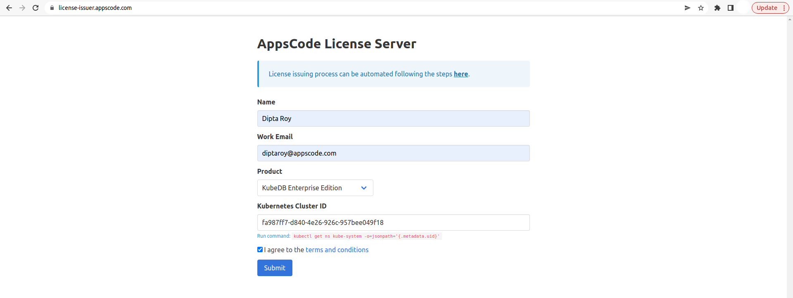

## Overview

KubeDB is the Kubernetes Native Database Management Solution which simplifies and automates routine database tasks such as Provisioning, Monitoring, Upgrading, Patching, Scaling, Volume Expansion, Backup, Recovery, Failure detection, and Repair for various popular databases on private and public clouds. The databases that KubeDB supports are PostgreSQL, MySQL, MongoDB, MariaDB, Elasticsearch, Redis, ProxySQL, Percona XtraDB, Memcached and PgBouncer. You can find the guides to all the supported databases [here](https://kubedb.com/).
In this tutorial we will deploy PostgreSQL database in Azure Kubernetes Service (AKS). We will cover the following steps:

1) Install KubeDB
2) Deploy PostgreSQL Clustered Database
3) Install Stash
4) Backup PostgreSQL Database Using Stash
5) Recover PostgreSQL Database Using Stash

## Install KubeDB

We will follow the steps to install KubeDB.

### Get Cluster ID

We need the cluster ID to get the KubeDB License.
To get cluster ID we can run the following command:

```bash
$ kubectl get ns kube-system -o jsonpath='{.metadata.uid}'
fa987ff7-d840-4e26-926c-957bee049f18
```

### Get License

Go to [Appscode License Server](https://license-issuer.appscode.com/) to get the license.txt file. For this tutorial we will use KubeDB Enterprise Edition.



### Install KubeDB

We will use helm to install KubeDB. Please install helm [here](https://helm.sh/docs/intro/install/) if it is not already installed.
Now, let's install `KubeDB`.

```bash
$ helm repo add appscode https://charts.appscode.com/stable/
$ helm repo update

$ helm search repo appscode/kubedb
NAME                              	CHART VERSION	APP VERSION	DESCRIPTION                                       
appscode/kubedb                   	v2022.05.24  	v2022.05.24	KubeDB by AppsCode - Production ready databases...
appscode/kubedb-autoscaler        	v0.12.0      	v0.12.0    	KubeDB Autoscaler by AppsCode - Autoscale KubeD...
appscode/kubedb-catalog           	v2022.05.24  	v2022.05.24	KubeDB Catalog by AppsCode - Catalog for databa...
appscode/kubedb-community         	v0.24.2      	v0.24.2    	KubeDB Community by AppsCode - Community featur...
appscode/kubedb-crds              	v2022.05.24  	v2022.05.24	KubeDB Custom Resource Definitions                
appscode/kubedb-dashboard         	v0.3.0       	v0.3.0     	KubeDB Dashboard by AppsCode                      
appscode/kubedb-enterprise        	v0.11.2      	v0.11.2    	KubeDB Enterprise by AppsCode - Enterprise feat...
appscode/kubedb-grafana-dashboards	v2022.05.24  	v2022.05.24	A Helm chart for kubedb-grafana-dashboards by A...
appscode/kubedb-metrics           	v2022.05.24  	v2022.05.24	KubeDB State Metrics                              
appscode/kubedb-ops-manager       	v0.14.0      	v0.14.0    	KubeDB Ops Manager by AppsCode - Enterprise fea...
appscode/kubedb-opscenter         	v2022.05.24  	v2022.05.24	KubeDB Opscenter by AppsCode                      
appscode/kubedb-provisioner       	v0.27.0      	v0.27.0    	KubeDB Provisioner by AppsCode - Community feat...
appscode/kubedb-schema-manager    	v0.3.0       	v0.3.0     	KubeDB Schema Manager by AppsCode                 
appscode/kubedb-ui                	v2022.06.14  	0.3.9      	A Helm chart for Kubernetes                       
appscode/kubedb-ui-server         	v2021.12.21  	v2021.12.21	A Helm chart for kubedb-ui-server by AppsCode     
appscode/kubedb-webhook-server    	v0.3.0       	v0.3.0     	KubeDB Webhook Server by AppsCode    

# Install KubeDB Enterprise operator chart
$ helm install kubedb appscode/kubedb \
  --version v2022.05.24 \
  --namespace kubedb --create-namespace \
  --set kubedb-provisioner.enabled=true \
  --set kubedb-ops-manager.enabled=true \
  --set kubedb-autoscaler.enabled=true \
  --set kubedb-dashboard.enabled=true \
  --set kubedb-schema-manager.enabled=true \
  --set-file global.license=/path/to/the/license.txt
```

Let's verify the installation:

```bash
$ watch kubectl get pods --all-namespaces -l "app.kubernetes.io/instance=kubedb"
NAMESPACE   NAME                                            READY   STATUS    RESTARTS   AGE
kubedb      kubedb-kubedb-autoscaler-597bcc648-s5pb8        1/1     Running   0          2m
kubedb      kubedb-kubedb-dashboard-bb466f9fd-9pz9n         1/1     Running   0          2m
kubedb      kubedb-kubedb-ops-manager-674d759dd9-9jw9g      1/1     Running   0          2m
kubedb      kubedb-kubedb-provisioner-6bc85b6c9c-65fg9      1/1     Running   0          2m
kubedb      kubedb-kubedb-schema-manager-6bc5486c48-459mw   1/1     Running   0          2m
kubedb      kubedb-kubedb-webhook-server-66cd558f9b-xcmp5   1/1     Running   0          2m

```

We can list the CRD Groups that have been registered by the operator by running the following command:

```bash
$ kubectl get crd -l app.kubernetes.io/name=kubedb
NAME                                              CREATED AT
elasticsearchautoscalers.autoscaling.kubedb.com   2022-07-01T04:30:11Z
elasticsearchdashboards.dashboard.kubedb.com      2022-07-01T04:30:13Z
elasticsearches.kubedb.com                        2022-07-01T04:29:57Z
elasticsearchopsrequests.ops.kubedb.com           2022-07-01T04:30:04Z
elasticsearchversions.catalog.kubedb.com          2022-07-01T04:27:43Z
etcds.kubedb.com                                  2022-07-01T04:29:58Z
etcdversions.catalog.kubedb.com                   2022-07-01T04:27:43Z
mariadbautoscalers.autoscaling.kubedb.com         2022-07-01T04:30:14Z
mariadbdatabases.schema.kubedb.com                2022-07-01T04:30:12Z
mariadbopsrequests.ops.kubedb.com                 2022-07-01T04:30:18Z
mariadbs.kubedb.com                               2022-07-01T04:29:58Z
mariadbversions.catalog.kubedb.com                2022-07-01T04:27:43Z
memcacheds.kubedb.com                             2022-07-01T04:29:58Z
memcachedversions.catalog.kubedb.com              2022-07-01T04:27:43Z
mongodbautoscalers.autoscaling.kubedb.com         2022-07-01T04:30:08Z
mongodbdatabases.schema.kubedb.com                2022-07-01T04:30:10Z
mongodbopsrequests.ops.kubedb.com                 2022-07-01T04:30:07Z
mongodbs.kubedb.com                               2022-07-01T04:29:58Z
mongodbversions.catalog.kubedb.com                2022-07-01T04:27:44Z
mysqldatabases.schema.kubedb.com                  2022-07-01T04:30:10Z
mysqlopsrequests.ops.kubedb.com                   2022-07-01T04:30:15Z
mysqls.kubedb.com                                 2022-07-01T04:29:58Z
mysqlversions.catalog.kubedb.com                  2022-07-01T04:27:44Z
perconaxtradbs.kubedb.com                         2022-07-01T04:29:58Z
perconaxtradbversions.catalog.kubedb.com          2022-07-01T04:27:44Z
pgbouncers.kubedb.com                             2022-07-01T04:29:58Z
pgbouncerversions.catalog.kubedb.com              2022-07-01T04:27:45Z
postgresdatabases.schema.kubedb.com               2022-07-01T04:30:11Z
postgreses.kubedb.com                             2022-07-01T04:29:59Z
postgresopsrequests.ops.kubedb.com                2022-07-01T04:30:25Z
postgresversions.catalog.kubedb.com               2022-07-01T04:27:45Z
proxysqlopsrequests.ops.kubedb.com                2022-07-01T04:30:29Z
proxysqls.kubedb.com                              2022-07-01T04:29:59Z
proxysqlversions.catalog.kubedb.com               2022-07-01T04:27:45Z
redises.kubedb.com                                2022-07-01T04:29:59Z
redisopsrequests.ops.kubedb.com                   2022-07-01T04:30:21Z
redissentinels.kubedb.com                         2022-07-01T04:29:59Z
redisversions.catalog.kubedb.com                  2022-07-01T04:27:46Z
```

## Deploy PostgreSQL Clustered Database

Now, we are going to Deploy PostgreSQL with the help of KubeDB.
At first, let's create a Namespace in which we will deploy the database.

```bash
$ kubectl create ns demo
namespace/demo created
```

Here is the yaml of the PostgreSQL CRO we are going to use:

```yaml
apiVersion: kubedb.com/v1alpha2
kind: Postgres
metadata:
  name: postgres-cluster
  namespace: demo
spec:
  version: "14.2"
  replicas: 3
  storageType: Durable
  storage:
    storageClassName: "default"
    accessModes:
    - ReadWriteOnce
    resources:
      requests:
        storage: 1Gi
  terminationPolicy: WipeOut
```

Let's save this yaml configuration into `postgres-cluster.yaml` 
Then create the above PostgreSQL CRO

```bash
$ kubectl create -f postgres-cluster.yaml
postgres.kubedb.com/postgres-cluster created
```

* In this yaml we can see in the `spec.version` field specifies the version of PostgreSQL. Here, we are using PostgreSQL `version 14.2`. You can list the KubeDB supported versions of PostgreSQL by running `$ kubectl get postgresversions` command.
* `spec.storage` specifies PVC spec that will be dynamically allocated to store data for this database. This storage spec will be passed to the StatefulSet created by KubeDB operator to run database pods. You can specify any StorageClass available in your cluster with appropriate resource requests.
* And the `spec.terminationPolicy` field is *Wipeout* means that the database will be deleted without restrictions. It can also be "Halt", "Delete" and "DoNotTerminate". Learn More about these [HERE](https://kubedb.com/docs/latest/guides/postgres/concepts/postgres/#specterminationpolicy).

Once these are handled correctly and the PostgreSQL object is deployed, you will see that the following objects are created:

```bash
$ kubectl get all -n demo
NAME                     READY   STATUS    RESTARTS   AGE
pod/postgres-cluster-0   2/2     Running   0          2m38s
pod/postgres-cluster-1   2/2     Running   0          2m4s
pod/postgres-cluster-2   2/2     Running   0          92s

NAME                               TYPE        CLUSTER-IP     EXTERNAL-IP   PORT(S)                      AGE
service/postgres-cluster           ClusterIP   10.0.25.152    <none>        5432/TCP,2379/TCP            2m39s
service/postgres-cluster-pods      ClusterIP   None           <none>        5432/TCP,2380/TCP,2379/TCP   2m39s
service/postgres-cluster-standby   ClusterIP   10.0.227.254   <none>        5432/TCP                     2m39s

NAME                                READY   AGE
statefulset.apps/postgres-cluster   3/3     2m40s

NAME                                                  TYPE                  VERSION   AGE
appbinding.appcatalog.appscode.com/postgres-cluster   kubedb.com/postgres   14.2      2m41s

NAME                                   VERSION   STATUS   AGE
postgres.kubedb.com/postgres-cluster   14.2      Ready    2m49s

```
Let’s check if the database is ready to use,

```bash
$ kubectl get postgres -n demo postgres-cluster
NAME               VERSION   STATUS   AGE
postgres-cluster   14.2      Ready    3m21s
```
> We have successfully deployed PostgreSQL in AKS. Now we can exec into the container to use the database.

### Accessing Database Through CLI

To access the database through CLI, we have to get the credentials to access.
KubeDB will create Secret and Service for the database `postgres-cluster` that we have deployed. Let’s check them using the following commands,

```bash
$ kubectl get secret -n demo -l=app.kubernetes.io/instance=postgres-cluster
NAME                    TYPE                       DATA   AGE
postgres-cluster-auth   kubernetes.io/basic-auth   2      3m44s

$ kubectl get service -n demo -l=app.kubernetes.io/instance=postgres-cluster
NAME                       TYPE        CLUSTER-IP     EXTERNAL-IP   PORT(S)                      AGE
postgres-cluster           ClusterIP   10.0.25.152    <none>        5432/TCP,2379/TCP            4m9s
postgres-cluster-pods      ClusterIP   None           <none>        5432/TCP,2380/TCP,2379/TCP   4m9s
postgres-cluster-standby   ClusterIP   10.0.227.254   <none>        5432/TCP                     4m9s

```
Now, we are going to use `postgres-cluster-auth` to get the credentials.

```bash
$ kubectl get secrets -n demo postgres-cluster-auth -o jsonpath='{.data.username}' | base64 -d
postgres

$ kubectl get secrets -n demo postgres-cluster-auth -o jsonpath='{.data.password}' | base64 -d
4Fd6stZGd$1eKz9C

```

#### Insert Sample Data

In this section, we are going to login into our PostgreSQL database pod and insert some sample data. 

```bash
$ kubectl exec -it postgres-cluster-0 -n demo -c postgres -- bash
bash-5.1$ psql -d "user=postgres password=4Fd6stZGd$1eKz9C"
psql (14.2)
Type "help" for help.

postgres=# \l
                                 List of databases
   Name    |  Owner   | Encoding |  Collate   |   Ctype    |   Access privileges   
-----------+----------+----------+------------+------------+-----------------------
 postgres  | postgres | UTF8     | en_US.utf8 | en_US.utf8 | 
 template0 | postgres | UTF8     | en_US.utf8 | en_US.utf8 | =c/postgres          +
           |          |          |            |            | postgres=CTc/postgres
 template1 | postgres | UTF8     | en_US.utf8 | en_US.utf8 | =c/postgres          +
           |          |          |            |            | postgres=CTc/postgres
(3 rows)

postgres=# CREATE DATABASE music;
CREATE DATABASE
postgres=# \l
                                 List of databases
   Name    |  Owner   | Encoding |  Collate   |   Ctype    |   Access privileges   
-----------+----------+----------+------------+------------+-----------------------
 music     | postgres | UTF8     | en_US.utf8 | en_US.utf8 | 
 postgres  | postgres | UTF8     | en_US.utf8 | en_US.utf8 | 
 template0 | postgres | UTF8     | en_US.utf8 | en_US.utf8 | =c/postgres          +
           |          |          |            |            | postgres=CTc/postgres
 template1 | postgres | UTF8     | en_US.utf8 | en_US.utf8 | =c/postgres          +
           |          |          |            |            | postgres=CTc/postgres
(4 rows)

postgres=# \c music
You are now connected to database "music" as user "postgres".
music=# CREATE TABLE artist (name VARCHAR(50) NOT NULL, song VARCHAR(50) NOT NULL);
CREATE TABLE

music=# INSERT INTO artist (name, song) VALUES('John Denver', 'Take Me Home Country Roads');
INSERT 0 1
music=# SELECT * FROM artist;
    name     |            song            
-------------+----------------------------
 John Denver | Take Me Home Country Roads
(1 row)

music=# \q
bash-5.1$ exit

```

> We've successfully inserted some sample data to our database. And this was just an example of our PostgreSQL Clustered database deployment. More information about Run & Manage Production-Grade PostgreSQL Database on Kubernetes can be found [HERE](https://kubedb.com/kubernetes/databases/run-and-manage-postgres-on-kubernetes/)

## Backup PostgreSQL Database Using Stash

Here, we are going to use Stash to backup the PostgreSQL database that we have just deployed.

### Install Stash

Kubedb Enterprise License works for Stash too.
So, we will use the Enterprise license that we have already obtained.

```bash
$ helm install stash appscode/stash             \
  --version v2022.06.27                         \
  --namespace kube-system                       \
  --set features.enterprise=true                \
  --set-file global.license=/path/to/the/license.txt
```

Let's verify the installation:

```bash
$ watch kubectl get pods --all-namespaces -l app.kubernetes.io/name=stash-enterprise
NAMESPACE     NAME                                      READY   STATUS    RESTARTS   AGE
kube-system   stash-stash-enterprise-66fb4b64f7-689n8   2/2     Running   0          2m
```

Now, to confirm CRD groups have been registered by the operator, run the following command:

```bash
$ kubectl get crd -l app.kubernetes.io/name=stash
NAME                                      CREATED AT
backupbatches.stash.appscode.com          2022-07-01T04:43:57Z
backupblueprints.stash.appscode.com       2022-07-01T04:43:57Z
backupconfigurations.stash.appscode.com   2022-07-01T04:43:55Z
backupsessions.stash.appscode.com         2022-07-01T04:43:55Z
functions.stash.appscode.com              2022-07-01T04:42:37Z
repositories.stash.appscode.com           2022-07-01T04:30:12Z
restorebatches.stash.appscode.com         2022-07-01T04:43:58Z
restoresessions.stash.appscode.com        2022-07-01T04:30:13Z
tasks.stash.appscode.com                  2022-07-01T04:42:38Z

```


### Prepare Backend

Stash supports various backends for storing data snapshots. It can be a cloud storage like GCS bucket, AWS S3, Azure Blob Storage etc. or a Kubernetes persistent volume like HostPath, PersistentVolumeClaim, NFS etc.

For this tutorial we are going to use Azure storage. You can find other setups [here](https://stash.run/docs/latest/guides/backends/overview/).

 

At first we need to create a secret so that we can access the Azure storage container. We can do that by the following code:

```bash
$ echo -n 'changeit' > RESTIC_PASSWORD
$ echo -n '<your-azure-storage-account-name>' > AZURE_ACCOUNT_NAME
$ echo -n '<your-azure-storage-account-key>' > AZURE_ACCOUNT_KEY
$ kubectl create secret generic -n demo azure-secret \
    --from-file=./RESTIC_PASSWORD \
    --from-file=./AZURE_ACCOUNT_NAME \
    --from-file=./AZURE_ACCOUNT_KEY
secret/azure-secret created
 ```

### Create Repository

```yaml
apiVersion: stash.appscode.com/v1alpha1
kind: Repository
metadata:
  name: azure-repo
  namespace: demo
spec:
  backend:
    azure:
      container: stash-backup
      prefix: /postgres-cluster
    storageSecretName: azure-secret

```

This repository CRO specifies the `azure-secret` we created before and stores the name and path to the azure storage container. It also specifies the location to the container where we want to backup our database.
> Here, My container name is `stash-backup`. Don't forget to change `spec.backend.azure.container` to your container name.

Lets create this repository,

```bash
$ kubectl apply -f azure-repo.yaml 
repository.stash.appscode.com/azure-repo created
```

### Create BackupConfiguration

Now, we need to create a `BackupConfiguration` file that specifies what to backup, where to backup and when to backup.

```yaml
apiVersion: stash.appscode.com/v1beta1
kind: BackupConfiguration
metadata:
  name: postgres-cluster-backup
  namespace: demo
spec:
  schedule: "*/5 * * * *"
  repository:
    name: azure-repo
  target:
    ref:
      apiVersion: appcatalog.appscode.com/v1alpha1
      kind: AppBinding
      name: postgres-cluster
  retentionPolicy:
    name: keep-last-5
    keepLast: 5
    prune: true
```
Create this `BackupConfiguration` by following command,

```bash
$ kubectl apply -f postgres-cluster-backup.yaml
backupconfiguration.stash.appscode.com/postgres-cluster-backup created
```

* `BackupConfiguration` creates a cronjob that backs up the specified database (`spec.target`) every 5 minutes.
* `spec.repository` contains the secret we created before called `azure-secret`.
* `spec.target.ref` contains the reference to the appbinding that we want to backup.
* `spec.schedule` specifies that we want to backup the database at 5 minutes interval.
* `spec.retentionPolicy` specifies the policy to follow for cleaning old snapshots. 
* To learn more about `AppBinding`, click here [AppBinding](https://kubedb.com/docs/latest/guides/postgres/concepts/appbinding/). 
So, after 5 minutes we can see the following status:

```bash
$ kubectl get backupsession -n demo
NAME                                 INVOKER-TYPE          INVOKER-NAME              PHASE       DURATION   AGE
postgres-cluster-backup-1656651303   BackupConfiguration   postgres-cluster-backup   Succeeded   18s        35s

$ kubectl get repository -n demo
NAME         INTEGRITY   SIZE        SNAPSHOT-COUNT   LAST-SUCCESSFUL-BACKUP   AGE
azure-repo   true        3.354 KiB   1                60s                      7m8s
```

Now if we check our azure storage container, we can see that the backup has been successful.


> **If you have reached here, CONGRATULATIONS!! :confetti_ball: :confetti_ball: :confetti_ball: You have successfully backed up PostgreSQL Database using Stash.** If you had any problem during the backup process, you can reach out to us via [EMAIL](mailto:support@appscode.com?subject=Stash%20Backup%20Failed%20in%20AKS).

## Recover PostgreSQL Database Using Stash

Let's think of a scenario in which the database has been accidentally deleted or there was an error in the database causing it to crash.

#### Temporarily pause backup

At first, let’s stop taking any further backup of the database so that no backup runs after we delete the sample data. We are going to pause the `BackupConfiguration` object. Stash will stop taking any further backup when the `BackupConfiguration` is paused.

```bash
$ kubectl patch backupconfiguration -n demo postgres-cluster-backup --type="merge" --patch='{"spec": {"paused": true}}'
backupconfiguration.stash.appscode.com/postgres-cluster-backup patched

```

Now, we are going to delete database to simulate accidental database deletion.

```bash
$ kubectl exec -it postgres-cluster-0 -n demo -c postgres -- bash
bash-5.1$ psql -d "user=postgres password=4Fd6stZGd$1eKz9C"
psql (14.2)
Type "help" for help.

postgres=# \l
                                 List of databases
   Name    |  Owner   | Encoding |  Collate   |   Ctype    |   Access privileges   
-----------+----------+----------+------------+------------+-----------------------
 music     | postgres | UTF8     | en_US.utf8 | en_US.utf8 | 
 postgres  | postgres | UTF8     | en_US.utf8 | en_US.utf8 | 
 template0 | postgres | UTF8     | en_US.utf8 | en_US.utf8 | =c/postgres          +
           |          |          |            |            | postgres=CTc/postgres
 template1 | postgres | UTF8     | en_US.utf8 | en_US.utf8 | =c/postgres          +
           |          |          |            |            | postgres=CTc/postgres
(4 rows)

postgres=# DROP DATABASE music;
DROP DATABASE
postgres=# \l
                                 List of databases
   Name    |  Owner   | Encoding |  Collate   |   Ctype    |   Access privileges   
-----------+----------+----------+------------+------------+-----------------------
 postgres  | postgres | UTF8     | en_US.utf8 | en_US.utf8 | 
 template0 | postgres | UTF8     | en_US.utf8 | en_US.utf8 | =c/postgres          +
           |          |          |            |            | postgres=CTc/postgres
 template1 | postgres | UTF8     | en_US.utf8 | en_US.utf8 | =c/postgres          +
           |          |          |            |            | postgres=CTc/postgres
(3 rows)

postgres=# \q
bash-5.1$ exit
exit

```

### Create a RestoreSession

Below, is the contents of YAML file of the `RestoreSession` object that we are going to create.

```yaml
apiVersion: stash.appscode.com/v1beta1
kind: RestoreSession
metadata:
  name: postgres-cluster-restore
  namespace: demo
spec:
  repository:
    name: azure-repo
  target:
    ref:
      apiVersion: appcatalog.appscode.com/v1alpha1
      kind: AppBinding
      name: postgres-cluster
  rules:
    - snapshots: [latest]
```

Now, let's create `RestoreSession` that will initiate restoring from the cloud.

```bash
$ kubectl create -f postgres-cluster-restore.yaml 
restoresession.stash.appscode.com/postgres-cluster-restore created
```

This `RestoreSession` specifies where the data will be restored.
Once this is applied, a `RestoreSession` will be created. Once it has succeeded, the database has been successfully recovered as you can see below:

```bash
$ kubectl get restoresession -n demo
NAME                       REPOSITORY   PHASE       DURATION   AGE
postgres-cluster-restore   azure-repo   Succeeded   4s         22s
```

Now, let's check whether the database has been correctly restored:

```bash
$ kubectl exec -it postgres-cluster-0 -n demo -c postgres -- bash
bash-5.1$ psql
psql (14.2)
Type "help" for help.

postgres=# \l
                                 List of databases
   Name    |  Owner   | Encoding |  Collate   |   Ctype    |   Access privileges   
-----------+----------+----------+------------+------------+-----------------------
 music     | postgres | UTF8     | en_US.utf8 | en_US.utf8 | 
 postgres  | postgres | UTF8     | en_US.utf8 | en_US.utf8 | 
 template0 | postgres | UTF8     | en_US.utf8 | en_US.utf8 | =c/postgres          +
           |          |          |            |            | postgres=CTc/postgres
 template1 | postgres | UTF8     | en_US.utf8 | en_US.utf8 | =c/postgres          +
           |          |          |            |            | postgres=CTc/postgres
(4 rows)

postgres=# \c music
You are now connected to database "music" as user "postgres".
music=# SELECT * FROM artist;
    name     |            song            
-------------+----------------------------
 John Denver | Take Me Home Country Roads
(1 row)

music=# \q
bash-5.1$ exit
```

> You can see the database has been restored. The recovery of PostgreSQL Database has been successful. If you faced any difficulties in the recovery process, you can reach out to us through [EMAIL](mailto:support@appscode.com?subject=Stash%20Recovery%20Failed%20in%20AKS).

We have made an in depth video on Managing Production Grade PostgreSQL Cluster in Kubernetes using KubeDB. You can have a look into the video below:

<iframe width="560" height="315" src="https://www.youtube.com/embed/xUnakCSVEuQ" title="YouTube video player" frameborder="0" allow="accelerometer; autoplay; clipboard-write; encrypted-media; gyroscope; picture-in-picture" allowfullscreen></iframe>

## Support

To speak with us, please leave a message on [our website](https://appscode.com/contact/).

To join public discussions with the KubeDB community, join us in the [Kubernetes Slack team](https://kubernetes.slack.com/messages/C8149MREV/) channel `#kubedb`. To sign up, use our [Slack inviter](http://slack.kubernetes.io/).

To receive product announcements, follow us on [Twitter](https://twitter.com/KubeDB).

To watch tutorials of various Production-Grade Kubernetes Tools Subscribe our [YouTube](https://www.youtube.com/c/AppsCodeInc/) channel.

More about [PostgreSQL in Kubernetes](https://kubedb.com/kubernetes/databases/run-and-manage-postgres-on-kubernetes/)

If you have found a bug with KubeDB or want to request for new features, please [file an issue](https://github.com/kubedb/project/issues/new).
