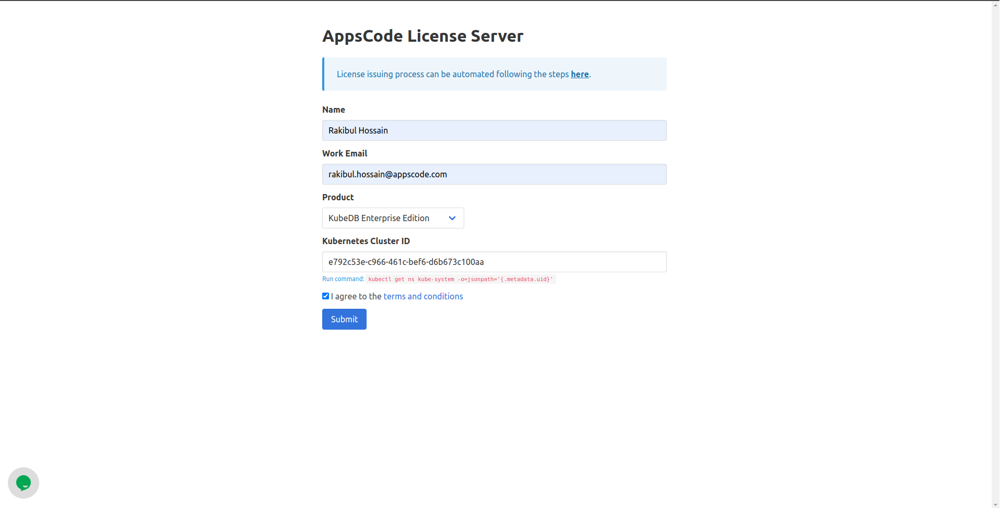

## Overview

KubeDB is the Kubernetes Native Database Management Solution which simplifies and automates routine database tasks such as Provisioning, Monitoring, Upgrading, Patching, Scaling, Volume Expansion, Backup, Recovery, Failure detection, and Repair for various popular databases on private and public clouds. The databases that KubeDB supports are MySQL, MongoDB, MariaDB, Elasticsearch, Redis, PostgreSQL, ProxySQL, Percona XtraDB, Memcached and PgBouncer. You can find the guides to all the supported databases [here](https://kubedb.com/).
In this tutorial we will show how to secure PostgreSQL using ACME Protocol issued TLS Certificates. We will cover the following steps:

1) Install KubeDB
2) Deploy Sample PostgreSQL Database
3) Install cert-manager
4) Deploy sample PgBouncer Database
5) Setup Ingress to expose PgBouncer
6) Use PgBouncer database from Developer Workstation

## Install KubeDB

We will follow the steps to install KubeDB.

### Get Cluster ID

We need the cluster ID to get the KubeDB License.
To get cluster ID we can run the following command:

```bash
$ kubectl get ns kube-system -o jsonpath='{.metadata.uid}'
e792c53e-c966-461c-bef6-d6b673c100aa
```

### Get License

Go to [Appscode License Server](https://license-issuer.appscode.com/) to get the license.txt file. For this tutorial we will use KubeDB Enterprise Edition.



### Install KubeDB

We will use helm to install KubeDB. Please install helm [here](https://helm.sh/docs/intro/install/) if it is not already installed.
Now, let's install `KubeDB`.

```bash
$ helm repo add appscode https://charts.appscode.com/stable/
$ helm repo update

$ helm search repo appscode/kubedb
NAME                              	CHART VERSION	APP VERSION	DESCRIPTION                                       
appscode/kubedb                   	v2023.02.28  	v2023.02.28	KubeDB by AppsCode - Production ready databases...
appscode/kubedb-autoscaler        	v0.17.0      	v0.17.0    	KubeDB Autoscaler by AppsCode - Autoscale KubeD...
appscode/kubedb-catalog           	v2023.02.28  	v2023.02.28	KubeDB Catalog by AppsCode - Catalog for databa...
appscode/kubedb-community         	v0.24.2      	v0.24.2    	KubeDB Community by AppsCode - Community featur...
appscode/kubedb-crds              	v2023.02.28  	v2023.02.28	KubeDB Custom Resource Definitions                
appscode/kubedb-dashboard         	v0.8.0       	v0.8.0     	KubeDB Dashboard by AppsCode                      
appscode/kubedb-enterprise        	v0.11.2      	v0.11.2    	KubeDB Enterprise by AppsCode - Enterprise feat...
appscode/kubedb-grafana-dashboards	v2023.02.28  	v2023.02.28	A Helm chart for kubedb-grafana-dashboards by A...
appscode/kubedb-metrics           	v2023.02.28  	v2023.02.28	KubeDB State Metrics                              
appscode/kubedb-ops-manager       	v0.19.0      	v0.19.2    	KubeDB Ops Manager by AppsCode - Enterprise fea...
appscode/kubedb-opscenter         	v2023.02.28  	v2023.02.28	KubeDB Opscenter by AppsCode                      
appscode/kubedb-provisioner       	v0.32.0      	v0.32.1    	KubeDB Provisioner by AppsCode - Community feat...
appscode/kubedb-schema-manager    	v0.8.0       	v0.8.0     	KubeDB Schema Manager by AppsCode                 
appscode/kubedb-ui                	v2022.06.14  	0.3.26     	A Helm chart for Kubernetes                       
appscode/kubedb-ui-server         	v2021.12.21  	v2021.12.21	A Helm chart for kubedb-ui-server by AppsCode     
appscode/kubedb-webhook-server    	v0.8.0       	v0.8.0     	KubeDB Webhook Server by AppsCode    

# Install KubeDB Enterprise operator chart
$ helm install kubedb appscode/kubedb \
  --version v2023.02.28 \
  --namespace kubedb --create-namespace \
  --set kubedb-provisioner.enabled=true \
  --set kubedb-ops-manager.enabled=true \
  --set kubedb-autoscaler.enabled=true \
  --set kubedb-dashboard.enabled=true \
  --set kubedb-schema-manager.enabled=true \
  --set-file global.license=/path/to/the/license.txt

```

Let's verify the installation:

```bash
$ watch kubectl get pods --all-namespaces -l "app.kubernetes.io/instance=kubedb"
NAMESPACE   NAME                                            READY   STATUS    RESTARTS      AGE
kubedb      kubedb-kubedb-autoscaler-7c9f8bbf8-zxp6l        1/1     Running   3 (21h ago)   21h
kubedb      kubedb-kubedb-dashboard-7557bf7584-jcpj7        1/1     Running   1 (21h ago)   21h
kubedb      kubedb-kubedb-ops-manager-6756f7d55c-mlm8x      1/1     Running   2 (21h ago)   21h
kubedb      kubedb-kubedb-provisioner-f8f76bff8-8jwx7       1/1     Running   4 (21h ago)   21h
kubedb      kubedb-kubedb-schema-manager-6fbb5cb598-45gwt   1/1     Running   1 (21h ago)   21h
kubedb      kubedb-kubedb-webhook-server-7c8477bc44-kd778   1/1     Running   0             21h
```

We can list the CRD Groups that have been registered by the operator by running the following command:

```bash
$ kubectl get crd -l app.kubernetes.io/name=kubedb
NAME                                              CREATED AT
elasticsearchautoscalers.autoscaling.kubedb.com   2023-03-08T08:50:40Z
elasticsearchdashboards.dashboard.kubedb.com      2023-03-08T08:50:44Z
elasticsearches.kubedb.com                        2023-03-08T08:50:38Z
elasticsearchopsrequests.ops.kubedb.com           2023-03-08T08:51:15Z
elasticsearchversions.catalog.kubedb.com          2023-03-08T08:48:24Z
etcds.kubedb.com                                  2023-03-08T08:50:38Z
etcdversions.catalog.kubedb.com                   2023-03-08T08:48:25Z
kafkas.kubedb.com                                 2023-03-08T08:51:01Z
kafkaversions.catalog.kubedb.com                  2023-03-08T08:48:25Z
mariadbautoscalers.autoscaling.kubedb.com         2023-03-08T08:50:40Z
mariadbdatabases.schema.kubedb.com                2023-03-08T08:51:34Z
mariadbopsrequests.ops.kubedb.com                 2023-03-08T08:52:01Z
mariadbs.kubedb.com                               2023-03-08T08:50:39Z
mariadbversions.catalog.kubedb.com                2023-03-08T08:48:25Z
memcacheds.kubedb.com                             2023-03-08T08:50:40Z
memcachedversions.catalog.kubedb.com              2023-03-08T08:48:26Z
mongodbautoscalers.autoscaling.kubedb.com         2023-03-08T08:50:40Z
mongodbdatabases.schema.kubedb.com                2023-03-08T08:50:46Z
mongodbopsrequests.ops.kubedb.com                 2023-03-08T08:51:20Z
mongodbs.kubedb.com                               2023-03-08T08:50:42Z
mongodbversions.catalog.kubedb.com                2023-03-08T08:48:26Z
mysqlautoscalers.autoscaling.kubedb.com           2023-03-08T08:50:40Z
mysqldatabases.schema.kubedb.com                  2023-03-08T08:50:42Z
mysqlopsrequests.ops.kubedb.com                   2023-03-08T08:51:53Z
mysqls.kubedb.com                                 2023-03-08T08:50:43Z
mysqlversions.catalog.kubedb.com                  2023-03-08T08:48:26Z
perconaxtradbautoscalers.autoscaling.kubedb.com   2023-03-08T08:50:41Z
perconaxtradbopsrequests.ops.kubedb.com           2023-03-08T08:52:33Z
perconaxtradbs.kubedb.com                         2023-03-08T08:50:52Z
perconaxtradbversions.catalog.kubedb.com          2023-03-08T08:48:26Z
pgbouncers.kubedb.com                             2023-03-08T08:50:53Z
pgbouncerversions.catalog.kubedb.com              2023-03-08T08:48:27Z
postgresautoscalers.autoscaling.kubedb.com        2023-03-08T08:50:42Z
postgresdatabases.schema.kubedb.com               2023-03-08T08:51:27Z
postgreses.kubedb.com                             2023-03-08T08:50:55Z
postgresopsrequests.ops.kubedb.com                2023-03-08T08:52:18Z
postgresversions.catalog.kubedb.com               2023-03-08T08:48:27Z
proxysqlautoscalers.autoscaling.kubedb.com        2023-03-08T08:50:42Z
proxysqlopsrequests.ops.kubedb.com                2023-03-08T08:52:25Z
proxysqls.kubedb.com                              2023-03-08T08:50:57Z
proxysqlversions.catalog.kubedb.com               2023-03-08T08:48:27Z
publishers.postgres.kubedb.com                    2023-03-08T08:55:05Z
redisautoscalers.autoscaling.kubedb.com           2023-03-08T08:50:42Z
redises.kubedb.com                                2023-03-08T08:50:58Z
redisopsrequests.ops.kubedb.com                   2023-03-08T08:52:06Z
redissentinelautoscalers.autoscaling.kubedb.com   2023-03-08T08:50:42Z
redissentinelopsrequests.ops.kubedb.com           2023-03-08T08:54:58Z
redissentinels.kubedb.com                         2023-03-08T08:50:59Z
redisversions.catalog.kubedb.com                  2023-03-08T08:48:28Z
subscribers.postgres.kubedb.com                   2023-03-08T08:55:09Z


```

## Deploy Sample PostgreSQL Database

Now, we are going to Deploy PostgreSQL using KubeDB.
Let's create a Namespace in which we will deploy the database.

```bash
$ kubectl create ns demo
namespace/demo created
```

Here is the yaml of the PostgreSQL CRO we are going to use:

```yaml
apiVersion: kubedb.com/v1alpha2
kind: Postgres
metadata:
  name: demo-pg
  namespace: demo
spec:
  version: "14.1"
  replicas: 3
  standbyMode: Hot
  storageType: Durable
  storage:
    storageClassName: "linode-block-storage"
    accessModes:
      - ReadWriteOnce
    resources:
      requests:
        storage: 1Gi
  terminationPolicy: WipeOut
```

Let's save this yaml configuration into `postgres.yaml` 
Then create the above PostgreSQL CRO

```bash
$ kubectl create -f postgres.yaml
postgres.kubedb.com/demo-pg created
```

* In this yaml we can see in the `spec.version` field specifies the version of PostgreSQL. Here, we are using PostgreSQL `version 14.1`. You can list the KubeDB supported versions of PostgreSQL by running `$ kubectl get postgresversions` command.
* `spec.storage` specifies PVC spec that will be dynamically allocated to store data for this database. This storage spec will be passed to the StatefulSet created by KubeDB operator to run database pods. You can specify any StorageClass available in your cluster with appropriate resource requests.
* And the `spec.terminationPolicy` field is *Wipeout* means that the database will be deleted without restrictions. It can also be "Halt", "Delete" and "DoNotTerminate". Learn More about these [HERE](https://kubedb.com/docs/v2023.02.28/guides/postgres/concepts/postgres/#specterminationpolicy).


### Install cert-manager

Now, we are going to install cert-manager by the following command:

```bash
$ kubectl apply -f https://github.com/cert-manager/cert-manager/releases/download/v1.10.1/cert-manager.yaml
namespace/cert-manager created
customresourcedefinition.apiextensions.k8s.io/clusterissuers.cert-manager.io created
customresourcedefinition.apiextensions.k8s.io/challenges.acme.cert-manager.io created
customresourcedefinition.apiextensions.k8s.io/certificaterequests.cert-manager.io created
customresourcedefinition.apiextensions.k8s.io/issuers.cert-manager.io created
customresourcedefinition.apiextensions.k8s.io/certificates.cert-manager.io created
customresourcedefinition.apiextensions.k8s.io/orders.acme.cert-manager.io created
serviceaccount/cert-manager-cainjector created
serviceaccount/cert-manager created
serviceaccount/cert-manager-webhook created
configmap/cert-manager-webhook created
clusterrole.rbac.authorization.k8s.io/cert-manager-cainjector created
clusterrole.rbac.authorization.k8s.io/cert-manager-controller-issuers created
clusterrole.rbac.authorization.k8s.io/cert-manager-controller-clusterissuers created
clusterrole.rbac.authorization.k8s.io/cert-manager-controller-certificates created
clusterrole.rbac.authorization.k8s.io/cert-manager-controller-orders created
clusterrole.rbac.authorization.k8s.io/cert-manager-controller-challenges created
clusterrole.rbac.authorization.k8s.io/cert-manager-controller-ingress-shim created
clusterrole.rbac.authorization.k8s.io/cert-manager-view created
clusterrole.rbac.authorization.k8s.io/cert-manager-edit created
clusterrole.rbac.authorization.k8s.io/cert-manager-controller-approve:cert-manager-io created
clusterrole.rbac.authorization.k8s.io/cert-manager-controller-certificatesigningrequests created
clusterrole.rbac.authorization.k8s.io/cert-manager-webhook:subjectaccessreviews created
clusterrolebinding.rbac.authorization.k8s.io/cert-manager-cainjector created
clusterrolebinding.rbac.authorization.k8s.io/cert-manager-controller-issuers created
clusterrolebinding.rbac.authorization.k8s.io/cert-manager-controller-clusterissuers created
clusterrolebinding.rbac.authorization.k8s.io/cert-manager-controller-certificates created
clusterrolebinding.rbac.authorization.k8s.io/cert-manager-controller-orders created
clusterrolebinding.rbac.authorization.k8s.io/cert-manager-controller-challenges created
clusterrolebinding.rbac.authorization.k8s.io/cert-manager-controller-ingress-shim created
clusterrolebinding.rbac.authorization.k8s.io/cert-manager-controller-approve:cert-manager-io created
clusterrolebinding.rbac.authorization.k8s.io/cert-manager-controller-certificatesigningrequests created
clusterrolebinding.rbac.authorization.k8s.io/cert-manager-webhook:subjectaccessreviews created
role.rbac.authorization.k8s.io/cert-manager-cainjector:leaderelection created
role.rbac.authorization.k8s.io/cert-manager:leaderelection created
role.rbac.authorization.k8s.io/cert-manager-webhook:dynamic-serving created
rolebinding.rbac.authorization.k8s.io/cert-manager-cainjector:leaderelection created
rolebinding.rbac.authorization.k8s.io/cert-manager:leaderelection created
rolebinding.rbac.authorization.k8s.io/cert-manager-webhook:dynamic-serving created
service/cert-manager created
service/cert-manager-webhook created
deployment.apps/cert-manager-cainjector created
deployment.apps/cert-manager created
deployment.apps/cert-manager-webhook created
mutatingwebhookconfiguration.admissionregistration.k8s.io/cert-manager-webhook created
validatingwebhookconfiguration.admissionregistration.k8s.io/cert-manager-webhook created

```

> Note: We are installing cert-manager version `v1.10.1`, you can specify your cert-manager version from [HERE](https://github.com/cert-manager/cert-manager/releases/)


#### Create an Issuer & Secret

Here, we are going to create an Issuer and Secret by using this yaml,

```yaml
apiVersion: cert-manager.io/v1
kind: Issuer
metadata:
  name: le-issuer
  namespace: demo
spec:
  acme:
    # server: https://acme-v02.api.letsencrypt.org/directory
    server: https://acme-staging-v02.api.letsencrypt.org/directory
    email: tamal@appscode.com
    # Name of a secret used to store the ACME account private key
    privateKeySecretRef:
      name: kubedb-cloud-acme
    # ACME DNS-01 provider configurations
    solvers:
      # An empty 'selector' means that this solver matches all domains
      - selector: {}
        dns01:
          cloudflare:
            email: tamal@appscode.com
            apiTokenSecretRef:
              name: kubedb-cloud-cloudflare
              key: api-token

---
apiVersion: v1
kind: Secret
metadata:
  name: kubedb-cloud-cloudflare
  namespace: demo
type: Opaque
stringData:
  api-token: "$CLOUDFLARE_API_TOKEN"
```

Let's save this yaml configuration into `issuer.yaml` and apply it,

```bash
$ kubectl apply -f issuer.yaml 
issuer.cert-manager.io/le-issuer created
secret/kubedb-cloud-cloudflare created
```

## Deploy Sample PgBouncer Database

Here is the yaml of the PgBouncer CRO we are going to use:

```yaml
apiVersion: kubedb.com/v1alpha2
kind: PgBouncer
metadata:
  name: pgbouncer-server
  namespace: demo
spec:
  version: "1.18.0"
  replicas: 3
  databases:
  - alias: "postgres"
    databaseName: "postgres"
    databaseRef:
      name: "demo-pg"
      namespace: demo
  connectionPool:
    port: 5432
    defaultPoolSize: 20
    poolMode: session
    minPoolSize: 0
    maxClientConnections: 20
    reservePoolSize: 5
    maxDBConnections: 0
    maxUserConnections: 0
    statsPeriodSeconds: 60
    authType: md5
  sslMode: verify-full
  tls:
    issuerRef:
      apiGroup: cert-manager.io
      kind: Issuer
      name: le-issuer
    certificates:
    - alias: server
      subject:
        organizations:
        - kubedb:server
      dnsNames:
      - proxy.kubedb.cloud
  terminationPolicy: WipeOut
```

Let's save this yaml configuration into `pgbouncer.yaml`
Then create the above PgBouncer CRO

```bash
$ kubectl create -f pgbouncer.yaml
pgbouncer.kubedb.com/pgbouncer-server created
```

* In this yaml we can see in the `spec.version` field specifies the version of PgBouncer. Here, we are using PgBouncer `version 1.18.0`. You can list the KubeDB supported versions of PgBouncer by running `$ kubectl get pgbouncerversions` command.
* `spec.storage` specifies PVC spec that will be dynamically allocated to store data for this database. This storage spec will be passed to the StatefulSet created by KubeDB operator to run database pods. You can specify any StorageClass available in your cluster with appropriate resource requests.
* And the `spec.terminationPolicy` field is *Wipeout* means that the database will be deleted without restrictions. It can also be "Halt", "Delete" and "DoNotTerminate". Learn More about these [HERE](https://kubedb.com/docs/v2023.02.28/guides/postgres/concepts/postgres/#specterminationpolicy).


### Setup Ingress to expose PgBouncer

Now, in this section we are going to setup ingress to expose our PgBouncer database.

```yaml
apiVersion: networking.k8s.io/v1
kind: Ingress
metadata:
  name: kubedb
  namespace: demo
spec:
  ingressClassName: nginx
  rules:
  - host: proxy.kubedb.cloud
    http:
      paths:
      - backend:
          service:
            name: pgbouncer-server
            port:
              number: 5432
        path: /
        pathType: Prefix
  tls:
  - hosts:
    - proxy.kubedb.cloud
    secretName: pgbouncer-server-server-cert
```

Let's save this yaml configuration into `ingress.yaml` and apply it,

```bash
kubectl apply -f ingress.yaml 
ingress.networking.k8s.io/kubedb created
```

Now, install Nginx ingress controller to set TCP port and expose the PgBouncer database:

```bash
helm repo add ingress-nginx https://kubernetes.github.io/ingress-nginx
helm upgrade -i ingress-nginx ingress-nginx/ingress-nginx  \
  --namespace demo --create-namespace \
  --set tcp.5432="demo/pgbouncer-server:5432"
```


### Setup DNS using external-dns (optional)

Now, we are going to setum DNS by using external-dns:

```yaml
provider: cloudflare
sources:
- ingress
domainFilters:
- kubedb.cloud

env:
- name: CF_API_TOKEN
  value: "$CLOUDFLARE_API_TOKEN"

policy: sync

logLevel: debug

registry: txt
txtOwnerId: ingress-kubedb


```
Let's save this yaml configuration into `external-dns.yaml`

```bash
$ helm repo add external-dns https://kubernetes-sigs.github.io/external-dns/
$ helm upgrade -i ingress-kubedb external-dns/external-dns \
  -n demo \
  -f external-dns.yaml
```

Once all of the above steps are handled correctly you will see that the following objects are created:

```bash
$ kubectl get all -n demo
NAME                                              READY   STATUS    RESTARTS   AGE
pod/demo-pg-0                                     2/2     Running   0          19h
pod/demo-pg-1                                     2/2     Running   0          19h
pod/demo-pg-2                                     2/2     Running   0          19h
pod/ingress-kubedb-external-dns-d5b7756d5-hlk5t   1/1     Running   0          21h
pod/ingress-nginx-controller-555bf6547d-fgtqh     1/1     Running   0          20h
pod/pgbouncer-server-0                            1/1     Running   0          19h
pod/pgbouncer-server-1                            1/1     Running   0          19h
pod/pgbouncer-server-2                            1/1     Running   0          19h

NAME                                         TYPE           CLUSTER-IP       EXTERNAL-IP     PORT(S)                                                    AGE
service/demo-pg                              ClusterIP      10.128.238.178   <none>          5432/TCP,2379/TCP                                          19h
service/demo-pg-pods                         ClusterIP      None             <none>          5432/TCP,2380/TCP,2379/TCP                                 19h
service/demo-pg-standby                      ClusterIP      10.128.200.78    <none>          5432/TCP                                                   19h
service/ingress-kubedb-external-dns          ClusterIP      10.128.211.218   <none>          7979/TCP                                                   21h
service/ingress-nginx-controller             LoadBalancer   10.128.76.145    45.79.245.243   80:30577/TCP,443:31804/TCP,5432:31549/TCP,6033:31757/TCP   21h
service/ingress-nginx-controller-admission   ClusterIP      10.128.61.189    <none>          443/TCP                                                    21h
service/pgbouncer-server                     ClusterIP      10.128.53.206    <none>          5432/TCP                                                   19h
service/pgbouncer-server-pods                ClusterIP      None             <none>          5432/TCP                                                   19h

NAME                                          READY   UP-TO-DATE   AVAILABLE   AGE
deployment.apps/ingress-kubedb-external-dns   1/1     1            1           21h
deployment.apps/ingress-nginx-controller      1/1     1            1           21h

NAME                                                    DESIRED   CURRENT   READY   AGE
replicaset.apps/ingress-kubedb-external-dns-d5b7756d5   1         1         1       21h
replicaset.apps/ingress-nginx-controller-555bf6547d     1         1         1       20h
replicaset.apps/ingress-nginx-controller-7f6c447958     0         0         0       21h

NAME                                READY   AGE
statefulset.apps/demo-pg            3/3     19h
statefulset.apps/pgbouncer-server   3/3     19h

NAME                                                  TYPE                   VERSION   AGE
appbinding.appcatalog.appscode.com/demo-pg            kubedb.com/postgres    14.1      19h
appbinding.appcatalog.appscode.com/pgbouncer-server   kubedb.com/pgbouncer   1.18.0    19h

NAME                                    VERSION   STATUS   AGE
pgbouncer.kubedb.com/pgbouncer-server   1.18.0    Ready    19h

NAME                          VERSION   STATUS   AGE
postgres.kubedb.com/demo-pg   14.1      Ready    19h

```


### Access PgBouncer server through the Ingress

Now, we will access the Postgres database and create some sample data into it. To access the database through CLI, we have to get the credentials to access. We are going to use `pgbouncer-server-backend` to get the credentials.

```bash
 $ kubectl view-secret -n demo pgbouncer-server-backend -a
userlist="pgbouncer" "i*Eq9NemO07VhltJ"
"postgres" "Rx;zzuf53bd8KBEe"
```

Now let's copy the certificates from the pod 

```bash
$ kubectl cp demo/pgbouncer-server-0:/var/run/pgbouncer/tls/serving/server/ca.crt ca.crt
tar: removing leading '/' from member names
warning: skipping symlink: "ca.crt" -> "..data/ca.crt" (consider using "kubectl exec -n "demo" "pgbouncer-server-0" -- tar cf - "/var/run/pgbouncer/tls/serving/server/ca.crt" | tar xf -")

$ kubectl cp demo/pgbouncer-server-0:/var/run/pgbouncer/tls/serving/server/tls.crt tls.crt
warning: skipping symlink: "tls.crt" -> "..data/tls.crt" (consider using "kubectl exec -n "demo" "pgbouncer-server-0" -- tar cf - "/var/run/pgbouncer/tls/serving/server/tls.crt" | tar xf -")

$ kubectl cp demo/pgbouncer-server-0:/var/run/pgbouncer/tls/serving/server/tls.key tls.key
tar: removing leading '/' from member names
warning: skipping symlink: "tls.key" -> "..data/tls.key" (consider using "kubectl exec -n "demo" "pgbouncer-server-0" -- tar cf - "/var/run/pgbouncer/tls/serving/server/tls.key" | tar xf -")

```

Let's insert some sample data into the postgres database,

```bash
$ psql "host=proxy.kubedb.cloud port=5432 user=postgres password=Rx;zzuf53bd8KBEe sslrootcert=ca.crt sslcert=tls.crt sslkey=tls.key sslmode=verify-full dbname=postgres"
psql (15.1, server 14.1)
SSL connection (protocol: TLSv1.3, cipher: TLS_AES_256_GCM_SHA384, compression: off)
Type "help" for help.

postgres=# create table test(data int);
CREATE TABLE
postgres=# insert into test values(generate_series(1,1000));
INSERT 0 1000
postgres=# select count(*) from test;
 count 
-------
  1000
(1 row)
testdb=# \q

```

> We have successfully accessed and use the PostgreSQL database from developer side. More information about Run & Manage Production-Grade PostgreSQL Database on Kubernetes can be found [HERE](https://kubedb.com/kubernetes/databases/run-and-manage-postgres-on-kubernetes/)

We have made an in depth tutorial on Managing ACME protocol based Certificates in PgBouncer Using KubeDB in Kubernetes. You can have a look into the video below:

<iframe width="560" height="315" src="https://www.youtube.com/embed/icT0jCvuXCA" title="YouTube video player" frameborder="0" allow="accelerometer; autoplay; clipboard-write; encrypted-media; gyroscope; picture-in-picture; web-share" allowfullscreen></iframe>

## Support

To speak with us, please leave a message on [our website](https://appscode.com/contact/).

To receive product announcements, follow us on [Twitter](https://twitter.com/KubeDB).

To watch tutorials of various Production-Grade Kubernetes Tools Subscribe our [YouTube](https://www.youtube.com/c/AppsCodeInc/) channel.

More about [MySQL in Kubernetes](https://kubedb.com/kubernetes/databases/run-and-manage-mysql-on-kubernetes/)

If you have found a bug with KubeDB or want to request for new features, please [file an issue](https://github.com/kubedb/project/issues/new).
