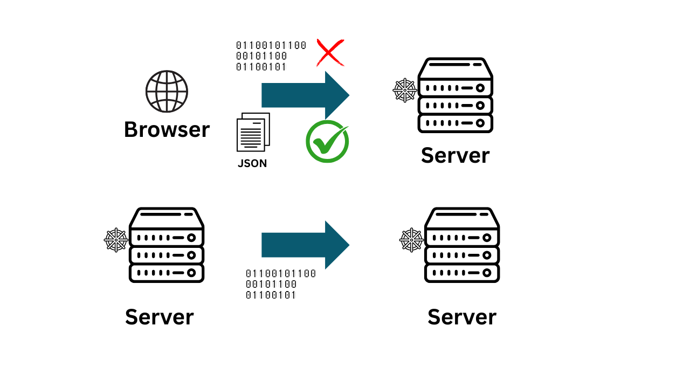

# RPC

Let's understand what is RPC. It stands for remote procedure call which is basically a protocol

What it means is you call a function or some operation that will run remotely from some where else , Simple.

That function req and res can use HTTP,TCP or UDP protocol under the hood.

Google uses binary format to transfer data and made a tool of their own gRPC

Connect rpc on the other hand also supports everything that gRPC supports but you
have the choice to use JSON to transfer data as well can use HTTP/1 for CDN support and so on
Basically Connect rpc brings all the benefits of rpc protocols while keeping the traditional way of data transfer open for more robust
microservice adaption

```plaintext

                 ┌──────────────────────┐
                 │        RPC (Idea)    │
                 │  Remote Procedure    │
                 │  Call = Call a       │
                 │  remote function     │
                 └──────────┬───────────┘
                            │
          ┌─────────────────┼──────────────────┐
          │                 │                  │
 ┌────────▼──────┐   ┌──────▼───────┐   ┌──────▼────────┐
 │   JSON-RPC    │   │    gRPC       │   │  Connect RPC  │
 │ (HTTP/WebSock)│   │ (Google, HTTP/2) │  │ (Buf, HTTP/1+2) │
 └───────────────┘   └──────────────┘   └───────────────┘
          │                 │                  │
          │                 │                  │
          │   Uses JSON     │   Uses Protobuf  │   Uses Protobuf/JSON
          │   Text-based    │   Binary (fast)  │   Flexible & CDN-friendly
          │                 │   Streaming OK   │   Easier debugging
          │                 │                  │   gRPC-compatible


```

# Why *-rpc/web is needed ?



So you can see what is the problem of using rpc's from browser. 

If you send data using rpc it's raw binary. If you do it from browser it exposes trailer of request
Which can lead to spoofing of site or other security threat 

That's why browsers don't allow HTTP/2  to give access to it's trailer to JS making it unusable

But If my backend services are using RPCs for efficient communication is my client(browser) is unable to use it ? 
Actually no *-rpc/web are the solutions. 

# gRPC/web

Let's take gRPC web as an example to understand how it works with browsers 

```
     ┌─────────────┐     HTTP1.1/2 + gRPC-Web     ┌───────────┐
     │   Browser   │─────────────────────────────►│   Proxy   │
     │ (JS Client) │◄─────────────────────────────│ (Envoy/Nginx)   │
     └─────────────┘                              └─────┬─────┘
                                                        │
                                              gRPC/HTTP2│
                                                        │
                                                 ┌──────▼───────┐
                                                 │   Service    │
                                                 │   (Backend)  │
                                                 └──────────────┘
```
To make sure your rpc based backend works with your client you will need to implement a proxy 

which will convert your HTTP/1 request into gRPC compatible HTTP/2

It is ok but that's unnecessary work just to use gRPC. Is there any better option?

Yes, here comes connectrpc 

# Connectrpc 

That proxy work you implemented in gRPC/web is handled by connectrpc meaning they handle the conversion 
you need not to worry.

```
 ┌───────────────────────── Browser (Client) ────────────────────────────┐
 │                                                                       │
 │  JS/TS Client (Connect-Web)                                           │
 │  ──────────────────────────                                           │
 │   • Can use Protobuf (binary, efficient)                              │
 │   • Or JSON (human-readable, debuggable)                              │
 │                                                                       │
 │  Transport:                                                           │
 │   • HTTP/1.1 (CDN-friendly, works everywhere)                         │
 │   • HTTP/2 (streaming, multiplexing)                                  │
 │                                                                       │
 └───────────────────────▲───────────────────────────────────────────────┘
                         │  (No proxy needed, direct request/response)
                         │
                         │  JSON/Protobuf over HTTP1.1/2
                         │
 ┌───────────────────────┴───────────────────────────────────────────────┐
 │                         Backend Service                               │
 │  (Any language: Go, Node, Python, Java, etc. via Connect RPC runtime) │
 │                                                                       │
 │  • Can accept JSON (for browser/debug tools)                          │
 │  • Can accept Protobuf (for efficiency between services)              │
 │  • Compatible with gRPC clients/servers                               │
 │                                                                       │
 └───────────────────────────────────────────────────────────────────────┘
```

# Other benefits of using Connect rpc 

The most useful benefits I found is the protofile. 

A product manager can make profo files depending on the business need 

Then frontend and backend team can use these protofile to generate protobuf 
which can be used in connection with business logic 

So you eliminate postman or swagger. You just need protofile and you are typesafe as well as 
boost the development rather then depending on other teams 

# Conclusion 

Connectrpc provides everythng that gRPC or jsonRPC. On top of that it supports many other advantages and compatible with 
so many languages. It is truely a modern rpc framework. If you want to use rpc in your whole project it's the go to way 


## Support

To speak with us, please leave a message on [our website](https://appscode.com/contact/).

To receive product announcements, follow us on [X](https://x.com/KubeDB).

To watch tutorials of various Production-Grade Kubernetes Tools Subscribe our [YouTube](https://youtube.com/@appscode) channel.

Learn More about [Production-Grade Databases in Kubernetes](https://kubedb.com/)

If you have found a bug with KubeDB or want to request for new features, please [file an issue](https://github.com/kubedb/project/issues/new).
