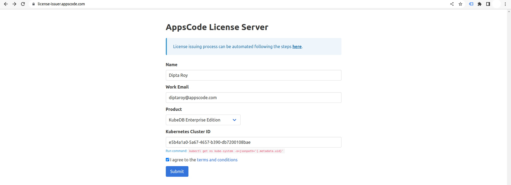

## Overview

KubeDB is the Kubernetes Native Database Management Solution which simplifies and automates routine database tasks such as Provisioning, Monitoring, Upgrading, Patching, Scaling, Volume Expansion, Backup, Recovery, Failure detection, and Repair for various popular databases on private and public clouds. The databases that KubeDB supports are Redis, PostgreSQL, MySQL, MongoDB, MariaDB, Elasticsearch, ProxySQL, Percona XtraDB, Memcached and PgBouncer. You can find the guides to all the supported databases in [KubeDB](https://kubedb.com/).
In this tutorial we will update version of MongoDB Database in Azure Kubernetes Service (AKS) using KubeDB. We will cover the following steps:

1. Install KubeDB
2. Deploy MongoDB Cluster
3. Insert Sample Data
4. Update MongoDB Database Version

### Get Cluster ID

We need the cluster ID to get the KubeDB License.
To get cluster ID we can run the following command:

```bash
$ kubectl get ns kube-system -o jsonpath='{.metadata.uid}'
e5b4a1a0-5a67-4657-b390-db7200108bae
```

### Get License

Go to [Appscode License Server](https://license-issuer.appscode.com/) to get the license.txt file. For this tutorial, we will use KubeDB Enterprise Edition.



### Install KubeDB

We will use helm to install KubeDB. Please install helm [here](https://helm.sh/docs/intro/install/) if it is not already installed.
Now, let's install `KubeDB`.

```bash
$ helm repo add appscode https://charts.appscode.com/stable/
$ helm repo update

$ helm search repo appscode/kubedb
NAME                              	CHART VERSION	APP VERSION	DESCRIPTION
appscode/kubedb                   	v2023.11.2   	v2023.11.2 	KubeDB by AppsCode - Production ready databases...
appscode/kubedb-autoscaler        	v0.22.0      	v0.22.0    	KubeDB Autoscaler by AppsCode - Autoscale KubeD...
appscode/kubedb-catalog           	v2023.11.2   	v2023.11.2 	KubeDB Catalog by AppsCode - Catalog for databa...
appscode/kubedb-community         	v0.24.2      	v0.24.2    	KubeDB Community by AppsCode - Community featur...
appscode/kubedb-crds              	v2023.11.2   	v2023.11.2 	KubeDB Custom Resource Definitions
appscode/kubedb-dashboard         	v0.13.0      	v0.13.0    	KubeDB Dashboard by AppsCode
appscode/kubedb-enterprise        	v0.11.2      	v0.11.2    	KubeDB Enterprise by AppsCode - Enterprise feat...
appscode/kubedb-grafana-dashboards	v2023.11.2   	v2023.11.2 	A Helm chart for kubedb-grafana-dashboards by A...
appscode/kubedb-metrics           	v2023.11.2   	v2023.11.2 	KubeDB State Metrics
appscode/kubedb-one               	v2023.11.2   	v2023.11.2 	KubeDB and Stash by AppsCode - Production ready...
appscode/kubedb-ops-manager       	v0.24.0      	v0.24.0    	KubeDB Ops Manager by AppsCode - Enterprise fea...
appscode/kubedb-opscenter         	v2023.11.2   	v2023.11.2 	KubeDB Opscenter by AppsCode
appscode/kubedb-provisioner       	v0.37.0      	v0.37.0    	KubeDB Provisioner by AppsCode - Community feat...
appscode/kubedb-schema-manager    	v0.13.0      	v0.13.0    	KubeDB Schema Manager by AppsCode
appscode/kubedb-ui                	v2023.10.18  	0.4.6      	A Helm chart for Kubernetes
appscode/kubedb-ui-server         	v2021.12.21  	v2021.12.21	A Helm chart for kubedb-ui-server by AppsCode
appscode/kubedb-webhook-server    	v0.13.0      	v0.13.0    	KubeDB Webhook Server by AppsCode

# Install KubeDB Enterprise operator chart
$ helm install kubedb appscode/kubedb \
  --version v2023.11.2 \
  --namespace kubedb --create-namespace \
  --set kubedb-provisioner.enabled=true \
  --set kubedb-ops-manager.enabled=true \
  --set kubedb-autoscaler.enabled=true \
  --set kubedb-dashboard.enabled=true \
  --set kubedb-schema-manager.enabled=true \
  --set-file global.license=/path/to/the/license.txt
```

Let's verify the installation:

```bash
$ watch kubectl get pods --all-namespaces -l "app.kubernetes.io/instance=kubedb"

NAMESPACE   NAME                                            READY   STATUS    RESTARTS   AGE
kubedb      kubedb-kubedb-autoscaler-857b984554-q8npd       1/1     Running   0          2m40s
kubedb      kubedb-kubedb-dashboard-64469696f6-9ngdm        1/1     Running   0          2m40s
kubedb      kubedb-kubedb-ops-manager-5d5974fd5-tmtzk       1/1     Running   0          2m40s
kubedb      kubedb-kubedb-provisioner-65b79449d4-8mklc      1/1     Running   0          2m40s
kubedb      kubedb-kubedb-schema-manager-5674b5bb8f-cv478   1/1     Running   0          2m40s
kubedb      kubedb-kubedb-webhook-server-67bd9d8fbd-lnx6z   1/1     Running   0          2m40s
```

We can list the CRD Groups that have been registered by the operator by running the following command:

```bash
$ kubectl get crd -l app.kubernetes.io/name=kubedb
NAME                                              CREATED AT
elasticsearchautoscalers.autoscaling.kubedb.com   2023-11-10T09:11:03Z
elasticsearchdashboards.dashboard.kubedb.com      2023-11-10T09:11:50Z
elasticsearches.kubedb.com                        2023-11-10T09:11:19Z
elasticsearchopsrequests.ops.kubedb.com           2023-11-10T09:11:37Z
elasticsearchversions.catalog.kubedb.com          2023-11-10T09:10:11Z
etcds.kubedb.com                                  2023-11-10T09:11:19Z
etcdversions.catalog.kubedb.com                   2023-11-10T09:10:12Z
kafkaopsrequests.ops.kubedb.com                   2023-11-10T09:12:09Z
kafkas.kubedb.com                                 2023-11-10T09:11:21Z
kafkaversions.catalog.kubedb.com                  2023-11-10T09:10:12Z
mariadbautoscalers.autoscaling.kubedb.com         2023-11-10T09:11:03Z
mariadbdatabases.schema.kubedb.com                2023-11-10T09:10:53Z
mariadbopsrequests.ops.kubedb.com                 2023-11-10T09:11:50Z
mariadbs.kubedb.com                               2023-11-10T09:10:53Z
mariadbversions.catalog.kubedb.com                2023-11-10T09:10:12Z
memcacheds.kubedb.com                             2023-11-10T09:11:19Z
memcachedversions.catalog.kubedb.com              2023-11-10T09:10:12Z
mongodbautoscalers.autoscaling.kubedb.com         2023-11-10T09:11:03Z
mongodbdatabases.schema.kubedb.com                2023-11-10T09:10:53Z
mongodbopsrequests.ops.kubedb.com                 2023-11-10T09:11:40Z
mongodbs.kubedb.com                               2023-11-10T09:10:53Z
mongodbversions.catalog.kubedb.com                2023-11-10T09:10:12Z
mysqlautoscalers.autoscaling.kubedb.com           2023-11-10T09:11:03Z
mysqldatabases.schema.kubedb.com                  2023-11-10T09:10:52Z
mysqlopsrequests.ops.kubedb.com                   2023-11-10T09:11:47Z
mysqls.kubedb.com                                 2023-11-10T09:10:52Z
mysqlversions.catalog.kubedb.com                  2023-11-10T09:10:12Z
perconaxtradbautoscalers.autoscaling.kubedb.com   2023-11-10T09:11:03Z
perconaxtradbopsrequests.ops.kubedb.com           2023-11-10T09:12:03Z
perconaxtradbs.kubedb.com                         2023-11-10T09:11:20Z
perconaxtradbversions.catalog.kubedb.com          2023-11-10T09:10:12Z
pgbouncers.kubedb.com                             2023-11-10T09:11:20Z
pgbouncerversions.catalog.kubedb.com              2023-11-10T09:10:12Z
postgresautoscalers.autoscaling.kubedb.com        2023-11-10T09:11:03Z
postgresdatabases.schema.kubedb.com               2023-11-10T09:10:53Z
postgreses.kubedb.com                             2023-11-10T09:10:53Z
postgresopsrequests.ops.kubedb.com                2023-11-10T09:11:56Z
postgresversions.catalog.kubedb.com               2023-11-10T09:10:12Z
proxysqlautoscalers.autoscaling.kubedb.com        2023-11-10T09:11:03Z
proxysqlopsrequests.ops.kubedb.com                2023-11-10T09:12:00Z
proxysqls.kubedb.com                              2023-11-10T09:11:20Z
proxysqlversions.catalog.kubedb.com               2023-11-10T09:10:12Z
publishers.postgres.kubedb.com                    2023-11-10T09:12:12Z
redisautoscalers.autoscaling.kubedb.com           2023-11-10T09:11:03Z
redises.kubedb.com                                2023-11-10T09:11:20Z
redisopsrequests.ops.kubedb.com                   2023-11-10T09:11:53Z
redissentinelautoscalers.autoscaling.kubedb.com   2023-11-10T09:11:03Z
redissentinelopsrequests.ops.kubedb.com           2023-11-10T09:12:06Z
redissentinels.kubedb.com                         2023-11-10T09:11:21Z
redisversions.catalog.kubedb.com                  2023-11-10T09:10:12Z
subscribers.postgres.kubedb.com                   2023-11-10T09:12:15Z
```

## Deploy MongoDB Cluster

Now we are going to deploy MongoDB cluster using KubeDB. First, let’s create a Namespace in which we will deploy the database.

```bash
$ kubectl create namespace demo
namespace/demo created
```

Here is the yaml of the MongoBD we are going to use:

```yaml
apiVersion: kubedb.com/v1alpha2
kind: MongoDB
metadata:
  name: mongodb-cluster
  namespace: demo
spec:
  version: "5.0.2"
  replicas: 3
  replicaSet:
    name: rs
  storage:
    storageClassName: "default"
    accessModes:
      - ReadWriteOnce
    resources:
      requests:
        storage: 1Gi
  terminationPolicy: WipeOut
```

Let's save this yaml configuration into `mongodb-cluster.yaml`
Then create the above MongoDB CRD

```bash
$ kubectl apply -f mongodb-cluster.yaml
mongodb.kubedb.com/mongodb-cluster created
```

In this yaml,

- `spec.version` field specifies the version of MongoDB. Here, we are using MongoDB `version 5.0.2`. You can list the KubeDB supported versions of MongoDB by running `$ kubectl get mongodbversions` command.
- Another field to notice is the `spec.storageType` field. This can be `Durable` or `Ephemeral` depending on the requirements of the database to be persistent or not.
- `spec.terminationPolicy` field is *Wipeout* means that the database will be deleted without restrictions. It can also be "Halt", "Delete" and "DoNotTerminate". Learn More about [Termination Policy](https://kubedb.com/docs/latest/guides/mongodb/concepts/mongodb/#specterminationpolicy).

Once these are handled correctly and the MongoDB object is deployed, you will see that the following are created:

```bash
$ kubectl get all -n demo
NAME                    READY   STATUS    RESTARTS   AGE
pod/mongodb-cluster-0   2/2     Running   0          2m36s
pod/mongodb-cluster-1   2/2     Running   0          92s
pod/mongodb-cluster-2   2/2     Running   0          68s

NAME                           TYPE        CLUSTER-IP     EXTERNAL-IP   PORT(S)     AGE
service/mongodb-cluster        ClusterIP   10.96.38.225   <none>        27017/TCP   2m46s
service/mongodb-cluster-pods   ClusterIP   None           <none>        27017/TCP   2m46s

NAME                               READY   AGE
statefulset.apps/mongodb-cluster   3/3     2m36s

NAME                                                 TYPE                 VERSION   AGE
appbinding.appcatalog.appscode.com/mongodb-cluster   kubedb.com/mongodb   5.0.2     2m29s

NAME                                 VERSION   STATUS   AGE
mongodb.kubedb.com/mongodb-cluster   5.0.2     Ready    2m46s
```

Let’s check if the database is ready to use,

```bash
$ kubectl get mongodb -n demo
NAME              VERSION   STATUS   AGE
mongodb-cluster   5.0.2     Ready    3m3s
```

> We have successfully deployed MongoDB in AKS. Now we can exec into the container to use the database.

### Accessing Database Through CLI

To access the database through CLI, we have to get the credentials to access. KubeDB will create Secret and Service for the database `mongodb-cluster` that we have deployed. Let’s check them using the following commands,

```bash
$ kubectl get secret -n demo -l=app.kubernetes.io/instance=mongodb-cluster
NAME                   TYPE                       DATA   AGE
mongodb-cluster-auth   kubernetes.io/basic-auth   2      3m21s
mongodb-cluster-key    Opaque                     1      3m21s

$ kubectl get service -n demo -l=app.kubernetes.io/instance=mongodb-cluster
NAME                   TYPE        CLUSTER-IP     EXTERNAL-IP   PORT(S)     AGE
mongodb-cluster        ClusterIP   10.96.38.225   <none>        27017/TCP   3m36s
mongodb-cluster-pods   ClusterIP   None           <none>        27017/TCP   3m36s
```
Now, we are going to use `mongodb-cluster-auth` to get the credentials.

```bash
$ kubectl get secrets -n demo mongodb-cluster-auth -o jsonpath='{.data.\username}' | base64 -d
root

$ kubectl get secrets -n demo mongodb-cluster-auth -o jsonpath='{.data.\password}' | base64 -d
oA15BU0Ym4IxCCZA
```


#### Insert Sample Data

In this section, we are going to login into our MongoDB database pod and insert some sample data.

```bash
$ kubectl exec -it mongodb-cluster-0 -n demo bash

Defaulted container "mongodb" out of: mongodb, replication-mode-detector, copy-config (init)
root@mongodb-cluster-0:/# mongo admin -u root -p 'oA15BU0Ym4IxCCZA'
MongoDB shell version v5.0.2
MongoDB server version: 5.0.2

rs:PRIMARY> show dbs
admin          0.000GB
config         0.000GB
kubedb-system  0.000GB
local          0.000GB

rs:PRIMARY> use musicdb
switched to db musicdb

rs:PRIMARY> db.songs.insert({"name":"Annie's Song"});
WriteResult({ "nInserted" : 1 })

rs:PRIMARY> db.songs.find().pretty()
{ "_id" : ObjectId("6553465b91a0560ef8c61d0c"), "name" : "Annie's Song" }
rs:PRIMARY> exit
bye
root@mongodb-cluster-0:/# exit
exit
```

> We’ve successfully inserted some sample data to our database. More information about Production-Grade MongoDB on Kubernetes can be found [MongoDB Kubernetes](https://kubedb.com/kubernetes/databases/run-and-manage-mongodb-on-kubernetes/)

## Update MongoDB Database Version

In this section, we will update our MongoDB version from `5.0.2` to the latest version `6.0.5`. Let's check the current version,

```bash
$ kubectl get mongodb -n demo mongodb-cluster -o=jsonpath='{.spec.version}{"\n"}'
5.0.2
```

### Create MongoDBOpsRequest

In order to update the version of MongoDB cluster, we have to create a `MongoDBOpsRequest` CR with your desired version that is supported by KubeDB. Below is the YAML of the `MongoDBOpsRequest` CR that we are going to create,

```yaml
apiVersion: ops.kubedb.com/v1alpha1
kind: MongoDBOpsRequest
metadata:
  name: update-version
  namespace: demo
spec:
  type: UpdateVersion
  databaseRef:
    name: mongodb-cluster
  updateVersion:
    targetVersion: 6.0.5
```

Let's save this yaml configuration into `update-version.yaml` and apply it,

```bash
$ kubectl apply -f update-version.yaml
mongodbopsrequest.ops.kubedb.com/update-version created
```

In this yaml,

- `spec.databaseRef.name` specifies that we are performing operation on `mongodb-cluster` MongoDB database.
- `spec.type` specifies that we are going to perform `UpdateVersion` on our database.
- `spec.updateVersion.targetVersion` specifies the expected version of the database `6.0.5`.

### Verify the Updated MongoDB Version

`KubeDB` Enterprise operator will update the image of MongoDB object and related `StatefulSets` and `Pods`.
Let’s wait for `MongoDBOpsRequest` to be Successful. Run the following command to check `MongoDBOpsRequest` CR,

```bash
$ kubectl get mongodbopsrequest -n demo
NAME             TYPE            STATUS       AGE
update-version   UpdateVersion   Successful   3m42s
```

We can see from the above output that the `MongoDBOpsRequest` has succeeded.
Now, we are going to verify whether the MongoDB and the related `StatefulSets` their `Pods` have the new version image. Let’s verify it by following command,

```bash
$ kubectl get mongodb -n demo mongodb-cluster -o=jsonpath='{.spec.version}{"\n"}'
6.0.5
```

> You can see from above, our MongoDB database has been updated with the new version `6.0.5`. So, the database update process is successfully completed.

If you want to learn more about Production-Grade MongoDB on Kubernetes you can have a look into that playlist below:

<iframe width="560" height="315" src="https://www.youtube.com/embed/videoseries?si=TU2WYp8OcgemIcB-&amp;list=PLoiT1Gv2KR1jZmdzRaQW28eX4zR9lvUqf" title="YouTube video player" frameborder="0" allow="accelerometer; autoplay; clipboard-write; encrypted-media; gyroscope; picture-in-picture; web-share" allowfullscreen></iframe>

## Support

To speak with us, please leave a message on [our website](https://appscode.com/contact/).

To receive product announcements, follow us on [Twitter/X](https://twitter.com/KubeDB).

To watch tutorials of various Production-Grade Kubernetes Tools Subscribe our [YouTube](https://www.youtube.com/c/AppsCodeInc/) channel.

More about [MongoDB in Kubernetes](https://kubedb.com/kubernetes/databases/run-and-manage-mongodb-on-kubernetes/)

If you have found a bug with KubeDB or want to request for new features, please [file an issue](https://github.com/kubedb/project/issues/new).
