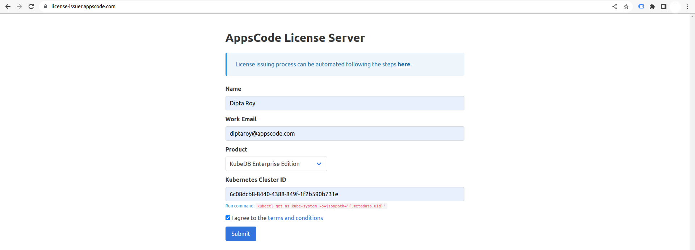

## Overview

KubeDB is the Kubernetes Native Database Management Solution which simplifies and automates routine database tasks such as Provisioning, Monitoring, Upgrading, Patching, Scaling, Volume Expansion, Backup, Recovery, Failure detection, and Repair for various popular databases on private and public clouds. The databases that KubeDB supports are Redis, PostgreSQL, MySQL, MongoDB, MariaDB, Elasticsearch, ProxySQL, Percona XtraDB, Memcached and PgBouncer. You can find the guides to all the supported databases in [KubeDB](https://kubedb.com/).
In this tutorial we will update version of PostgreSQL Database in Amazon Elastic Kubernetes Service (Amazon EKS). We will cover the following steps:

1) Install KubeDB
2) Deploy PostgreSQL Cluster
3) Insert Sample Data
4) Update PostgreSQL Database Version


### Get Cluster ID

We need the cluster ID to get the KubeDB License.
To get cluster ID we can run the following command:

```bash
$ kubectl get ns kube-system -o jsonpath='{.metadata.uid}'
6c08dcb8-8440-4388-849f-1f2b590b731e
```

### Get License

Go to [Appscode License Server](https://license-issuer.appscode.com/) to get the license.txt file. For this tutorial, we will use KubeDB Enterprise Edition.



### Install KubeDB

We will use helm to install KubeDB. Please install helm [here](https://helm.sh/docs/intro/install/) if it is not already installed.
Now, let's install `KubeDB`.

```bash
$ helm repo add appscode https://charts.appscode.com/stable/
$ helm repo update

$ helm search repo appscode/kubedb
NAME                              	CHART VERSION	APP VERSION	DESCRIPTION                                       
appscode/kubedb                   	v2023.08.18  	v2023.08.18	KubeDB by AppsCode - Production ready databases...
appscode/kubedb-autoscaler        	v0.20.0      	v0.20.1    	KubeDB Autoscaler by AppsCode - Autoscale KubeD...
appscode/kubedb-catalog           	v2023.08.18  	v2023.08.18	KubeDB Catalog by AppsCode - Catalog for databa...
appscode/kubedb-community         	v0.24.2      	v0.24.2    	KubeDB Community by AppsCode - Community featur...
appscode/kubedb-crds              	v2023.08.18  	v2023.08.18	KubeDB Custom Resource Definitions                
appscode/kubedb-dashboard         	v0.11.0      	v0.11.0    	KubeDB Dashboard by AppsCode                      
appscode/kubedb-enterprise        	v0.11.2      	v0.11.2    	KubeDB Enterprise by AppsCode - Enterprise feat...
appscode/kubedb-grafana-dashboards	v2023.08.18  	v2023.08.18	A Helm chart for kubedb-grafana-dashboards by A...
appscode/kubedb-metrics           	v2023.08.18  	v2023.08.18	KubeDB State Metrics                              
appscode/kubedb-one               	v2023.08.18  	v2023.08.18	KubeDB and Stash by AppsCode - Production ready...
appscode/kubedb-ops-manager       	v0.22.0      	v0.22.8    	KubeDB Ops Manager by AppsCode - Enterprise fea...
appscode/kubedb-opscenter         	v2023.08.18  	v2023.08.18	KubeDB Opscenter by AppsCode                      
appscode/kubedb-provisioner       	v0.35.0      	v0.35.6    	KubeDB Provisioner by AppsCode - Community feat...
appscode/kubedb-schema-manager    	v0.11.0      	v0.11.0    	KubeDB Schema Manager by AppsCode                 
appscode/kubedb-ui                	v2023.03.23  	0.4.3      	A Helm chart for Kubernetes                       
appscode/kubedb-ui-server         	v2021.12.21  	v2021.12.21	A Helm chart for kubedb-ui-server by AppsCode     
appscode/kubedb-webhook-server    	v0.11.0      	v0.11.1    	KubeDB Webhook Server by AppsCode   

# Install KubeDB Enterprise operator chart
$ helm install kubedb appscode/kubedb \
  --version v2023.08.18 \
  --namespace kubedb --create-namespace \
  --set kubedb-provisioner.enabled=true \
  --set kubedb-ops-manager.enabled=true \
  --set kubedb-autoscaler.enabled=true \
  --set kubedb-dashboard.enabled=true \
  --set kubedb-schema-manager.enabled=true \
  --set-file global.license=/path/to/the/license.txt
```

Let's verify the installation:

```bash
$ watch kubectl get pods --all-namespaces -l "app.kubernetes.io/instance=kubedb"

NAMESPACE   NAME                                            READY   STATUS    RESTARTS     AGE
kubedb      kubedb-kubedb-autoscaler-6d45d7d4df-cchnj       1/1     Running   0            84s
kubedb      kubedb-kubedb-dashboard-74879c5f86-rbrln        1/1     Running   0            84s
kubedb      kubedb-kubedb-ops-manager-c7cc578c5-l9jds       1/1     Running   0            84s
kubedb      kubedb-kubedb-provisioner-5ffc8fdb9f-7cglg      1/1     Running   0            84s
kubedb      kubedb-kubedb-schema-manager-68f845bbb6-4jwnf   1/1     Running   0            84s
kubedb      kubedb-kubedb-webhook-server-6fdd5b4857-v8tn5   1/1     Running   0            83s
```

We can list the CRD Groups that have been registered by the operator by running the following command:

```bash
$ kubectl get crd -l app.kubernetes.io/name=kubedb
NAME                                              CREATED AT
elasticsearchautoscalers.autoscaling.kubedb.com   2023-09-29T04:44:17Z
elasticsearchdashboards.dashboard.kubedb.com      2023-09-29T04:44:18Z
elasticsearches.kubedb.com                        2023-09-29T04:44:19Z
elasticsearchopsrequests.ops.kubedb.com           2023-09-29T04:44:25Z
elasticsearchversions.catalog.kubedb.com          2023-09-29T04:41:41Z
etcds.kubedb.com                                  2023-09-29T04:44:25Z
etcdversions.catalog.kubedb.com                   2023-09-29T04:41:41Z
kafkas.kubedb.com                                 2023-09-29T04:44:52Z
kafkaversions.catalog.kubedb.com                  2023-09-29T04:41:42Z
mariadbautoscalers.autoscaling.kubedb.com         2023-09-29T04:44:18Z
mariadbdatabases.schema.kubedb.com                2023-09-29T04:44:26Z
mariadbopsrequests.ops.kubedb.com                 2023-09-29T04:45:01Z
mariadbs.kubedb.com                               2023-09-29T04:44:26Z
mariadbversions.catalog.kubedb.com                2023-09-29T04:41:42Z
memcacheds.kubedb.com                             2023-09-29T04:44:26Z
memcachedversions.catalog.kubedb.com              2023-09-29T04:41:42Z
mongodbautoscalers.autoscaling.kubedb.com         2023-09-29T04:44:18Z
mongodbdatabases.schema.kubedb.com                2023-09-29T04:44:20Z
mongodbopsrequests.ops.kubedb.com                 2023-09-29T04:44:29Z
mongodbs.kubedb.com                               2023-09-29T04:44:21Z
mongodbversions.catalog.kubedb.com                2023-09-29T04:41:42Z
mysqlautoscalers.autoscaling.kubedb.com           2023-09-29T04:44:19Z
mysqldatabases.schema.kubedb.com                  2023-09-29T04:44:17Z
mysqlopsrequests.ops.kubedb.com                   2023-09-29T04:44:58Z
mysqls.kubedb.com                                 2023-09-29T04:44:18Z
mysqlversions.catalog.kubedb.com                  2023-09-29T04:41:43Z
perconaxtradbautoscalers.autoscaling.kubedb.com   2023-09-29T04:44:19Z
perconaxtradbopsrequests.ops.kubedb.com           2023-09-29T04:45:15Z
perconaxtradbs.kubedb.com                         2023-09-29T04:44:46Z
perconaxtradbversions.catalog.kubedb.com          2023-09-29T04:41:43Z
pgbouncers.kubedb.com                             2023-09-29T04:44:47Z
pgbouncerversions.catalog.kubedb.com              2023-09-29T04:41:44Z
postgresautoscalers.autoscaling.kubedb.com        2023-09-29T04:44:19Z
postgresdatabases.schema.kubedb.com               2023-09-29T04:44:24Z
postgreses.kubedb.com                             2023-09-29T04:44:25Z
postgresopsrequests.ops.kubedb.com                2023-09-29T04:45:09Z
postgresversions.catalog.kubedb.com               2023-09-29T04:41:44Z
proxysqlautoscalers.autoscaling.kubedb.com        2023-09-29T04:44:20Z
proxysqlopsrequests.ops.kubedb.com                2023-09-29T04:45:12Z
proxysqls.kubedb.com                              2023-09-29T04:44:50Z
proxysqlversions.catalog.kubedb.com               2023-09-29T04:41:44Z
publishers.postgres.kubedb.com                    2023-09-29T04:45:26Z
redisautoscalers.autoscaling.kubedb.com           2023-09-29T04:44:21Z
redises.kubedb.com                                2023-09-29T04:44:50Z
redisopsrequests.ops.kubedb.com                   2023-09-29T04:45:05Z
redissentinelautoscalers.autoscaling.kubedb.com   2023-09-29T04:44:21Z
redissentinelopsrequests.ops.kubedb.com           2023-09-29T04:45:19Z
redissentinels.kubedb.com                         2023-09-29T04:44:51Z
redisversions.catalog.kubedb.com                  2023-09-29T04:41:45Z
subscribers.postgres.kubedb.com                   2023-09-29T04:45:29Z
```

## Deploy PostgreSQL Cluster

Now we are going to deploy PostgreSQL cluster using KubeDB. First, let’s create a Namespace in which we will deploy the database.

```bash
$ kubectl create namespace demo
namespace/demo created
```

Here is the yaml of the PostgreSQL we are going to use:

```yaml
apiVersion: kubedb.com/v1alpha2
kind: Postgres
metadata:
  name: postgres-cluster
  namespace: demo
spec:
  version: "11.11"
  replicas: 3
  standbyMode: Hot
  storageType: Durable
  storage:
    storageClassName: "gp2"
    accessModes:
      - ReadWriteOnce
    resources:
      requests:
        storage: 1Gi
  terminationPolicy: WipeOut
```

Let's save this yaml configuration into `postgres-cluster.yaml` 
Then create the above PostgreSQL CRD

```bash
$ kubectl create -f postgres-cluster.yaml
postgres.kubedb.com/postgres-cluster created
```

In this yaml,
* `spec.version` field specifies the version of PostgreSQL. Here, we are using PostgreSQL `version 11.11`. You can list the KubeDB supported versions of PostgreSQL by running `$ kubectl get postgresversions` command.
* `spec.standby` is an optional field that specifies the standby mode `hot` or `warm` to use for standby replicas. In `hot` standby mode, standby replicas can accept connection and run read-only queries. In `warm` standby mode, standby replicas can’t accept connection and only used for replication purpose.
* Another field to notice is the `spec.storageType` field. This can be `Durable` or `Ephemeral` depending on the requirements of the database to be persistent or not.
* `spec.terminationPolicy` field is *Wipeout* means that the database will be deleted without restrictions. It can also be "Halt", "Delete" and "DoNotTerminate". Learn More about [Termination Policy](https://kubedb.com/docs/latest/guides/postgres/concepts/postgres/#specterminationpolicy).

Once these are handled correctly and the PostgreSQL object is deployed, you will see that the following are created:

```bash
$ kubectl get all -n demo
NAME                     READY   STATUS    RESTARTS   AGE
pod/postgres-cluster-0   2/2     Running   0          2m25s
pod/postgres-cluster-1   2/2     Running   0          2m4s
pod/postgres-cluster-2   2/2     Running   0          61s

NAME                               TYPE        CLUSTER-IP       EXTERNAL-IP   PORT(S)                      AGE
service/postgres-cluster           ClusterIP   10.100.248.168   <none>        5432/TCP,2379/TCP            2m30s
service/postgres-cluster-pods      ClusterIP   None             <none>        5432/TCP,2380/TCP,2379/TCP   2m30s
service/postgres-cluster-standby   ClusterIP   10.100.106.115   <none>        5432/TCP                     2m30s

NAME                                READY   AGE
statefulset.apps/postgres-cluster   3/3     3m32s

NAME                                                  TYPE                  VERSION   AGE
appbinding.appcatalog.appscode.com/postgres-cluster   kubedb.com/postgres   11.11      2m36s

NAME                                   VERSION   STATUS   AGE
postgres.kubedb.com/postgres-cluster   11.11      Ready    2m59s
```
Let’s check if the database is ready to use,

```bash
$ kubectl get pg -n demo postgres-cluster
NAME               VERSION   STATUS   AGE
postgres-cluster   11.11      Ready    4m
```
> We have successfully deployed PostgreSQL in AWS. Now we can exec into the container to use the database.

### Accessing Database Through CLI

To access the database through CLI, we have to get the credentials to access. KubeDB will create Secret and Service for the database `postgres-cluster` that we have deployed. Let’s check them using the following commands,

```bash
$ kubectl get secret -n demo -l=app.kubernetes.io/instance=postgres-cluster
NAME                    TYPE                       DATA   AGE
postgres-cluster-auth   kubernetes.io/basic-auth   2      4m34s

$ kubectl get service -n demo -l=app.kubernetes.io/instance=postgres-cluster
NAME                       TYPE        CLUSTER-IP       EXTERNAL-IP   PORT(S)                      AGE
postgres-cluster           ClusterIP   10.100.248.168   <none>        5432/TCP,2379/TCP            4m57s
postgres-cluster-pods      ClusterIP   None             <none>        5432/TCP,2380/TCP,2379/TCP   4m57s
postgres-cluster-standby   ClusterIP   10.100.106.115   <none>        5432/TCP                     4m57s
```
Now, we are going to use `postgres-cluster-auth` to get the credentials.

```bash
$ kubectl get secrets -n demo postgres-cluster-auth -o jsonpath='{.data.username}' | base64 -d
postgres

$ kubectl get secrets -n demo postgres-cluster-auth -o jsonpath='{.data.password}' | base64 -d
zeLSv;mqqlgr1jOD
```

#### Insert Sample Data

In this section, we are going to login into our PostgreSQL pod and insert some sample data.

```bash
$ kubectl exec -it postgres-cluster-0 -n demo -c postgres -- bash
postgres-cluster-0:/$ psql -d "user=postgres password=zeLSv;mqqlgr1jOD"
psql (11.11)
Type "help" for help.

postgres=# \l
                                                  List of databases
     Name      |  Owner   | Encoding |  Collate   |   Ctype    | ICU Locale | Locale Provider |   Access privileges   
---------------+----------+----------+------------+------------+------------+-----------------+-----------------------
 kubedb_system | postgres | UTF8     | en_US.utf8 | en_US.utf8 |            | libc            | 
 postgres      | postgres | UTF8     | en_US.utf8 | en_US.utf8 |            | libc            | 
 template0     | postgres | UTF8     | en_US.utf8 | en_US.utf8 |            | libc            | =c/postgres          +
               |          |          |            |            |            |                 | postgres=CTc/postgres
 template1     | postgres | UTF8     | en_US.utf8 | en_US.utf8 |            | libc            | =c/postgres          +
               |          |          |            |            |            |                 | postgres=CTc/postgres
(4 rows)

postgres=# CREATE DATABASE music;
CREATE DATABASE

postgres=# \l
                                                  List of databases
     Name      |  Owner   | Encoding |  Collate   |   Ctype    | ICU Locale | Locale Provider |   Access privileges   
---------------+----------+----------+------------+------------+------------+-----------------+-----------------------
 kubedb_system | postgres | UTF8     | en_US.utf8 | en_US.utf8 |            | libc            | 
 music         | postgres | UTF8     | en_US.utf8 | en_US.utf8 |            | libc            | 
 postgres      | postgres | UTF8     | en_US.utf8 | en_US.utf8 |            | libc            | 
 template0     | postgres | UTF8     | en_US.utf8 | en_US.utf8 |            | libc            | =c/postgres          +
               |          |          |            |            |            |                 | postgres=CTc/postgres
 template1     | postgres | UTF8     | en_US.utf8 | en_US.utf8 |            | libc            | =c/postgres          +
               |          |          |            |            |            |                 | postgres=CTc/postgres
(5 rows)

postgres=# \c music
You are now connected to database "music" as user "postgres".

music=# CREATE TABLE artist (name VARCHAR(50) NOT NULL, song VARCHAR(50) NOT NULL);
CREATE TABLE

music=# INSERT INTO artist (name, song) VALUES('John Denver', 'Country Roads');
INSERT 0 1

music=# SELECT * FROM artist;
    name      |     song      
--------------+----------------
  John Denver |  Country Roads
(1 row)

music=# \q

postgres-cluster-0:/$ exit
exit
```

> We’ve successfully inserted some sample data to our database. More information about Run & Manage PostgreSQL on Kubernetes can be found in [PostgreSQL Kubernetes](https://kubedb.com/kubernetes/databases/run-and-manage-postgres-on-kubernetes/)

## Update PostgreSQL Database Version

In this section, we will update our PostgreSQL version from `11.11` to the latest version `15.1`. Let's check the current version,

```bash
$ kubectl get postgres -n demo postgres-cluster -o=jsonpath='{.spec.version}{"\n"}'
11.11
```

### Create PostgresOpsRequest

In order to update the version of PostgreSQL cluster, we have to create a `PostgresOpsRequest` CR with your desired version that is supported by KubeDB. Below is the YAML of the `PostgresOpsRequest` CR that we are going to create,

```yaml
apiVersion: ops.kubedb.com/v1alpha1
kind: PostgresOpsRequest
metadata:
  name: update-version
  namespace: demo
spec:
  type: UpdateVersion
  updateVersion:
    targetVersion: "15.1"
  databaseRef:
    name: postgres-cluster
```

Let's save this yaml configuration into `update-version.yaml` and apply it,

```bash
$ kubectl apply -f update-version.yaml
postgresopsrequest.ops.kubedb.com/update-version created
```

In this yaml,
* `spec.databaseRef.name` specifies that we are performing operation on `postgres-cluster` PostgreSQL database.
* `spec.type` specifies that we are going to perform `UpdateVersion` on our database.
* `spec.updateVersion.targetVersion` specifies the expected version of the database `15.1`.

### Verify the Updated PostgreSQL Version

`KubeDB` Enterprise operator will update the image of PostgreSQL object and related `StatefulSets` and `Pods`.
Let’s wait for `PostgresOpsRequest` to be Successful. Run the following command to check `PostgresOpsRequest` CR,

```bash
$ kubectl get postgresopsrequest -n demo
NAME             TYPE            STATUS       AGE
update-version   UpdateVersion   Successful   2m48s
```

We can see from the above output that the `PostgresOpsRequest` has succeeded.
Now, we are going to verify whether the PostgreSQL and the related `StatefulSets` their `Pods` have the new version image. Let’s verify it by following command,

```bash
$ kubectl get postgres -n demo postgres-cluster -o=jsonpath='{.spec.version}{"\n"}'
15.1
```

> You can see from above, our PostgreSQL database has been updated with the new version `15.1`. So, the database update process is successfully completed.


If you want to learn more about Production-Grade PostgreSQL you can have a look into that playlist below:

<iframe width="560" height="315" src="https://www.youtube.com/embed/videoseries?list=PLoiT1Gv2KR1imqnrYFhUNTLHdBNFXPKr_" title="YouTube video player" frameborder="0" allow="accelerometer; autoplay; clipboard-write; encrypted-media; gyroscope; picture-in-picture; web-share" allowfullscreen></iframe>


## Support

To speak with us, please leave a message on [our website](https://appscode.com/contact/).

To receive product announcements, follow us on [Twitter](https://twitter.com/KubeDB).

To watch tutorials of various Production-Grade Kubernetes Tools Subscribe our [YouTube](https://www.youtube.com/c/AppsCodeInc/) channel.

More about [PostgreSQL in Kubernetes](https://kubedb.com/kubernetes/databases/run-and-manage-postgres-on-kubernetes/)

If you have found a bug with KubeDB or want to request for new features, please [file an issue](https://github.com/kubedb/project/issues/new).