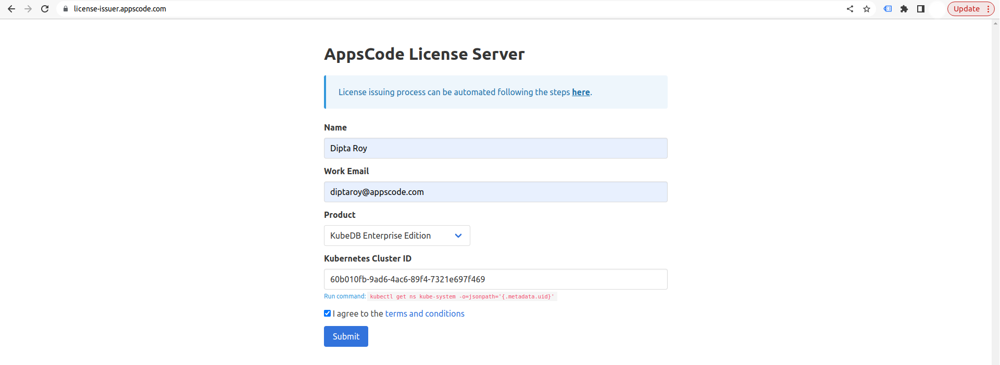

## Overview

KubeDB is the Kubernetes Native Database Management Solution which simplifies and automates routine database tasks such as Provisioning, Monitoring, Upgrading, Patching, Scaling, Volume Expansion, Backup, Recovery, Failure detection, and Repair for various popular databases on private and public clouds. The databases that KubeDB supports are PostgreSQL, MySQL, MongoDB, MariaDB, Elasticsearch, Redis, ProxySQL, Percona XtraDB, Memcached and PgBouncer. You can find the guides to all the supported databases in [KubeDB](https://kubedb.com/).
In this tutorial we will be upgrading PostgreSQL Standalone to a High Availability Cluster in Amazon Elastic Kubernetes Service (Amazon EKS). We will cover the following steps:

1) Install KubeDB
2) Deploy PostgreSQL Standalone
3) Read/Write Sample Data
4) Horizontal Scaling of PostgreSQL Standalone


### Get Cluster ID

We need the cluster ID to get the KubeDB License.
To get cluster ID we can run the following command:

```bash
$ kubectl get ns kube-system -o jsonpath='{.metadata.uid}'
60b010fb-9ad6-4ac6-89f4-7321e697f469
```

### Get License

Go to [Appscode License Server](https://license-issuer.appscode.com/) to get the license.txt file. For this tutorial we will use KubeDB Enterprise Edition.



### Install KubeDB

We will use helm to install KubeDB. Please install helm [here](https://helm.sh/docs/intro/install/) if it is not already installed.
Now, let's install `KubeDB`.

```bash
$ helm repo add appscode https://charts.appscode.com/stable/
$ helm repo update

$ helm search repo appscode/kubedb
NAME                              	CHART VERSION	APP VERSION	DESCRIPTION                                       
appscode/kubedb                   	v2023.02.28  	v2023.02.28	KubeDB by AppsCode - Production ready databases...
appscode/kubedb-autoscaler        	v0.17.0      	v0.17.0    	KubeDB Autoscaler by AppsCode - Autoscale KubeD...
appscode/kubedb-catalog           	v2023.02.28  	v2023.02.28	KubeDB Catalog by AppsCode - Catalog for databa...
appscode/kubedb-community         	v0.24.2      	v0.24.2    	KubeDB Community by AppsCode - Community featur...
appscode/kubedb-crds              	v2023.02.28  	v2023.02.28	KubeDB Custom Resource Definitions                
appscode/kubedb-dashboard         	v0.8.0       	v0.8.0     	KubeDB Dashboard by AppsCode                      
appscode/kubedb-enterprise        	v0.11.2      	v0.11.2    	KubeDB Enterprise by AppsCode - Enterprise feat...
appscode/kubedb-grafana-dashboards	v2023.02.28  	v2023.02.28	A Helm chart for kubedb-grafana-dashboards by A...
appscode/kubedb-metrics           	v2023.02.28  	v2023.02.28	KubeDB State Metrics                              
appscode/kubedb-ops-manager       	v0.19.0      	v0.19.2    	KubeDB Ops Manager by AppsCode - Enterprise fea...
appscode/kubedb-opscenter         	v2023.02.28  	v2023.02.28	KubeDB Opscenter by AppsCode                      
appscode/kubedb-provisioner       	v0.32.0      	v0.32.1    	KubeDB Provisioner by AppsCode - Community feat...
appscode/kubedb-schema-manager    	v0.8.0       	v0.8.0     	KubeDB Schema Manager by AppsCode                 
appscode/kubedb-ui                	v2022.06.14  	0.3.26     	A Helm chart for Kubernetes                       
appscode/kubedb-ui-server         	v2021.12.21  	v2021.12.21	A Helm chart for kubedb-ui-server by AppsCode     
appscode/kubedb-webhook-server    	v0.8.0       	v0.8.0     	KubeDB Webhook Server by AppsCode   

# Install KubeDB Enterprise operator chart
$ helm install kubedb appscode/kubedb \
  --version v2023.02.28 \
  --namespace kubedb --create-namespace \
  --set kubedb-provisioner.enabled=true \
  --set kubedb-ops-manager.enabled=true \
  --set kubedb-autoscaler.enabled=true \
  --set kubedb-dashboard.enabled=true \
  --set kubedb-schema-manager.enabled=true \
  --set-file global.license=/path/to/the/license.txt
```

Let's verify the installation:

```bash
$ kubectl get pods --all-namespaces -l "app.kubernetes.io/instance=kubedb"
NAMESPACE   NAME                                            READY   STATUS    RESTARTS      AGE
kubedb      kubedb-kubedb-autoscaler-59645757f8-q7kbl       1/1     Running   0             4m7s
kubedb      kubedb-kubedb-dashboard-86b798dc88-ss66q        1/1     Running   0             4m7s
kubedb      kubedb-kubedb-ops-manager-6f686d6ccc-94rv2      1/1     Running   0             4m7s
kubedb      kubedb-kubedb-provisioner-75cc768444-hs8vn      1/1     Running   0             4m7s
kubedb      kubedb-kubedb-schema-manager-87b855b48-ndt68    1/1     Running   0             4m7s
kubedb      kubedb-kubedb-webhook-server-855c6cb7c5-g7hmx   1/1     Running   0             4m7s
```

We can list the CRD Groups that have been registered by the operator by running the following command:

```bash
$ kubectl get crd -l app.kubernetes.io/name=kubedb
NAME                                              CREATED AT
elasticsearchautoscalers.autoscaling.kubedb.com   2023-03-16T05:09:19Z
elasticsearchdashboards.dashboard.kubedb.com      2023-03-16T05:09:14Z
elasticsearches.kubedb.com                        2023-03-16T05:09:14Z
elasticsearchopsrequests.ops.kubedb.com           2023-03-16T05:10:06Z
elasticsearchversions.catalog.kubedb.com          2023-03-16T05:06:17Z
etcds.kubedb.com                                  2023-03-16T05:09:24Z
etcdversions.catalog.kubedb.com                   2023-03-16T05:06:18Z
kafkas.kubedb.com                                 2023-03-16T05:10:03Z
kafkaversions.catalog.kubedb.com                  2023-03-16T05:06:18Z
mariadbautoscalers.autoscaling.kubedb.com         2023-03-16T05:09:19Z
mariadbdatabases.schema.kubedb.com                2023-03-16T05:09:24Z
mariadbopsrequests.ops.kubedb.com                 2023-03-16T05:10:34Z
mariadbs.kubedb.com                               2023-03-16T05:09:24Z
mariadbversions.catalog.kubedb.com                2023-03-16T05:06:19Z
memcacheds.kubedb.com                             2023-03-16T05:09:32Z
memcachedversions.catalog.kubedb.com              2023-03-16T05:06:19Z
mongodbautoscalers.autoscaling.kubedb.com         2023-03-16T05:09:19Z
mongodbdatabases.schema.kubedb.com                2023-03-16T05:09:17Z
mongodbopsrequests.ops.kubedb.com                 2023-03-16T05:10:10Z
mongodbs.kubedb.com                               2023-03-16T05:09:19Z
mongodbversions.catalog.kubedb.com                2023-03-16T05:06:20Z
mysqlautoscalers.autoscaling.kubedb.com           2023-03-16T05:09:20Z
mysqldatabases.schema.kubedb.com                  2023-03-16T05:09:15Z
mysqlopsrequests.ops.kubedb.com                   2023-03-16T05:10:30Z
mysqls.kubedb.com                                 2023-03-16T05:09:16Z
mysqlversions.catalog.kubedb.com                  2023-03-16T05:06:21Z
perconaxtradbautoscalers.autoscaling.kubedb.com   2023-03-16T05:09:20Z
perconaxtradbopsrequests.ops.kubedb.com           2023-03-16T05:12:01Z
perconaxtradbs.kubedb.com                         2023-03-16T05:09:54Z
perconaxtradbversions.catalog.kubedb.com          2023-03-16T05:06:21Z
pgbouncers.kubedb.com                             2023-03-16T05:09:54Z
pgbouncerversions.catalog.kubedb.com              2023-03-16T05:06:22Z
postgresautoscalers.autoscaling.kubedb.com        2023-03-16T05:09:20Z
postgresdatabases.schema.kubedb.com               2023-03-16T05:09:21Z
postgreses.kubedb.com                             2023-03-16T05:09:23Z
postgresopsrequests.ops.kubedb.com                2023-03-16T05:10:52Z
postgresversions.catalog.kubedb.com               2023-03-16T05:06:22Z
proxysqlautoscalers.autoscaling.kubedb.com        2023-03-16T05:09:21Z
proxysqlopsrequests.ops.kubedb.com                2023-03-16T05:10:57Z
proxysqls.kubedb.com                              2023-03-16T05:10:01Z
proxysqlversions.catalog.kubedb.com               2023-03-16T05:06:22Z
publishers.postgres.kubedb.com                    2023-03-16T05:12:12Z
redisautoscalers.autoscaling.kubedb.com           2023-03-16T05:09:22Z
redises.kubedb.com                                2023-03-16T05:10:02Z
redisopsrequests.ops.kubedb.com                   2023-03-16T05:10:46Z
redissentinelautoscalers.autoscaling.kubedb.com   2023-03-16T05:09:22Z
redissentinelopsrequests.ops.kubedb.com           2023-03-16T05:12:05Z
redissentinels.kubedb.com                         2023-03-16T05:10:02Z
redisversions.catalog.kubedb.com                  2023-03-16T05:06:23Z
subscribers.postgres.kubedb.com                   2023-03-16T05:12:21Z
```

## Deploy PostgreSQL Standalone

Now, we are going to Deploy PostgreSQL using KubeDB.
First, let's create a Namespace in which we will deploy the database.

```bash
$ kubectl create namespace demo
namespace/demo created
```

Here is the yaml of the PostgreSQL CRO we are going to use:

```yaml
apiVersion: kubedb.com/v1alpha2
kind: Postgres
metadata:
  name: postgres
  namespace: demo
spec:
  version: "13.2"
  replicas: 1
  storageType: Durable
  storage:
    storageClassName: "gp2"
    accessModes:
    - ReadWriteOnce
    resources:
      requests:
        storage: 512Mi     
  terminationPolicy: WipeOut
```

Let's save this yaml configuration into `postgres.yaml` 
Then create the above PostgreSQL CRO

```bash
$ kubectl apply -f postgres.yaml
postgres.kubedb.com/postgres created
```
In this yaml,

* we can see in the `spec.version` field specifies the version of PostgreSQL. Here, we are using PostgreSQL `version 13.2`. You can list the KubeDB supported versions of PostgreSQL by running `$ kubectl get postgresversions` command.
* `spec.storage` specifies PVC spec that will be dynamically allocated to store data for this database. This storage spec will be passed to the StatefulSet created by KubeDB operator to run database pods. You can specify any `storageclass` available in your cluster with appropriate resource requests. You can get all the available `storageclass` in your cluster by running `$ kubectl get storageclass` command.
* And the `spec.terminationPolicy` field is *Wipeout* means that the database will be deleted without restrictions. It can also be "Halt", "Delete" and "DoNotTerminate". Learn More about these [HERE](https://kubedb.com/docs/latest/guides/postgres/concepts/postgres/#specterminationpolicy).

Once these are handled correctly and the PostgreSQL object is deployed, you will see that the following objects are created:

```bash
$ kubectl get all -n demo
NAME             READY   STATUS    RESTARTS   AGE
pod/postgres-0   1/1     Running   0          61s

NAME                    TYPE        CLUSTER-IP   EXTERNAL-IP   PORT(S)                      AGE
service/postgres        ClusterIP   10.8.5.12    <none>        5432/TCP,2379/TCP            64s
service/postgres-pods   ClusterIP   None         <none>        5432/TCP,2380/TCP,2379/TCP   65s

NAME                        READY   AGE
statefulset.apps/postgres   1/1     67s

NAME                                          TYPE                  VERSION   AGE
appbinding.appcatalog.appscode.com/postgres   kubedb.com/postgres   13.2      72s

NAME                           VERSION   STATUS   AGE
postgres.kubedb.com/postgres   13.2      Ready    97s
```
Check the `PVC` in the `demo` namespace,

```bash
$ kubectl get pvc -n demo
NAME              STATUS   VOLUME                                     CAPACITY   ACCESS MODES   STORAGECLASS   AGE
data-postgres-0   Bound    pvc-61bbfd87-2fc8-44fa-abd8-a10930b7eb4d   1Gi        RWO            standard       2m
```

Let’s check if the database is ready to use,

```bash
$ kubectl get postgres -n demo postgres
NAME       VERSION   STATUS   AGE
postgres   13.2      Ready    2m
```
> We have successfully deployed PostgreSQL in EKS. Now we can exec into the container to use the database.

### Accessing Database Through CLI

To access the database through CLI, we have to get the credentials to access.
KubeDB will create Secret and Service for the database `postgres` that we have deployed. Let’s check them using the following commands,

```bash
$ kubectl get secret -n demo -l=app.kubernetes.io/instance=postgres
NAME            TYPE                       DATA   AGE
postgres-auth   kubernetes.io/basic-auth   2      4m

$ kubectl get service -n demo -l=app.kubernetes.io/instance=postgres
NAME            TYPE        CLUSTER-IP   EXTERNAL-IP   PORT(S)                      AGE
postgres        ClusterIP   10.8.5.12    <none>        5432/TCP,2379/TCP            4m
postgres-pods   ClusterIP   None         <none>        5432/TCP,2380/TCP,2379/TCP   4m
```
Now, we are going to use `postgres-auth` to get the credentials.

```bash
$ kubectl get secrets -n demo postgres-auth -o jsonpath='{.data.username}' | base64 -d
postgres

$ kubectl get secrets -n demo postgres-auth -o jsonpath='{.data.password}' | base64 -d
5RbcezJjkrK4Aals
```

#### Insert Sample Data

In this section, we are going to login into our PostgreSQL database pod and insert some sample data. 

```bash
$ kubectl exec -it postgres-0 -n demo -c postgres -- bash
bash-5.1$  psql -d "user=postgres password=5RbcezJjkrK4Aals"
psql (13.2)
Type "help" for help.

postgres=# \l
                                   List of databases
     Name      |  Owner   | Encoding |  Collate   |   Ctype    |   Access privileges   
---------------+----------+----------+------------+------------+-----------------------
 kubedb_system | postgres | UTF8     | en_US.utf8 | en_US.utf8 | 
 postgres      | postgres | UTF8     | en_US.utf8 | en_US.utf8 | 
 template0     | postgres | UTF8     | en_US.utf8 | en_US.utf8 | =c/postgres          +
               |          |          |            |            | postgres=CTc/postgres
 template1     | postgres | UTF8     | en_US.utf8 | en_US.utf8 | =c/postgres          +
               |          |          |            |            | postgres=CTc/postgres
(4 rows)

postgres=# CREATE DATABASE sampledb;
CREATE DATABASE

postgres=# \l
                                   List of databases
     Name      |  Owner   | Encoding |  Collate   |   Ctype    |   Access privileges   
---------------+----------+----------+------------+------------+-----------------------
 kubedb_system | postgres | UTF8     | en_US.utf8 | en_US.utf8 | 
 postgres      | postgres | UTF8     | en_US.utf8 | en_US.utf8 | 
 sampledb      | postgres | UTF8     | en_US.utf8 | en_US.utf8 | 
 template0     | postgres | UTF8     | en_US.utf8 | en_US.utf8 | =c/postgres          +
               |          |          |            |            | postgres=CTc/postgres
 template1     | postgres | UTF8     | en_US.utf8 | en_US.utf8 | =c/postgres          +
               |          |          |            |            | postgres=CTc/postgres
(5 rows)

postgres=# \c sampledb
You are now connected to database "sampledb" as user "postgres".

sampledb=# CREATE TABLE tab_1 (a int);
CREATE TABLE

sampledb=# INSERT INTO tab_1 values (generate_series(1,1000));
INSERT 0 1000

sampledb=# \q
bash-5.1$ exit
exit
```

> We've successfully inserted some sample data to our database. More information about Run & Manage Production-Grade PostgreSQL Database on Kubernetes can be found in [PostgreSQL Kubernetes.](https://kubedb.com/kubernetes/databases/run-and-manage-postgres-on-kubernetes/)


## Upgrade Standalone to High Availabilty PostgreSQL

### Create PostgresOpsRequest
In order to scale up the replicas of the cluster of the database, we have to create a `PostgresOpsRequest` CR with our desired replicas. Let’s create it using this following yaml,

```yaml
apiVersion: ops.kubedb.com/v1alpha1
kind: PostgresOpsRequest
metadata:
  name: high-availability-cluster
  namespace: demo
spec:
  type: HorizontalScaling
  horizontalScaling:
    replicas: 3
    streamingMode: Synchronous
    standbyMode: Hot
  databaseRef:
    name: postgres
```

Let's save this yaml configuration into `high-availability-cluster.yaml` 
Then create the above PostgreSQL CRO

```bash
$ kubectl apply -f high-availability-cluster.yaml
postgresopsrequest.ops.kubedb.com/high-availability-cluster created
```

* `spec.databaseRef.name` specifies that we are performing horizontal scaling operation on `postgres` database.
* `spec.type` specifies that we are performing `HorizontalScaling` on our database.
* `spec.horizontalScaling.replicas` specifies the desired replicas after scaling.
* `spec.horizontalScaling.streamingMode` is an optional field that specifies the streaming mode (`Synchronous` / `Asynchronous`) of the standby replicas.
* `spec.horizontalScaling.standbyMode` is an optional field that specifies the standby mode (`Warm` / `Hot`) to use for standby replicas. In `hot` standby mode, standby replicas can accept connection and run read-only queries. In `warm` standby mode, standby replicas can’t accept connection and only used for replication purpose..

Let’s wait for `PostgresOpsRequest` STATUS to be Successful. Run the following command to watch `PostgresOpsRequest` CR,

```bash
$ watch kubectl get postgresopsrequest -n demo
NAME                        TYPE                STATUS       AGE
high-availability-cluster   HorizontalScaling   Successful   5m
```

We can see from the above output that the MariaDBOpsRequest has succeeded. Now, we are going to verify the number of replicas,

```bash
$ kubectl get postgres -n demo postgres -o json | jq '.spec.replicas'
3
```
> From all the above outputs we can see that the replicas of the cluster is now increased to 3. That means we have successfully scaled up the replicas of the MariaDB cluster.

Again let's check the objects in the `demo` namespace:

```bash
$ kubectl get all -n demo
NAME             READY   STATUS    RESTARTS   AGE
pod/postgres-0   2/2     Running   0          2m3s
pod/postgres-1   2/2     Running   0          114s
pod/postgres-2   2/2     Running   0          104s

NAME                       TYPE        CLUSTER-IP      EXTERNAL-IP   PORT(S)                      AGE
service/postgres           ClusterIP   10.100.196.95   <none>        5432/TCP,2379/TCP            2m7s
service/postgres-pods      ClusterIP   None            <none>        5432/TCP,2380/TCP,2379/TCP   2m7s
service/postgres-standby   ClusterIP   10.100.39.189   <none>        5432/TCP                     2m7s

NAME                        READY   AGE
statefulset.apps/postgres   3/3     2m10s

NAME                                          TYPE                  VERSION   AGE
appbinding.appcatalog.appscode.com/postgres   kubedb.com/postgres   13.2      2m19s

NAME                           VERSION   STATUS   AGE
postgres.kubedb.com/postgres   13.2      Ready    7m41s
```

Let’s check if the database is ready to use,

```bash
$ kubectl get postgres -n demo postgres
NAME       VERSION   STATUS   AGE
postgres   13.2      Ready    2m
```
Now, we are going to check one of the newly created replicas to see if it contains the series that we've previously created.

```bash
$ kubectl exec -it postgres-1 -n demo -c postgres -- bash
bash-5.1$ psql
psql (13.2)
Type "help" for help.

postgres=# \l
                                   List of databases
     Name      |  Owner   | Encoding |  Collate   |   Ctype    |   Access privileges   
---------------+----------+----------+------------+------------+-----------------------
 kubedb_system | postgres | UTF8     | en_US.utf8 | en_US.utf8 | 
 postgres      | postgres | UTF8     | en_US.utf8 | en_US.utf8 | 
 sampledb      | postgres | UTF8     | en_US.utf8 | en_US.utf8 | 
 template0     | postgres | UTF8     | en_US.utf8 | en_US.utf8 | =c/postgres          +
               |          |          |            |            | postgres=CTc/postgres
 template1     | postgres | UTF8     | en_US.utf8 | en_US.utf8 | =c/postgres          +
               |          |          |            |            | postgres=CTc/postgres
(5 rows)

postgres=# \c sampledb
You are now connected to database "sampledb" as user "postgres".

sampledb=# SELECT COUNT(*) FROM tab_1;
 count 
-------
  1000
(1 row)

sampledb=# \q
bash-5.1$ exit
exit
```
We can see the series that we've created before. So, we're successfully able to upgrade our PostgreSQL standalone to a high-availability cluster.  


We have made an in depth tutorial on Upgrading PostgreSQL Standalone to a High Availability Cluster with KubeDB. You can have a look into the video below:

<iframe width="560" height="315" src="https://www.youtube.com/embed/1bL2mAhEOcU" title="YouTube video player" frameborder="0" allow="accelerometer; autoplay; clipboard-write; encrypted-media; gyroscope; picture-in-picture; web-share" allowfullscreen></iframe>

## Support

To speak with us, please leave a message on [our website](https://appscode.com/contact/).

To receive product announcements, follow us on [Twitter](https://twitter.com/KubeDB).

To watch tutorials of various Production-Grade Kubernetes Tools Subscribe our [YouTube](https://www.youtube.com/c/AppsCodeInc/) channel.

More about [PostgreSQL in Kubernetes](https://kubedb.com/kubernetes/databases/run-and-manage-postgres-on-kubernetes/)

If you have found a bug with KubeDB or want to request for new features, please [file an issue](https://github.com/kubedb/project/issues/new).
