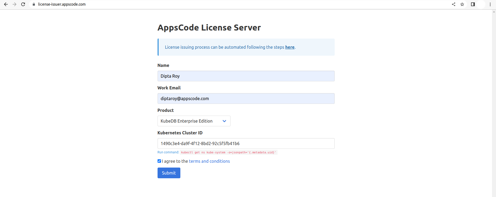

## Overview

KubeDB is the Kubernetes Native Database Management Solution which simplifies and automates routine database tasks such as Provisioning, Monitoring, Upgrading, Patching, Scaling, Volume Expansion, Backup, Recovery, Failure detection, and Repair for various popular databases on private and public clouds. The databases that KubeDB supports are MySQL, MongoDB, MariaDB, Elasticsearch, Redis, PostgreSQL, ProxySQL, Percona XtraDB, Memcached and PgBouncer. You can find the guides to all the supported databases [here](https://kubedb.com/).
In this tutorial we will show how to use Ingress with MySQL in Linode Kubernetes Engine (LKE). We will cover the following steps:

1) Install KubeDB
2) Deploy Sample MySQL Database
3) Install cert-manager
4) Setup Ingress to expose MySQL
5) Use MySQL database from Developer Workstation

## Install KubeDB

We will follow the steps to install KubeDB.

### Get Cluster ID

We need the cluster ID to get the KubeDB License.
To get cluster ID we can run the following command:

```bash
$ kubectl get ns kube-system -o jsonpath='{.metadata.uid}'
1490c3e4-da9f-4f12-8bd2-92c5f5fb41b6
```

### Get License

Go to [Appscode License Server](https://license-issuer.appscode.com/) to get the license.txt file. For this tutorial we will use KubeDB Enterprise Edition.



### Install KubeDB

We will use helm to install KubeDB. Please install helm [here](https://helm.sh/docs/intro/install/) if it is not already installed.
Now, let's install `KubeDB`.

```bash
$ helm repo add appscode https://charts.appscode.com/stable/
$ helm repo update

$ helm search repo appscode/kubedb
NAME                              	CHART VERSION	APP VERSION	DESCRIPTION                                       
appscode/kubedb                   	v2022.12.28  	v2022.12.28	KubeDB by AppsCode - Production ready databases...
appscode/kubedb-autoscaler        	v0.15.0      	v0.15.0    	KubeDB Autoscaler by AppsCode - Autoscale KubeD...
appscode/kubedb-catalog           	v2022.12.28  	v2022.12.28	KubeDB Catalog by AppsCode - Catalog for databa...
appscode/kubedb-community         	v0.24.2      	v0.24.2    	KubeDB Community by AppsCode - Community featur...
appscode/kubedb-crds              	v2022.12.28  	v2022.12.28	KubeDB Custom Resource Definitions                
appscode/kubedb-dashboard         	v0.6.0       	v0.6.0     	KubeDB Dashboard by AppsCode                      
appscode/kubedb-enterprise        	v0.11.2      	v0.11.2    	KubeDB Enterprise by AppsCode - Enterprise feat...
appscode/kubedb-grafana-dashboards	v2022.12.28  	v2022.12.28	A Helm chart for kubedb-grafana-dashboards by A...
appscode/kubedb-metrics           	v2022.12.28  	v2022.12.28	KubeDB State Metrics                              
appscode/kubedb-ops-manager       	v0.17.0      	v0.17.0    	KubeDB Ops Manager by AppsCode - Enterprise fea...
appscode/kubedb-opscenter         	v2022.12.28  	v2022.12.28	KubeDB Opscenter by AppsCode                      
appscode/kubedb-provisioner       	v0.30.0      	v0.30.0    	KubeDB Provisioner by AppsCode - Community feat...
appscode/kubedb-schema-manager    	v0.6.0       	v0.6.0     	KubeDB Schema Manager by AppsCode                 
appscode/kubedb-ui                	v2022.06.14  	0.3.22     	A Helm chart for Kubernetes                       
appscode/kubedb-ui-server         	v2021.12.21  	v2021.12.21	A Helm chart for kubedb-ui-server by AppsCode     
appscode/kubedb-webhook-server    	v0.6.0       	v0.6.0     	KubeDB Webhook Server by AppsCode  

# Install KubeDB Enterprise operator chart
$ helm install kubedb appscode/kubedb \
  --version v2022.12.28 \
  --namespace kubedb --create-namespace \
  --set kubedb-provisioner.enabled=true \
  --set kubedb-ops-manager.enabled=true \
  --set kubedb-autoscaler.enabled=true \
  --set kubedb-dashboard.enabled=true \
  --set kubedb-schema-manager.enabled=true \
  --set-file global.license=/path/to/the/license.txt

```

Let's verify the installation:

```bash
$ watch kubectl get pods --all-namespaces -l "app.kubernetes.io/instance=kubedb"
NAMESPACE   NAME                                            READY   STATUS    RESTARTS        AGE
kubedb      kubedb-kubedb-autoscaler-5f54c44f78-jhf4p       1/1     Running   0               6m27s
kubedb      kubedb-kubedb-dashboard-7bbcdd5ff9-xqpxr        1/1     Running   0               6m27s
kubedb      kubedb-kubedb-ops-manager-f475b96db-rs6pf       1/1     Running   1               6m27s
kubedb      kubedb-kubedb-provisioner-7476c97f55-74sj4      1/1     Running   0               6m26s
kubedb      kubedb-kubedb-schema-manager-6f6db9f95f-q64q4   1/1     Running   0               6m27s
kubedb      kubedb-kubedb-webhook-server-99b6665b7-r4qd9    1/1     Running   0               6m27s
```

We can list the CRD Groups that have been registered by the operator by running the following command:

```bash
$ kubectl get crd -l app.kubernetes.io/name=kubedb
NAME                                              CREATED AT
elasticsearchautoscalers.autoscaling.kubedb.com   2022-12-29T19:23:34Z
elasticsearchdashboards.dashboard.kubedb.com      2022-12-29T19:25:39Z
elasticsearches.kubedb.com                        2022-12-29T19:24:52Z
elasticsearchopsrequests.ops.kubedb.com           2022-12-29T19:28:00Z
elasticsearchversions.catalog.kubedb.com          2022-12-29T19:21:07Z
etcds.kubedb.com                                  2022-12-29T19:24:52Z
etcdversions.catalog.kubedb.com                   2022-12-29T19:21:07Z
kafkas.kubedb.com                                 2022-12-29T19:24:57Z
kafkaversions.catalog.kubedb.com                  2022-12-29T19:21:07Z
mariadbautoscalers.autoscaling.kubedb.com         2022-12-29T19:23:34Z
mariadbdatabases.schema.kubedb.com                2022-12-29T19:26:43Z
mariadbopsrequests.ops.kubedb.com                 2022-12-29T19:28:16Z
mariadbs.kubedb.com                               2022-12-29T19:24:52Z
mariadbversions.catalog.kubedb.com                2022-12-29T19:21:07Z
memcacheds.kubedb.com                             2022-12-29T19:24:52Z
memcachedversions.catalog.kubedb.com              2022-12-29T19:21:07Z
mongodbautoscalers.autoscaling.kubedb.com         2022-12-29T19:23:34Z
mongodbdatabases.schema.kubedb.com                2022-12-29T19:26:40Z
mongodbopsrequests.ops.kubedb.com                 2022-12-29T19:28:04Z
mongodbs.kubedb.com                               2022-12-29T19:24:53Z
mongodbversions.catalog.kubedb.com                2022-12-29T19:21:07Z
mysqlautoscalers.autoscaling.kubedb.com           2022-12-29T19:23:34Z
mysqldatabases.schema.kubedb.com                  2022-12-29T19:26:40Z
mysqlopsrequests.ops.kubedb.com                   2022-12-29T19:28:12Z
mysqls.kubedb.com                                 2022-12-29T19:24:54Z
mysqlversions.catalog.kubedb.com                  2022-12-29T19:21:07Z
perconaxtradbautoscalers.autoscaling.kubedb.com   2022-12-29T19:23:34Z
perconaxtradbopsrequests.ops.kubedb.com           2022-12-29T19:28:31Z
perconaxtradbs.kubedb.com                         2022-12-29T19:24:54Z
perconaxtradbversions.catalog.kubedb.com          2022-12-29T19:21:07Z
pgbouncers.kubedb.com                             2022-12-29T19:24:54Z
pgbouncerversions.catalog.kubedb.com              2022-12-29T19:21:07Z
postgresautoscalers.autoscaling.kubedb.com        2022-12-29T19:23:34Z
postgresdatabases.schema.kubedb.com               2022-12-29T19:26:42Z
postgreses.kubedb.com                             2022-12-29T19:24:55Z
postgresopsrequests.ops.kubedb.com                2022-12-29T19:28:24Z
postgresversions.catalog.kubedb.com               2022-12-29T19:21:07Z
proxysqlautoscalers.autoscaling.kubedb.com        2022-12-29T19:23:35Z
proxysqlopsrequests.ops.kubedb.com                2022-12-29T19:28:28Z
proxysqls.kubedb.com                              2022-12-29T19:24:55Z
proxysqlversions.catalog.kubedb.com               2022-12-29T19:21:07Z
publishers.postgres.kubedb.com                    2022-12-29T19:28:42Z
redisautoscalers.autoscaling.kubedb.com           2022-12-29T19:23:35Z
redises.kubedb.com                                2022-12-29T19:24:56Z
redisopsrequests.ops.kubedb.com                   2022-12-29T19:28:20Z
redissentinelautoscalers.autoscaling.kubedb.com   2022-12-29T19:23:35Z
redissentinelopsrequests.ops.kubedb.com           2022-12-29T19:28:35Z
redissentinels.kubedb.com                         2022-12-29T19:24:56Z
redisversions.catalog.kubedb.com                  2022-12-29T19:21:07Z
subscribers.postgres.kubedb.com                   2022-12-29T19:28:45Z

```

## Deploy Sample MySQL Database

Now, we are going to Deploy MySQL using KubeDB.
Let's create a Namespace in which we will deploy the database.

```bash
$ kubectl create ns demo
namespace/demo created
```

Here is the yaml of the MySQL CRO we are going to use:

```yaml
apiVersion: kubedb.com/v1alpha2
kind: MySQL
metadata:
  name: mysql-quickstart
  namespace: demo
spec:
  version: "8.0.29"
  storageType: Durable
  storage:
    storageClassName: linode-block-storage
    accessModes:
    - ReadWriteOnce
    resources:
      requests:
        storage: 1Gi
  terminationPolicy: Wipeout
```

Let's save this yaml configuration into `mysql-quickstart.yaml` 
Then create the above MySQL CRO

```bash
$ kubectl create -f mysql.yaml 
mysql.kubedb.com/mysql-quickstart created
```

* In this yaml we can see in the `spec.version` field specifies the version of MySQL. Here, we are using MySQL `version 8.0.29`. You can list the KubeDB supported versions of MySQL by running `$ kubectl get mysqlversions` command.
* `spec.storage` specifies PVC spec that will be dynamically allocated to store data for this database. This storage spec will be passed to the StatefulSet created by KubeDB operator to run database pods. You can specify any StorageClass available in your cluster with appropriate resource requests.
* And the `spec.terminationPolicy` field is *Wipeout* means that the database will be deleted without restrictions. It can also be "Halt", "Delete" and "DoNotTerminate". Learn More about these [HERE](https://kubedb.com/docs/latest/guides/mysql/concepts/database/#specterminationpolicy).


### Install cert-manager

Now, we are going to install cert-manager by the following command:

```bash
$ kubectl apply -f https://github.com/cert-manager/cert-manager/releases/download/v1.10.1/cert-manager.yaml
namespace/cert-manager created
customresourcedefinition.apiextensions.k8s.io/clusterissuers.cert-manager.io created
customresourcedefinition.apiextensions.k8s.io/challenges.acme.cert-manager.io created
customresourcedefinition.apiextensions.k8s.io/certificaterequests.cert-manager.io created
customresourcedefinition.apiextensions.k8s.io/issuers.cert-manager.io created
customresourcedefinition.apiextensions.k8s.io/certificates.cert-manager.io created
customresourcedefinition.apiextensions.k8s.io/orders.acme.cert-manager.io created
serviceaccount/cert-manager-cainjector created
serviceaccount/cert-manager created
serviceaccount/cert-manager-webhook created
configmap/cert-manager-webhook created
clusterrole.rbac.authorization.k8s.io/cert-manager-cainjector created
clusterrole.rbac.authorization.k8s.io/cert-manager-controller-issuers created
clusterrole.rbac.authorization.k8s.io/cert-manager-controller-clusterissuers created
clusterrole.rbac.authorization.k8s.io/cert-manager-controller-certificates created
clusterrole.rbac.authorization.k8s.io/cert-manager-controller-orders created
clusterrole.rbac.authorization.k8s.io/cert-manager-controller-challenges created
clusterrole.rbac.authorization.k8s.io/cert-manager-controller-ingress-shim created
clusterrole.rbac.authorization.k8s.io/cert-manager-view created
clusterrole.rbac.authorization.k8s.io/cert-manager-edit created
clusterrole.rbac.authorization.k8s.io/cert-manager-controller-approve:cert-manager-io created
clusterrole.rbac.authorization.k8s.io/cert-manager-controller-certificatesigningrequests created
clusterrole.rbac.authorization.k8s.io/cert-manager-webhook:subjectaccessreviews created
clusterrolebinding.rbac.authorization.k8s.io/cert-manager-cainjector created
clusterrolebinding.rbac.authorization.k8s.io/cert-manager-controller-issuers created
clusterrolebinding.rbac.authorization.k8s.io/cert-manager-controller-clusterissuers created
clusterrolebinding.rbac.authorization.k8s.io/cert-manager-controller-certificates created
clusterrolebinding.rbac.authorization.k8s.io/cert-manager-controller-orders created
clusterrolebinding.rbac.authorization.k8s.io/cert-manager-controller-challenges created
clusterrolebinding.rbac.authorization.k8s.io/cert-manager-controller-ingress-shim created
clusterrolebinding.rbac.authorization.k8s.io/cert-manager-controller-approve:cert-manager-io created
clusterrolebinding.rbac.authorization.k8s.io/cert-manager-controller-certificatesigningrequests created
clusterrolebinding.rbac.authorization.k8s.io/cert-manager-webhook:subjectaccessreviews created
role.rbac.authorization.k8s.io/cert-manager-cainjector:leaderelection created
role.rbac.authorization.k8s.io/cert-manager:leaderelection created
role.rbac.authorization.k8s.io/cert-manager-webhook:dynamic-serving created
rolebinding.rbac.authorization.k8s.io/cert-manager-cainjector:leaderelection created
rolebinding.rbac.authorization.k8s.io/cert-manager:leaderelection created
rolebinding.rbac.authorization.k8s.io/cert-manager-webhook:dynamic-serving created
service/cert-manager created
service/cert-manager-webhook created
deployment.apps/cert-manager-cainjector created
deployment.apps/cert-manager created
deployment.apps/cert-manager-webhook created
mutatingwebhookconfiguration.admissionregistration.k8s.io/cert-manager-webhook created
validatingwebhookconfiguration.admissionregistration.k8s.io/cert-manager-webhook created

```

> Note: We are installing cert-manager version `v1.10.1`, you can specify your cert-manager version from [HERE](https://github.com/cert-manager/cert-manager/releases/)


#### Create an Issuer & Secret

Here, we are going to create an Issuer and Secret by using this yaml,

```yaml
apiVersion: cert-manager.io/v1
kind: Issuer
metadata:
  name: bytebuilders-xyz
  namespace: demo
spec:
  acme:
    # server: https://acme-v02.api.letsencrypt.org/directory
    server: https://acme-staging-v02.api.letsencrypt.org/directory
    email: tamal@appscode.com
    # Name of a secret used to store the ACME account private key
    privateKeySecretRef:
      name: bytebuilders-xyz-acme
    # ACME DNS-01 provider configurations
    solvers:
    # An empty 'selector' means that this solver matches all domains
    - selector: {}
      dns01:
        cloudflare:
          email: tamal@appscode.com
          apiTokenSecretRef:
            name: bytebuilders-xyz-cloudflare
            key: api-token

---
apiVersion: v1
kind: Secret
metadata:
  name: bytebuilders-xyz-cloudflare
  namespace: demo
type: Opaque
stringData:
  api-token: "$CLOUDFLARE_API_TOKEN"
```

Let's save this yaml configuration into `issuer.yaml` and apply it,

```bash
$ kubectl apply -f issuer.yaml 
issuer.cert-manager.io/bytebuilders-xyz created
secret/bytebuilders-xyz-cloudflare created
```

### Setup Ingress to expose MySQL

Now, in this section we are going to setup ingress to expose our MySQL database.

```yaml
apiVersion: networking.k8s.io/v1
kind: Ingress
metadata:
  annotations:
    cert-manager.io/issuer: bytebuilders-xyz
  name: kubedb
  namespace: demo
spec:
  ingressClassName: nginx
  rules:
  - host: mysql.bytebuilders.xyz
    http:
      paths:
      - backend:
          service:
            name: mysql-quickstart
            port:
              number: 3306
        path: /
        pathType: Prefix
  tls:
  - hosts:
    - mysql.bytebuilders.xyz
    secretName: bytebuilders-xyz-tls
```

Let's save this yaml configuration into `ingress.yaml` and apply it,

```bash
kubectl apply -f ingress.yaml 
ingress.networking.k8s.io/kubedb created
```

Now, set tcp port to expose MySQL database,

```bash
helm repo add ingress-nginx https://kubernetes.github.io/ingress-nginx
helm upgrade -i ingress-nginx ingress-nginx/ingress-nginx  \
  --namespace demo --create-namespace \
  --set tcp.3306="demo/mysql-quickstart:3306"
```


### Setup DNS using external-dns (optional)

Now, we are going to setum DNS by using external-dns:

```yaml
provider: cloudflare
sources:
- ingress
domainFilters:
- bytebuilders.xyz

env:
- name: CF_API_TOKEN
  value: "$CLOUDFLARE_API_TOKEN"

policy: sync

logLevel: debug

registry: txt
txtOwnerId: ingress-kubedb

extraArgs:
- --ignore-ingress-tls-spec

```
Let's save this yaml configuration into `external-dns.yaml`

```bash
$ helm repo add external-dns https://kubernetes-sigs.github.io/external-dns/
$ helm upgrade -i ingress-kubedb external-dns/external-dns \
  -n demo \
  -f external-dns.yaml
```

Once all of the above steps are handled correctly you will see that the following objects are created:

```bash
$ kubectl get all -n demo
NAME                                               READY   STATUS    RESTARTS   AGE
pod/ingress-kubedb-external-dns-6577b5687d-f577m   1/1     Running   0          2h
pod/ingress-nginx-controller-76cb758dcf-7jmc4      1/1     Running   0          2h
pod/mysql-quickstart-0                             1/1     Running   0          2h

NAME                                         TYPE           CLUSTER-IP       EXTERNAL-IP    PORT(S)                                     AGE
service/ingress-kubedb-external-dns          ClusterIP      10.128.250.228   <none>         7979/TCP                                    2h
service/ingress-nginx-controller             LoadBalancer   10.128.3.169     45.79.243.69   80:30552/TCP,443:31346/TCP,3306:32105/TCP   2h
service/ingress-nginx-controller-admission   ClusterIP      10.128.134.98    <none>         443/TCP                                     2h
service/mysql-quickstart                     ClusterIP      10.128.128.69    <none>         3306/TCP                                    2h
service/mysql-quickstart-pods                ClusterIP      None             <none>         3306/TCP                                    2h

NAME                                          READY   UP-TO-DATE   AVAILABLE   AGE
deployment.apps/ingress-kubedb-external-dns   1/1     1            1           2h
deployment.apps/ingress-nginx-controller      1/1     1            1           2h

NAME                                                     DESIRED   CURRENT   READY   AGE
replicaset.apps/ingress-kubedb-external-dns-6577b5687d   1         1         1       2h
replicaset.apps/ingress-nginx-controller-76cb758dcf      1         1         1       2h

NAME                                READY   AGE
statefulset.apps/mysql-quickstart   1/1     37h

NAME                                                  TYPE               VERSION   AGE
appbinding.appcatalog.appscode.com/mysql-quickstart   kubedb.com/mysql   8.0.29    2h

NAME                                VERSION   STATUS   AGE
mysql.kubedb.com/mysql-quickstart   8.0.29    Ready    2h
```


### Use MySQL database from Developer Workstation

Now, we will access the MySQL database and create some sample data into it. To access the database through CLI, we have to get the credentials to access. We are going to use `mysql-quickstart-auth` to get the credentials.

```bash
$ kubectl view-secret mysql-quickstart-auth --all
password=aj.9sWpsqVNd798T
username=root
```

Let's insert some sample data into the MySQL database,

```bash
$ docker run -it mysql:8 bash
bash-4.4# mysql -h mysql.bytebuilders.xyz -uroot -p'aj.9sWpsqVNd798T' 
Welcome to the MySQL monitor.  Commands end with ; or \g.
Your MySQL connection id is 13507
Server version: 8.0.29 MySQL Community Server - GPL

Copyright (c) 2000, 2022, Oracle and/or its affiliates.

Oracle is a registered trademark of Oracle Corporation and/or its
affiliates. Other names may be trademarks of their respective
owners.

Type 'help;' or '\h' for help. Type '\c' to clear the current input statement.

mysql> SHOW DATABASES;
+--------------------+
| Database           |
+--------------------+
| information_schema |
| kubedb_system      |
| mysql              |
| performance_schema |
| sys                |
+--------------------+
5 rows in set (0.34 sec)

mysql> CREATE DATABASE Music;
Query OK, 1 row affected (0.31 sec)

mysql> SHOW DATABASES;
+--------------------+
| Database           |
+--------------------+
| Music              |
| information_schema |
| kubedb_system      |
| mysql              |
| performance_schema |
| sys                |
+--------------------+
6 rows in set (0.27 sec)

mysql> CREATE TABLE Music.Artist (id INT(6) UNSIGNED AUTO_INCREMENT PRIMARY KEY, Name VARCHAR(50), Song VARCHAR(50));
Query OK, 0 rows affected, 1 warning (0.49 sec)

mysql> INSERT INTO Music.Artist (Name, Song) VALUES ("Bobby Bare", "500 Miles Away From Home");
Query OK, 1 row affected (0.30 sec)

mysql> SELECT * FROM Music.Artist;
+----+------------+--------------------------+
| id | Name       | Song                     |
+----+------------+--------------------------+
|  1 | Bobby Bare | 500 Miles Away From Home |
+----+------------+--------------------------+
1 row in set (0.27 sec)

mysql> exit
Bye

```

> We have successfully access and use the MySQL database. More information about Run & Manage Production-Grade MySQL Database on Kubernetes can be found [HERE](https://kubedb.com/kubernetes/databases/run-and-manage-mysql-on-kubernetes/)

We have made an in depth tutorial on Managing Semi-synchronous MySQL Cluster Using KubeDB in Kubernetes. You can have a look into the video below:

<iframe width="560" height="315" src="https://www.youtube.com/embed/y9VgofqwGyE" title="YouTube video player" frameborder="0" allow="accelerometer; autoplay; clipboard-write; encrypted-media; gyroscope; picture-in-picture" allowfullscreen></iframe>

## Support

To speak with us, please leave a message on [our website](https://appscode.com/contact/).

To receive product announcements, follow us on [Twitter](https://twitter.com/KubeDB).

To watch tutorials of various Production-Grade Kubernetes Tools Subscribe our [YouTube](https://www.youtube.com/c/AppsCodeInc/) channel.

More about [MySQL in Kubernetes](https://kubedb.com/kubernetes/databases/run-and-manage-mysql-on-kubernetes/)

If you have found a bug with KubeDB or want to request for new features, please [file an issue](https://github.com/kubedb/project/issues/new).
