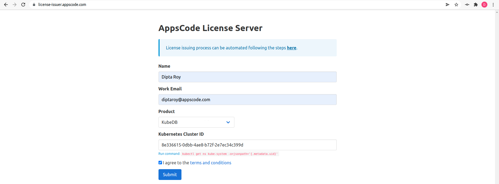

## Overview

KubeDB is the Kubernetes Native Database Management Solution which simplifies and automates routine database tasks such as Provisioning, Monitoring, Upgrading, Patching, Scaling, Volume Expansion, Backup, Recovery, Failure detection, and Repair for various popular databases on private and public clouds. The databases supported by KubeDB include MongoDB, Elasticsearch, MySQL, MariaDB, Redis, PostgreSQL, FerretDB, Percona XtraDB, and Memcached. Additionally, KubeDB also supports ProxySQL, PgBouncer, and the streaming platform Kafka, RabbitMQ. You can find the guides to all the supported databases in [KubeDB](https://kubedb.com/).
In this tutorial we will show Vertical scaling of Redis cluster in Amazon Elastic Kubernetes Service (Amazon EKS). We will cover the following steps:

1. Install KubeDB
2. Deploy Redis Cluster
3. Read/Write Sample Data
4. Vertical Scaling of Redis Cluster

### Get Cluster ID

We need the cluster ID to get the KubeDB License. To get cluster ID, we can run the following command:

```bash
$ kubectl get ns kube-system -o jsonpath='{.metadata.uid}'
8e336615-0dbb-4ae8-b72f-2e7ec34c399d
```

### Get License

Go to [Appscode License Server](https://license-issuer.appscode.com/) to get the license.txt file. For this tutorial we will use KubeDB.



### Install KubeDB

We will use helm to install KubeDB. Please install helm [here](https://helm.sh/docs/intro/install/) if it is not already installed.
Now, let's install `KubeDB`.

```bash
$ helm search repo appscode/kubedb
NAME                              	CHART VERSION	APP VERSION	DESCRIPTION                                       
appscode/kubedb                   	v2024.4.27   	v2024.4.27 	KubeDB by AppsCode - Production ready databases...
appscode/kubedb-autoscaler        	v0.30.0      	v0.30.0    	KubeDB Autoscaler by AppsCode - Autoscale KubeD...
appscode/kubedb-catalog           	v2024.4.27   	v2024.4.27 	KubeDB Catalog by AppsCode - Catalog for databa...
appscode/kubedb-community         	v0.24.2      	v0.24.2    	KubeDB Community by AppsCode - Community featur...
appscode/kubedb-crd-manager       	v0.0.9       	v0.0.9     	KubeDB CRD Manager by AppsCode                    
appscode/kubedb-crds              	v2024.4.27   	v2024.4.27 	KubeDB Custom Resource Definitions                
appscode/kubedb-dashboard         	v0.21.0      	v0.21.0    	KubeDB Dashboard by AppsCode                      
appscode/kubedb-enterprise        	v0.11.2      	v0.11.2    	KubeDB Enterprise by AppsCode - Enterprise feat...
appscode/kubedb-grafana-dashboards	v2024.4.27   	v2024.4.27 	A Helm chart for kubedb-grafana-dashboards by A...
appscode/kubedb-kubestash-catalog 	v2024.4.27   	v2024.4.27 	KubeStash Catalog by AppsCode - Catalog of Kube...
appscode/kubedb-metrics           	v2024.4.27   	v2024.4.27 	KubeDB State Metrics                              
appscode/kubedb-one               	v2023.12.28  	v2023.12.28	KubeDB and Stash by AppsCode - Production ready...
appscode/kubedb-ops-manager       	v0.32.0      	v0.32.0    	KubeDB Ops Manager by AppsCode - Enterprise fea...
appscode/kubedb-opscenter         	v2024.4.27   	v2024.4.27 	KubeDB Opscenter by AppsCode                      
appscode/kubedb-provider-aws      	v2024.4.27   	v0.7.0     	A Helm chart for KubeDB AWS Provider for Crossp...
appscode/kubedb-provider-azure    	v2024.4.27   	v0.7.0     	A Helm chart for KubeDB Azure Provider for Cros...
appscode/kubedb-provider-gcp      	v2024.4.27   	v0.7.0     	A Helm chart for KubeDB GCP Provider for Crossp...
appscode/kubedb-provisioner       	v0.45.0      	v0.45.0    	KubeDB Provisioner by AppsCode - Community feat...
appscode/kubedb-schema-manager    	v0.21.0      	v0.21.0    	KubeDB Schema Manager by AppsCode                 
appscode/kubedb-ui                	v2024.5.3    	0.6.5      	A Helm chart for Kubernetes                       
appscode/kubedb-ui-server         	v2021.12.21  	v2021.12.21	A Helm chart for kubedb-ui-server by AppsCode     
appscode/kubedb-webhook-server    	v0.21.0      	v0.21.0    	KubeDB Webhook Server by AppsCode


$ helm install kubedb oci://ghcr.io/appscode-charts/kubedb \
  --version v2024.4.27 \
  --namespace kubedb --create-namespace \
  --set-file global.license=/path/to/the/license.txt \
  --wait --burst-limit=10000 --debug
```

Let's verify the installation:

```bash
$ kubectl get pods --all-namespaces -l "app.kubernetes.io/instance=kubedb"
NAMESPACE   NAME                                            READY   STATUS    RESTARTS   AGE
kubedb      kubedb-kubedb-autoscaler-5dddcbfb89-9mzpb       1/1     Running   0          4m31s
kubedb      kubedb-kubedb-ops-manager-6bdb8f6c95-trvhg      1/1     Running   0          4m31s
kubedb      kubedb-kubedb-provisioner-865d655b94-dd7pp      1/1     Running   0          4m31s
kubedb      kubedb-kubedb-webhook-server-64bc8848bd-cgbsz   1/1     Running   0          4m31s
kubedb      kubedb-petset-operator-5d94b4ddb8-rfr4x         1/1     Running   0          4m31s
kubedb      kubedb-petset-webhook-server-5465c9d87f-vpvnw   2/2     Running   0          4m31s
kubedb      kubedb-sidekick-5d9947bd9-cvq7l                 1/1     Running   0          4m31s
```

We can list the CRD Groups that have been registered by the operator by running the following command:

```bash
$ kubectl get crd -l app.kubernetes.io/name=kubedb
NAME                                               CREATED AT
connectclusters.kafka.kubedb.com                   2024-05-07T09:51:28Z
connectors.kafka.kubedb.com                        2024-05-07T09:51:28Z
druidversions.catalog.kubedb.com                   2024-05-07T09:50:00Z
elasticsearchautoscalers.autoscaling.kubedb.com    2024-05-07T09:51:25Z
elasticsearchdashboards.elasticsearch.kubedb.com   2024-05-07T09:51:25Z
elasticsearches.kubedb.com                         2024-05-07T09:51:25Z
elasticsearchopsrequests.ops.kubedb.com            2024-05-07T09:51:25Z
elasticsearchversions.catalog.kubedb.com           2024-05-07T09:50:00Z
etcdversions.catalog.kubedb.com                    2024-05-07T09:50:00Z
ferretdbversions.catalog.kubedb.com                2024-05-07T09:50:00Z
kafkaautoscalers.autoscaling.kubedb.com            2024-05-07T09:51:28Z
kafkaconnectorversions.catalog.kubedb.com          2024-05-07T09:50:00Z
kafkaopsrequests.ops.kubedb.com                    2024-05-07T09:51:28Z
kafkas.kubedb.com                                  2024-05-07T09:51:28Z
kafkaversions.catalog.kubedb.com                   2024-05-07T09:50:00Z
mariadbarchivers.archiver.kubedb.com               2024-05-07T09:51:31Z
mariadbautoscalers.autoscaling.kubedb.com          2024-05-07T09:51:31Z
mariadbdatabases.schema.kubedb.com                 2024-05-07T09:51:31Z
mariadbopsrequests.ops.kubedb.com                  2024-05-07T09:51:31Z
mariadbs.kubedb.com                                2024-05-07T09:51:31Z
mariadbversions.catalog.kubedb.com                 2024-05-07T09:50:00Z
memcachedversions.catalog.kubedb.com               2024-05-07T09:50:00Z
mongodbarchivers.archiver.kubedb.com               2024-05-07T09:51:35Z
mongodbautoscalers.autoscaling.kubedb.com          2024-05-07T09:51:35Z
mongodbdatabases.schema.kubedb.com                 2024-05-07T09:51:35Z
mongodbopsrequests.ops.kubedb.com                  2024-05-07T09:51:35Z
mongodbs.kubedb.com                                2024-05-07T09:51:35Z
mongodbversions.catalog.kubedb.com                 2024-05-07T09:50:00Z
mssqlserverversions.catalog.kubedb.com             2024-05-07T09:50:00Z
mysqlarchivers.archiver.kubedb.com                 2024-05-07T09:51:38Z
mysqlautoscalers.autoscaling.kubedb.com            2024-05-07T09:51:38Z
mysqldatabases.schema.kubedb.com                   2024-05-07T09:51:38Z
mysqlopsrequests.ops.kubedb.com                    2024-05-07T09:51:38Z
mysqls.kubedb.com                                  2024-05-07T09:51:38Z
mysqlversions.catalog.kubedb.com                   2024-05-07T09:50:00Z
perconaxtradbversions.catalog.kubedb.com           2024-05-07T09:50:00Z
pgbouncerversions.catalog.kubedb.com               2024-05-07T09:50:00Z
pgpoolversions.catalog.kubedb.com                  2024-05-07T09:50:00Z
postgresarchivers.archiver.kubedb.com              2024-05-07T09:51:42Z
postgresautoscalers.autoscaling.kubedb.com         2024-05-07T09:51:42Z
postgresdatabases.schema.kubedb.com                2024-05-07T09:51:42Z
postgreses.kubedb.com                              2024-05-07T09:51:41Z
postgresopsrequests.ops.kubedb.com                 2024-05-07T09:51:42Z
postgresversions.catalog.kubedb.com                2024-05-07T09:50:00Z
proxysqlversions.catalog.kubedb.com                2024-05-07T09:50:00Z
publishers.postgres.kubedb.com                     2024-05-07T09:51:42Z
rabbitmqversions.catalog.kubedb.com                2024-05-07T09:50:00Z
redisautoscalers.autoscaling.kubedb.com            2024-05-07T09:51:45Z
redises.kubedb.com                                 2024-05-07T09:51:45Z
redisopsrequests.ops.kubedb.com                    2024-05-07T09:51:45Z
redissentinelautoscalers.autoscaling.kubedb.com    2024-05-07T09:51:45Z
redissentinelopsrequests.ops.kubedb.com            2024-05-07T09:51:45Z
redissentinels.kubedb.com                          2024-05-07T09:51:45Z
redisversions.catalog.kubedb.com                   2024-05-07T09:50:00Z
singlestoreversions.catalog.kubedb.com             2024-05-07T09:50:01Z
solrversions.catalog.kubedb.com                    2024-05-07T09:50:01Z
subscribers.postgres.kubedb.com                    2024-05-07T09:51:42Z
zookeeperversions.catalog.kubedb.com               2024-05-07T09:50:01Z
```

## Deploy Redis Cluster

We are going to Deploy Redis Cluster by using KubeDB.
First, let's create a Namespace in which we will deploy the Redis Cluster.

```bash
$ kubectl create namespace demo
namespace/demo created
```

Here is the yaml of the Redis CRO we are going to use:

```yaml                                                                      
apiVersion: kubedb.com/v1alpha2
kind: Redis
metadata:
  name: redis-cluster
  namespace: demo
spec:
  version: 7.2.4
  mode: Cluster
  cluster:
    master: 3
    replicas: 1
  storageType: Durable
  storage:
    resources:
      requests:
        storage: 1Gi
    storageClassName: "gp2"
    accessModes:
    - ReadWriteOnce
  terminationPolicy: WipeOut
```
Let's save this yaml configuration into `redis-cluster.yaml` 
Then create the above Redis CRO

```bash
$ kubectl apply -f redis-cluster.yaml
redis.kubedb.com/redis-cluster created
```
In this yaml,
* In this yaml we can see in the `spec.version` field specifies the version of Redis. Here, we are using Redis `7.2.4`. You can list the KubeDB supported versions of Redis by running `kubectl get redisversions` command.
* `spec.storage.storageClassName` is the name of the StorageClass used to provision PVCs. 
* `spec.terminationPolicy` field is *Wipeout* means that the database will be deleted without restrictions. It can also be “Halt”, “Delete” and “DoNotTerminate”. Learn More about these checkout [Termination Policy](https://kubedb.com/docs/latest/guides/redis/concepts/redis/#specterminationpolicy) .

Once these are handled correctly and the Redis object is deployed, you will see that the following objects are created:

```bash
$ kubectl get all -n demo
NAME                         READY   STATUS    RESTARTS   AGE
pod/redis-cluster-shard0-0   1/1     Running   0          4m19s
pod/redis-cluster-shard0-1   1/1     Running   0          3m39s
pod/redis-cluster-shard1-0   1/1     Running   0          4m16s
pod/redis-cluster-shard1-1   1/1     Running   0          3m38s
pod/redis-cluster-shard2-0   1/1     Running   0          4m14s
pod/redis-cluster-shard2-1   1/1     Running   0          3m37s

NAME                         TYPE        CLUSTER-IP     EXTERNAL-IP   PORT(S)    AGE
service/redis-cluster        ClusterIP   10.96.184.23   <none>        6379/TCP   4m21s
service/redis-cluster-pods   ClusterIP   None           <none>        6379/TCP   4m21s

NAME                                    READY   AGE
statefulset.apps/redis-cluster-shard0   2/2     4m19s
statefulset.apps/redis-cluster-shard1   2/2     4m16s
statefulset.apps/redis-cluster-shard2   2/2     4m14s

NAME                                               TYPE               VERSION   AGE
appbinding.appcatalog.appscode.com/redis-cluster   kubedb.com/redis   7.2.4     4m14s

NAME                             VERSION   STATUS   AGE
redis.kubedb.com/redis-cluster   7.2.4     Ready    4m22s
```
Let’s check if the database is ready to use,

```bash
$ kubectl get redis -n demo redis-cluster
NAME            VERSION   STATUS   AGE
redis-cluster   7.2.4     Ready    4m57s
```
> We have successfully deployed Redis cluster in Amazon-EKS. Now we can exec into the container to use the database.


### Accessing Database Through CLI

To access the database through CLI, we have to get the credentials to access. Let’s export the credentials as environment variable to our current shell :

#### Export the Credentials

KubeDB has created Secret and Service for the database `redis-cluster` that we have deployed. Let’s check them by following command,

```bash
$ kubectl get secret -n demo -l=app.kubernetes.io/instance=redis-cluster
NAME                   TYPE                       DATA   AGE
redis-cluster-auth     kubernetes.io/basic-auth   2      5m48s
redis-cluster-config   Opaque                     1      5m48s

$ kubectl get service -n demo -l=app.kubernetes.io/instance=redis-cluster
NAME                 TYPE        CLUSTER-IP     EXTERNAL-IP   PORT(S)    AGE
redis-cluster        ClusterIP   10.96.184.23   <none>        6379/TCP   6m4s
redis-cluster-pods   ClusterIP   None           <none>        6379/TCP   6m4s
```
Now, we are going to use `PASSWORD` to authenticate and insert some sample data.
First, let’s export the `PASSWORD` as environment variables to make further commands re-usable.

```bash
$ export PASSWORD=$(kubectl get secrets -n demo redis-cluster-auth -o jsonpath='{.data.\password}' | base64 -d)
```

#### Insert Sample Data

In this section, we are going to login into our Redis database pod and insert some sample data. 

```bash
$ kubectl exec -it -n demo redis-cluster-shard0-0 -- redis-cli -c -a $PASSWORD
Defaulted container "redis" out of: redis, redis-init (init)

127.0.0.1:6379> set Product1 KubeDB
OK
10.244.0.17:6379> set Product2 KubeStash
OK
10.244.0.14:6379> get Product1
"KubeDB"
10.244.0.17:6379> get Product2
"KubeStash"
10.244.0.14:6379> exit
```
> We've successfully inserted some sample data to our database. More information about Deploy & Manage Production-Grade Redis Database on Kubernetes can be found in [Redis Kubernetes](https://kubedb.com/kubernetes/databases/run-and-manage-redis-on-kubernetes/)

## Vertical Scaling of Redis Cluster

We are going to scale up the current cpu and memory resource of the Redis cluster by applying Vertical Scaling.
Before applying it, let's check the current resources,

```bash
$ kubectl get pod -n demo redis-cluster-shard0-0 -o json | jq '.spec.containers[].resources'
{
  "limits": {
    "memory": "1Gi"
  },
  "requests": {
    "cpu": "500m",
    "memory": "1Gi"
  }
}
```
### Vertical Scale Up

#### Create RedisOpsRequest

In order to update the resources of the cluster, we have to create a `RedisOpsRequest` CR with our desired resources. Let’s create it using this following yaml,

```yaml
apiVersion: ops.kubedb.com/v1alpha1
kind: RedisOpsRequest
metadata:
  name: vertical-scale-up
  namespace: demo
spec:
  type: VerticalScaling
  databaseRef:
    name: redis-cluster
  verticalScaling:
    redis:
      resources:
        requests:
          memory: "1100Mi"
          cpu: "0.55"
        limits:
          memory: "1100Mi"
          cpu: "0.55"
```

In this yaml,

- `spec.databaseRef.name` specifies that we are performing vertical scaling operation on `redis-cluster` database.
- `spec.type` specifies that we are performing `VerticalScaling` on our database.
- `spec.verticalScaling.resources` specifies the desired resources after scaling.

Let’s save this yaml configuration into `vertical-scale-up.yaml` and apply it,

```bash
$ kubectl apply -f vertical-scale-up.yaml
redisopsrequest.ops.kubedb.com/vertical-scale-up created
```

Let’s wait for `RedisOpsRequest` `STATUS` to be Successful. Run the following command to watch `RedisOpsRequest` CR,

```bash
$ watch kubectl get redisopsrequest -n demo
NAME                TYPE              STATUS       AGE
vertical-scale-up   VerticalScaling   Successful   2m58s
```

We can see from the above output that the `RedisOpsRequest` has succeeded. Now, we are going to verify from one of the Pod yaml whether the resources of the database has updated to meet up the desired state. Let’s check with the following command,

```bash
$ kubectl get pod -n demo redis-cluster-shard0-0 -o json | jq '.spec.containers[].resources'
{
  "limits": {
    "cpu": "550m",
    "memory": "1100Mi"
  },
  "requests": {
    "cpu": "550m",
    "memory": "1100Mi"
  }
}
```
> The above output verifies that we have successfully scaled up the resources of the Redis cluster.

### Vertical Scale Down

#### Create RedisOpsRequest

In order to update the resources of the database, we have to create a `RedisOpsRequest` CR with our desired resources. Let’s create it using this following yaml,

```yaml
apiVersion: ops.kubedb.com/v1alpha1
kind: RedisOpsRequest
metadata:
  name: vertical-scale-down
  namespace: demo
spec:
  type: VerticalScaling
  databaseRef:
    name: redis-cluster
  verticalScaling:
    redis:
      resources:
        requests:
          memory: "1Gi"
          cpu: "0.5"
        limits:
          memory: "1Gi"
          cpu: "0.5"
```
In this yaml,

- `spec.databaseRef.name` specifies that we are performing vertical scaling operation on `redis-cluster` database.
- `spec.type` specifies that we are performing `VerticalScaling` on our database.
- `spec.verticalScaling.resources` specifies the desired resources after scaling.

Let’s save this yaml configuration into `vertical-scale-down.yaml` and apply it,

```bash
$ kubectl apply -f vertical-scale-down.yaml
redisopsrequest.ops.kubedb.com/vertical-scale-down created
```

Let’s wait for `RedisOpsRequest` `STATUS` to be Successful. Run the following command to watch `RedisOpsRequest` CR,

```bash
$ watch kubectl get redisopsrequest -n demo
NAME                  TYPE              STATUS       AGE
vertical-scale-down   VerticalScaling   Successful   3m50s
```

We can see from the above output that the `RedisOpsRequest` has succeeded. Now, we are going to verify from one of the Pod yaml whether the resources of the database has updated to meet up the desired state. Let’s check with the following command,

```bash
$ kubectl get pod -n demo redis-cluster-shard0-0 -o json | jq '.spec.containers[].resources'
{
  "limits": {
    "cpu": "500m",
    "memory": "1Gi"
  },
  "requests": {
    "cpu": "500m",
    "memory": "1Gi"
  }
}

```
> The above output verifies that we have successfully scaled down the resources of the Redis cluster.

If you want to learn more about Production-Grade Redis on Kubernetes you can have a look into that playlist below:

<iframe width="560" height="315" src="https://www.youtube.com/embed/videoseries?si=RJInaESDLyw3mA_Z&amp;list=PLoiT1Gv2KR1iSuQq_iyypzqvHW9u_un04" title="YouTube video player" frameborder="0" allow="accelerometer; autoplay; clipboard-write; encrypted-media; gyroscope; picture-in-picture; web-share" referrerpolicy="strict-origin-when-cross-origin" allowfullscreen></iframe>

## Support

To speak with us, please leave a message on [our website](https://appscode.com/contact/).

To receive product announcements, follow us on [X](https://twitter.com/KubeDB).

To watch tutorials of various Production-Grade Kubernetes Tools Subscribe to our [YouTube](https://www.youtube.com/c/AppsCodeInc/) channel.

Learn more about [Redis on Kubernetes](https://kubedb.com/kubernetes/databases/run-and-manage-redis-on-kubernetes/)

If you have found a bug with KubeDB or want to request for new features, please [file an issue](https://github.com/kubedb/project/issues/new).

