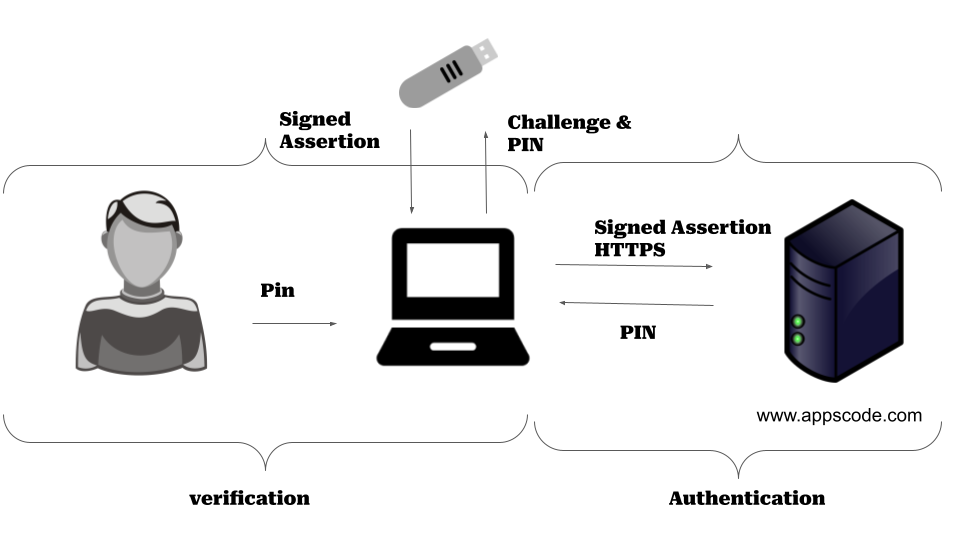
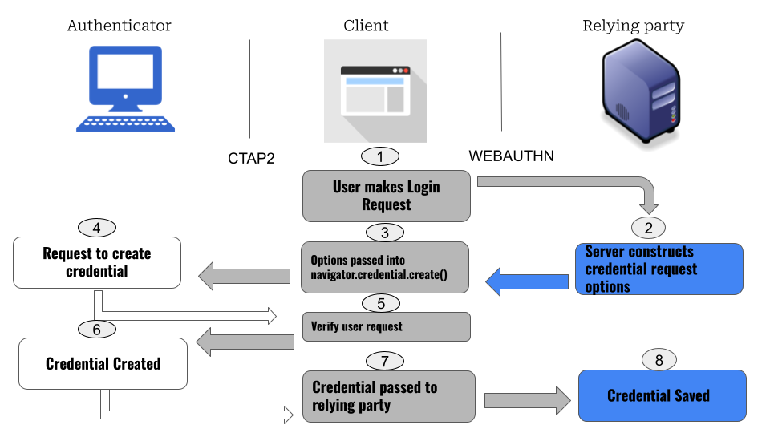

## What is WebAuthn ?

WebAuthn, short for Web Authentication, is a technology that makes logging into websites and online services more secure and convenient. It allows you to use biometrics (like fingerprint or face recognition) or physical security keys (like USB tokens) as a way to prove your identity online, instead of traditional passwords. WebAuthn is designed to protect against common security threats and is supported by many web browsers and online platforms, making it a promising solution for safer and user-friendly online authentication.

## How it Works?

To understand the how WebAuthn works lets get clear on some points

### Registration

- During registration on a website, the user’s browser generates a new [public-private key pair](https://en.wikipedia.org/wiki/Public-key_cryptography).
- The public key is sent to the website’s server, which associates it with the user’s account.
- The private key is securely stored on the user’s authenticator device.

### Authentication (Logging In)

- When the user wants to log in, the website requests authentication.
- The user’s authenticator device signs a challenge with the private key and returns the response to the website.
- The website verifies the response using the public key it previously stored for that user.

### Credential Management

- The website may store multiple credentials for a user, allowing the user to choose which authenticator to use during login.
- Users can manage and delete their credentials as needed.

### Cryptographic Protection

- WebAuthn relies on strong public-key cryptography for security.
- The private key is protected within the authenticator, ensuring it’s difficult to compromise.

### Options

- WebAuthn supports various types of authenticators, including platform authenticators (e.g., biometric sensors on devices) and roaming authenticators (e.g., USB security keys).

### No Passwords

- Users are not required to create or remember passwords, enhancing security against password-related attacks.

### Multi-Factor Authentication (MFA)

- WebAuthn can be used as part of a multi-factor authentication system, combining something the user knows (e.g., a PIN) with something the user has (the authenticator).



## Workflow

In this figure you can see an user insert an USB then the browser will give the USB a challenge . The Authenticator(USB) will solve the challenge using the key. Then it will send back the signed assertion to the browser which browser will save to the server .
When ever someone tries to login into the server, It will generate new challenge using the public key and the authenticator(USB) will solve it using the private key if its the right USB with verified user

## Lets do some code

Okay Hopefully you understand what webauthn . Now lets implement some of it.

### Registration



First when the user tries the authenticator for the first time it registered the user to the server in the above displayed process. Here client means your browser , authenticator can be anything like USB, Fingerprint etc and the relying party is the server

Now to code it lets assume you run the following function from the browser ( Client Side)

```js
async function registerWebAuthn() {
  try {
    // Generate a new credential request
    const credential = await navigator.credentials.create({
      publicKey: {
        user: {
          id: new Uint8Array(16), // Unique user ID (server-generated)
          name: "john.doe@example.com", // User identifier (e.g., email)
          displayName: "John Doe", // User's display name
        },
        challenge: new Uint8Array(32), // Server-generated random challenge
        pubKeyCredParams: [
          {
            type: "public-key",
            alg: -7, // ES256 algorithm for example
          },
        ],
        timeout: 60000, // Timeout for the operation
        attestation: "direct", // Attestation type (can be "direct" or "none")
      },
    });

    // Send the credential response to the server for verification
    const response = await fetch("/register", {
      method: "POST",
      body: JSON.stringify(credential),
    });

    if (response.ok) {
      alert("Registration successful");
    } else {
      alert("Registration failed");
    }
  } catch (error) {
    console.error("WebAuthn registration error", error);
  }
}

registerWebAuthn();
```

Now with the request to the server needs to perform some tasks. Lets assume Server Side (backend) is written in Node js . So the following code will help the server to handle the request sent from the browser

```js
const express = require("express");
const app = express();
const bodyParser = require("body-parser");
const crypto = require("crypto");

app.use(bodyParser.json());

app.post("/register", (req, res) => {
  // Get the data from the client
  const credential = req.body;

  // Verify the challenge and save the public key to the user's account
  // In a real scenario, you would validate the credential and store it securely
  // and associate it with the user.

  // For simplicity, we'll just respond with a success status here.
  res.sendStatus(200);
});

app.listen(3000, () => {
  console.log("Server listening on port 3000");
});
```

Now that you have successfully registered the key in the browser , Its time to login . Now go to the web app that you implemented the code instead of login page it would pop-down a browser alert box saying you should verify yourself using the authenticator. Insert the USB or click it or give your fingerprint what ever you used for registration then it will help you to login

### Client-Side (JavaScript)

Request WebAuthn Authentication:

- When a user wants to log in, you request authentication using the navigator.credentials.get() method.

```js
async function authenticateWebAuthn() {
  try {
    const credential = await navigator.credentials.get({
      publicKey: {
        challenge: new Uint8Array(32), // Server-generated random challenge
        timeout: 60000, // Timeout for the operation
        userVerification: "preferred", // Specify user verification preference
      },
    });

    // Send the credential response to the server for verification
    const response = await fetch("/login", {
      method: "POST",
      body: JSON.stringify(credential),
    });

    if (response.ok) {
      alert("Login successful");
    } else {
      alert("Login failed");
    }
  } catch (error) {
    console.error("WebAuthn login error", error);
  }
}

authenticateWebAuthn();
```

### Server-Side (Node.js)

Handle Authentication Request:

- On the server, you should implement a route to handle the authentication request.

```js
const express = require("express");
const app = express();
const bodyParser = require("body-parser");

app.use(bodyParser.json());

app.post("/login", (req, res) => {
  // Get the credential data from the client
  const credential = req.body;

  // Verify the credential data and authenticate the user
  // In a real scenario, you would validate the credential and authenticate the user.

  // For simplicity, we'll just respond with a success status here.
  res.sendStatus(200);
});

app.listen(3000, () => {
  console.log("Server listening on port 3000");
});
```

Thats it you have successfully used the webauthn for authentication. You can check the compatibility of a browser for integrating webauthn [here](https://developers.yubico.com/WebAuthn/WebAuthn_Browser_Support/) . Of course what i have described is the basic version of it , It can vary depending on your needs. The sources I have learned this can be also helpful to you. Do check out these [Official Doc](https://webauthn.io/) , [Hackernoon](https://hackernoon.com/web-auth-standard-guide-to-web-authentication-api-chy3yh0) , [Octa](https://developer.okta.com/blog/2022/04/26/webauthn-java) , [Wiki](https://en.wikipedia.org/wiki/WebAuthn)

## Support

To speak with us, please leave a message on [our website](https://appscode.com/contact/).

To receive product announcements, follow us on [Twitter](https://twitter.com/KubeDB).

To watch tutorials of various Production-Grade Kubernetes Tools Subscribe our [YouTube](https://www.youtube.com/c/AppsCodeInc/) channel.

Learn More about [Production-Grade Databases in Kubernetes](https://kubedb.com/)

If you have found a bug with KubeDB or want to request for new features, please [file an issue](https://github.com/kubedb/project/issues/new).
